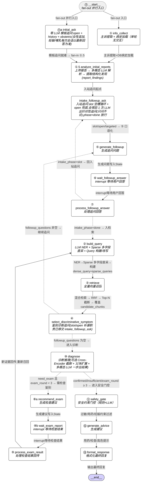

# 4. Agent设计

## 4.1 Agent工作流
```
医疗诊断 Agentic RAG
编排框架：LangGraph
症状采集阶段支持人机交互追问(13 维 HPI slot 填空驱动,空槽填满后跳诊断)
诊断推理阶段全自动运行
```

###  LangGraph StateGraph 工作流设计

#### 4.1.1 State 定义

> **实现形态**:`MedicalState` 实际是 **Pydantic `BaseModel`**(`pydantic.BaseModel`),不是 TypedDict。原因:§9.2 兼容性规则全是 Pydantic Field 语法(checkpointer 反序列化老 state 时缺字段自动填默认值,避免 KeyError);§9.5 inner schema 也是 Pydantic;嵌套结构(token_usage / latency / present_illness_slots)用嵌套 BaseModel 强类型化,把"注释式 schema"升级为 runtime 强制约束。
>
> 下方代码块的 `TypedDict` 写法仅作**字段清单与初始值的快速参考**;实际类声明、Field 默认值、嵌套 BaseModel(`PresentIllnessSlots` / `SessionTokenUsage` / `SessionLatencyMs`)见 `src/agent/state.py`。

```python
class MedicalState(TypedDict):  # 实际为 pydantic.BaseModel,见 src/agent/state.py
    # === 消息历史 ===
    messages: Annotated[list[BaseMessage], add_messages]  # 完整消息历史（各节点追加，LangGraph 自动合并）；⚠️ 仅用于 Checkpointer 持久化与审计追溯，任何节点不得从 messages 组装 prompt
    # 保留在 State 而非异步写入外部日志的理由：
    # 1. LangGraph 原生 get_state_history() 依赖 messages 字段做会话回放与调试，移除后丧失内置审计能力
    # 2. 4.2.4 预留的 Compaction 机制以 messages 为压缩输入源，异步外置后该扩展路径断裂
    # 3. 当前固定流程下消息总量有界(追问受 HPI 13 维 slot 填空收敛 + MAX_FOLLOWUP_ROUNDS=8 硬性兜底,检查循环上限 MAX_EXAM_ROUNDS=3),存储开销可控

    # === 患者信息 ===
    patient_id: str                       # 患者 ID（关联 PostgreSQL 2.4.5 各表）
    patient_input: str                    # 用户原始输入
    chief_complaint: str                  # 主诉（主要症状+持续时间）
    present_illness: str                  # 现病史（本次发病的详细展开：诱因、症状特点、伴随症状、加重/缓解因素、诊疗经过）
    present_illness_slots: dict           # 现病史结构化要素槽位（由 info_collect ① 首次填充，process_followup_answer ⑦ 回填）
    # {
    #   "onset_time":          str|None,  # 起病时间（如"3天前"）
    #   "onset_mode":          str|None,  # 起病方式（急性/缓慢/隐匿）
    #   "trigger":             str|None,  # 诱因（劳累/受凉/进食/无明显诱因）
    #   "location":            str|None,  # 部位
    #   "nature":              str|None,  # 性质（刺痛/胀痛/绞痛/烧灼感）
    #   "severity":            str|None,  # 程度（轻/中/重/VAS评分）
    #   "duration_pattern":    str|None,  # 时间规律（持续性/间歇性/阵发性）
    #   "aggravating":         list[str], # 加重因素（什么条件下加重，如吃完饭后更疼）
    #   "relieving":           list[str], # 缓解因素（什么条件下减轻）
    #   "associated_symptoms": list[str], # 伴随症状（患者自述，非 chunk 提取）
    #   "progression":         str|None,  # 病程演变（随时间加重/减轻/稳定/波动，如"三天来越来越重"）
    #   "treatment_tried":     str|None,  # 诊疗经过（看过没、用过什么药）
    #   "treatment_response":  str|None,  # 治疗反应（有效/无效/加重）
    # }
    medical_history: dict                 # 结构化病史信息（从 DB 加载的历史档案，不含主诉和现病史）
    # - past_history: dict               # 既往史（基础病/手术/外伤/输血/传染病）
    # - allergy_history: list            # 过敏史 ⚠️安全底线
    # - medication_history: list         # 用药史
    # - personal_history: dict           # 个人史（烟酒/职业/旅居）
    # - obstetric_history: dict|None     # 婚育史（女性）
    # - family_history: list             # 家族史
    exam_reports: list[dict]             # 患者上传的检查报告文件引用列表（轻量引用，不存图片/PDF原文）
    # 每项结构：{"file_ref": str}
    # - file_ref: 文件路径或对象存储 URL（初始报告来自 DB file_path，检查回传由 ⑨ 落盘后生成）
    # 需要多模态 LLM 读取时，由 ①.5 / ⑨ 调用 load_report(file_ref) 按需加载（图片转 base64 / PDF 直传），加载结果不写回 State
    # 注：历史 vs 本次会话新增的区分由 report_findings[i].report_date 与当前日期比较得出；审计追溯走 PostgreSQL diagnosis_records 日志，无需在 State 冗余存储
    report_findings: list[dict]          # ①.5 和 ⑨ 从报告中提取的结构化关键发现（供 ② build_query 和 ④ select_symptom 直接使用）
    # 每项结构：
    # {
    #   "report_type":        str,       # 报告类型：blood_routine / urine_routine / biochemistry / imaging / ecg / physical_exam / pathology / other
    #   "report_date":        str|None,  # 报告日期（LLM 从报告中提取，格式 YYYY-MM-DD；无法识别则为 None）
    #   "report_index":       int,       # 对应 exam_reports[i] 的下标
    #   "abnormal_values":    list[str], # 异常检验值（如"WBC 12.3 × 10⁹/L ↑"）
    #   "impressions":        list[str], # 报告诊断印象（如"右肺上叶磨玻璃结节"）
    #   "positive_findings":  list[str], # 阳性发现（preferred_term）
    #   "negative_findings":  list[str], # 阴性发现，已排除项（报告原文标准术语，直接可用）
    # }
    # 注:报告内容已是标准医学术语,LLM 直读提取即可

    # === 召回与候选 ===
    # 注:原 `standardized_entities` 字段 EL 移除时一并删除(见 §4.1.6.2)
    dense_query: str                     # Dense 路检索 query:LLM 将确认症状+病史改写成语义连贯的自然语言句子(1 次向量检索)
    sparse_queries: list[str]            # Sparse 路检索 queries:来源 A 症状/slots/chief 多字段直采 + 来源 B report 语义信号(见 §3.2.1 Step 2)
                                         # 例:["腹痛 3 天", "右上腹", "进食后", "右额颞线形骨折", "瞳孔散大"](前 3 条来源 A,后 2 条来源 B)
                                         # N 条 BM25 各产出候选 → RRF 融合(每条等权 1 票)
    candidate_chunks: list[dict]         # 候选 chunk 池;每项形态 {source_chunk_id, rrf_score, vector_hits},vector_hits 见 §3.2.2 多向量聚合
    confirmed_symptoms: list[str]        # 用户确认有的症状(raw text)
    denied_symptoms: list[str]           # 用户确认没有的症状(raw text)
    uncertain_symptoms: list[str]        # 用户明确表示不知道/不确定的症状(raw text);已问过不再重问

    # === 追问控制 ===
    followup_round: int                  # 当前追问轮次(硬性上限 MAX_FOLLOWUP_ROUNDS=8;正常由 HPI 13 维 slot 填空自然收敛,上限仅作兜底);Node ⑩ Step -1 在入口直接判断 `followup_round >= MAX_FOLLOWUP_ROUNDS` 以短路出 insufficient,不再引入冗余的 capped 旗标字段
    last_nlu_round: int                  # build_query 已完成 NER 的最近轮次(初始 0);仅当 followup_round > last_nlu_round 时对 followup_answer 做 NER,防止检查路径(N9→N2)重复抽取旧回答
    followup_question: str               # 当前追问问题
    followup_answer: str                 # 用户对追问的回答
    followup_questions: list[dict]        # 本轮待追问列表(最多 MAX_FOLLOWUP_QUESTIONS=5 项),支持两种 type:
    # - slot type:{"type": "slot", "slot": str}(补全 HPI 13 维空槽,如 "trigger"/"aggravating")
    # - open type:{"type": "open"}(开放式问"还有别的不舒服吗?",每轮最多 1 条)
    # 为空表示信息已足/13 维已大部分填满,should_continue 路由跳诊断
    unaskable_symptoms: list[dict]       # 两段写入:④ select_symptom 写粗筛版({description, reason},LLM 想知道但患者答不上的体征);⑩ diagnose 输出 retained_unaskable 覆盖粗筛 → 精筛版(基于诊断结果重判,confirmed/insufficient 通常清空、need_exam 留关键鉴别项);⑧a recommend_exam 直接消费精筛版
    exam_round: int                      # 已建议检查的轮次（每经过 recommend_exam ⑧a +1，上限 MAX_EXAM_ROUNDS=3）
    pending_exam_results: list           # wait_exam_report ⑧b 写入（interrupt 返回的用户回传检查结果）；process_exam_result ⑨ 消费

    # === 诊断结果 ===
    diagnosis_result: list[dict]         # 诊断结果列表 [{disease, probability, evidence, differentiation, differentiation_type, failure_reason}]
    # - differentiation_type: "confirmed"(高置信度) | "need_exam"(需检查鉴别) | "insufficient"(信息不足)
    # - failure_reason: str|None         # 系统级失败原因，None=LLM 正常推理结果；非 None 取值：
    #   "followup_round_capped"（追问触顶兜底）
    #   "step_1_structured_output_failed: <ExcType>: <msg>"（诊断 LLM 失败兜底)
    #   供 ⑫ risk_warnings 附加系统级提示、⑬ 免责声明差异化、rag_trace.error_info 审计追溯

    # === 安全约束（safety_gate ⑪ 产出）===
    safety_constraints: dict             # 安全门控输出
    # - banned_drugs: list[str]          # 禁用药物列表（过敏+同类药排除）
    # - interaction_warnings: list[dict] # 药物相互作用警告
    # - contraindication_flags: dict     # 禁忌标记（妊娠分级、哺乳禁忌等）

    # === 建议输出 ===
    recommended_tests: list[str]         # 建议检查项目
    medication_advice: list[dict]        # 用药建议（已通过 safety_constraints 过滤）
    risk_warnings: list[str]            # 高危提示
    final_response: str                  # 最终输出给用户的回复

    # === 审计埋点承接字段（rag_trace 写入所需数据，见 §9.6）===
    last_reranked_chunks: list[dict]     # ⑩ Step 0 Cross-Encoder 精排后的 chunks 截断结果；API 层 G4 写入 `rag_trace.reranked_chunks`
    session_token_usage: dict            # LLM token 使用量累计 {prompt_tokens, completion_tokens, total_tokens}；由 `RetryObserver.on_llm_end` 累加（见 §9.1）
    session_latency_ms: dict             # 各环节累计耗时（毫秒）{intent, retrieval, rerank, llm_call, post_process}；各节点计时后累加，最终 `total` 由 API 层求和
    last_diagnose_prompt: str | None     # 仅在 ⑩ `diagnose` 失败兜底路径填写当前失败 Step 的完整 prompt；正常诊断保持 None
    last_diagnose_raw_output: str | None # 仅在 ⑩ `diagnose` 失败兜底路径填写 LLM 最后一次原始输出（如有）；正常诊断保持 None
```

#### 4.1.1a State 初始值规范

`MedicalState` 实际是 **Pydantic `BaseModel`**(见 §4.1.1 实现形态注),Field 默认值机制接管字段填充。`create_initial_state(patient_id, patient_input)` 工厂仅显式传两个必填字段,其余 35 字段由 `Field(default_factory=...)` / 字段默认值自动填充。**checkpointer 反序列化老 state 时缺字段自动填默认值,不会触发 KeyError**(§9.2 第一类长生命周期路径的天然支持)。下表保留为字段清单与初始值的权威对照,仍是新增字段时必查的参考。

**字段分类与初始值表**：

| 分类 | 字段 | 类型 | 初始值 | 说明 |
|------|------|------|--------|------|
| **LangGraph 管理** | `messages` | `Annotated[list[BaseMessage], add_messages]` | `[]` | 各节点追加，LangGraph 通过 `add_messages` reducer 自动合并，无需手动初始化 |
| **调用方必填** | `patient_id` | `str` | *(患者ID)* | 关联 PostgreSQL 2.4.5 各表，不可缺省 |
| | `patient_input` | `str` | *(用户输入)* | 用户原始输入，不可缺省 |
| **首节点产出** | `chief_complaint` | `str` | `""` | 由 `info_collect` ① LLM 从 `patient_input` 提取 |
| | `present_illness` | `str` | `""` | 由 `info_collect` ① LLM 从 `patient_input` 提取 |
| | `present_illness_slots` | `dict` | `{各字段: None/[]}` | 由 `info_collect` ① LLM 从 `patient_input` 结构化提取；`process_followup_answer` ⑦ 回填维度追问结果；空槽驱动 ④ 维度缺口追问 |
| | `medical_history` | `dict` | `{}` | 由 `info_collect` ① 从 DB 加载（历史档案，不含主诉和现病史） |
| | `exam_reports` | `list[dict]` | `[]` | 由 `info_collect` ① 从 DB 加载文件引用（不存 base64）；`process_exam_result` ⑨ 追加检查回传的文件引用；患者未上传报告时保持空 |
| | `report_findings` | `list[dict]` | `[]` | 由 `analyze_initial_reports` ①.5 填充；无报告时保持空 |
| **系统默认值** | `dense_query` | `str` | `""` | 首轮 `build_query` ② 生成 |
| | `sparse_queries` | `list[str]` | `[]` | 首轮 `build_query` ② 生成 |
| | `candidate_chunks` | `list[dict]` | `[]` | `retrieve` ③ 每轮覆盖写入 |
| | `confirmed_symptoms` | `list[str]` | `[]` | 首轮 `build_query` ② 从主诉 NER 初始化(raw text) |
| | `denied_symptoms` | `list[str]` | `[]` | 首轮 `build_query` ② 从主诉 NER 否定项初始化(raw text) |
| | `uncertain_symptoms` | `list[str]` | `[]` | `process_followup_answer` ⑦ 填充 |
| | `followup_round` | `int` | `0` | `process_followup_answer` ⑦ 每轮 +1；Node ⑩ 入口直接读取判断上限 |
| | `last_nlu_round` | `int` | `0` | NER 游标；首轮 `build_query` ② 完成后置为 `followup_round` |
| | `followup_question` | `str` | `""` | `generate_followup` ⑤ 生成 |
| | `followup_answer` | `str` | `""` | `wait_followup_answer` ⑥（interrupt 恢复写入） |
| | `followup_questions` | `list[dict]` | `[]` | `select_discriminative_symptom` ④ 填充;每项 `type: "slot"`(填补 HPI 空槽)或 `"open"`(开放式问还有别的不舒服) |
| | `unaskable_symptoms` | `list[dict]` | `[]` | ④ 填粗筛版(`{description, reason}`),⑩ 1 步 LLM 输出 `retained_unaskable` 覆盖为精筛版,⑧a 消费 |
| | `exam_round` | `int` | `0` | `recommend_exam` ⑧a 每轮 +1 |
| | `pending_exam_results` | `list` | `[]` | `wait_exam_report` ⑧b 写入（interrupt 返回的用户回传检查结果）；`process_exam_result` ⑨ 消费后解析入 `exam_reports` / `report_findings` |
| | `diagnosis_result` | `list[dict]` | `[]` | `diagnose` ⑩ 填充 |
| | `safety_constraints` | `dict` | `{}` | `safety_gate` ⑪ 填充 |
| | `recommended_tests` | `list[str]` | `[]` | `recommend_exam` ⑧a / `generate_advice` ⑫ 填充 |
| | `medication_advice` | `list[dict]` | `[]` | `generate_advice` ⑫ 填充 |
| | `risk_warnings` | `list[str]` | `[]` | `generate_advice` ⑫ 填充 |
| | `final_response` | `str` | `""` | `format_response` ⑬ 填充 |
| **审计埋点承接（§9.6）** | `last_reranked_chunks` | `list[dict]` | `[]` | `diagnose` ⑩ Step 0 覆盖写入；API 层 G4 写入 `rag_trace.reranked_chunks` |
| | `session_token_usage` | `dict` | `{"prompt_tokens": 0, "completion_tokens": 0, "total_tokens": 0}` | 各 LLM 调用点通过 `RetryObserver.on_llm_end` 累加（见 §9.1） |
| | `session_latency_ms` | `dict` | `{"intent": 0, "retrieval": 0, "rerank": 0, "llm_call": 0, "post_process": 0}` | 各节点计时后累加；`total` 由 API 层在写 `rag_trace` 前求和 |
| | `last_diagnose_prompt` | `str \| None` | `None` | 仅 ⑩ `diagnose` 失败兜底路径填写；正常路径保持 `None` |
| | `last_diagnose_raw_output` | `str \| None` | `None` | 仅 ⑩ `diagnose` 失败兜底路径填写；正常路径保持 `None` |

**工厂函数**（实现放置于 `src/agent/state.py`）：

```python
def create_initial_state(patient_id: str, patient_input: str) -> MedicalState:
    """构造完整的初始 State，确保所有字段均有合法缺省值。"""
    return MedicalState(
        # 消息历史（LangGraph add_messages reducer 自动管理）
        messages=[],
        # 调用方必填
        patient_id=patient_id,
        patient_input=patient_input,
        # 首节点产出（info_collect 填充，此处给安全缺省）
        chief_complaint="",
        present_illness="",
        present_illness_slots={
            "onset_time": None,
            "onset_mode": None,
            "trigger": None,
            "location": None,
            "nature": None,
            "severity": None,
            "duration_pattern": None,
            "aggravating": [],
            "relieving": [],
            "associated_symptoms": [],
            "progression": None,
            "treatment_tried": None,
            "treatment_response": None,
        },
        medical_history={},
        exam_reports=[],
        report_findings=[],
        # 召回与候选(原 standardized_entities 字段 EL 移除时删除;extracted_symptoms 随 ④ 节点废弃一并删除)
        dense_query="",
        sparse_queries=[],
        candidate_chunks=[],
        confirmed_symptoms=[],
        denied_symptoms=[],
        uncertain_symptoms=[],
        # 追问控制(info_gain 随信息增益机制移除一并删除)
        followup_round=0,
        last_nlu_round=0,
        followup_question="",
        followup_answer="",
        followup_questions=[],
        unaskable_symptoms=[],
        exam_round=0,
        pending_exam_results=[],
        # 诊断结果
        diagnosis_result=[],
        # 安全约束
        safety_constraints={},
        # 建议输出
        recommended_tests=[],
        medication_advice=[],
        risk_warnings=[],
        final_response="",
        # 审计埋点承接字段（见 §9.6）
        last_reranked_chunks=[],
        session_token_usage={"prompt_tokens": 0, "completion_tokens": 0, "total_tokens": 0},
        session_latency_ms={"intent": 0, "retrieval": 0, "rerank": 0, "llm_call": 0, "post_process": 0},
        last_diagnose_prompt=None,
        last_diagnose_raw_output=None,
    )
```

**调用方式**：

```python
config = {"configurable": {"thread_id": f"session_{session_id}"}}
initial_state = create_initial_state(patient_id=patient_id, patient_input="我最近老是头疼，已经持续一周了")
result = graph.invoke(initial_state, config=config)
```

> **设计说明**:追问的收敛由 LLM 看 13 维 HPI 空缺自然控制(原 `info_gain` 阈值机制已彻底移除,字段也已从 schema 删除)。

#### 4.1.2 Node 节点设计

##### ① `info_collect` — 主诉提取 + 病史加载（单轮，无交互）

- **输入**: `patient_input`, `patient_id`
- **输出**: 更新 `chief_complaint`, `present_illness`, `present_illness_slots`, `medical_history`, `exam_reports`
- **职责（三步顺序执行，单轮完成，无 interrupt）**:

  **Step 1. 主诉 + 现病史提取（LLM）**
  - LLM 解析 `patient_input`，提取：
    - `chief_complaint`：主诉（主要症状 + 持续时间），如"腹痛3天"
    - `present_illness`：现病史（本次发病的详细展开）——起病时间与诱因、症状特点（部位/性质/程度/持续或间歇）、伴随症状、加重/缓解因素、诊疗经过
    - `present_illness_slots`：现病史结构化槽位——LLM **同时**将提取到的现病史信息填入对应槽位（onset_time / onset_mode / trigger / location / nature / severity / duration_pattern / aggravating / relieving / associated_symptoms / progression / treatment_tried / treatment_response），患者未提及的维度保持 None/空列表
  - `present_illness`（自由文本）供 `build_query` ② 和 `diagnose` ⑩ 使用；`present_illness_slots`（结构化视图）供 `select_discriminative_symptom` ④ 做缺口检测
  - 患者表述不完整的项保持空，后续追问循环（④→⑤→⑥→⑦）通过维度缺口追问机制定向补充

  **Step 2. 历史病史加载（DB 查询，零 LLM）**
  - 以 `patient_id` 为主键，从 PostgreSQL（2.4.5）各表加载患者已有的结构化病史档案：
    | DB 表 | 写入 `medical_history` 字段 |
    |-------|--------------------------|
    | `medical_history` (DB) | `past_history`（基础病/传染病）|
    | `surgical_trauma_history` | `past_history`（手术/外伤）|
    | `transfusion_history` | `past_history`（输血史）|
    | `allergies` ⚠️ | `allergy_history` |
    | `medications` ⚠️ | `medication_history` |
    | `patients`（个人史字段） | `personal_history` |
    | `menstrual_reproductive` | `obstetric_history`（仅女性）|
    | `family_history` | `family_history` |

  **Step 3. 已有检查报告加载（DB 查询，零 LLM）**
  - 从 `exam_reports` 表（2.4.5）加载患者已上传的检查报告
  - 仅将 `file_path` 作为文件引用写入 State 的 `exam_reports`（`{"file_ref": file_path}`），**不读取文件内容**，避免 MB 级 base64 膨胀 State 和 Checkpointer 存储

- **设计理由**:
  - 采集规范八大项中，既往史、过敏史、用药史、个人史、婚育史、家族史属于**相对稳定的患者档案**，在患者注册/建档时已录入 PostgreSQL（2.4.5），无需每次问诊重复采集
  - 仅主诉和现病史是**本次就诊特有**的实时信息，需从 `patient_input` 提取
  - 单轮无交互，消除多轮采集的机制歧义，避免冗长问诊对话
  - `medical_history` 存储历史档案，不含主诉和现病史；`present_illness` 作为独立顶层字段存在于 State（RAM），与 `chief_complaint` 共同描述本次就诊

> **采集规范说明**：八大采集项的详细规范（主诉/现病史的提取要素、既往史/过敏史/用药史/个人史/婚育史/家族史的必询内容）见 2.4.5 节各表结构注释。这些规范既是患者建档时的数据录入标准，也是 `safety_gate` ⑪ 完整性校验的依据。


##### ①.5 `analyze_initial_reports` — 初始报告解析与关键发现提取

- **触发条件**: 始终被调用（无条件顺序边）；`exam_reports` 为空时 early return 直接透传（零 LLM 开销）
- **输入**: `exam_reports`（文件引用列表，来自 Node ①）
- **输出**: 新增 `report_findings`
- **职责**:
  1. 对 `exam_reports` 中每份报告，通过 `load_report(file_ref)` **按需加载**（图片转 base64 / PDF 直传），送入**多模态 LLM** 提取结构化关键发现（加载结果仅作为函数局部变量，不写回 State）：
     - 异常检验值（`abnormal_values`）：保留原始数值，如"WBC 12.3×10⁹/L↑"、"Hb 85g/L↓"，供诊断推理时精确参考
     - 诊断印象（`impressions`）：如"右肺上叶磨玻璃结节"
     - 阳性发现（`positive_findings`）：阳性体征 + **异常值的临床解读**（如 WBC↑→"白细胞升高"、Hb↓→"贫血"），使用医学文献语言，直接可用于 query 召回
     - 阴性发现（`negative_findings`）：如"未见肝内胆管扩张"、"肝功能正常"
  2. 将结构化发现写入 `report_findings`
  > 报告内容本身已是标准医学术语,LLM 直读提取即可;`positive_findings` 中需同时包含异常值的临床概念解读,不能只记录原始数值
- **共享逻辑**: 结构化提取逻辑封装在 `src/agent/utils/report_parser.py`，Node ⑨ `process_exam_result` 复用同一函数

- **设计目的**:
  - 让报告中的客观证据在第一次 `build_query` 时就被纳入，提高初始召回精度
  - 使 Node ④ 能感知"报告已有答案"从而跳过冗余追问
  - 使 Node ⑧ 去重逻辑更精准（基于结构化 `report_findings` 而非原文字符串匹配）


- **病史信息在诊疗流水线中的分层接入机制**:

  总体原则：**越涉及安全的越靠规则，越涉及推理的越靠 LLM，但都要给 LLM 加结构化约束。**

  病史各项目按其临床角色，分别绑定到流水线中最合适的节点，避免在单一节点中混杂所有职责。

  **（一）鉴别诊断层 —— LLM 显式归因推理（`diagnose` ⑩）**

  | 病史项目 | 诊断角色 | 作用方式 |
  |---------|---------|---------|
  | 既往史（基础病、复发史） | 先验概率调节器 | ↑ 相关疾病复发/并发概率 |
  | 家族史 | 先验概率调节器 | ↑ 遗传/家族聚集性疾病概率 |
  | 个人史（烟酒、职业暴露） | 先验概率调节器 | ↑ 对应危险因素相关疾病概率 |
  | 现病史细节 | 直接证据 | 症状特征直接指向或排除候选诊断 |
  | 既往检查结果 | 直接证据 | 客观数据权重高于主观症状 |
  | 既往治疗反应 | 直接证据（诊断性治疗线索） | 如"口服奥美拉唑后上腹痛缓解"→ ↑ 消化性溃疡概率 |

  - **执行机制**：不将完整 `medical_history` 原样传入 LLM。进入 `diagnose` 节点前，先将病史预处理为**诊断相关摘要**（仅保留与当前候选诊断可能相关的项目），然后在 prompt 中要求 LLM **逐项显式归因**：

    ```
    已知病史关键项：
    - 既往史：2型糖尿病 10年，冠心病支架术后
    - 家族史：父亲脑卒中
    - 个人史：吸烟30包年
    - 既往治疗反应：口服奥美拉唑后上腹痛缓解

    请对每个候选诊断，逐条说明上述病史对其概率的影响（升高/降低/无关），
    再给出综合判断。
    ```

  - **设计目的**：LLM 负责推理，但 prompt 强制逐项归因，输出可审计，幻觉更容易被发现。

  **（二）安全门控层 —— 规则优先 + LLM 兜底（`safety_gate` ⑪）**

  此层独立于诊断推理，作为诊断结果到治疗建议之间的**硬约束过滤器**。

  | 病史项目 | 约束类型 | 处理方式 |
  |---------|---------|---------|
  | 过敏史 ⚠️ | 药物/成分禁忌 | 规则层：同类药排除（如过敏青霉素 → 阿莫西林禁用） |
  | 用药史 ⚠️ | 药物相互作用 | 规则层：已知配伍禁忌匹配；LLM 兜底：复杂交互判断 |
  | 妊娠/哺乳状态 ⚠️ | 用药禁忌 | 规则层：FDA 妊娠分级过滤（D/X 类禁用） |

  - **执行机制（两步）**：
    1. **规则过滤**：从结构化 `medical_history` 中提取过敏药物列表、当前用药列表、妊娠/哺乳状态，执行确定性匹配（已知药物-过敏对、配伍禁忌表、妊娠禁忌药清单）
    2. **LLM 兜底**：在规则过滤后的安全范围内，LLM 处理规则覆盖不到的情况（如交叉过敏风险、罕见药物相互作用、基于肝肾功能的剂量调整）
  - **设计目的**：安全相关决策不完全依赖 LLM 概率推理，规则层提供确定性保障。

  **（三）检查复用提示层 —— LLM 判断（`recommend_exam` ⑧）**

  | 病史项目 | 作用 | 处理方式 |
  |---------|------|---------|
  | 已有检查报告（`report_findings`） | 复用性评估 | LLM 判断已有报告能否满足当前诊断需求，输出复用建议而非静默过滤 |

  - **执行机制**：LLM 推荐所有诊断所需检查，**不因已有报告而静默排除**。对于患者已有相关报告的检查项，LLM 额外输出复用说明，由患者/医生自行判断，例如：
    - "您有一份3天前的血常规。血常规建议早上空腹采集，若当时满足条件可复用；否则建议重做。"
    - "您有一份上月的腹部B超，建议携带至医生处评估是否仍有参考价值，或根据症状变化决定是否重做。"
  - **设计原则**：宁可多推荐、附说明，不贸然排除。检查的复用判断涉及时效、采集条件、病情变化等复杂因素，交由 LLM 结合具体情境给出建议，而不是由规则静默删除。

  **（四）各层协作关系**

  ```
  info_collect ①
        │
        ▼
  analyze_initial_reports ①.5（exam_reports → report_findings）
        │
        ▼
   medical_history（结构化）+ report_findings（结构化）
        │
        ├──→ diagnose ⑩ ：诊断相关摘要 → LLM 逐项归因推理 → diagnosis_result
        │
        ├──→ 安全门控（规则 + LLM）：过敏/用药/妊娠硬约束过滤
        │         │
        │         ▼
        │    safety_gate ⑪ ：规则+LLM 安全约束过滤
        │         │
        │         ▼
        │    generate_advice ⑫ ：在安全约束内生成治疗建议
        │
        └──→ recommend_exam ⑧ ：推荐检查 + 已有报告复用性说明（LLM 判断）
  ```


##### ② `build_query` — NER + Query 构建/改写

> **EL 移除**:原 Step 2 Entity Linking(三层归一化:Tier 1 精确别名 / Tier 2 向量阈值 / Tier 3 占位)整段删除,运行时不再查 `terms_collection`(数据资产保留备用,见 §2.4.6);原"四步"精简为"三步"(NER → Sparse 多字段直采 → Query 构建)。EL 删除后,`confirmed_symptoms` / `denied_symptoms` 字段值改为 raw text(无 preferred_term 归一化),下游 ④ select_symptom 的"已问去重 / 报告证据消费"由 LLM 一次语义比对承担。详细动机见 EL_DESIGN_REVIEW §11。

- **输入**: `chief_complaint`, `present_illness`, `present_illness_slots`, `medical_history`, `report_findings`, `confirmed_symptoms`, `denied_symptoms`, `followup_answer`(后续轮)
- **职责**(每轮循环均完整执行以下三步):

  **Step 1. NER 实体抽取(LLM)**
  - 首轮(`followup_round == 0`):对主诉 + 现病史做 LLM NER(检查报告已由 ①.5 结构化为标准术语,无需 NER)
  - 后续轮:仅当 `followup_round > last_nlu_round` 时,对 `followup_answer` 做 NER,处理完后置 `last_nlu_round = followup_round`;否则跳过(说明当前从检查路径 N9→N2 进入,`followup_answer` 为已处理的旧值)
  - 提取结构化实体:实体文本、类型(symptom/disease/drug/anatomy)、否定标记、时态(current/past/family)、数值
  - 检查路径进入时(`followup_round == last_nlu_round`)直接跳到 Step 3,基于已有 `confirmed_symptoms`/`denied_symptoms` 和新 `report_findings` 重建 query
  - **首轮主诉症状初始化**(`followup_round == 0`,NER 输入仅含 `chief_complaint` + `present_illness`):从 NER 抽到的实体中筛选 `entity_type == 'symptom'` 且 `temporality == 'current'` 的实体,按 `negation` 分流,**直接用实体 raw text 写入**(EL 已删,不再归一化):
    - `negation == False` → 写入 `confirmed_symptoms`(如"肚子疼"→"肚子疼")
    - `negation == True` → 写入 `denied_symptoms`(如"没有发烧"→"发烧")
    - 下游 ④ select_symptom 的"已问去重"由 LLM 一次语义比对承担("肚子疼"/"腹痛"同义判断不再依赖 preferred_term 精确匹配)
  - 此步确保 Node ④ 选追问目标时不会向患者重复询问其主诉中已明确陈述或否认的症状

  **Step 2. Sparse 多字段直采(Sparse 路专用,2026-05-17 RETRIEVAL_EVAL §2 改造)**
  - **不查 terms_collection,无任何 alias 反查**;纯 state 字段拼接:
    - 来源 A:`chief_complaint` + `present_illness_slots` 单值字段(trigger/location/nature/severity/duration_pattern/onset_mode)+ list 字段(associated_symptoms/aggravating/relieving)
    - 来源 B:`report_findings` 的 `positive_findings`(全加)+ `impressions`(阴性过滤:含 `(-)`/正常/阴性/未见/无异常 的整条跳过)
    - 长度 ≥ 2 + 保序去重,实测 62 case 平均 21.8 条

  **Step 3. Query 构建/改写(Dense 与 Sparse 分路构建)**
  - 首轮:基于 `confirmed_symptoms`(NER raw text)+ 病史 + `report_findings` 中的 **`positive_findings` / `impressions`** 构建初始检索 query
    - `positive_findings` 含对异常值的临床解读(如"WBC 12.3↑"→"白细胞升高",由 report_parser 提取时同步写入),文献语言,可直接用于召回
    - `abnormal_values` 原始数值**不进 query**(数字无向量语义,且文献不以数值描述疾病);`negative_findings` 同样不进 query
    - `abnormal_values` 保留用于 Node ⑩ 诊断推理上下文(LLM 需要精确数值做临床判断,如 WBC 25×10⁹/L vs 12×10⁹/L 指向不同严重程度)
  - 后续轮:融合所有**已确认症状**(`confirmed_symptoms`)+ 新增实体改写 query,确保新方向被覆盖;`denied_symptoms` **不进 query**(BM25 无法处理否定,embedding 也会被否认词拉偏方向),仅在 Node ⑩ `diagnose` 作为排除证据使用
  - **Dense Route**:LLM 将所有确认症状、病史关键项、`report_findings` 的 `positive_findings`/`impressions`、以及 `present_illness_slots` 中已填充的维度信息(如诱因、加重/缓解因素、症状性质等)整合,改写为语义连贯的自然语言查询句(如"进食后加重的上腹胀痛伴反酸,白细胞升高,既往糖尿病史"),生成 `dense_query`;维度信息的纳入使 query 从泛化症状描述细化为具有鉴别特征的临床描述,显著提升召回精度
  - **Sparse Route**:`sparse_queries` 由 Step 2 产出(state 多字段直采,详见 §3.2.1 Step 2)。每条作一次独立 BM25 查询,N 条 = N 次查询。融合层走加权多路 RRF(详见 §3.2.2:`dense_weight = max(1, N_sparse/RRF_DENSE_WEIGHT_FACTOR)`,sparse 各路等权 1 票)。`abnormal_values` 原始数值与 `negative_findings` 仍不进 query(数字无向量语义;否定词与 BM25/embedding 语义冲突)。

- **输出**: `dense_query`、`sparse_queries`、`last_nlu_round`(后续轮 NER 执行后更新);首轮额外初始化 `confirmed_symptoms`(主诉中当前、未否定的症状 raw text)和 `denied_symptoms`(主诉中当前、被否定的症状 raw text)
- **设计理由**: 将 NER 置于 `build_query` 而非独立前置节点,因为每轮循环(追问回答、检查结果回传)都带来新信息,需在 query 构建前统一抽实体;EL 归一化层整体移除(LLM 内化的医学同义词知识远超 4 万条 ICD-10 alias 表,运行时 LLM 在线判断比向量阈值精确得多,详见 EL_DESIGN_REVIEW §11)

##### ③ `retrieve` — 混合检索（Dense + Sparse）
- **输入**: `dense_query`, `sparse_queries`
- **职责**:
  - **Dense 路**：对 `dense_query` 做 Qwen3-Embedding-8B 编码 → Milvus ANN 向量检索，返回语义相似候选
  - **Sparse 路**：对 `sparse_queries` 中每个症状维度词袋分别做 Milvus BM25 检索（N 个维度 = N 次查询），每次返回关键词匹配候选
  - **RRF 加权融合**(2026-05-17 RETRIEVAL_EVAL §4 改造):Dense 路加权 `max(1, N_sparse/RRF_DENSE_WEIGHT_FACTOR)`(默认 factor=5,§9.7),Sparse 各路等权 1 票,k=60;sparse 多路命中天然累加(原 self-tuning 特性保留);详见 §3.2.2
  - **Top-N 截断**：按 RRF 融合分数降序，取 Top-N（`settings.agent_limits.RETRIEVE_TOP_N`，初始值 200，见 §9.7；阈值调优改 `.env` 不改代码）截断，丢弃低分长尾候选
  - **多向量聚合**:同一 source_chunk_id 下所有命中记录(original / summary / question)的 `1/(k + rank)` **求和**得到 chunk 最终 RRF 分数,多路命中得分自然更高;每条候选附 `vector_hits` 副载荷(命中向量类型 + rank + matched_text 清单),供下游 §3.2.3 Context 扩展使用。详见 §3.2.2
- **输出**: 聚合后的候选 chunk 列表(每条形态 `{source_chunk_id, rrf_score, vector_hits}`),**覆盖写入** `candidate_chunks`(每轮检索结果直接替换上一轮,不做跨轮合并)
- **设计理由**: `build_query` ② 每轮已融合全部累积证据（确认/否认症状、检查报告、已填维度）重写 query，新 query 的检索结果天然反映最新信息状态，无需保留历史候选；若候选仍然相关，新 query 会重新召回它

##### ④ `extract_symptoms` — 已删除

原"TF-IDF + EL 三层归一化"症状提取节点整段拆除,从 graph 拓扑里去掉,边 ③ retrieve → ④ select_symptom 直连。`state.extracted_symptoms` 字段同步删除(不再用,checkpointer 向后兼容期已过)。

**为什么删除**:实测(`.eval/rag_eval/validate_node4_tfidf_el.py`):TF-IDF 抽出的关键词 94% 是医学教材通用高频词("治疗/细胞/病人")+ char n-gram 碎片("性心/受损时,"),真鉴别症状词稀疏。即使换 cTF-IDF(按 disease 聚合 corpus)能压下通用词,抽出来的鉴别词 90% 仍是医生角度的病因/病理/影像/化验术语(HP/萎缩/门静脉高压/AFP),**患者无法回答**;真正 patient-askable 的鉴别症状无法通过任何无监督算法识别(需要语义判断)。继续维护算法路是 sunk cost。

**替代方案**:④ select_symptom 重设计为 1 次 LLM 调用,直接基于 state(主诉 + 13 维 HPI + 已确认/否认症状)产出追问 — LLM 内化的医学知识覆盖中文常见病诊断,且能天然分辨 patient-askable vs 需检查的鉴别要素。详见 ④ 节点定义。

##### ④ `select_discriminative_symptom` — 智能追问选择(1 LLM)

> **重设计**:原"TF-IDF 关键词 + 信息增益(二元熵)+ 可问性评估 / 报告证据消费 / 已问去重(LLM 批量)"四步重工程化路径整体废弃。原因:实测 TF-IDF 抽不出真症状(94% 教材通用高频词),信息增益的可比 key 立不起来;任何无监督算法抽出的"鉴别词"对患者多数不可问(语义判断算法做不到)。改为 LLM 一次性基于 state 选追问 — 利用 LLM 内化的医学鉴别诊断知识,直接挑出 patient-askable 维度/兜底问,**同时**主动识别"想知道但患者答不上的体征"作为 unaskable 粗筛。

- **输入**: `chief_complaint`, `present_illness`, `present_illness_slots`(13 维 HPI), `confirmed_symptoms`, `denied_symptoms`, `uncertain_symptoms`
- **职责**(1 次 LLM 调用,LLM 同时出 2 件事):

  LLM 输入 patient state(主诉 + 现病史 + 13 维 slots 已填/空缺 + 已问症状清单),输出 `SmartFollowupOutput`:

  **任务 1 — `questions: list[FollowupQuestion]`**(≤ MAX_FOLLOWUP_QUESTIONS,可为 0):
  1. **`type="slot"`**:补全 HPI 空缺维度。LLM 从【空缺 slot 列表】里挑对当前主诉**诊断价值最高**且 **patient-answerable** 的维度(优先 trigger/location/nature/duration_pattern/aggravating/relieving 这类患者能直接答的),把 slot 名写到 `slot` 字段。空槽都不重要时不选 slot。
  2. **`type="open"`**:开放式问"还有别的不舒服吗?"。适合 13 维已大部分填满 / 空缺维度都不重要 / 想兜底捕获遗漏症状的场景;**一轮最多 1 条 open**(再多对患者认知负荷过重)。

  **任务 2 — `unaskable_symptoms: list[UnaskableSymptom]`**(≤ MAX_FOLLOWUP_QUESTIONS,可为 0):
  LLM 主动识别"想知道但患者答不上的体征/指标"作为粗筛,每条带 `{description, reason}`:
  - `description`:医生侧语言,写"想查什么 / 想知道什么体征",如"腹部 B 超提示有无胆囊壁增厚"
  - `reason`:为什么对鉴别诊断重要,如"鉴别胆囊炎 vs 胃炎"
  - **两个任务互斥**:可问的进 `questions`,不可问的进 `unaskable_symptoms`,不要重叠;不要直接写检查名(那是 ⑧a 的事)

- **输出**:
  - `followup_questions: list[dict]` — 形态 `[{"type": "slot", "slot": str}, {"type": "open"}, ...]`;为空 = 信息已足,`should_continue` 路由跳诊断
  - `unaskable_symptoms: list[dict]` — 粗筛版({description, reason}),后续 ⑩ Step 3 会基于诊断结果输出 `retained_unaskable` 覆盖此字段为精筛版,⑧a 直接消费精筛版
- **失败兜底**:LLM 失败 → 返回空 `followup_questions` + 空 `unaskable_symptoms` → 路由跳诊断(信息已有 → 早结束总比误问强)

- **设计要点**:
  - **不再有"症状级追问"**:之前 ④ 设计的"基于 TF-IDF 抽症状 + 信息增益排序 + 可问性评估"对应的"问患者有没有 X 症状" 的封闭式追问形式已删 — 实测证明无监督算法抽不出真症状,LLM 直接选维度填空 + 开放式兜底是更朴素也更对的临床路径
  - **unaskable 两段精筛**:④ 出粗筛(LLM 撒网式列出"想查的"),⑩ Step 3 基于诊断结果精筛(confirmed/insufficient 通常清空、need_exam 留关键鉴别项);代码侧不做语义判断,全交给两次 LLM 分工
  - **不再调 reranked chunks / candidate_chunks**:LLM 凭 state 字段足够形成 prior 选追问 + 粗筛 unaskable;减少 prompt 长度
  - **每轮 1 次 LLM 调用**:延迟 ~3-5s,前半段交互可接受;比原 ④ 的 4 处 LLM 调用总延迟更低

##### ⑤+⑥ `generate_followup` + `wait_followup_answer` — 生成追问问题 + 等待回答

> **拆分设计**：LLM 生成与 `interrupt` 等待分属两个节点。LangGraph `interrupt` 恢复时会重新执行整个节点，若 LLM 调用与 `interrupt` 在同一节点，恢复时会重复调用 LLM（浪费 token 且可能生成不同问题）。拆分后恢复时只重执行轻量的 `wait_followup_answer` 节点。

**⑤ `generate_followup`**：
- **输入**: `followup_questions`（list，可包含两种类型）、`confirmed_symptoms`、`denied_symptoms`、`chief_complaint`
- **职责**:
  - `followup_questions` 现在可能同时包含两种类型的追问项：
    - 症状级：`{"term": "反酸", "type": "symptom"}` — 问患者是否有某症状
    - 维度级：`{"slot": "trigger", "type": "dimension"}` — 问已知症状的某个未知维度
  - LLM 将两类问题自然合并为一段流畅追问，**不用列举式**，以患者口语组织，控制在 2-3 句内
  - 例（混合类型）: `[{"slot": "trigger", "type": "dimension"}, {"term": "反酸", "type": "symptom"}]` → "请问您这次腹痛是在什么情况下开始的，比如劳累、受凉还是吃了什么东西之后？另外，您有没有反酸的感觉？"
  - 例（纯症状）: `[{"term": "反酸", "type": "symptom"}, {"term": "胸骨后烧灼感", "type": "symptom"}, {"term": "胸闷", "type": "symptom"}]` → "您有没有反酸或烧心的感觉？另外想请问，您是否有胸口中间烧灼感或胸闷的情况？"
- **输出**: 更新 `followup_question`

**⑥ `wait_followup_answer`**：
- **输入**: `followup_question`（由 ⑤ 写入 State）
- **职责**: 调用 `interrupt(state["followup_question"])` 暂停执行，等待用户回答
- **输出**: 更新 `followup_answer`

##### ⑦ `process_followup_answer` — 处理追问回答
- **输入**: `followup_answer`, `followup_questions`（list），`present_illness_slots`
- **职责**:
  - LLM 解析用户回答,根据追问项的 type 分别处理:
  - **slot 类追问**(`type: "slot"`):将答案回填到 `present_illness_slots` 对应槽位,同时将新信息追加到 `present_illness` 自由文本(确保 `build_query` ② 下轮构建 query 时能利用更丰富的维度信息提升检索精度)
    - 例:追问 `{"slot": "aggravating", "type": "slot"}`,用户回答"吃完饭后会疼得更厉害" → `present_illness_slots["aggravating"] = ["进食后"]`,同时 `present_illness` 追加"进食后加重"
  - **open 类追问**(`type: "open"`):患者回答的新症状(如"对了我还有点反酸"、"昨天开始有点头晕")直接进 `new_symptoms` 字段,由本节点 append 到 `confirmed_symptoms`,供下轮 build_query NER + 召回链路使用
  - 解析回答中所有患者主动提到的新症状(无论是 open 类问的回答,还是 slot 类问时顺带补充),都进 `new_symptoms`
- **输出**: 更新 `confirmed_symptoms`, `denied_symptoms`, `uncertain_symptoms`, `present_illness_slots`, `present_illness`, `followup_round += 1`

##### ⑧ `recommend_exam` + `wait_exam_report` — 生成检查建议 + 等待结果

> **拆分设计**：与追问节点同理，LLM 生成检查建议与 `interrupt` 等待结果分属两个节点，避免恢复时重复调用 LLM。

**⑧a `recommend_exam`**：
- **输入**: `candidate_chunks`, `confirmed_symptoms`, `denied_symptoms`, `exam_reports`, `report_findings`, `exam_round`, `diagnosis_result`
- **职责**:
  - `exam_round += 1`
  - 检查推荐基于三层信息：
    1. `diagnosis_result` → 候选疾病及概率分布、鉴别类型（`need_exam`），明确"要区分什么"
    2. `unaskable_symptoms` → 高增益但需体格检查/辅助检查确认的鉴别体征，精确定位"区分点在哪"
    3. `candidate_chunks`（未经 Cross-Encoder 精排的原始候选）→ 原始医学文献上下文，作为补充参考
  - 根据以上三层信息，LLM 推断需要哪些检查来进一步区分，检查类型包括：
    - **体格检查**（需医生执行）：如触诊（Murphy征）、叩诊（肝浊音界）、听诊（心脏杂音）、神经系统检查（Babinski征）等
    - **辅助检查**（需设备/实验室）：如血常规、生化全套、影像（X光/CT/MRI/B超）、心电图、内镜、病理等
  - **一次可建议多项检查，按优先级排序**，说明每项的鉴别目的，让患者根据自身情况选择做哪些（如"① 腹部超声（优先，可区分胆囊炎）② 胃镜（可确认溃疡）③ 幽门螺杆菌检测（辅助）"）
  - **不静默排除已有报告**：对推荐列表中与 `report_findings` 存在交集的检查项，LLM 额外输出复用评估说明（综合报告日期、采集条件如是否空腹/早晨、病情变化等），由患者和医生决定是否需要重做；宁可多推荐附说明，不贸然删除
  - 以患者可理解的语言输出检查建议及理由
- **输出**: 更新 `recommended_tests`, `exam_round`

**⑧b `wait_exam_report`**：
- **输入**: `recommended_tests`（由 ⑧a 写入 State）
- **职责**: 调用 `interrupt(state["recommended_tests"])` 暂停执行，等待患者线下就医检查后回传结果（医生体格检查结论/检查报告，图片/PDF/文字描述均可；患者可只做部分检查）
- **输出**: 更新 `pending_exam_results`（用户回传的检查结果原始数据，供 ⑨ 处理）

##### ⑨ `process_exam_result` — 处理检查结果回传
- **输入**: `pending_exam_results`（由 ⑧b 写入 State，用户上传的检查结果——体格检查结论 或 辅助检查报告，可能是多项；**已是落盘后的 file_ref 引用**，原始文件落盘由 API 层在 ⑧b interrupt resume 时完成，见下方"落盘责任划分"段）
- **职责**:
  1. **文件引用追加**：将 `{"file_ref": pending_exam_results 中已带的路径}` 追加到 `exam_reports`
  2. **结构化提取**：通过 `load_report(file_ref)` 按需加载（图片转 base64 / PDF 直传），调用 `src/agent/utils/report_parser.py` 中的共享解析函数（与 Node ①.5 复用相同逻辑），多模态 LLM 直读 → 提取结构化发现，追加到 `report_findings`
  3. 清空 `pending_exam_results` 防重复消费；流程回到 `build_query`，带着新的客观证据重新召回和推理
- **输出**: 追加更新 `exam_reports`（文件引用）和 `report_findings`（结构化发现）；清空 `pending_exam_results`

> **落盘责任划分**（2026-05-14 修订）：落盘**不是 Agent 节点职责**，由 API 层在 ⑧b interrupt resume 时完成（前端 multipart upload → API 层调对象存储 / 文件系统落盘 → 把 file_ref 路径填入 `pending_exam_results` 后 resume graph）。理由：① 关注点分离 — Agent 节点只做业务逻辑（LLM 解析报告），存储是基础设施层职责；② state.exam_reports 字段定义本身就是 `[{"file_ref": str}]`，假设 file_ref 来自外部传入；③ 落盘失败应在 API 层直接返 5xx，不应跟节点 LLM 失败兜底逻辑混在一起；④ Agent 跑在何种部署形态（单进程 / Lambda / 云函数）都不必关心存储后端。

##### ⑩ `diagnose` — 诊断推理（Cross-Encoder 截断 + 父块扩展 + **1 步 LLM**）
- **输入**: `candidate_chunks`, `chief_complaint`, `present_illness`, `confirmed_symptoms`, `denied_symptoms`, `uncertain_symptoms`, `present_illness_slots`, `medical_history`, `report_findings`, `unaskable_symptoms`, `followup_round`
- **职责**:

  **Step -1: 追问上限兜底短路**（非 LLM，优先级最高）
  - 若 `state["followup_round"] >= MAX_FOLLOWUP_ROUNDS`，说明收敛机制未能按预期收敛，追问轮次已触顶（路由函数 `should_continue` 已把流程送进本节点，此处做最终判断）
  - 跳过 Step 0/0.5/1 全部 LLM 调用，直接产出：
    ```python
    diagnosis_result = [{
        "disease": "信息不足以支持可靠诊断",
        "probability": 0.0,
        "evidence": ["追问轮次达上限 MAX_FOLLOWUP_ROUNDS"],
        "differentiation": None,
        "differentiation_type": "insufficient",
        "failure_reason": "followup_round_capped",  # 供⑫⑬ / 审计系统区分"系统触顶"与"自然 insufficient"
    }]
    ```
  - 目的：保证确定性 + 节省成本；后续由 `diagnose_router` 路由到 `safety_gate` → `generate_advice` ⑫ 的 `insufficient` 分支（"建议线下全面检查"）输出
  - **设计说明**：不再单列 `followup_capped` 旗标字段——其语义完全由 `followup_round >= MAX_FOLLOWUP_ROUNDS` 推导，在 Node ⑩ 入口直读即可，避免路由函数写 State 的副作用

  **Step 0: Cross-Encoder 精排截断**（非 LLM，可插拔，3.2.3）
  - 调用 `src/rag/retrieval/reranker.py` 对 `candidate_chunks` 做 Cross-Encoder 精排,截断至 `settings.retrieval.RERANK_TOP_K`(默认 20,2026-05-17 RETRIEVAL_EVAL 评测确定生产口径)后送入后续 LLM 步骤
  - **默认 Reranker ENABLED=False**(§3.2.3 评测决定),走 fallback 路径 = 取 `candidate_chunks[:RERANK_TOP_K]` 原序(等价于直接 slice)
  - 不可用或超时时同样回退至 `candidate_chunks` 原序
  - **State 写入**：精排并截断后的 chunks 列表赋值给 `state["last_reranked_chunks"]`（供 API 层 G4 写入 `rag_trace.reranked_chunks`，详见 §9.6）

  **Step 0.5: 父块扩展 + 同节图表**（非 LLM，Small-to-Big，3.2.3）
  - 按 Top-K 小块的 `parent_chunk_id` 批量查询 PostgreSQL，取父块全文
  - `parent_chunk_id IS NULL` 时保留小块原文兜底
  - 父块全文仅替换当次 prompt 中的小块文本，**不写回 State**；`candidate_chunks` 始终存储小块
  - 表/图直接命中(规则 2)+ 父块 heading_path_id 同节图表(规则 3,封顶 RETRIEVE_PARENT_FIGURE_CAP)合并去重后,figure 的 image_path 转 base64 作为多模态 image_url 块附在 LLM messages 上

  **Step 1: 1 步 LLM 诊断推理(原生多模态模型,DashScope qwen3.5-plus)**
  - **输入完整患者画像 + 文献**(对齐评测 `.eval/rag_eval/run_diagnose_eval.py` 口径):
    - **患者叙事**:`chief_complaint`、`present_illness`(原文)
    - **结构化字段**:`present_illness_slots`(13 维 HPI)、`confirmed_symptoms`、`denied_symptoms`、`uncertain_symptoms`、`medical_history`(摘要,见「病史分层接入机制」)、`report_findings`(`abnormal_values` 精确数值 + `impressions`/`positive_findings` 定性证据 + `negative_findings` 排除证据)
    - **检索证据**:Step 0.5 展开后的父块全文 + 同节图表(table HTML + figure 多模态截图)
    - **粗筛 unaskable**:④ 写入的 `unaskable_symptoms`(`{description, reason}`),供 LLM 产 `retained_unaskable`
  - **输出 `DiagnosisOutput`** (完整 schema 见 §9.5):
    - `results: list[RankedDisease]`:按 probability 降序的候选疾病,每项含 disease / probability / evidence(3-5 条) / differentiation(鉴别要点,可空) / differentiation_type
    - `retained_unaskable: list[UnaskableSymptom]`:基于诊断结果挑/改写后,仍需检查确认的 unaskable 列表(覆盖 ④ 粗筛 → 精筛)
  - **`differentiation_type` 判定规则**(prompt 写死):
    - `confirmed`:top1 概率 ≥ 0.6 且证据闭环 → router 走 ⑪ safety_gate
    - `need_exam`:top1 概率 0.3-0.6,或多候选概率接近(差距 < 0.1)鉴别依赖检查体征 → router 走 ⑧ recommend_exam
    - `insufficient`:top1 概率 < 0.3,或候选分散证据不足支持任何高概率判断 → router 走 ⑪ safety_gate
    - **top1 决定 router 走向**;top2/top3 沿用 top1 的值即可(router 只看 top1)
  - **`retained_unaskable` 精筛规则**(prompt 写死):
    - `confirmed`/`insufficient` → 通常返空(证据闭环或检查也救不回)
    - `need_exam` → 至少保留 1 条,只留对当前 top 候选鉴别真正关键的;**宁可少留不可多留**(不该查的留下来会被 ⑧a 直接推给患者)

- **设计说明** — **为什么 3 步链 → 1 步**:原 3 步链(EvidenceSheet → DiagnosisRanking → DiagnosisOutput)是过度工程化。1)RAG 评测脚本一步 LLM + 信息全给已经能拿到 top1 93.5% / top3 100%,证据归集 + 排序 + 校准 3 步只增延迟不增精度;2)Step 2/3 拆分让总延迟到 4-6 分钟(每步带 thinking + 重试),1 步对齐评测的 2 分钟口径;3)Step 3"概率校准"是伪能力 — 同款 LLM 自己校自己不会本质上改变判断,真正的概率校准需要历史数据 + Platt scaling,不是 prompt engineering 能做到的

- **输出**:
  - `diagnosis_result`(每项含 disease, probability, evidence, differentiation, `differentiation_type`: "confirmed" | "need_exam" | "insufficient", `failure_reason`)
  - `unaskable_symptoms`(覆盖 ④ 粗筛 = LLM 输出的 `retained_unaskable`,⑧a recommend_exam 直接消费此精筛版)
- **结构化输出保障（错误原因记录）**：1 步 LLM 通过 `llm.with_structured_output()` 约束输出,最多尝试 3 次(`stop_after_attempt=3`)。**仍失败 → 兜底产出**:
  ```python
  diagnosis_result = [{
      "disease": "信息不足以支持可靠诊断",
      "probability": 0.0,
      "evidence": ["Step 1 结构化输出失败"],
      "differentiation": None,
      "differentiation_type": "insufficient",
      "failure_reason": f"step_1_structured_output_failed: {type(exc).__name__}: {exc}",
  }]
  ```
  具体含义：
  - **`failure_reason` 字段承载具体错误**：记录异常类型、异常消息。用户侧不直接暴露（避免泄露实现细节），但供三条下游路径消费：
    1. `generate_advice` ⑫ 读到非 None 时在 `risk_warnings` 追加系统级提示（"系统分析过程出现问题，建议线下就诊以获得准确诊断"）
    2. `format_response` ⑬ 在免责声明中补充说明本次诊断存在系统性限制
    3. 审计：`rag_trace.error_info`（见 5.2.3.1）直接持久化该字段，运维可按 `failure_reason LIKE 'step_1_structured_output_failed%'` 聚合统计 LLM 失败率
  - **实现**：用 try/except 包裹 Step 1 的 LLM 调用，捕获 `StructuredOutputError` / `OutputParserException` / `ValidationError` / 其他 LLM 异常（含超时、网络），记录 `logger.error()` 完整堆栈后按上述结构返回。Step 0/0.5（非 LLM）有独立回退策略（见 3.2.3），不走此兜底。
  - **失败兜底 State 写入**（见 §9.6）：except 块内除了构造 `diagnosis_result` 兜底结构外，**同时**将完整 prompt 写入 `state["last_diagnose_prompt"]`、把 `str(exc)` 写入 `state["last_diagnose_raw_output"]`。正常路径两字段保持 `None`（初始值），API 层据此判断是否写入 `rag_trace.final_prompt` / `rag_trace.llm_raw_output`。
  - **下游行为**：兜底结果的 `differentiation_type="insufficient"` 由 `diagnose_router` 送入 `safety_gate` → `generate_advice` ⑫ 的"信息不足→建议线下全面检查"分支，流水线完整走到 ⑬ 输出用户回复，保证用户侧始终有可执行落点。
  - **与 Step -1 的关系**：两者共用兜底结构，通过 `failure_reason` 区分来源（`"followup_round_capped"` vs `"step_1_structured_output_failed: ..."`），便于审计聚合与差异化提示。"正常 LLM 推理判为 insufficient"时 `failure_reason=None`，这是语义分界：None = 业务信息真的不足；非 None = 系统出现问题，诊断不可靠。
- **路由**（条件分支 `diagnose_router`）:
  - `need_exam` → 进入 `recommend_exam`（⑧），走检查循环拿到结果后重新诊断
  - `confirmed` / `insufficient` → 进入 `safety_gate`（⑪），执行安全约束过滤后生成建议

##### ⑪ `safety_gate` — 安全约束门控

> **⚠️ TODO（待重构，已识别确定性缺陷）**：当前设计声称"规则过滤（确定性）"但规则层实际通过 RAG 检索 chunk 做匹配判断，这是根本性矛盾——RAG 概率性检索可能漏召回关键禁忌 chunk，导致已知禁忌药物漏检（fail-silent）。计划重构方向：摄取期从《临床用药指南》结构化抽取规则进 PostgreSQL 表（drug_allergy_rules / drug_interaction_rules / drug_pregnancy_categories），查询期用 SQL 直查；药物名统一通过同一抽取管线产出的 concept_id 匹配（指南同时作为 terms_collection 中 drug 词条的权威来源）；未命中规则库的药物走 fail-safe 悲观标记而非静默放行。详细讨论见 pending tasks 缺陷 3，落地前 MVP 阶段暂按现设计实现，但需在集成测试中显式覆盖"禁忌药漏召回"用例，出现一次即触发重构。

- **输入**: `diagnosis_result`, `medical_history`（过敏史、用药史、妊娠/哺乳状态）
- **职责**:
  - 详见「病史信息在诊疗流水线中的分层接入机制 — 安全门控层」
  - **规则过滤（确定性）**：
    - **规则知识来源**：《中国医师药师临床用药指南》，经 MinerU 摄取管线解析入库，规则层通过 RAG 检索对应 chunk 进行匹配判断
    - 从结构化 `medical_history` 提取过敏药物列表、当前用药列表、妊娠/哺乳状态
    - 匹配药物-过敏对（含同类药排除，如过敏青霉素 → 阿莫西林禁用）
    - 匹配配伍禁忌
    - 妊娠/哺乳用药分级过滤
  - **LLM 兜底（不确定性）**：
    - 交叉过敏风险判断
    - 罕见药物相互作用
    - 基于肝肾功能的剂量调整建议
  - 输出安全约束清单，供 `generate_advice` 在受限范围内生成治疗建议
- **输出**: 更新 `safety_constraints`（包含 `banned_drugs`, `interaction_warnings`, `contraindication_flags`）

##### ⑫ `generate_advice` — 生成建议
- **输入**: `diagnosis_result`（含 `failure_reason` 字段）, `safety_constraints`, `exam_reports`, `exam_round`
- **职责**:
  - **confirmed（高置信度）**: 在 `safety_constraints` 约束内给出用药建议、注意事项、复查建议
  - **insufficient（信息不足）**: 建议线下全面检查，列出优先级最高的检查项目
  - **need_exam 但已达检查上限**：诚实告知患者当前诊断的局限——陈述已排除的疾病、仍存疑的候选及各自可能性，建议患者携带已有的检查报告到线下医生处做进一步诊断
  - **系统级失败提示**（读 `diagnosis_result[0].failure_reason`）：
    - `None` → 正常推理结果，按上述分支处理
    - `"followup_round_capped"` → 在 `risk_warnings` 追加 "本次问诊轮次较多仍未收敛，建议线下就诊以获得更全面的评估"
    - `"step_N_structured_output_failed: ..."` → 在 `risk_warnings` 追加 "系统分析过程出现技术问题，本次诊断结果不可作为依据，请尽快线下就诊"（**不向患者暴露具体异常类型/堆栈**，只给可执行引导）
  - 高危情况提示（如疑似心梗、脑卒中等 → 强烈建议立即就医），高危提示优先级高于以上所有分支
- **输出**: 更新 `medication_advice`, `recommended_tests`, `risk_warnings`

##### ⑬ `format_response` — 格式化最终回复
- **输入**: 所有诊断与建议字段（含 `diagnosis_result[0].failure_reason`）
- **职责**:
  - LLM 组织自然语言回复，包含免责声明
  - `failure_reason` 非 None 时，在免责声明中补充一句"本次诊断因系统原因未能完整推理，结果仅供参考，请务必线下就诊"——不暴露具体异常细节，保持用户侧信息简洁
- **输出**: 更新 `final_response`

#### 4.1.3 Edge 路由与条件分支



##### 4.1.3.1 条件路由函数 `should_continue`

```python
from config.settings import settings  # 常量权威定义见 §9.7 agent_limits

def should_continue(state: MedicalState) -> str:
    """纯函数路由：仅返回下一节点名，不修改 State。
    上限命中后的 insufficient 兜底在 Node ⑩ `diagnose` 入口的 Step -1 完成（直读 followup_round）。"""
    # 硬性兜底：追问轮次达上限 → 强制进入诊断
    # 正常情况下 Node ④ 的三重过滤（可问性/增益阈值/候选池耗尽）会在此之前收敛，
    # 此处仅作为收敛机制异常时的止损保障
    if state["followup_round"] >= settings.agent_limits.MAX_FOLLOWUP_ROUNDS:
        return "diagnose"
    # followup_questions 由 Node ④ 产出,包含两类 type:
    #   - slot type:补全 HPI 13 维空槽(present_illness_slots 中缺失的维度)
    #   - open type:开放式问"还有别的不舒服吗"(兜底)
    # ④ 内部 LLM 判定信息已足时返回空列表 → 跳诊断
    # 此处只需检查 followup_questions 是否非空
    if state["followup_questions"]:
        return "followup"           # 有待追问项(slot 或 open)→ 继续追问
    return "diagnose"               # 其他所有情况 → 进入诊断推理
```

##### 4.1.3.2 条件路由函数 `diagnose_router`

```python
from config.settings import settings  # 常量权威定义见 §9.7 agent_limits

def diagnose_router(state: MedicalState) -> str:
    top_result = state["diagnosis_result"][0]

    if top_result["differentiation_type"] == "need_exam":
        if state["exam_round"] >= settings.agent_limits.MAX_EXAM_ROUNDS:
            return "safety_gate"      # 已达检查上限 → 强制出结论，先过安全门控
        return "recommend_exam"       # 需检查鉴别 → 走检查循环
    return "safety_gate"              # confirmed 或 insufficient → 先过安全门控，再给建议
```

> **常量来源**：`MAX_FOLLOWUP_ROUNDS` / `MAX_EXAM_ROUNDS` / `MAX_FOLLOWUP_QUESTIONS` 统一定义在 `config/settings.py` 的 `agent_limits` 段（**权威位置见 §9.7**），路由器与节点必须通过 `settings.agent_limits.XXX` 引用。**禁止**在模块级重新 `MAX_X = 8` hardcode，以免阈值调优时需要多处同步修改。

##### 4.1.3.3 条件路由函数 `intake_router`

```python
from config.settings import settings

def intake_router(state: MedicalState) -> str:
    """⑦ process_followup_answer 出口路由(入站追问 / 鉴别诊断追问共用)。

    放行规则(任意命中即放行到 ② build_query):
      1. followup_round >= MAX_FOLLOWUP_ROUNDS  — 硬性兜底,防无穷循环
      2. state.intake_phase == "done"           — 入站阶段已结束(slot 全填 + LLM 针对性追问已发或失败兜底)

    其余 (intake_phase=="slot") → "loop_intake" 回到 intake_followup_ask 继续。
    ④-driven 鉴别诊断追问循环中,intake_phase 已是 "done",router 直接放行,
    与 intake 入站循环共用同一出口路由,不再单独写 followup-loop 边。
    """
    if state.followup_round >= settings.agent_limits.MAX_FOLLOWUP_ROUNDS:
        return "exit_intake"
    if state.intake_phase == "done":
        return "exit_intake"
    return "loop_intake"
```

入站追问状态机由 `state.intake_phase: Literal["slot", "done"]` 驱动:

| phase  | 触发动作                                         | 谁负责切换                    |
|--------|--------------------------------------------------|-------------------------------|
| "slot" | 初始值;intake_followup_ask 每轮按空槽 + open 出题 | 默认                          |
| "done" | slot 全填 → intake LLM 针对性阶段产出 / 失败兜底  | intake_followup_ask 内部 inline |

⑦ 不写 intake_phase,只回填 slot_fills / new_symptoms / obstetric_fills / history_fills。
intake_router 是**纯函数**,只读 state.intake_phase 与 followup_round。

#### 4.1.4 LangGraph 构建伪代码

```python
from langgraph.graph import StateGraph, END

workflow = StateGraph(MedicalState)

# 添加节点
workflow.add_node("initial_ask", initial_ask)
workflow.add_node("info_collect", info_collect)
workflow.add_node("analyze_initial_reports", analyze_initial_reports)
workflow.add_node("intake_followup_ask", intake_followup_ask)
workflow.add_node("build_query", build_query)
workflow.add_node("retrieve", retrieve)
workflow.add_node("select_discriminative_symptom", select_discriminative_symptom)
workflow.add_node("generate_followup", generate_followup)
workflow.add_node("wait_followup_answer", wait_followup_answer)
workflow.add_node("process_followup_answer", process_followup_answer)
workflow.add_node("recommend_exam", recommend_exam)
workflow.add_node("wait_exam_report", wait_exam_report)
workflow.add_node("process_exam_result", process_exam_result)
workflow.add_node("diagnose", diagnose)
workflow.add_node("safety_gate", safety_gate)
workflow.add_node("generate_advice", generate_advice)
workflow.add_node("format_response", format_response)

# 设置入口（START fan-out 并行到 ⓪a 与 ①；两条支路在 ①.5 fan-in 汇合）
workflow.add_edge(START, "info_collect")
workflow.add_edge(START, "initial_ask")

# 顺序边
workflow.add_edge("info_collect", "analyze_initial_reports")
workflow.add_edge("initial_ask", "analyze_initial_reports")
workflow.add_edge("analyze_initial_reports", "intake_followup_ask")
workflow.add_edge("intake_followup_ask", "generate_followup")
workflow.add_edge("build_query", "retrieve")
workflow.add_edge("retrieve", "select_discriminative_symptom")

# 条件分支：追问 / 诊断（两路，recommend_exam 不再是 should_continue 的出口）
workflow.add_conditional_edges(
    "select_discriminative_symptom",
    should_continue,
    {
        "followup": "generate_followup",
        "diagnose": "diagnose",
    }
)

# 追问循环（入站 / 鉴别共用 ⑤⑥⑦） —— generate_followup → wait_followup_answer(interrupt) → process_followup_answer
workflow.add_edge("generate_followup", "wait_followup_answer")     # 生成问题 → 等待回答
workflow.add_edge("wait_followup_answer", "process_followup_answer")  # interrupt 恢复后处理回答
# 出口走 intake_router:loop_intake=回入站追问;exit_intake=放行到 ②
# ④-driven 鉴别循环此时 intake_phase 已是 "done",router 直接放行到 ②
workflow.add_conditional_edges(
    "process_followup_answer",
    intake_router,
    {
        "loop_intake": "intake_followup_ask",
        "exit_intake": "build_query",
    }
)

# 检查循环（检查结果回传）—— recommend_exam → wait_exam_report(interrupt) → process_exam_result
workflow.add_edge("recommend_exam", "wait_exam_report")            # 生成建议 → 等待结果
workflow.add_edge("wait_exam_report", "process_exam_result")       # interrupt 恢复后处理结果
workflow.add_edge("process_exam_result", "build_query")            # 带着新证据回到循环顶部

# 诊断条件分支：需检查鉴别 or 出结论
workflow.add_conditional_edges(
    "diagnose",
    diagnose_router,
    {
        "recommend_exam": "recommend_exam",   # need_exam → 走检查循环
        "safety_gate": "safety_gate",         # confirmed/insufficient → 安全门控
    }
)

# 安全门控 → 建议 → 输出
workflow.add_edge("safety_gate", "generate_advice")
workflow.add_edge("generate_advice", "format_response")
workflow.add_edge("format_response", END)

# 编译
app = workflow.compile()
```

#### 4.1.5 人机交互机制

两个节点使用 LangGraph 的 **interrupt** 机制暂停图执行，等待用户输入：

**`generate_followup` — 生成追问问题**：

```python
def generate_followup(state: MedicalState) -> dict:
    question = llm_generate_question(state["followup_questions"])
    return {"followup_question": question}
```

**`wait_followup_answer` — 暂停等待患者回答**：

> 拆分原因：LangGraph `interrupt` 恢复时会重新执行整个节点。若 LLM 调用与
> `interrupt` 在同一节点，恢复时会重复调用 LLM（浪费 token 且可能生成不同问题）。
> 因此将"生成"与"等待"拆分为两个节点，确保恢复时只重执行轻量的等待节点。

```python
from langgraph.types import interrupt

def wait_followup_answer(state: MedicalState) -> dict:
    # 暂停执行，等待用户回答；恢复时仅重执行此节点，不会重复调用 LLM
    user_answer = interrupt(state["followup_question"])
    return {"followup_answer": user_answer}
```

**`recommend_exam` — 生成检查建议**：

```python
def recommend_exam(state: MedicalState) -> dict:
    recommendations = llm_recommend_tests(
        diagnosis_result=state["diagnosis_result"],
        unaskable_symptoms=state["unaskable_symptoms"],
        candidate_chunks=state["candidate_chunks"],
        exam_reports=state["exam_reports"],
        report_findings=state["report_findings"],
    )
    return {"recommended_tests": recommendations["tests"], "exam_round": state["exam_round"] + 1}
```

**`wait_exam_report` — 暂停等待患者回传检查报告**：

```python
from langgraph.types import interrupt

def wait_exam_report(state: MedicalState) -> dict:
    # 暂停执行，等待患者线下就医检查后回传结果（图片 jpg/png 或 PDF）；恢复时仅重执行此节点
    pending_exam_results = interrupt(state["recommended_tests"])
    return {"pending_exam_results": pending_exam_results}
```

#### 4.1.6 关键算法说明

##### 4.1.6.1 信息增益机制 — 已移除

原 ④ select_symptom 采用"症状在 candidate_chunks 中出现频率 p → 二元熵 H = -p·log₂(p)-(1-p)·log₂(1-p)"作为追问候选排序依据。该机制已整体废弃,理由:

- **数据基础不立**:实测 TF-IDF 抽出来的 94% 是"治疗/细胞/病人"通用词,真鉴别症状词稀疏 → 信息增益要的"症状 → chunk 集合"倒排表 ≥2 共享 key 只有 9 个,且 7/9 是诊断词不是症状(见 EL_DESIGN_REVIEW §11)
- **目标函数错**:二元熵优化"等概率拆分候选池的症状",前提是把所有候选病当等概率;但医生临床思路是"鉴别 top 1 vs top 2 候选病的特异性症状"(hypothesis-driven),两者差异是目标不同而非工程精度问题
- **替代方案**:④ 重设计为 1 次 LLM 调用,LLM 凭医学知识直接挑 patient-askable 维度(HPI 13 维 slot 填空)+ open 兜底问。无信息增益,无阈值兜底

##### 4.1.6.2 Entity Linking — 已移除

原三层归一化(Tier 1 alias / Tier 2 向量阈值 / Tier 3 占位)整段拆除。运行时不再查 `terms_collection`、不再有 `preferred_term` / `concept_id` 归一化产物;`confirmed_symptoms` / `denied_symptoms` 字段统一存 raw text,下游 ④ select_symptom 的"已问去重 / 报告证据消费"由 LLM 一次语义比对承担(详见 §4.1.2 ④)。

**为什么移除**:EL_DESIGN_REVIEW §11 实测发现 ICD-10 alias 表对中文症状词覆盖率拉胯(case 症状词 50% Tier 3 占位,KB chunk 94% Tier 3),且 4 万条 alias 对 LLM 内化的医学同义词知识来说是噪音而非补充;运行时 LLM 在线判断("肚子疼=腹痛"、"低热⊂发热")反而比向量阈值精确。

**保留的资产**:`terms_collection`(40k+ ICD-10 alias 向量)+ `terms/build_icd10.py` 灌库脚本 + `src/db/milvus/terms_collection.py` DAL 模块继续存在(见 §2.4.6),作为未来重新启用 EL 或切换到 EL_DESIGN_REVIEW §11.6 方案 A/B 时的数据基础。

##### 4.1.6.3 收敛后两种终态
1. **候选收敛至 1~2 个** → `generate_advice` 给出诊断 + 用药建议
2. **症状层面无法区分** → `generate_advice` 列出可能疾病概率 + 建议检查项目 + 导向线下就诊


## 4.2 Agent 上下文管理

### 4.2.1 设计目标

医疗问诊对话可能经历多轮症状澄清、病史采集、科室检索等步骤，消息历史会快速增长。上下文管理的目标是：在不超出 LLM 上下文窗口的前提下，尽可能保留对诊断决策有价值的信息，避免因截断丢失关键症状或决策上下文。

### 4.2.2 四层上下文策略与 LangGraph 映射

| 策略 | 含义 | LangGraph 支持度 | 本项目实现方式 |
|------|------|-------------------|----------------|
| Write（写入） | 将对话与中间状态写入存储 | 内置（State + Checkpointer + BaseStore） | 使用 LangGraph State 管理图内数据流转；使用 PostgreSQL-backed Checkpointer 持久化跨轮状态 |
| Select（筛选） | 选择哪些历史传给 LLM | 不内置，需自定义 | 各节点从 State 结构化字段直接读取所需数据组装 prompt，不透传完整 messages（见 4.2.3） |
| Compress（压缩） | 将旧消息压缩为摘要 | 不内置，需自定义 | 当前固定流程下 token 有界，无需压缩；预留 Compaction 机制供未来开放式交互场景启用（见 4.2.4） |
| Isolate（隔离） | 不同会话/用户的上下文隔离 | 内置（thread_id） | 使用 `thread_id` 隔离会话；同一 thread 内各 Agent 节点共享 State |

### 4.2.3 Select — 各节点从 State 读取所需字段

Agent 工作流中不同节点对上下文的需求不同。每个节点在调用 LLM 前，**直接从 State 结构化字段中读取所需数据组装 prompt**，而非从 `messages` 列表中过滤消息。`messages` 仅用于 Checkpointer 持久化（审计追溯），不参与 prompt 组装。

| 节点（对应 4.1 节） | 读取的 State 字段 | 是否调用 LLM | 示例（prompt 中实际拼入的内容） |
|------|----------------|-------------|------|
| `info_collect` ① | `patient_id`、`patient_input` | 是（Step 1 LLM 提取主诉+现病史+结构化槽位）；Step 2-3 纯 DB 查询 | Step 1: LLM 从 `patient_input` 提取 `chief_complaint` + `present_illness` + `present_illness_slots`（13 维度同步填充）；Step 2: 以 `patient_id` 查 PostgreSQL 加载 `medical_history`；Step 3: 加载 `exam_reports` |
| `build_query` ② | `chief_complaint`、`present_illness`(首轮)/ `followup_answer`(追问轮)/ 新检查结果文本、`confirmed_symptoms`、`denied_symptoms`、`medical_history`、`report_findings`(`positive_findings` / `impressions` 进 query 的 dense 路与 sparse 路;`abnormal_values` 原始数值、`negative_findings`、`denied_symptoms` 均不进 query)、`present_illness_slots`(已填充的维度信息纳入 Dense query 与 Sparse 多字段直采) | 是 | 首轮对主诉+现病史做 NER 直出 raw text 进 `confirmed_symptoms` / `denied_symptoms`(EL 已移除,无归一化);`confirmed_symptoms` + `present_illness_slots` 已填维度构建 `dense_query`;`sparse_queries` 由 state 多字段直采(chief_complaint + 13 维 slots + `positive_findings`/`impressions` 每条独立词袋,阴性 impression 过滤)合并而成;`denied_symptoms` 仅用于 NER 去重上下文,不参与 query 构建 |
| `retrieve` ③ | `dense_query`、`sparse_queries` | 否（纯检索） | `dense_query: "外伤后中间清醒期意识恶化伴瞳孔不等大及锥体束征"` + `sparse_queries: ["恶心", "呕吐", "右侧瞳孔散大", "左侧Babinski征阳性", "右额颞线形骨折"]` → Dense ANN + N×BM25 → RRF 融合 |
| ~~`extract_symptoms` ④~~ | — | — | **节点已删除**(TF-IDF 抽症状对患者追问无价值,见 §4.1.2 ④);④ 直接从 state 出追问 |
| `select_discriminative_symptom` ④ | `chief_complaint`、`present_illness`、`present_illness_slots`、`confirmed_symptoms`、`denied_symptoms`、`uncertain_symptoms` | 是(1 LLM:SmartFollowupOutput) | LLM 一次输入 state → 同时出 questions(≤5 条追问,`type` ∈ `{"slot","open"}`) + unaskable_symptoms(≤5 条想知道但患者答不上的体征粗筛,`{description, reason}`);后续 ⑩ Step 3 输出 retained_unaskable 覆盖粗筛 → 精筛供 ⑧a 消费 |
| `generate_followup` ⑤ | `followup_questions`(含 `type: "slot"/"open"` 标记)、`confirmed_symptoms`、`denied_symptoms`、`chief_complaint` | 是 | 混合 type 输入 → 生成流畅追问;如 slot `{"slot": "trigger"}` + open `{}` → `"您这次腹痛是什么情况下开始的?除此之外还有别的地方不舒服吗?"` |
| `process_followup_answer` ⑦ | `followup_question`、`followup_answer`、`followup_questions`（含类型标记）、`confirmed_symptoms`、`denied_symptoms`、`present_illness_slots`（维度回填目标）、`present_illness`（维度回答追加目标） | 是 | 症状级：`followup_answer: "有的"` → 确认症状；维度级：`followup_answer: "吃完饭后疼得厉害"` → 回填 `present_illness_slots["aggravating"]` + 追加 `present_illness` |
| `recommend_exam` ⑧a | `candidate_chunks`、`confirmed_symptoms`、`denied_symptoms`、`exam_reports`、`exam_round`、`diagnosis_result`、`report_findings` | 是 | 基于 `diagnosis_result` 候选疾病及鉴别类型 + `candidate_chunks` 文献参考推荐检查;已有 `exam_reports` + `report_findings` 用于去重和复用评估 |
| `process_exam_result` ⑨ | 用户上传的检查结果文本 | 是 | 多模态 LLM 直读报告，提取结构化发现追加到 `exam_reports` 和 `report_findings` |
| `diagnose` ⑩ | `candidate_chunks`、`chief_complaint`（主诉原文）、`present_illness`（现病史原文）、`confirmed_symptoms`、`denied_symptoms`、`uncertain_symptoms`、`present_illness_slots`（结构化现病史维度）、`medical_history`（预处理为诊断相关摘要）、`report_findings`（`abnormal_values` 精确数值 + `impressions`/`positive_findings` 定性支持证据 + `negative_findings` 排除证据）、`unaskable_symptoms`（④ 粗筛） | 是（**1 步 LLM**，原生多模态模型 DashScope qwen3.5-plus） | 1 步 LLM 同时出 `DiagnosisOutput` = `results`（按 probability 降序的候选,含 disease/probability/evidence/differentiation/differentiation_type）+ `retained_unaskable`（覆盖 ④ 粗筛供 ⑧a 消费）;对齐 RAG 评测口径 `.eval/rag_eval/run_diagnose_eval.py`，3 步链已废弃 |
| `safety_gate` ⑪ | `diagnosis_result`、`medical_history`（过敏史/用药史/妊娠状态） | 是（LLM 兜底） | 规则层匹配 `allergy_history: ["青霉素"]` → 禁用阿莫西林；LLM 判断交叉过敏风险 |
| `generate_advice` ⑫ | `diagnosis_result`、`safety_constraints`、`medical_history`、`exam_reports`、`exam_round` | 是 | 在 `safety_constraints.banned_drugs` 约束内生成用药建议 |
| `format_response` ⑬ | `chief_complaint`、`diagnosis_result`、`recommended_tests`、`medication_advice`、`risk_warnings` | 是 | 组织面向患者的自然语言回复，引用主诉原文使回复更人性化 |

**实现方式**：每个节点内部直接从 `state["字段名"]` 读取所需数据，组装为 prompt 的对应区域。不使用 `messages` 过滤机制，不依赖消息元数据标记。

下面以 ⑩ `diagnose` 节点为例，**仅演示 Select 模式（从 State 读哪些字段、如何组装 prompt）**。为了保持可读性，此处**省略 Step -1 追问触顶短路、Step 1/2/3 整链路 try/except 兜底、Prometheus 指标埋点、`failure_reason` 填充等生产实现细节**。完整实现见 4.1.2 ⑩"结构化输出保障（整链路兜底 + 错误原因记录）"段和 §9.1 伪代码模板。

```python
def diagnose(state: MedicalState) -> dict:
    """诊断推理节点 — Select 模式示例（简化版，忽略 Step -1 / try-except / 指标埋点）"""
    # 直接从 State 读取所需字段
    chunks = state["candidate_chunks"]
    chief = state["chief_complaint"]
    present_illness = state["present_illness"]
    confirmed = state["confirmed_symptoms"]
    denied = state["denied_symptoms"]
    uncertain = state["uncertain_symptoms"]
    slots = state["present_illness_slots"]
    history = state["medical_history"]
    findings = state["report_findings"]
    unaskable = state["unaskable_symptoms"]

    # Step 0: Cross-Encoder 精排截断（可插拔，失败则回退原序）
    reranked = rerank_chunks(chunks)  # src/rag/retrieval/reranker.py

    # 预处理：将病史筛选为与当前候选诊断相关的摘要（见 4.1 病史分层接入机制）
    history_summary = preprocess_history_for_diagnosis(history, reranked)

    # Step 1: 1 步 LLM 诊断推理 — 全量患者画像 + 文献 + figure 多模态喂入,直接出 DiagnosisOutput
    # 对齐 RAG 评测 _PROMPT_TEMPLATE,3 步链已废弃
    messages, prompt_text = build_diagnose_prompt(
        parent_texts=reranked,           # Step 0.5 父块扩展后
        figures=ctx_figures,             # Step 0.5 同节图表 + 直接命中,图作多模态 image_url
        chief_complaint=chief,
        present_illness=present_illness,
        confirmed_symptoms=confirmed,
        denied_symptoms=denied,
        uncertain_symptoms=uncertain,
        slots=slots,
        history_summary=history_summary,
        report_findings=findings,
        unaskable_symptoms=unaskable,    # ④ 粗筛,LLM 用来产 retained_unaskable
    )
    chain = vision_llm.with_structured_output(DiagnosisOutput).with_retry(stop_after_attempt=3)
    result = chain.invoke(messages)  # 生产实现需套 try/except + 指标埋点

    return {
        "diagnosis_result": [r.model_dump() for r in result.results],
        # retained_unaskable 覆盖 ④ 写的粗筛版 → 精筛供 ⑧a recommend_exam 消费
        "unaskable_symptoms": [u.model_dump() for u in result.retained_unaskable],
    }
```

> ⚠️ 生产实现必须按 §9.1 伪代码套上：① Step -1 `followup_round >= settings.agent_limits.MAX_FOLLOWUP_ROUNDS` 入口短路（常量来源见 §9.7）；② 1 步 LLM 用 `try/except` 兜底产 insufficient + `failure_reason="step_1_structured_output_failed: ..."`；③ `_attempts` / `_failures` / `_latency` 埋点；④ 异常路径上报 `_fallbacks` + `_diagnose_reason`。

#### RAG 精排 chunk 的上下文策略

RAG Pipeline（Dense/Sparse 双路检索 → RRF 融合）产出候选 chunk，存入 State 的 `candidate_chunks` 字段（Cross-Encoder 精排在 `diagnose` ⑩ 前置执行，不在检索阶段），体积大且用后即弃。处理策略：

- **存储方式**：精排 chunk 存入 `candidate_chunks` 结构化字段，而非拼入 `messages`
- **读取节点**:仅 `recommend_exam` ⑧、`diagnose` ⑩ 等明确需要原始医学文本的节点从该字段读取
- **结论提取**：节点使用 chunk 完成推理后，将被采纳的关键结论写入对应结构化字段（如 `diagnosis_result`），下游节点读取结论而非原始 chunk
- **生命周期**：`candidate_chunks` 在每轮 `retrieve` ③ 中覆盖写入（不做跨轮合并），随 State 持久化到 Checkpointer，但不传入不需要它的节点的 prompt 中

> **设计决策**：LangGraph 路由器（conditional edges）的跳转决策不产生消息，不进入 `messages`，因此无需纳入上下文管理范围。

### 4.2.4 Compress — 预留 Compaction

#### 设计理念

当前系统流程是固定的(①→...→⑫),循环有明确上限(追问受 HPI 13 维 slot 填空自然收敛 + `MAX_FOLLOWUP_ROUNDS=8` 硬性兜底,检查循环 `MAX_EXAM_ROUNDS=3`),且每个节点只从 State 取所需的结构化字段组装 prompt(见 4.2.3),不会透传完整 `messages`。因此传给 LLM 的 token 量是**有界且可预估的**,不会逼近模型上下文窗口。

基于此判断，当前阶段不需要 Compaction。紧急 Compaction 作为预留扩展，待未来引入自由对话等开放式交互时再启用。

#### 预留扩展：紧急 Compaction

> **当前状态：不实现。** 当前系统流程固定、循环有上限，上下文不会爆掉。以下设计预留给未来引入自由对话、多轮开放式交互等场景时启用。

<details>
<summary>点击展开 Compaction 预留设计</summary>

**适用场景**：自由对话模式、多科室会诊等无固定流程终点的场景，`messages` 可能无限增长。

**触发条件**：

```
当前消息总 token 数 >= MODEL_CONTEXT_WINDOW * COMPACTION_THRESHOLD (默认 0.75)
```

**压缩流程（三步）**：

1. **读取结构化字段**：从 State 直接读取，零开销（已由节点级实时提取维护）
2. **LLM 分块摘要**：旧消息区按约 4000 tokens 分组，生成结构化摘要，重点保留对话语境和推理过程
3. **摘要校验**:基于 NER 抽取的实体集合(EL 移除后 raw text)与摘要做集合对比,遗漏实体自动补回

**压缩后上下文结构**：

```
[
  {"role": "system", "content": "<系统 prompt>"},
  {"role": "system", "content": "[结构化字段]\n<已确认症状、病史、候选疾病等>"},
  {"role": "system", "content": "[上下文摘要]\n<推理过程、对话语境、补充信息>"},
  // --- 最近 ≈ RECENT_TOKENS_KEEP 的原始消息 ---
  {"role": "user", "content": "..."},
  {"role": "assistant", "content": "..."},
]
```

**降级原则**：宁可丢失对话语境，不可丢失结构化医疗数据。LLM 摘要失败时回退到结构化字段 + 简单截断。

</details>

### 4.2.5 LangGraph 集成

上下文管理在 LangGraph 中的集成方式：

- **读取（Select）**：每个节点在调用 LLM 前，从 State 中只取自己需要的结构化字段组装 prompt（见 4.2.3）
- **写入**：每个节点执行完毕后，通过 return dict 更新 State 结构化字段（见 4.1 节各节点的输出定义）
- 当前固定流程下无需独立的 compact/select 中间节点，上下文管理逻辑内嵌于各业务节点中

```python
from langgraph.graph import StateGraph

# 各业务节点内部已包含：
# 1. 从 State 结构化字段读取所需上下文组装 prompt（见 4.2.3）
# 2. 将产出写入 State 结构化字段供下游节点读取（见 4.1 节各节点输出）
# 当前固定流程下无需独立的 compact/select 节点

graph = StateGraph(MedicalState)
# ... 业务节点注册（见 4.1 节图拓扑）
```

**State 设计要点**（字段对齐 4.1 节 MedicalState 定义；各字段初始值详见 4.1.1a 节初始值表与 `create_initial_state` 工厂函数）：

| 字段 | 类型 | 更新节点 | 说明 |
|------|------|---------|------|
| `messages` | `Annotated[list[BaseMessage], add_messages]` | LangGraph `add_messages` reducer 自动合并；任何节点不得从 `messages` 组装 prompt（见 4.1.1） | 完整消息历史，仅供 Checkpointer 持久化与审计追溯 |
| `chief_complaint` | `str` | `info_collect` ① | 主诉（主要症状+持续时间），LLM 从 `patient_input` 提取 |
| `present_illness` | `str` | `info_collect` ①、`process_followup_answer` ⑦（维度追问回答追加） | 现病史（本次发病详细展开），LLM 从 `patient_input` 提取，维度追问回答后追加更新 |
| `present_illness_slots` | `dict` | `info_collect` ①（首次填充）、`process_followup_answer` ⑦（维度回填） | 现病史结构化要素槽位（13 个维度：onset_time/onset_mode/trigger/location/nature/severity/duration_pattern/aggravating/relieving/associated_symptoms/progression/treatment_tried/treatment_response）；空槽驱动 ④ 维度缺口追问 |
| `medical_history` | `dict` | `info_collect` ① | 历史病史档案（从 DB 加载，不含主诉和现病史） |
| `exam_reports` | `list[dict]` | `info_collect` ①、`process_exam_result` ⑨ | 检查报告文件引用列表（`{"file_ref": str}`），不存 base64；需要时由 ①.5 / ⑨ 按需加载 |
| `report_findings` | `list[dict]` | `analyze_initial_reports` ①.5、`process_exam_result` ⑨ | 从报告中提取的结构化关键发现（异常值/印象/阳性/阴性，报告本身已是标准术语） |
| `dense_query` | `str` | `build_query` ② | Dense 路检索 query:LLM 将确认症状+病史改写成的语义连贯自然语言句子 |
| `sparse_queries` | `list[str]` | `build_query` ② | Sparse 路检索 queries:state 多字段直采(`chief_complaint` + `present_illness_slots` 6 单值字段 + 3 list 字段 + `report_findings.positive_findings`/`impressions` 每条独立词袋,阴性 impression 过滤;去重 + 长度 ≥ 2 过滤);每条一次 BM25,RRF 加权融合(`dense_weight = max(1, N_sparse/RRF_DENSE_WEIGHT_FACTOR)`;见 §3.2.1 Step 2 / §3.2.2) |
| `candidate_chunks` | `list[dict]` | `retrieve` ③ | 候选 chunk 池(每轮覆盖写入,保留 RRF 融合分数) |
| `confirmed_symptoms` | `list[str]` | `build_query` ②(首轮主诉初始化)、`select_discriminative_symptom` ④(报告证据优先消费 LLM 批量)、`process_followup_answer` ⑦ | 已确认有的症状,EL 移除后为 raw text(来源:主诉 NER、报告阳性发现、追问确认) |
| `denied_symptoms` | `list[str]` | `build_query` ②(首轮主诉初始化)、`select_discriminative_symptom` ④(报告证据优先消费 LLM 批量)、`process_followup_answer` ⑦ | 已确认没有的症状,EL 移除后为 raw text(来源:主诉 NER 否定项、报告阴性发现、追问否认) |
| `uncertain_symptoms` | `list[str]` | `process_followup_answer` ⑦ | 用户明确表示不知道/不确定的症状,raw text;已问过不再重问 |
| `followup_questions` | `list[dict]` | `select_discriminative_symptom` ④ | 本轮待追问列表（最多 MAX_FOLLOWUP_QUESTIONS=5 项），支持两种类型：症状级 `{"term": str, "type": "symptom"}` + 维度级 `{"slot": str, "type": "dimension"}`；维度通过配额制占 1~2 席（空槽填满后退化为纯症状）；为空则路由到诊断 |
| `unaskable_symptoms` | `list[dict]` | ④ 写粗筛版 → ⑩ 1 步 LLM 输出 `retained_unaskable` 覆盖为精筛版 | LLM 想知道但患者答不上的体征/指标(`{"description": str, "reason": str}`)。④ 出粗筛喂 ⑩ 判 need_exam;⑩ 基于诊断结果挑出"仍需检查确认的"精筛覆盖此字段;⑧a `recommend_exam` 直接消费精筛版 |
| `followup_round` | `int` | `process_followup_answer` ⑦ | 已完成的追问轮次，每轮 +1；`should_continue` 路由在 ≥ MAX_FOLLOWUP_ROUNDS 时送往 diagnose；Node ⑩ Step -1 直读该字段判断是否走 insufficient 兜底（无需额外 capped 旗标字段） |
| `followup_question` | `str` | `generate_followup` ⑤ | 当前生成的追问问题文本 |
| `followup_answer` | `str` | `wait_followup_answer` ⑥（interrupt 恢复写入） | 用户对追问的回答 |
| `exam_round` | `int` | `recommend_exam` ⑧a | 已建议检查的轮次，每轮 +1；≥ MAX_EXAM_ROUNDS 时强制进入诊断 |
| `pending_exam_results` | `list` | `wait_exam_report` ⑧b | interrupt 返回的用户回传检查结果；`process_exam_result` ⑨ 消费后解析入 `exam_reports` / `report_findings` |
| `last_nlu_round` | `int` | `build_query` ② | NER 游标，初始 0；每次 NER 完成后置为 `followup_round`；检查路径（N9→N2）进入时两值相等，跳过重复 NER |
| `diagnosis_result` | `list[dict]` | `diagnose` ⑩ | 诊断结果（disease / probability / evidence / differentiation / differentiation_type / `failure_reason`）；由 `with_structured_output` + Pydantic `min_length=1` 保证非空；`failure_reason` 承载系统级失败原因（触顶 or LLM 失败），`None` 表示 LLM 正常推理结果，供 ⑫⑬ 差异化提示与审计消费 |
| `safety_constraints` | `dict` | `safety_gate` ⑪ | 安全门控输出（banned_drugs/interaction_warnings/contraindication_flags） |
| `recommended_tests` | `list[str]` | `recommend_exam` ⑧a（检查循环中间结果）、`generate_advice` ⑫（最终建议输出） | 建议检查项目 |
| `medication_advice` | `list[dict]` | `generate_advice` ⑫ | 用药建议（已通过 safety_constraints 过滤） |
| `risk_warnings` | `list[str]` | `generate_advice` ⑫ | 高危提示（疑似心梗/脑卒中等立即就医场景） |
| `final_response` | `str` | `format_response` ⑬ | 最终输出给用户的自然语言回复（含免责声明） |
| `last_reranked_chunks` | `list[dict]` | `diagnose` ⑩ Step 0（Cross-Encoder 精排后覆盖写入） | API 层 G4 写入 `rag_trace.reranked_chunks`（见 §9.6） |
| `session_token_usage` | `dict` | 各 LLM 调用点（`RetryObserver.on_llm_end` 累加，见 §9.1） | API 层 G4 写入 `rag_trace.token_usage` |
| `session_latency_ms` | `dict` | 各节点计时后累加（`intent`/`retrieval`/`rerank`/`llm_call`/`post_process`） | API 层 G4 求和 `total` 后写入 `rag_trace.latency_ms` |
| `last_diagnose_prompt` | `str \| None` | `diagnose` ⑩ 失败兜底路径 | 正常路径保持 `None`；失败时 API 层 G4 写入 `rag_trace.final_prompt`（见 §9.6） |
| `last_diagnose_raw_output` | `str \| None` | `diagnose` ⑩ 失败兜底路径 | 正常路径保持 `None`；失败时 API 层 G4 写入 `rag_trace.llm_raw_output`（见 §9.6） |

### 4.2.6 会话隔离

使用 LangGraph 原生 `thread_id` 实现会话级隔离：

```python
from src.agent.state import create_initial_state

config = {"configurable": {"thread_id": f"session_{session_id}"}}
initial_state = create_initial_state(patient_id=patient_id, patient_input=user_input)
result = graph.invoke(initial_state, config=config)
```

每个 `thread_id` 对应独立的 Checkpointer 存档，包括完整的 State 结构化字段与消息历史，互不干扰。调用方始终通过 `create_initial_state` 构造初始 State（详见 4.1.1a 节），确保所有字段具备合法缺省值。

### 4.2.7 监控指标

**上下文 / 会话级**

| 指标 | 说明 | 采集方式 |
|------|------|----------|
| `context_tokens_per_llm_call` | 每次 LLM 调用实际传入的 token 数 | Prometheus Histogram |
| `context_structured_fields_size` | 结构化字段总体积（字符数） | Prometheus Gauge |
| `context_messages_count` | 会话结束时 `messages` 列表长度 | Prometheus Histogram |
| `context_loop_iterations` | 追问/检查循环实际执行次数 | Prometheus Histogram |

**结构化输出健康度**（配合 §9 全局实现契约使用，调 prompt / Schema 时主要看这些）

| 指标 | 说明 | 采集方式 |
|------|------|----------|
| `structured_output_attempt_total` | 结构化输出调用次数，按 `node`（如 `diagnose`）、`schema`（如 `DiagnosisOutput`）分桶 | Prometheus Counter |
| `structured_output_retry_total` | 首次调用失败后触发重试的次数（不含首次），按 `node`、`schema` 分桶；可推导出一次通过率 = 1 - retry_total / attempt_total | Prometheus Counter |
| `structured_output_failure_total` | 达到最大尝试次数仍失败的次数，按 `node`、`schema`、`exception_type`（`ValidationError`/`OutputParserException`/`TimeoutError`/...）分桶 | Prometheus Counter |
| `structured_output_fallback_triggered_total` | 触发兜底降级的次数，按 `node`、`fallback_type`（`insufficient` / `safety_conservative` / `skip`）分桶 | Prometheus Counter |
| `diagnose_failure_reason_total` | Node ⑩ 产出非 None `failure_reason` 的次数，按 `reason_kind`（`followup_round_capped` / `step_1_failed`）分桶 | Prometheus Counter |
| `structured_output_latency_seconds` | 结构化输出调用端到端延迟（含重试），按 `node`、`schema` 分桶 | Prometheus Histogram |

> 这些指标在 H2 任务（Prometheus 指标埋点）中落地。实现约定：**不使用装饰器或 helper 函数**——`src/common/metrics.py` 只做模块级指标对象声明 + 提供 `RetryObserver` callback handler，各 LLM 调用点在业务代码内裸写 `try/except/finally` 并按 §9.1 模板手动 `.inc()` / `.observe()`。详见 §9.1 "实现风格约定"与伪代码模板。

### 4.2.8 结构化输出统一策略 → 已迁移至第 9 章

> **迁移说明**：原 4.2.8 结构化输出统一策略（含统一机制、Schema 演进兼容性、全量调用清单、全量 Pydantic Schema 定义）已整体迁移至 **[第 9 章 全局实现契约](#9-全局实现契约跨章节)**。
>
> 原因：结构化输出是**跨章节的工程契约**（横跨第 3 章摄取、第 4 章 Agent、第 6 章评估），放在"4.2 Agent 上下文管理"下容易被误认为仅适用于 Agent 章节。按章节拆分加载 spec 时，仅读第 4 章的实现者会错失本标准，因此上升为顶级章节。
>
> **任何涉及 LLM 调用的任务（第 3 章 enrichment / 第 4 章所有 Agent 节点 / 第 6 章 LLM Judge / 第 7 章 Prompt 模板），在实现前必须读第 9 章**。

下面保留一份快速索引，完整内容以第 9 章为准：

- [§ 9.1 统一机制（with_structured_output + 重试 + 分级失败处理）](#91-统一机制)
- [§ 9.2 Schema 演进兼容性](#92-schema-演进兼容性)
- [§ 9.3 全量结构化输出清单](#93-全量结构化输出清单)
- [§ 9.4 不需要结构化输出的 LLM 调用](#94-不需要结构化输出的-llm-调用)
- [§ 9.5 全量 Pydantic Schema 定义](#95-全量-pydantic-schema-定义)
