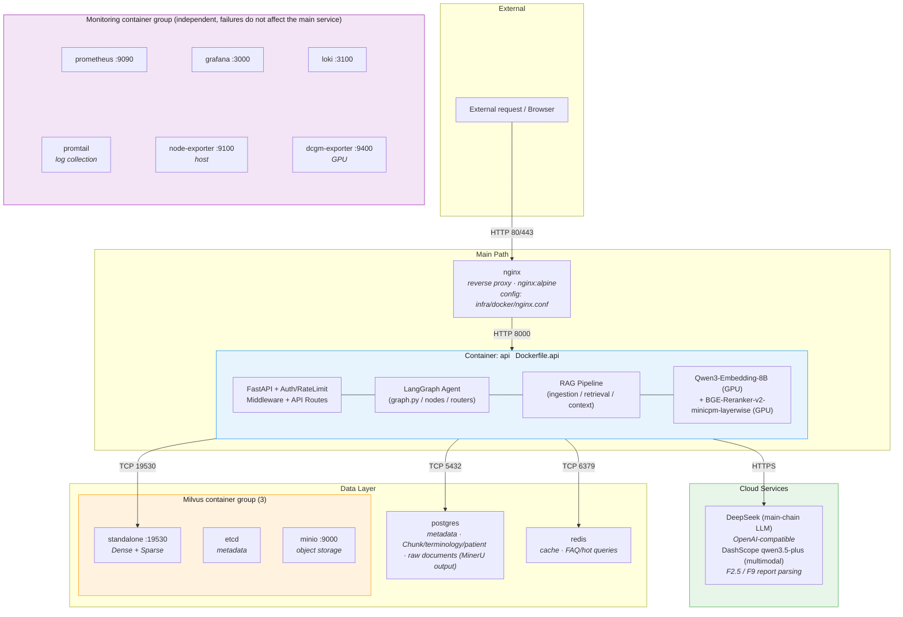
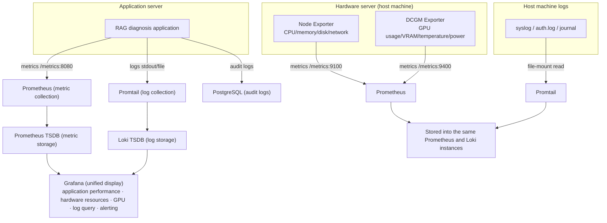
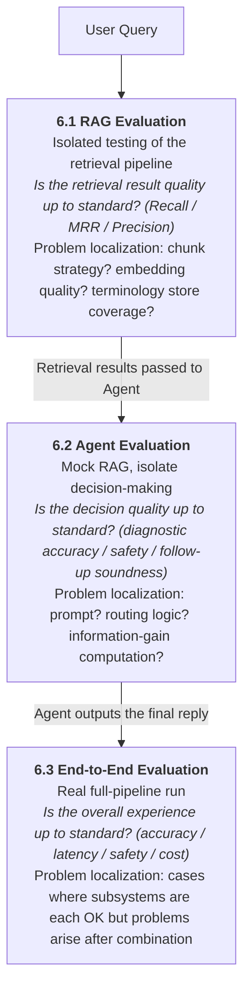

<!--
================================================================================
ENGLISH TRANSLATION OF DEV_SPEC.md — NOT THE SOURCE OF TRUTH
================================================================================
This file is a machine-assisted English mirror of DEV_SPEC.md (Chinese).

• DEV_SPEC.md (Chinese) remains the SINGLE SOURCE OF TRUTH. The authority
  hierarchy in CLAUDE.md is unchanged. On ANY divergence, the Chinese original
  wins — fix DEV_SPEC.md, then re-translate; never resolve a conflict here.
• Point-in-time snapshot (2026-06-03). It is NOT auto-synced: sync_spec.py does
  NOT regenerate this file, so it will drift as DEV_SPEC.md evolves.
• Translation rules: section numbers, code, Pydantic schemas, field/identifier
  names, Literal/enum values, thresholds, model names, cross-references (§x.y),
  and circled node markers (⓪a ① ② ⑥b ⑧a ⑩ …) are preserved verbatim. Only
  Chinese prose was translated. A few in-code Chinese comments, diagram labels,
  and production string literals may remain in Chinese by design.
================================================================================
-->

# 1. Project Overview

> Author's local development environment: CPU 9800X3D, GPU RTX 5070 Ti (16GB), RAM 48GB. All deployment / selection decisions in this document that involve "GPU VRAM" use this hardware as the baseline.

## 1.1 Project Highlights:

**Spec-driven collaborative development**: This `DEV_SPEC.md` is the single source of truth (architecture / schema / §8.4 progress tracking table / §9 global contracts), with the author leading architecture and trade-off judgments, completing rapid implementation in collaboration with Claude. `.claude/skills/auto-coder/scripts/sync_spec.py` is the accompanying internal tool that generates the `references/` mirror per chapter, for Claude to load chapter by chapter, avoiding stuffing 4976 lines into the context at once.


Deeply grounded in real business scenarios and optimized for them, through multiple rounds of discussion incorporating the opinions of experienced chief physicians


Observable, with visual management and integrated evaluation

## 1.2 Table of Contents
```
1. Project Overview
   1.1 Project Highlights
   1.2 Table of Contents
   1.3 Overall Architecture

2. Technology Selection
   2.1 Embedding Model Selection
   2.2 Agent and RAG System Model Selection
      2.2.1 Theoretical Selection
      2.2.2 Selection Evaluation Results
   2.3 Reranker Model Selection
   2.4 Data Storage Selection and Detailed Design
      2.4.1 Milvus Medical Literature Vector Store
      2.4.2 PostgreSQL Metadata Storage
      2.4.3 PostgreSQL Sessions and Conversation Records
      2.4.4 Raw Document Storage: PostgreSQL raw_documents Table
      2.4.5 PostgreSQL Patient Information
      2.4.6 Milvus Terminology Vector Store

3. RAG System Pipeline
   3.1 Ingestion
      3.1.1 Data Loading and Processing (MinerU)
      3.1.2 Chunking
      3.1.3 Transform & Enrichment
      3.1.4 Idempotency Design
      3.1.5 Embedding
      3.1.6 Index Storage
   3.2 Retrieval Strategy
      3.2.1 Query Processing
      3.2.2 Retrieval (Dense + Sparse + RRF Fusion)
      3.2.3 Precise Filtering and Reranking

4. Agent Design
   4.1 Workflow (LangGraph StateGraph, 17 nodes + 4 conditional routers)
   4.2 Context Management (Select + Compress Two-Layer Architecture)

5. Infrastructure
   5.1 Performance Optimization Layer (Redis Cache, Connection Pool)
   5.2 Monitoring Layer (Prometheus + Grafana + Loki + Audit System)
   5.3 Management Layer (Dynamic Configuration, Permission System)

6. Evaluation
   6.1 RAG Retrieval Evaluation
   6.2 Agent Decision Evaluation
   6.3 End-to-End System Evaluation
   6.4 Relationship Among the Three Evaluation Layers

7. Prompt Templates

8. Project Schedule
   8.1 Scheduling Principles
   8.2 Phase Overview
   8.3 Detailed Schedule
   8.4 Progress Tracking Table

9. Global Implementation Contracts (Cross-chapter, Must Read Before Implementation)
   9.1 Unified Mechanism (with_structured_output + Retry + Tiered Failure Handling)
   9.2 Schema Evolution Compatibility
   9.3 Full Structured Output Inventory
   9.4 LLM Calls That Do Not Require Structured Output
   9.5 Full Pydantic Schema Definitions
   9.6 Audit Logging Contract (rag_trace Write Rules)
   9.7 Runtime Constant Centralization (agent_limits)
   9.8 Cross-chapter Data Contract Quick Reference (terms_collection, etc.)
```

## 1.3 Overall Architecture
### 1.3.1 Project File Directory Structure
```
Agentic-RAG-diagnose-Assistant/
│
├── docker-compose.yml                  # Container orchestration (13 total): nginx, api, Milvus (standalone+etcd+minio), PostgreSQL, Redis, Prometheus, Grafana, Loki, Promtail, Node Exporter, DCGM Exporter (LLM inference is invoked via cloud API)
├── .dockerignore                       # docker build context exclusions (.venv / tests / data / infra/{grafana,prometheus,...}), added in J0
├── .env.example                        # Environment variable template (.env not committed)
├── .gitignore
├── pyproject.toml                      # Project dependencies and build configuration (incl. [tool.uv].extra-index-url cu128)
├── alembic.ini                         # Database migration configuration (Alembic)
├── README.md                           # Chinese README
├── README.en.md                        # English README (placeholder before J5 completion)
├── DEV_SPEC.md                         # Technical documentation
│
├── config/                             # Static configuration files
│   ├── settings.py                     # Global configuration (incl. model configs EmbeddingSettings/RerankerSettings/LLMSettings, loaded from .env)
│   ├── milvus_schema.py                # Milvus Collection Schema definitions (docs_collection + terms_collection)
│   └── logging_config.py               # Log format and Promtail adaptation
│
├── src/
│   ├── __init__.py
│   │
│   ├── api/                            # API gateway / entry service
│   │   ├── __init__.py
│   │   ├── app.py                      # FastAPI application entry
│   │   ├── routes/
│   │   │   ├── __init__.py
│   │   │   ├── diagnosis.py            # Consultation endpoint (POST /diagnose, follow-up interaction)
│   │   │   ├── auth.py                 # Login and registration (JWT)
│   │   │   ├── patient.py              # Patient information CRUD
│   │   │   ├── admin.py                # Admin: knowledge base upload, configuration modification
│   │   │   └── health.py               # Health check & Prometheus /metrics
│   │   ├── middleware/
│   │   │   ├── __init__.py
│   │   │   ├── auth_middleware.py       # JWT verification + role determination (admin/patient)
│   │   │   └── rate_limiter.py         # Rate limiting (prevents API quota overrun)
│   │   └── schemas/                    # Pydantic request/response models
│   │       ├── __init__.py
│   │       ├── diagnosis_schema.py
│   │       └── patient_schema.py
│   │
│   ├── agent/                          # Agent orchestration layer (LangGraph StateGraph)
│   │   ├── __init__.py
│   │   ├── graph.py                    # StateGraph definition: node registration, edge and conditional edge connections
│   │   ├── state.py                    # MedicalState Schema (Pydantic BaseModel) + nested BaseModel + create_initial_state factory
│   │   ├── nodes/                      # Implementations of each node
│   │   │   ├── __init__.py
│   │   │   ├── info_collect.py         # Node ①: chief complaint extraction + medical history/report loading (single round, no interaction)
│   │   │   ├── analyze_initial_reports.py  # Node ①.5: initial report parsing (multimodal LLM direct read, extracts structured findings)
│   │   │   ├── build_query.py          # Node ②: Sparse multi-field direct collection + LLM Dense Query rewriting (2026-05-24 NER removed entirely)
│   │   │   ├── retrieve.py             # Node ③: full vector retrieval
│   │   │   ├── select_symptom.py       # Node ④: intelligent follow-up selection (1 LLM, slot dimension filling + open fallback)
│   │   │   ├── generate_followup.py    # Node ⑤: generate follow-up questions
│   │   │   ├── wait_followup_answer.py # Node ⑥: interrupt awaiting user answer
│   │   │   ├── process_followup.py     # Node ⑦: process follow-up answer
│   │   │   ├── recommend_exam.py       # Node ⑧a: generate examination recommendations
│   │   │   ├── wait_exam_report.py     # Node ⑧b: interrupt awaiting examination result return
│   │   │   ├── process_exam_result.py  # Node ⑨: process returned examination result
│   │   │   ├── diagnose.py             # Node ⑩: diagnostic reasoning (Cross-Encoder truncation + parent chunk expansion + 1-step LLM)
│   │   │   ├── safety_gate.py           # Node ⑪: safety constraint gating (rules + LLM)
│   │   │   ├── generate_advice.py      # Node ⑫: generate advice (medication/examination/high-risk alerts)
│   │   │   └── format_response.py      # Node ⑬: format the final response
│   │   ├── schemas/                    # LLM structured output Pydantic Schemas (see §9.5)
│   │   │   ├── __init__.py
│   │   │   ├── info_collect.py         # InfoCollectOutput
│   │   │   ├── report_parser.py        # ReportFinding, ReportFindings
│   │   │   ├── query_construction.py   # QueryConstructionOutput
│   │   │   ├── symptom_selection.py    # FollowupQuestion, SmartFollowupOutput
│   │   │   ├── followup.py             # FollowupParseResult
│   │   │   ├── diagnosis.py            # RankedDisease, DiagnosisOutput
│   │   │   ├── safety_gate.py          # SafetyGateOutput
│   │   │   ├── advice.py               # AdviceOutput
│   │   │   ├── ingestion.py            # ChunkEnrichmentOutput
│   │   │   └── evaluation.py           # LLM Judge scoring Schema
│   │   ├── utils/                      # Agent-layer shared utilities
│   │   │   └── report_parser.py        # Shared report parsing logic (multimodal LLM direct read + structured finding extraction, shared by ①.5 and ⑨)
│   │   └── routers/                    # Conditional edge routing logic
│   │       ├── __init__.py
│   │       ├── should_continue.py      # Two-way routing for follow-up/diagnosis
│   │       └── diagnose_router.py      # Post-diagnosis routing (need_exam / safety_gate)
│   │
│   ├── rag/                            # RAG system Pipeline
│   │   ├── __init__.py
│   │   ├── ingestion/                  # 3.1 Ingestion
│   │   │   ├── __init__.py
│   │   │   ├── mineru_loader.py        # 3.1.1 MinerU output loading (reads markdown + content_list)
│   │   │   ├── chunking.py             # 3.1.2 parent/child chunking: authoritative table-of-contents list + three-pass intra-section split 【】+(一)+1. + size-driven child chunk split
│   │   │   ├── enrichment.py           # 3.1.3 LLM enrichment (title/summary/questions)
│   │   │   ├── idempotency.py          # 3.1.4 idempotency: source_id / heading_path_id / chunk_id (incl. parent chunk "parent" convention) / content_hash
│   │   │   ├── embedding.py            # 3.1.5 multi-vector Embedding (Dense: Qwen3-Embedding-8B, Sparse: Milvus BM25)
│   │   │   ├── storage.py              # 3.1.6 write to PostgreSQL + Milvus (incl. zombie cleanup)
│   │   │   └── pipeline.py             # Full ingestion Pipeline orchestration (chains the above steps)
│   │   │
│   │   ├── retrieval/                  # 3.2 Retrieval strategy
│   │   │   ├── __init__.py
│   │   │   ├── query_processing.py     # 3.2.1 query processing (coreference disambiguation, keyword extraction, terminology expansion, multi-angle rewriting)
│   │   │   ├── sparse_retriever.py     # 3.2.2 Sparse Route (Milvus BM25 full-text retrieval)
│   │   │   ├── dense_retriever.py      # 3.2.2 Dense Route (single-shot ANN)
│   │   │   ├── fusion.py               # 3.2.2 single-stage multi-route RRF fusion + multi-vector aggregation
│   │   │   └── reranker.py             # 3.2.3 Cross-Encoder reranking (pre-truncation before diagnose ⑩, invoked outside the retrieval stage / fallback strategy)
│   │   │
│   │   └── context/                    # Agent context management (4.2)
│   │       └── __init__.py             # Under the current fixed flow, no standalone compact/select node is needed (see 4.2.4 / 4.2.5); context management logic is embedded within each business node; compressor.py / selector.py are reserved for future open-ended interaction scenarios, not implemented in phase one
│   │
│   ├── models/                         # Model inference layer
│   │   ├── __init__.py
│   │   ├── llm_client.py              # LLM inference client (DashScope OpenAI-compatible API)
│   │   ├── embedding_model.py         # Qwen3-Embedding-8B (GPU inference, INT8)
│   │   └── reranker_model.py          # BGE-Reranker-v2-minicpm-layerwise (GPU inference, shares the GPU with Embedding)
│   │
│   ├── db/                            # Data and cache layer
│   │   ├── __init__.py
│   │   ├── postgres/
│   │   │   ├── __init__.py
│   │   │   ├── connection.py           # PostgreSQL connection pool
│   │   │   ├── models.py               # ORM models (sources, raw_documents, chunks, users, patients, conversations, etc.)
│   │   │   ├── metrics.py              # SQLAlchemy event subscription → Prometheus Histogram (dependency-layer metrics, §5.2.1 ③)
│   │   │   └── migrations/             # Database migration scripts (Alembic)
│   │   │       └── ...
│   │   ├── milvus/
│   │   │   ├── __init__.py
│   │   │   ├── connection.py           # Milvus connection management
│   │   │   ├── client.py               # Unified call wrapper + Prometheus Histogram (dependency-layer metrics, §5.2.1 ③)
│   │   │   ├── docs_collection.py      # Medical literature vector store operations (2.4.1)
│   │   │   └── terms_collection.py     # Terminology vector store operations (2.4.6)
│   │   └── redis/
│   │       ├── __init__.py
│   │       └── cache.py                # Redis cache (config cache only; no RAG response caching in MVP phase, see §5.1)
│   │
│   ├── prompts/                       # LLM Prompt templates
│   │   ├── __init__.py
│   │   ├── ingestion.py               # Ingestion enrichment Prompts (title/summary/hypothetical_questions)
│   │   ├── agent.py                   # Agent node Prompts (history-taking, Query construction, follow-up, diagnosis, safety gating, advice generation)
│   │   └── evaluation.py              # LLM Judge evaluation Prompts
│   │
│   └── common/                        # Common utilities
│       ├── __init__.py
│       ├── normalize.py               # Text normalization functions (full-width to half-width, NFC, etc., see 3.1.4.2)
│       ├── hashing.py                 # SHA256 utilities (chunk_id, content_hash, heading_path_id)
│       └── metrics.py                 # Prometheus metrics instrumentation
│
├── terms/                             # Terminology store build scripts (in-project code; raw data goes through the data volume, see notes after the directory tree)
│   └── build_icd10.py                 # ICD-10 load script (→ terms_collection)
│                                      # Other terminology sources such as CMeSH are YAGNI, added on demand
│
├── evaluation/                        # 6. Evaluation system
│   ├── __init__.py
│   ├── datasets/                      # Test sets (JSON/JSONL)
│   │   ├── rag_eval.jsonl             # RAG retrieval quality test set
│   │   └── agent_eval.jsonl           # Agent decision test set (L1-L5 gradient)
│   ├── offline/
│   │   ├── rag_evaluator.py           # RAG offline evaluation (recall, accuracy)
│   │   ├── agent_evaluator.py         # Agent offline evaluation (trajectory, tool calls, fault tolerance)
│   │   └── llm_judge.py               # LLM Judge scoring
│   └── online/
│       └── tracing.py                 # Online tracing (end-to-end latency, Token statistics)
│
├── infra/                             # Infrastructure configuration
│   ├── docker/
│   │   ├── Dockerfile.api             # API service image (FastAPI + Agent + RAG + Embedding + Reranker)
│   │   └── nginx.conf                 # Nginx reverse proxy configuration
│   ├── prometheus/
│   │   └── prometheus.yml             # Prometheus scrape configuration
│   ├── grafana/
│   │   └── dashboards/               # Grafana dashboard JSON
│   ├── loki/
│   │   └── loki-config.yml
│   └── promtail/
│       └── promtail-config.yml
│
├── scripts/                           # Operations scripts
│   ├── init_db.py                     # Initialize PostgreSQL table structure + indexes
│   ├── init_milvus.py                 # Initialize Milvus Collection + indexes
│   ├── ingest.py                      # Document ingestion entry (calls rag.ingestion.pipeline)
│   └── batch_parse_pdfs.sh            # Batch mineru parsing of all PDFs under raw-pdf/ (idempotent, skips completed ones)
│
└── tests/
    ├── unit/
    │   ├── test_normalize.py
    │   ├── test_hashing.py
    │   ├── test_chunking.py
    │   └── test_fusion.py
    ├── integration/                    # Module integration tests with Mock LLM + Mock DB
    │   ├── test_ingestion_pipeline.py
    │   ├── test_retrieval.py
    │   └── test_agent_workflow.py
    └── e2e/                            # End-to-end smoke tests with real DashScope + real Milvus/PG (phase J)
        ├── test_ingestion_e2e.py       # J1
        ├── test_retrieval_e2e.py       # J2
        ├── test_agent_workflow_e2e.py  # J3
        └── test_api_e2e.py             # J4
```

> This section only describes the project directory (code). All local paths for raw data, model weights, parsing outputs, etc. are configured via `.env`, see `.env.example`; the spec does not re-list them.

### 1.3.2 Mapping Between Directories and Document Chapters

| DEV_SPEC Chapter | Corresponding Directory |
|---|---|
| 2.1 Qwen3-Embedding-8B model | `src/models/embedding_model.py` |
| 2.2 Cloud LLM API (DashScope) | `src/models/llm_client.py` |
| 2.3 BGE-Reranker-v2-minicpm-layerwise reranking model | `src/models/reranker_model.py` |
| 2.4.1 Milvus medical literature vector store | `src/db/milvus/docs_collection.py` |
| 2.4.2 PostgreSQL metadata storage | `src/db/postgres/` |
| 2.4.3 PostgreSQL sessions and conversation records | `src/db/postgres/models.py` → sessions / conversations |
| 2.4.4 Raw document storage raw_documents table | `src/db/postgres/models.py` (raw_documents ORM class) |
| 2.4.5 PostgreSQL patient information | `src/db/postgres/models.py` → patients, etc. |
| 2.4.6 Milvus terminology vector store | `src/db/milvus/terms_collection.py` + `terms/` |
| 3.1.1 MinerU data loading | `src/rag/ingestion/mineru_loader.py` |
| 3.1.2 Chunking | `src/rag/ingestion/chunking.py` |
| 3.1.3 Transform & Enrichment | `src/rag/ingestion/enrichment.py` |
| 3.1.4 Idempotency design | `src/rag/ingestion/idempotency.py` + `src/common/hashing.py` |
| 3.1.5 Embedding | `src/rag/ingestion/embedding.py` |
| 3.1.6 Index storage | `src/rag/ingestion/storage.py` |
| 3.2.1 Query processing | `src/rag/retrieval/query_processing.py` |
| 3.2.2 Retrieval (Dense + Sparse + RRF) | `src/rag/retrieval/` |
| 3.2.3 Cross-Encoder reranking (pre-truncation before diagnose ⑩) | `src/rag/retrieval/reranker.py` |
| 4.1 Agent workflow (17 nodes + 4 conditional routers) | `src/agent/graph.py` + `nodes/` (①~⑬ incl. ⓪a / ①.5 / intake_followup_ask, ⑥⑧ each split into a/b/c) + `routers/` (should_continue / diagnose_router / generate_followup_out / post_followup) |
| 4.2 Context management | `src/rag/context/` |
| 5.1 Redis cache | `src/db/redis/cache.py` |
| 5.2 Monitoring layer | `infra/prometheus/` + `infra/grafana/` + `infra/loki/` |
| 5.2.3 PostgreSQL audit system | `src/db/postgres/models.py` → rag_trace / kb_change_log / config_change_log / diagnosis_feedback |
| 5.3 Dynamic configuration management | `src/db/postgres/models.py` → system_config |
| 5.3 Permissions and configuration | `src/api/middleware/` + `src/db/postgres/` |
| 6. Evaluation system | `evaluation/` |
| 7. Prompt templates | `src/prompts/` |
| 9. Global implementation contracts (cross-chapter) | `src/agent/schemas/` (authoritative Pydantic Schema definitions) + `src/common/metrics.py` (module-level Prometheus metric objects + `RetryObserver` callback, **no decorator/helper wrappers**); the rules run through all LLM call implementations in chapters 3/4/6/7, each call site written bare per the §9.1 template |

### 1.3.3 Project Layers

#### Logical Layer Description

**Client layer**

- Nginx reverse proxy (`infra/docker/nginx.conf`), exposes the REST interface
- Authentication middleware (`src/api/middleware/auth_middleware.py`) and rate-limiting middleware (`src/api/middleware/rate_limiter.py`), prevent API quota overrun and ensure system stability

**API service layer** (incl. Agent orchestration, RAG, Embedding/Reranker, invoked within the same process)

- FastAPI application (`src/api/app.py`), provides diagnosis, patient management, health check, and admin routes
- Request/response Schema validation (`src/api/schemas/`)
- State-graph-driven multi-step diagnostic flow (`src/agent/graph.py`), an iterative follow-up workflow driven by HPI 12-dimension slot filling
- Nodes (15): history-taking, initial report parsing, Query construction, vector retrieval, intelligent follow-up selection, follow-up generation (⑤), follow-up waiting (⑥), follow-up processing, examination recommendation (⑧a), examination result waiting (⑧b), examination result processing, diagnostic reasoning, safety constraint gating, advice generation, response formatting (`src/agent/nodes/`)
- Routers (2): should_continue (two-way follow-up/diagnosis routing), diagnose_router (post-diagnosis routing: need_exam / safety_gate) (`src/agent/routers/`)
- Ingestion Pipeline: MinerU document parsing → Chunking → LLM enrichment (summary/question generation/image description) → idempotent write → Embedding → vector storage (`src/rag/ingestion/`)
- Retrieval Pipeline: query processing → Dense/Sparse two-route retrieval → RRF fusion (`src/rag/retrieval/`)
- Context management: context selection and compression (`src/rag/context/`)
- Embedding inference: Qwen3-Embedding-8B, GPU inference (INT8), shares the GPU with the Reranker (`src/models/embedding_model.py`)
- Reranker inference: BGE-Reranker-v2-minicpm-layerwise, GPU inference, shares the GPU with Embedding (`src/models/reranker_model.py`)

> **Design decision**: Agent/RAG are Python function calls running within the same process as FastAPI, requiring no cross-container network communication. Embedding and Reranker invoke the GPU directly via Python; merging them into the `api` container avoids unnecessary HTTP latency while simplifying deployment and debugging.

**LLM inference layer (cloud API)**

- LLM inference: invoked via an OpenAI-compatible API (`src/models/llm_client.py`)
- Cloud solution: DeepSeek-V3 / Qwen-Max, etc.; GPU VRAM is fully released to Embedding + Reranker

> **Design decision**: After migrating LLM inference to the cloud, the RTX 5070 Ti 16GB VRAM is fully allocated to Embedding (Qwen3-Embedding-8B, INT8 about 8.5-8.8GB) and Reranker (BGE-Reranker-v2-minicpm-layerwise, INT8 about 2.6GB), substantially improving retrieval quality and inference speed.

**Data and cache layer**

- Vector storage: Milvus (Dense + Sparse vectors, containerized deployment, composed of three containers: `milvus-standalone` + `milvus-etcd` + `milvus-minio`) (`src/db/milvus/`)
- Metadata storage: PostgreSQL (Chunk metadata, source documents, medical terminology, etc.) (`src/db/postgres/`)
- Raw document storage: PostgreSQL `raw_documents` table (raw documents after MinerU parsing, in the same database as `sources`) (`src/db/postgres/`)
- Cache: Redis (FAQ, hot queries, etc.) (`src/db/redis/`)

**Logging and monitoring layer**

- Metrics collection and alerting: Prometheus (`infra/prometheus/`)
- Visualization dashboards: Grafana (`infra/grafana/`)
- Log collection: Loki + Promtail (`infra/loki/`, `infra/promtail/`)
- Application metrics instrumentation (`src/common/metrics.py`)

**Infrastructure layer (local deployment)**

- Container orchestration: Docker Compose (`docker-compose.yml`)
- Container images: the API service is built using a custom Dockerfile (`infra/docker/Dockerfile.api`); LLM inference is invoked via the DashScope cloud API, requiring no local container
- Storage: local disk
- Secret management: environment variable configuration (`.env.example`)

---

#### Container Partition Overview



Container list (14 total):
- **Main path**: nginx → api (LLM inference is invoked via the DashScope cloud API, occupies no local container)
- **Data layer**: milvus-standalone, milvus-etcd, milvus-minio, postgres, redis
- **Monitoring layer**: prometheus, grafana, loki, promtail, node-exporter, dcgm-exporter

# 2 Technology Selection:
The LLM selection for this project was made on 2026/3/6.
## 2.1 Embedding Model Selection

The Embedding model is responsible for converting text into vectors, used for coarse-ranking retrieval. The medical domain demands far higher Embedding precision than general scenarios: terminology is highly ambiguous ("MI" may refer to myocardial infarction or mitral insufficiency), near-synonymous expressions are abundant (patient colloquialisms vs. clinical terminology), and fine-grained semantic distinctions are critical ("left heart failure" vs. "right heart failure", "acute" vs. "chronic"). Models with insufficient parameters cannot encode these subtle differences within a finite-dimensional vector space, causing semantic collapse — i.e., compressing clinically distinct concepts into nearly identical vectors, directly harming retrieval quality.

### Selection Conclusion: Qwen3-Embedding-8B (Qwen/Qwen3-Embedding-8B), deployed on GPU

#### Rationale

1. **8B parameters, ample medical semantic capacity**: The 8B parameter count is based on the Qwen LLM architecture (decoder-based); compared with traditional encoder models (e.g., BGE-M3's 568M), semantic encoding capacity is an order of magnitude higher. A larger parameter count means the model can allocate sufficient representational space in the vector space for the fine-grained distinctions among medical terms, avoiding semantic collapse. The C-MTEB total score is 73.84, far surpassing BGE-M3's ~66-67.

2. **Qwen base, thorough Chinese medical pretraining**: The Qwen series' pretraining scale on Chinese corpora (including medical literature, clinical guidelines, drug package inserts, etc.) far exceeds BAAI's encoder-series models. It shares the same origin as this project's LLM selection (Qwen series), with an identical tokenizer and identical tokenization of Chinese medical terms, yielding better semantic alignment between coarse-ranking and reranking.

3. **Ultra-long context support (32,768 tokens)**: Chunks of medical guidelines may be long; the 32K context window can fully encode the semantics of long passages, with no concern about truncation losing key information.

4. **High-dimensional vectors (4096 dimensions)**: Outputs 4096-dimensional Dense vectors with large vector-space capacity, providing more ample representational dimensions for fine distinctions among medical terms. The `dense_vector` field in this project's Collection Schema (see 2.4.1) must be adjusted to 4096 dimensions accordingly.

5. **Sparse route unaffected**: This project's Sparse retrieval adopts Milvus's built-in BM25 full-text search (see 3.2.2), independent of the Embedding model; Qwen3-Embedding-8B focuses on Dense encoding, with clear separation of duties.


Although this project already has multiple mechanisms to improve retrieval quality — multi-vector representation (original + summary + question), hybrid retrieval (Dense + BM25), Reranker reranking, etc. — these mechanisms **cannot compensate for a fundamental retrieval miss at the coarse-ranking stage**: if the Embedding model fails to retrieve the correct document into the candidate set due to insufficient semantic capacity, no matter how strong the subsequent Reranker and fusion strategies are, there is nothing to rerank. In the medical domain, missing the retrieval of a key guideline may directly affect the completeness and safety of diagnostic recommendations, so the Embedding stage warrants investment in a larger-parameter model.

#### Deployment Strategy: GPU Inference (RTX 5070 Ti 16GB)

LLM inference is invoked via cloud API (see 2.2), and the entire GPU memory is allocated to Embedding and Reranker. The deployment strategy is as follows:

- **INT8 quantized deployment**: After INT8 quantization, the 8B model occupies about 8.5-8.8GB of GPU memory, which the RTX 5070 Ti 16GB can easily accommodate, leaving the remaining memory for the Reranker (INT8, about 2.6GB).
- **Offline Embedding (document ingestion)**: GPU inference is far faster than CPU, greatly improving batch ingestion efficiency, with no need to schedule off-peak nighttime execution.
- **Online Query Embedding (real-time queries)**: GPU inference latency is extremely low (a single Query is typically <10ms), offering a better user experience than the CPU approach.
- **Sharing the GPU with the Reranker**: Embedding and Reranker loads are naturally offset (Embedding runs in batches at ingestion time, Reranker runs in real time at query time), so they can share GPU resources without additional hardware.

#### Rationale for Excluding Other Candidate Models

| Candidate Model | Reason for Exclusion |
|---------|---------|
| **BGE-M3 (568M)** | Insufficient parameters, limited semantic encoding ability in the medical domain; C-MTEB retrieval score lags by about 10 points |
| **Conan-embedding-v2 (1.48B)** | Traditional encoder architecture; although larger in parameters than BGE-M3, still limited; Tencent ecosystem, with community resources and documentation inferior to Qwen; C-MTEB retrieval score of 78.31 is high but represents the encoder ceiling |
| **Qwen3-Embedding-4B** | C-MTEB 72.26, 1.5 points lower than 8B; limited memory savings (INT8 about 4-5GB vs 8-10GB), and on a 16GB card there is no need to sacrifice model capability to save this bit of memory |
| **Qwen3-Embedding-0.6B** | Parameter count comparable to BGE-M3 (0.6B vs 0.568B), C-MTEB 66.33 with no substantive improvement; does not address the core problem |
| **Seed1.6-Embedding (ByteDance)** | API only, cannot be deployed locally; batch ingestion call costs accumulate; vectors become incompatible after an API model upgrade, requiring a full re-index; transmitting medical data externally poses compliance risks |
| **Cloud Embedding APIs (general)** | Same as above, and they introduce network latency and external dependencies; Embedding needs to share the GPU with the Reranker, and local deployment is simpler and more efficient |

## 2.2 Agent and RAG System Model Selection (Cloud API)

### 2.2.1 Selection Conclusion: Qwen-Series Cloud API (Alibaba Cloud DashScope)

**Selection conclusion: `qwen-max` (preferred) / `qwen-plus` (alternative)**, invoked via the Alibaba Cloud DashScope OpenAI-compatible interface.

#### Rationale

**1. Same model family as the Embedding model, forming a complete Qwen ecosystem**

This project's Embedding selection is Qwen3-Embedding-8B (see 2.1), which shares the following underlying consistency with the Qwen-series LLM:

- **Completely identical tokenizer**: The entire Qwen family uses the same tiktoken BPE tokenizer. Medical terms (e.g., "amlodipine tablets", "acute myocardial infarction") tokenize identically at the Embedding stage and the LLM inference stage, avoiding the problem of token-boundary misalignment across model families.
- **Aligned pretraining data**: The Embedding model and the LLM are pretrained on the same Chinese medical corpora (including medical literature, clinical guidelines, pharmacopoeias, etc.), so their "understanding" of the same medical concept resides in the same semantic space. Chunks retrieved by RAG are injected directly into the LLM context with minimal semantic friction, and the LLM can efficiently utilize the retrieved content.
- **Instruction-style Embedding alignment**: Qwen3-Embedding-8B supports task instructions (e.g., `"Represent this medical query for retrieval:"`), which can further align the direction of the Embedding's vector representation with how the Qwen LLM understands queries, improving the relevance of coarse-ranking retrieval.

**2. The entire GPU memory is allocated to Embedding and Reranker**

This project's hardware is an RTX 5070 Ti (16GB GPU memory). The LLM is invoked via cloud API, freeing all GPU memory for Qwen3-Embedding-8B (INT8, about 8.5-8.8GB) and BGE-Reranker-v2-minicpm-layerwise (INT8, about 2.6GB), totaling about 11.1-11.4GB, leaving ample headroom for inference activations and memory fragmentation, greatly improving retrieval quality and reranking speed.

**3. Fully OpenAI-compatible interface, concise code**

DashScope provides an OpenAI-compatible interface; the model can be switched via environment variable configuration, with no changes needed to the `src/models/llm_client.py` business code.

#### Comparison of Cloud Qwen Models

| Model | Positioning | Applicable Scenarios |
|---|---|---|
| **qwen-max** (preferred) | Flagship, strongest reasoning ability | Complex diagnostic reasoning, multi-round follow-up, drug-safety judgment; supports thinking mode |
| **qwen-plus** (alternative) | Balanced, about 60% lower cost | Cost-sensitive scenarios, common consultations, symptom analysis |
| qwen-turbo | Ultra-fast, low cost | Not suitable for this scenario; insufficient medical reasoning quality |

#### Interface Configuration

```env
LLM_BASE_URL=https://dashscope.aliyuncs.com/compatible-mode/v1
LLM_API_KEY=sk-xxx
LLM_MODEL_NAME=qwen-max
```

### 2.2.2 Selection Evaluation Results

The specific evaluation methodology is described in detail in Part 6; this section states the final results.

Cloud `qwen-max` is adopted directly, with no need for a local evaluation process. If cost pressure becomes significant later, `qwen-max` and `qwen-plus` can be compared in business scenarios along the following dimensions: diagnostic accuracy, follow-up reasonableness, drug-safety judgment, and structured-output stability.

> In this project, the author does not have high-quality annotated data, so fine-tuning is not currently planned. The vendor has already performed DPO/RLHF alignment; if persistent harmful output or undesired behavior occurs, a small amount of DPO alignment may be considered.


## 2.3 Reranker Model Selection
The Rerank model performs fine-ranking (reranking) over the retrieved candidate documents. It is typically a cross-encoder architecture — concatenating the query and document together as input to the model and directly outputting a relevance score. Because there is sufficient interaction attention between query and document, precision is higher, but the computational cost is also greater; it is unsuitable for full-scale retrieval directly and only suitable for reranking a small number of candidates (e.g., top-20 to top-100).

### Selection Conclusion: BGE-Reranker-v2-minicpm-layerwise (BAAI/bge-reranker-v2-minicpm-layerwise), deployed on GPU

#### Rationale

1. **Highest precision in Chinese medical scenarios**: The base is MiniCPM-2B (Tsinghua & ModelBest); its Chinese pretraining corpus is thorough, and its understanding of medical terms such as ICD-10 and SNOMED CT is significantly better than the XLM-RoBERTa-based v2-m3. It clearly leads other models in the same series on the C-MTEB Reranking Chinese subset. It also supports both Chinese and English, covering reranking needs for English medical literature.

2. **Cross-Encoder architecture, 2.4B parameters with high reranking precision**: As a cross-encoder, it concatenates the query and document and performs full attention interaction, with precision far higher than the Embedding's bi-encoder similarity. The 2.4B parameter count is an order of magnitude larger than v2-m3's 568M, giving stronger semantic discrimination. Even though coarse-ranking (Embedding) and reranking (Reranker) come from different model families (Qwen vs BAAI), the cross-encoder's full-interaction mechanism naturally compensates for this difference — the Reranker independently judges query-doc relevance and does not depend on the vector representation from the coarse-ranking stage.

3. **Layerwise inference, continuously tunable precision and speed**: The model trains a classification head at every layer, so via the `cutoff_layers` parameter you can choose to extract scores early from layer N rather than necessarily running all 28 layers. Full-layer inference yields the highest precision; truncating to the first 20 layers can speed up by about 30% with minimal precision loss. This provides a flexible precision-latency tuning knob for the production environment.

4. **Long context support (8192 tokens)**: Chunks of medical guidelines may be long; the 8192-token window ensures full interaction of the query-document pair, with no loss of reranking information due to truncation.

#### Deployment Strategy: GPU Inference, Sharing the GPU with the Embedding Model

After this project migrated the LLM to the cloud API (see 2.2), the RTX 5070 Ti 16GB GPU memory is shared by the Embedding model (Qwen3-Embedding-8B, INT8 about 8.5-8.8GB) and the Reranker:

- **The two will not be under high load simultaneously**: Embedding runs in batches during document ingestion, and Reranker runs in real time during user queries, so loads are naturally offset.
- **INT8 quantized deployment, memory-safe**: After INT8 quantization, the 2.4B parameters take about 2.6GB; together with the Embedding model, the total is about 11.1-11.4GB, leaving about 4.6-4.9GB of headroom on the 16GB card, fully covering inference activations (~0.5-1GB), fixed CUDA overhead (~0.5-0.8GB), and memory fragmentation. Using FP16 (~4.8GB) would bring the total to 13.3-13.6GB, posing an OOM risk when both models run inference simultaneously, so it is not adopted.
- **INT8 has minimal impact on reranking precision**: The Reranker outputs relative scores used for ranking rather than generated text, and is insensitive to quantization precision loss.
- **Excellent GPU inference speed**: Reranking 20 query-doc pairs has a latency of about 40-80ms (full layers); using layerwise truncation can further reduce it to 30-60ms, providing a good user experience.
- **Limited candidate volume**: Reranking only processes the Top-20 candidates after RRF fusion (see 3.2.3), not involving large-batch computation.

#### Alternatives and Reasons for Exclusion

| Alternative Model | Reason for Exclusion |
|---------|---------|
| **Cohere Rerank** | Closed-source cloud API; transmitting medical data externally poses compliance risks; introducing an external dependency affects system stability |
| **LLM Rerank (Qwen itself doing reranking)** | Would contend for the inference model's GPU resources and inference queue, increasing end-to-end latency; structured output is less stable than a cross-encoder; cost is higher than a dedicated Reranker |
| **BGE-Reranker-v2-m3** | 568M parameters, reranking precision lower than v2-minicpm-layerwise; the project has ample GPU memory (5-6GB remaining), with no need to sacrifice precision to save memory |
| **BGE-Reranker-v2-gemma** | Based on Gemma 2B, primarily English pretraining; understanding of Chinese medical terms is inferior to the MiniCPM base; no layerwise flexibility |
| **BGE-Reranker-large (v1)** | Older version; Chinese ability and long-context support inferior to the v2 series; maximum input is only 512 tokens, unable to cover this project's long-Chunk scenarios |

#### Integration with the System Architecture

- **Input**: Top-M candidates after RRF fusion + multi-vector aggregation (see 3.2.2), each candidate being a [query, original_content] pair
- **Output**: Top-K results sorted by relevance score, passed to the LLM for diagnosis generation
- **Fallback mechanism**: When the Reranker times out or is unavailable, directly return the RRF Top-K, ensuring system availability (see 3.2.3 fallback strategy)
- **Layerwise configuration**: The production environment defaults to full-layer inference (28 layers) for the highest precision; the `cutoff_layers` parameter can be configured to switch to truncated mode in latency-sensitive scenarios

## 2.4 Data Storage Selection and Detailed Design:
### 2.4.1. Vector Store for Original Document Vectorization: Milvus

Each Chunk corresponds to 4~5 vector records in Milvus (1 original + 1 summary + 2~3 question):

| vector_type | id rule | Dense (Qwen3-Embedding-8B) | BM25 full-text search | Description |
|-------------|---------|:-----:|:------:|------|
| `original` | `{chunk_id}` | ✅ | ✅ | Original-text vector + full-text index, supporting semantic retrieval and keyword retrieval |
| `summary` | `{chunk_id}_summary` | ✅ | ❌ | Summary vector, improving matching capability for fuzzy queries |
| `question` | `{chunk_id}_q{n}` | ✅ | ❌ | Question vector, bridging the semantic gap between patient colloquialisms and clinical text |

summary / question records do not participate in BM25 full-text search — keyword matching should be based on the original text, not on LLM-rewritten text, to avoid semantic drift. BM25 is handled by Milvus 2.4+'s built-in full-text search engine, building an inverted index based on the `original_content` field, with no need for the Embedding model to output Sparse vectors.

**Milvus Collection Schema**:

```
{
    "id":               str,             # Unique ID of this record (see table above)
    "source_chunk_id":  str,             # The original chunk_id this belongs to (original records have the same id)
    "vector_type":      str,             # "original" | "summary" | "question"
    "dense_vector":     List[float],     # Qwen3-Embedding-8B semantic vector, 4096-dim (all records have it)
    "text_for_bm25":    str,             # BM25 full-text search field (only original has a value; summary/question store an empty string; Milvus 2.4+ automatically builds an inverted index)
    "original_content": str,             # Original chunk text, redundantly stored, so no need to look up PostgreSQL after a hit
    "source_id":        str              # Pre-filter field: filter by source document (see 2.4.2 sources table)
}
```

Display fields such as `title` and `heading_path` are not redundantly stored in Milvus; after a retrieval hit, they are looked up in the PostgreSQL `chunks` table via `source_chunk_id`.


 ### 2.4.2. Metadata Storage: PostgreSQL

PostgreSQL is responsible for storing the structural metadata and enrichment metadata of all Chunks, supporting idempotent writes, zombie cleanup, incremental Embedding determination, and context restoration of retrieval results. The vector data itself is stored in Milvus; PostgreSQL does not store vectors.

**sources table** (source-document registry, the authoritative source of source_id)

```sql
sources (
  source_id    TEXT PRIMARY KEY,          -- Unique document ID (see 3.1.4.1)
  file_name    TEXT NOT NULL,             -- Original file name
  file_path    TEXT,                      -- File storage path
  doc_type     VARCHAR(50),               -- Document type, e.g., guideline / textbook / protocol
  created_at   TIMESTAMPTZ NOT NULL DEFAULT now(),
  updated_at   TIMESTAMPTZ NOT NULL DEFAULT now()
)
```

**chunks table** (the core Chunk metadata table)

```sql
chunks (
  -- Idempotency fields (see 3.1.4)
  chunk_id              TEXT PRIMARY KEY,   -- SHA256(source_id:heading_path_id:relative_chunk_index)
  source_id             TEXT NOT NULL REFERENCES sources(source_id),
  heading_path_id       TEXT NOT NULL,      -- SHA256(H1_id:H2_id:...) heading-path hash
  heading_path          TEXT NOT NULL,      -- Human-readable heading path, e.g., "Chapter 2 > 2.1 > 3.1.4", used for displaying retrieval results
  relative_chunk_index  TEXT NOT NULL,      -- Block index under the same heading path; child blocks use "0/1/2..."; parent blocks use "parent"; figure/table chunks use "{chunk_type}:p{page_idx}_b{block_idx}" (see §3.1.4.2 Step 3 figure/table chunk convention)
  parent_chunk_id       TEXT REFERENCES chunks(chunk_id),
                                            -- Parent block ID (Small-to-Big parent-child index, see 3.1.2); NULL means this block is itself a top-level parent block
  chunk_type            VARCHAR(20) NOT NULL DEFAULT 'child',
                                            -- parent / child / table / figure
                                            -- figure covers all "image-dominant" sources (the flowchart subset of mineru type=image + all of type=chart; chart recognition quality is poor, so it is uniformly treated as an image)
                                            -- see the figure/table/image processing section in 3.1.2
  image_path            TEXT,               -- Relative path of the figure/table screenshot (used by table / figure chunks); NULL means a non-figure/table chunk
  sub_type              VARCHAR(20),        -- mineru sub_type (used by figure chunks, recording 'flowchart' or the original chart subtype 'line'/'bar', etc. for traceability); NULL means a chunk not sourced from image/chart
  chunk_raw_text        TEXT NOT NULL,      -- Chunk original text: child = body paragraph; table = caption + html + footnote (html is preserved at high quality); figure = caption + footnote (mineru mermaid / markdown is not written in; its quality is too poor and it is never consumed, see §3.1.2); parent = merged child-block text (used only for Small-to-Big expansion of the parent context after a child hit, **not embedded and not put into BM25**). child / table / figure go to BM25 sparse; child also serves as the dense `original` vector source (the dense `original` for table / figure comes from medical_statement)
  medical_statement     TEXT,               -- table / figure dedicated: an LLM-generated 100-300-character medical statement (linearizing figure/table data into declarative sentences). **The dense `original` vector source for table / figure** (replacing chunk_raw_text, because a figure's chunk_raw_text has only a caption, insufficient for dense embedding, and although a table has html its expressiveness as dense original text is insufficient, see §3.1.2); this column is NULL for child / parent
  content_hash          TEXT NOT NULL,      -- Change-detection signal (see 3.1.4.3): child / parent = SHA256(chunk_raw_text); table / figure = SHA256(chunk_raw_text + "\n" + medical_statement), where a change in either source (html/caption or the LLM statement) triggers re-embedding

  -- LLM enrichment fields (see 3.1.3)
  title                 TEXT,              -- LLM-generated precise subheading
  summary               TEXT,             -- LLM-generated content summary, also serving as the source text for the summary vector (see 3.1.5)
  hypothetical_questions TEXT[],          -- Array of LLM-generated hypothetical questions (3 entries, see 3.1.5)

  -- Operational status fields
  embedding_status      VARCHAR(20) NOT NULL DEFAULT 'pending',
                                          -- pending / done / failed / skip
                                          -- pending: awaiting Embedding; done: vector written to Milvus; failed: Milvus write failed, awaiting compensation
                                          -- skip: parent-block-only, never vectorized (see 3.1.2 parent-child index)
  created_at            TIMESTAMPTZ NOT NULL DEFAULT now(),
  updated_at            TIMESTAMPTZ NOT NULL DEFAULT now()
)
```

**Indexes**

```sql
CREATE INDEX idx_chunks_source_id        ON chunks (source_id);           -- Zombie-cleanup set-difference query
CREATE INDEX idx_chunks_heading_path_id  ON chunks (heading_path_id);     -- Aggregation query by heading path
CREATE INDEX idx_chunks_content_hash     ON chunks (content_hash);        -- Cross-document content deduplication
CREATE INDEX idx_chunks_embedding_status ON chunks (embedding_status)     -- Incremental Embedding task scan
  WHERE embedding_status NOT IN ('done', 'skip');
CREATE INDEX idx_chunks_parent_chunk_id  ON chunks (parent_chunk_id)      -- Sort child blocks by parent block during zombie cleanup (see 3.1.4.3)
  WHERE parent_chunk_id IS NOT NULL;
CREATE INDEX idx_chunks_chunk_type       ON chunks (chunk_type);          -- Aggregation query by chunk type (figure/table/body, etc.)
```

> `heading_path` (plaintext) and `heading_path_id` (hash) are stored simultaneously: the latter is used to derive chunk_id, the former is used to display the source heading of retrieval results; they have different duties and cannot be merged.

### 2.4.3. Conversation and Session Records: PostgreSQL

**sessions table** (session management, threading together one complete consultation process for the same patient)

```sql
sessions (
  id            UUID PRIMARY KEY DEFAULT gen_random_uuid(),
  user_id       UUID NOT NULL REFERENCES users(id),
  title         TEXT,                    -- Session title (may be auto-generated as a summary by the LLM)
  status        VARCHAR(20) NOT NULL DEFAULT 'active',  -- active / closed / archived
  created_at    TIMESTAMPTZ NOT NULL DEFAULT now(),
  updated_at    TIMESTAMPTZ NOT NULL DEFAULT now()
)
```

**Indexes**

```sql
CREATE INDEX idx_sessions_user      ON sessions (user_id, created_at DESC);   -- Query historical sessions by user
CREATE INDEX idx_sessions_status    ON sessions (status) WHERE status = 'active';  -- Query active sessions
```

**conversations table** (conversation records, each representing one user-system interaction)

```sql
conversations (
  id            UUID PRIMARY KEY DEFAULT gen_random_uuid(),
  session_id    UUID NOT NULL REFERENCES sessions(id),   -- The session this belongs to
  user_id       UUID NOT NULL REFERENCES users(id),      -- Redundantly stored to avoid cross-table JOINs
  user_input    TEXT NOT NULL,            -- User's original input
  llm_output    TEXT NOT NULL,            -- LLM reply
  rag_context   JSONB,                   -- Snapshot of this round's retrieval context (chunk_id list + scores)
  created_at    TIMESTAMPTZ NOT NULL DEFAULT now()
)
```

**Indexes**

```sql
CREATE INDEX idx_conversations_session ON conversations (session_id, created_at);  -- Query the conversation flow by session
CREATE INDEX idx_conversations_user    ON conversations (user_id, created_at DESC); -- Query history by user
```
### 2.4.4. Original Guideline/Textbook Document Storage: PostgreSQL `raw_documents` Table

The PostgreSQL `raw_documents` table is responsible for storing all the original artifacts parsed by MinerU, keyed by `source_id`, in one-to-one correspondence with the `sources` table (2.4.2).

**Storage motivation**: MinerU artifacts include both deeply nested JSON (`content_list`, `middle`) and long-text Markdown, with heterogeneous structure and a primarily "write once, read on demand" access pattern. Merging them into the same PostgreSQL database as `sources` and `chunks` provides: (1) `jsonb` fields (with GIN indexes available) satisfy the need to accommodate heterogeneous schemas, equivalent to the flexibility of a document database; (2) long text goes into a `text` field, which PostgreSQL automatically stores out-of-line via TOAST, with performance no different from a document database; (3) being in the same database as `sources` gains cross-table ACID transactions, avoiding the dual-write compensation problem of "sources write succeeds, original artifact write fails"; (4) reducing the operational and connection-pool burden of one separate service.

**PostgreSQL table: `raw_documents`**

```sql
raw_documents (
  source_id        TEXT PRIMARY KEY REFERENCES sources(source_id) ON DELETE CASCADE,
                                          -- Dual identity as primary key + foreign key: 1:1 with the sources table, cascade-cleaned when the source document is deleted
  file_name        TEXT NOT NULL,         -- Original file name, e.g., "2024 Heart Failure Guideline.pdf"
  stored_at        TIMESTAMPTZ NOT NULL DEFAULT now(),  -- Time this record was written

  -- ── MinerU text artifacts ──────────────────────────────────────────────
  markdown_content TEXT NOT NULL,         -- Full text of target_document.md, read directly by the chunking pipeline

  -- ── MinerU JSON artifacts (stored as-is in jsonb, no secondary parsing) ─────────────
  content_list     JSONB NOT NULL,        -- target_document_content_list_v2.json (the recommended format for mineru 2.x)
                                          -- top level list[number of pages], each page list[block], block = {type, content, bbox};
                                          -- the real nested structure and the 10 block.type kinds are in §2.4.4.1
                                          -- main consumer: the chunking stage (§3.1.2) extracts body text by whitelist and identifies tables for dual-granularity processing
                                          -- note: mineru also outputs the v1 format content_list.json (flat list, with page_idx), for backward compatibility; this project does not consume it
  middle_data      JSONB NOT NULL,        -- target_document_middle.json
                                          -- contains token-level layout-analysis structure, large in size (typically 16-84MB, extreme 300MB+, PG TOAST automatically stores out-of-line)
                                          -- main use: troubleshooting parsing anomalies (e.g., flipping through token bbox to locate when OCR drops characters or table recognition is misaligned)
  model_data       JSONB NOT NULL,        -- target_document_model.json
                                          -- model inference details (typical 2-19MB); flip through it when you want to see mineru's layout-classification confidence for a block

  -- ── Original file reference ─────────────────────────────────────────────────
  pdf_path         TEXT NOT NULL          -- Absolute path of the original PDF on local disk; the file itself is not stored in the database
)
```

**Indexes**

```sql
-- The primary-key index is automatically built by PRIMARY KEY, no need to declare it again
-- GIN index: supports aggregation queries on the type field within content_list (e.g., filtering by "table block / image block")
CREATE INDEX idx_raw_documents_content_list_gin ON raw_documents USING GIN (content_list);
```

**Field descriptions**

| Field | Source | Main Use |
|------|------|---------|
| `markdown_content` | `target_document.md` | Rendered artifact (the same information presented as markdown text), retained as a raw backup and layout-traceability aid. **Chunking does not consume this field**; all splitting logic reads `content_list` directly (§3.1.2 the main splitting flow is based on the mineru block structure, not on the markdown character stream) |
| `content_list` | `content_list_v2.json` | Page-level nested structure (see §2.4.4.1); the **sole input** at the chunking stage, used for: ① extracting the authoritative book table-of-contents list from the TOC pages (§3.1.2 Step 1), ② matching body title blocks against the dictionary to find section boundaries (§3.1.2 Step 2), ③ accumulating paragraph/title/list and other blocks within a section to split parent/child blocks, ④ identifying table/chart blocks for dual-granularity processing, ④ filtering noise types (blacklist); the GIN index supports aggregation queries by type. **Note**: the `title.level` field is all 1, meaningless, not read |
| `middle_data` | `middle.json` | Largest in size (typically 16-84MB, extreme 300MB+), contains token-level bbox, used when troubleshooting parsing anomalies |
| `model_data` | `model.json` | Model inference details (typically 2-19MB), flip through it when you want to see mineru's layout-classification confidence for a block |
| `pdf_path` | filesystem | Reference to the original PDF path; the PDF body is stored on local disk |

**Content not stored in the `raw_documents` table**

- The original PDF file body: large in size, stored on local disk; the table only records the path
- `target_document_span.pdf` / `target_document_layout.pdf`: MinerU debugging intermediate artifacts, not included in system storage

#### 2.4.4.1. `content_list_v2` Real Nested Structure and block.type Overview

The measured structure of mineru 2.x `content_list_v2.json` is far more complex than the early v1 (flat list) — **each block's `content` is not a string but a nested dict, and the inner schema differs across types**. Downstream (C1 mineru_loader / C2 chunking) must cross-reference this table before writing code to consume this field, otherwise it will fall into traps using the simplified mental model of v1 (typical mistakes: reading `block["content"]` as a str, looking for table fields `caption/body/footnote` as described in early spec).

**Top-level structure**: `list[number of pages] → list[block] → block = {"type": str, "content": dict, "bbox": [x0,y0,x1,y1]}`

**Measured block.type distribution** (using the 626-page Diagnostics 10th Edition as the reference sample):

| type | count | proportion | enters chunks table (§3.1.2) |
|---|---|---|---|
| `paragraph` | 4610 | 35% | ✓ main body text |
| `title` | 2191 | 17% | ✓ heading (level reconstruction, see end of §3.1.1) |
| `page_footer` | 1142 | 9% | ✗ noise |
| `list` | 868 | 7% | ✓ list item |
| `page_number` | 606 | 5% | ✗ noise |
| `page_header` | 579 | 4% | ✗ noise |
| `image` | 532 | 4% | **routed by sub_type**: `flowchart` enters the chunks table (`chunk_type='figure'`, see §3.1.2); `chemical / text_image / natural_image / None` all dropped (end-of-§3.1.1 rule) |
| `table` | 177 | 1% | ✓ enters the chunks table (`chunk_type='table'`, see §3.1.2) |
| `chart` | 74 | <1% | ✓ enters the chunks table (grouped under `chunk_type='figure'`; mineru chart recognition quality is poor, uniformly treated as an image, see §3.1.2) |
| `equation_interline` | 54 | <1% | ✗ dropped (small in number and formulas are usually already described in the text of their parent paragraph, end-of-§3.1.1 rule) |

Noise types (`page_header / page_footer / page_number / image content`) total ~22%; **the chunking stage must explicitly filter them, otherwise headers, footers, and page numbers will be split into chunks as body text** — see §3.1.2 for the specific whitelist and extractor rules.

**Inner `content` schema for each type**:

```python
# title
{"type": "title", "content": {"title_content": [{"type": "text", "content": "Diagnostics"}], "level": 1}, "bbox": [...]}
# paragraph
{"type": "paragraph", "content": {"paragraph_content": [{"type": "text", "content": "..."}]}, "bbox": [...]}
# list (4-level deep nesting, may contain ordered/unordered)
{"type": "list", "content": {"list_type": "text_list",
                              "list_items": [{"item_type": "text", "item_content": [{"type": "text", "content": "..."}]}]}, "bbox": [...]}
# table (caption/footnote field names carry the table_ prefix, body is an HTML string)
{"type": "table", "content": {"image_source": {"path": "images/xxx.jpg"},
                               "table_caption":  [{"type": "text", "content": "Table 1-1 ..."}],
                               "table_footnote": [],
                               "html": "<table><tr><td>...</td></tr></table>"}, "bbox": [...]}
# chart (contains the markdown data table that a curve chart was OCR'd into; field names carry the chart_ prefix)
{"type": "chart", "content": {"image_source": {"path": "images/xxx.jpg"},
                               "chart_caption":  [{"type": "text", "content": "..."}],
                               "content": "| col1 | col2 |\n| --- | --- |\n| ... |"}, "bbox": [...]}
# image (the content field 50% contains VLM hallucination, the loader must drop it, see end of §3.1.1)
{"type": "image", "content": {"image_source": {"path": "images/xxx.jpg"},
                               "image_caption":  [{"type": "text", "content": "Figure 1-1 ..."}],
                               "image_footnote": [],
                               "content": "..."  # ← must drop
                               }, "bbox": [...]}
# equation_interline (interline formula; mineru also has equation_inline inline formulas but this sample does not contain them)
{"type": "equation_interline", "content": {"math_content": "\\frac{a}{b}", "math_type": "latex",
                                            "image_source": {"path": "images/xxx.jpg"}}, "bbox": [...]}
# page_header / page_footer / page_number (noise, dropped directly)
{"type": "page_header",  "content": {"page_header_content":  [{"type": "text", "content": "+ "}]}, "bbox": [...]}
{"type": "page_footer",  "content": {"page_footer_content":  []}, "bbox": [...]}
{"type": "page_number",  "content": {"page_number_content":  []}, "bbox": [...]}
```

**Corrections to the early spec descriptions** (all the old descriptions below are obsolete; this table is authoritative):
- ❌ "block.content is a string" → ✓ it is a nested dict, with different inner keys for different types
- ❌ "table field names are caption/body/footnote" → ✓ they are actually `table_caption / html / table_footnote`, and body is an HTML string (downstream consumers wanting row-level data must parse the HTML themselves)
- ❌ "block.type has only 5 kinds: title/paragraph/table/image/equation" → ✓ actually 10 kinds (additionally page_header/page_footer/page_number/list/chart)


### 2.4.5. Patient Information: PostgreSQL

> The table structure aligns with the eight major collection standards (chief complaint → present illness → past history → allergy history → medication history → personal history → marital and reproductive history → family history), ensuring that every item collected during the consultation has a persistence destination. Among them, the chief complaint and present illness are extracted in real time by `info_collect` ① from `patient_input` (stored in State RAM), while the other six items are loaded from this database as the patient's historical records.

```
users (account system)
  └── patients (1:1, basic information + personal history)
        ├── medical_history         (1:N, underlying diseases + infectious diseases ⚠️ must ask)
        ├── surgical_trauma_history (1:N, surgery and trauma ⚠️ must ask)
        ├── transfusion_history     (1:N, transfusion history)
        ├── allergies               (1:N, allergy history ⚠️ safety baseline)
        ├── medications              (1:N, medication history ⚠️ must ask)
        ├── family_history          (1:N, family history)
        ├── menstrual_reproductive  (1:1, female marital-reproductive/menstrual history)
        └── exam_reports            (1:N, examination report uploads)
```

The detailed design is as follows

```sql
-- User authentication table
users (
  id UUID PRIMARY KEY,
  email TEXT UNIQUE NOT NULL,
  password TEXT NOT NULL,         -- Stores the hashed password
  role VARCHAR(20) NOT NULL,      -- patient / doctor / admin, etc.
  created_at TIMESTAMP DEFAULT NOW(),
  updated_at TIMESTAMP DEFAULT NOW()
)
```
```sql
-- Patient basic information + personal history (linked to the users table)
-- Corresponds to collection standard: basic information + (6) personal history
patients (
  id UUID PRIMARY KEY REFERENCES users(id),
  name TEXT,
  gender VARCHAR(10),             -- male / female / other
  birth_date DATE,
  blood_type VARCHAR(20),         -- Blood type, e.g., "AB-Rh(D) negative", emergency-relevant
  height_cm INT,
  weight_kg DECIMAL(5,1),
  phone TEXT,
  emergency_contact TEXT,         -- Emergency contact name + phone
  -- Personal-history fields (low cardinality, embedded directly)
  smoking_status VARCHAR(20),     -- never / former / current
  smoking_pack_years DECIMAL(5,1),-- Pack-years (packs per day × years)
  alcohol_status VARCHAR(20),     -- never / occasional / regular / heavy
  alcohol_detail TEXT,            -- Frequency, daily alcohol intake
  occupation TEXT,                -- Occupation
  occupational_exposure TEXT,     -- Occupational exposure such as dust, chemical toxins, radiation, noise
  travel_history TEXT,            -- Recent travel/residence history (epidemic/special areas)
  infectious_contact TEXT,        -- Infectious-disease contact history
  created_at TIMESTAMP DEFAULT NOW(),
  updated_at TIMESTAMP DEFAULT NOW()
)
```
```sql
-- Past medical history: underlying diseases + infectious diseases (one-to-many) ⚠️ must ask
-- Corresponds to collection standard: (3) past history - underlying disease history ⚠️ must ask + infectious disease history
medical_history (
  id UUID PRIMARY KEY,
  patient_id UUID REFERENCES patients(id),
  category VARCHAR(20) NOT NULL,  -- chronic (underlying disease) / infectious (infectious disease)
  condition TEXT NOT NULL,        -- Disease name, e.g., "type 2 diabetes", "hepatitis B"
  icd10_code VARCHAR(10),        -- ICD-10 code (optional, facilitates structured retrieval)
  diagnosed_at DATE,
  resolved_at DATE,               -- NULL means ongoing
  control_status VARCHAR(20),     -- well_controlled / poorly_controlled / unknown
  notes TEXT,                     -- Supplementary notes such as current control status
  created_at TIMESTAMP DEFAULT NOW(),
  updated_at TIMESTAMP DEFAULT NOW()
)

-- Surgical and trauma history (one-to-many) ⚠️ must ask
-- Corresponds to collection standard: (3) past history - surgical and trauma history ⚠️ must ask
surgical_trauma_history (
  id UUID PRIMARY KEY,
  patient_id UUID REFERENCES patients(id),
  type VARCHAR(10) NOT NULL,      -- surgery / trauma
  name TEXT NOT NULL,             -- Surgery name or trauma description
  occurred_at DATE,
  hospital TEXT,                  -- Surgery hospital (optional)
  has_complications BOOLEAN DEFAULT FALSE,
  complications TEXT,             -- Complications description
  sequelae TEXT,                  -- Sequelae description
  created_at TIMESTAMP DEFAULT NOW(),
  updated_at TIMESTAMP DEFAULT NOW()
)

-- Transfusion history (one-to-many)
-- Corresponds to collection standard: (3) past history - transfusion history (infectious-disease screening and immune-reaction risk assessment)
transfusion_history (
  id UUID PRIMARY KEY,
  patient_id UUID REFERENCES patients(id),
  transfusion_date DATE,
  blood_product VARCHAR(30),      -- whole_blood / rbc / plasma / platelet, etc.
  reason TEXT,                    -- Reason for transfusion
  adverse_reaction BOOLEAN DEFAULT FALSE,
  reaction_detail TEXT,           -- Adverse-reaction description
  created_at TIMESTAMP DEFAULT NOW(),
  updated_at TIMESTAMP DEFAULT NOW()
)

-- Allergy history ⚠️ safety baseline, must ask
-- Corresponds to collection standard: (4) allergy history
allergies (
  id UUID PRIMARY KEY,
  patient_id UUID REFERENCES patients(id),
  allergen TEXT NOT NULL,         -- Allergen, e.g., "penicillin", "seafood", "pollen"
  allergen_type VARCHAR(20),      -- drug / food / environmental / material / other
  reaction TEXT,                  -- Allergic-reaction description
  reaction_type VARCHAR(30),      -- rash / anaphylaxis / gi_reaction / angioedema, etc.
  severity VARCHAR(10),           -- mild / moderate / severe / life_threatening
  status VARCHAR(20) DEFAULT 'suspected', -- confirmed / suspected / resolved
  created_at TIMESTAMP DEFAULT NOW(),
  updated_at TIMESTAMP DEFAULT NOW()
)

-- Medication history ⚠️ must ask (including current and past medications)
-- Corresponds to collection standard: (5) medication history
medications (
  id UUID PRIMARY KEY,
  patient_id UUID REFERENCES patients(id),
  drug_name TEXT NOT NULL,
  drug_category VARCHAR(30),      -- anticoagulant / hypoglycemic / hormone / immunosuppressant / otc / herbal / supplement, etc.
  dosage TEXT,                    -- "500mg"
  frequency TEXT,                 -- "twice daily"
  route VARCHAR(20),              -- oral / injection / topical, etc.
  started_at DATE,
  ended_at DATE,                  -- NULL means still being taken
  prescribed_by TEXT,             -- Note on the prescription source
  is_self_medication BOOLEAN DEFAULT FALSE, -- Self-purchased drug vs prescription
  created_at TIMESTAMP DEFAULT NOW(),
  updated_at TIMESTAMP DEFAULT NOW()
)

-- Family history (one-to-many)
-- Corresponds to collection standard: (8) family history
family_history (
  id UUID PRIMARY KEY,
  patient_id UUID REFERENCES patients(id),
  relation VARCHAR(20) NOT NULL,  -- father / mother / sibling / grandparent, etc.
  condition TEXT NOT NULL,        -- Disease name: hereditary diseases, tumors, cardiovascular/cerebrovascular, diabetes, hypertension, psychiatric diseases, etc.
  condition_category VARCHAR(30), -- genetic / cancer / cardiovascular / metabolic / psychiatric / other
  onset_age INT,                  -- Age of onset (optional)
  notes TEXT,
  created_at TIMESTAMP DEFAULT NOW(),
  updated_at TIMESTAMP DEFAULT NOW()
)

-- Female marital-reproductive/menstrual history (one-to-one)
-- Corresponds to collection standard: (7) marital and reproductive history (must ask for females)
menstrual_reproductive (
  id UUID PRIMARY KEY,
  patient_id UUID REFERENCES patients(id) UNIQUE,
  menarche_age INT,               -- Age of menarche
  cycle_days INT,                 -- Menstrual cycle (days)
  period_days INT,                -- Number of menstruation days
  last_menstrual_period DATE,     -- Last menstrual period (LMP) ⚠️ key
  is_pregnant BOOLEAN,            -- Whether currently pregnant
  gravidity INT,                  -- Number of pregnancies
  parity INT,                     -- Number of deliveries
  is_lactating BOOLEAN,           -- Whether currently breastfeeding (affects drug selection)
  menopause_age INT,              -- Age of menopause (NULL means not yet menopausal)
  notes TEXT,
  created_at TIMESTAMP DEFAULT NOW(),
  updated_at TIMESTAMP DEFAULT NOW()
)

-- Examination report uploads (one-to-many)
-- Corresponds to info_collect ① Step 3: loading the patient's already-uploaded examination reports
exam_reports (
  id UUID PRIMARY KEY,
  patient_id UUID REFERENCES patients(id),
  report_type VARCHAR(30) NOT NULL, -- blood_routine / urine_routine / biochemistry / imaging / ecg / physical_exam / pathology / other
  report_name TEXT,               -- Report name, e.g., "2024 Annual Physical Exam Report"
  file_path TEXT,                 -- Storage path of the uploaded file (image/PDF)
  file_mime VARCHAR(50),          -- image/jpeg / application/pdf, etc.
  report_date DATE,               -- Report date
  llm_summary TEXT,               -- Structured summary after LLM reading comprehension
  uploaded_at TIMESTAMP DEFAULT NOW(),
  updated_at TIMESTAMP DEFAULT NOW()
)
```

### 2.4.6. Terminology Vector Store: Milvus (terms_collection)

`terms_collection` is a dedicated terminology-retrieval store independent of the medical-literature vector store (2.4.1). **After EL removal it is no longer queried at runtime** (both routes of the original service — the ② build_query Entity Linking and the 3.2.1 terminology expansion — have been taken offline, see §4.1.6.2). The data asset is retained (40k+ ICD-10-CN alias vectors) as a basis for re-enabling EL in the future or switching to Plan A/B of EL_DESIGN_REVIEW §11.6; the `src/db/milvus/terms_collection.py` DAL module and the `terms/build_icd10.py` ingestion script continue to exist but are not imported at runtime.

**Data sources (three layers stacked, priority from high to low)**:

| Layer | Source | Content | Acquisition Method |
|------|------|------|---------|
| Layer 1 PROJECT | Project's self-built colloquial dictionary | Mapping of patient colloquialisms and common terms → standard terminology (e.g., "tummy ache" → abdominal pain) | Curated from physician input + continuously supplemented by query-log feedback after launch |
| Layer 2 ICD-10-CN | National Healthcare Security Administration clinical edition | Disease codes actually used in Chinese hospitals, containing Chinese standard names and some aliases | Free download from the National Healthcare Security Administration website |
| Layer 3 CMeSH | Chinese Medical Subject Headings | Chinese standardized names and synonyms for symptom/anatomy terms, maintained by the Chinese Academy of Medical Sciences | Free application via the official website |

**Core design principle**: One record corresponds to one alias; multiple aliases belong to the same concept_id; the alias text is vectorized rather than the preferred_term, so that colloquialisms, abbreviations, and English professional terms can all hit the standard term via vector retrieval.

**Milvus Collection Schema (terms_collection)**:

```
{
    "id":             str,          # Unique record ID: {concept_id}_{alias_index}
    "concept_id":     str,          # Unique concept ID: prefer the ICD-10-CN code (e.g., "R10.4");
                                    # use the CMeSH ID when there is no ICD-10-CN code;
                                    # use a project-self-assigned ID (PROJECT_{hash}) when neither exists
    "preferred_term": str,          # The standard preferred term for this concept, e.g., "abdominal pain"
    "alias":          str,          # The alias text for this record, e.g., "tummy ache" / "belly pain" / "abdominal pain"
    "source_vocab":   str,          # Alias source: PROJECT / ICD10CN / CMESH
    "icd10":          str,          # ICD-10-CN code, e.g., "R10.4" (empty when there is no mapping)
    "category":       str,          # Concept type: symptom / disease / anatomy / drug
    "dense_vector":   List[float]   # Qwen3-Embedding-8B vector of the alias text, 4096-dim (Dense only, no Sparse needed)
}
```

**Differences from 2.4.1**:

| | Medical-literature vector store (2.4.1) | Terminology vector store (terms_collection) |
|---|---|---|
| Content | Medical guideline/textbook Chunks | Terminology alias entries |
| Vector text | Original text/summary/hypothetical questions | alias strings |
| Retrieval purpose | Retrieve diagnostic-and-treatment basis | Entity-normalization coding |
| BM25 full-text search | ✅ original has it (Milvus built-in BM25) | ❌ not needed |
| Update frequency | Updated with document imports | Updated with ICD-10-CN/CMeSH version updates; the PROJECT layer is continuously supplemented |

**Indexes**:

```
# Vector index (for Dense retrieval)
collection.create_index(
    field_name="dense_vector",
    index_type="HNSW",           # Suitable for medium data volume, high-recall scenarios
    metric_type="COSINE",
    params={"M": 16, "efConstruction": 256}
)

# Scalar indexes (for filtering & querying)
collection.create_index(field_name="concept_id", index_type="INVERTED")   # Query all aliases by concept_id (for terminology expansion)
collection.create_index(field_name="category", index_type="INVERTED")     # Filter by type (query only symptom, etc.)
```

# 3. RAG System Design:
## 3.1 Ingestion

### 3.1.1 Data Loading and Processing

#### Document Parser Selection: MinerU

Documents in the medical domain are highly complex and specialized, demanding extremely high parsing precision. MinerU was selected as the document parser; its core advantages are as follows:

| Capability | Description |
|------|------|
| Scanned document and imaging report support | Hospital documents largely exist as scanned PDFs (e.g., lab reports, archived medical records); MinerU has a built-in high-precision OCR engine |
| High-precision reconstruction of complex tables | A deep-learning-based table recognition model accurately reconstructs row/column structure, ensuring table data remains semantically complete once it enters the vector store |
| Recognition of medical formulas and specialized symbols | Supports LaTeX-formatted formula output, accurately extracting measurement units, chemical formulas, and statistical formulas |
| Mixed text-and-image document processing | Equipped with multimodal parsing capability, structurally processing charts rather than discarding them outright |

#### MinerU Output Structure

After running MinerU parsing via the command line, the output directory structure is as follows (the subdirectory name varies with the backend: hybrid-auto-engine → `hybrid_auto/`, vlm-auto-engine → `vlm_auto/`, pipeline → `pipeline_auto/`):

```
/project_folder/mineru_output/target_document/{backend}_auto/
├── images/                                   # extracted image assets (SHA-named)
├── target_document.md                        # final Markdown output (for human preview, not ingested directly)
├── target_document_content_list_v2.json      # ⭐ actually consumed by downstream chunking (page-level nesting, blocks carry full semantics)
├── target_document_content_list.json         # v1 flat structure (backward compatible, not consumed by this project)
├── target_document_middle.json               # intermediate parse result (contains spans/score/lines, large, kept on disk only by default, not ingested)
├── target_document_model.json                # raw model inference (normalized bbox, kept on disk only by default, not ingested)
├── target_document_origin.pdf                # original PDF copy
└── target_document_layout.pdf                # layout-analysis diagram (for visual inspection)
```

#### Multi-Type Content Handling Strategy

The project's data sources contain a large amount of multi-type content (tables, flowcharts, statistical charts, imaging figures, chemical structures, formulas). **Decided on 2026-05-03**: only the two types **table / figure** are kept for chunking (figure covers the subset of mineru type=image with sub_type=flowchart + all of type=chart; the latter has poor recognition quality and is uniformly treated as an image), and everything else is filtered out in memory and discarded during the chunking stage.

**Single-row multi-column design (revised on 2026-05-12 from the original "source chunk + summary chunk" two-row architecture)**

Each figure/table mineru block corresponds to **one row** in the chunks table; that row simultaneously carries the original payload and the LLM-generated medical statement:

- `chunk_raw_text`: caption + html + footnote (table) / caption + footnote (figure; **mineru mermaid / markdown is not written in**, see "why figure does not store mermaid/markdown" below), serving as the **BM25 sparse index source**; for a table, the html is also the chart-display payload after a hit
- `medical_statement`: a 100–300-character medical statement generated by the LLM after viewing the screenshot/html (linearizing the chart data into declarative sentences), serving as the **dense `original` vector source** (because a figure's chunk_raw_text contains only the caption, which carries too little information, and a table's html is insufficiently expressive as a dense representation)
- `summary` / `hypothetical_questions`: go through the standard §3.1.3 enrichment (same as a child), driving the dense `summary` / `question` vectors respectively
- `image_path`: the relative path of the screenshot, fed directly to the consuming LLM after a hit (node ⑩ diagnose, etc.) (figure type)

| Type | chunk_raw_text contains | medical_statement-generating LLM |
|---|---|---|
| `table` | caption + html + footnote | **text LLM** views html → 100–300-character medical statement |
| `figure` | caption + footnote (**excluding** mermaid / markdown) | **vision LLM** views screenshot (the original mineru mermaid / markdown may optionally serve as an auxiliary prompt hint, but is **not stored**) → 100–300-character medical statement |

**Why figure does not store mermaid / markdown in chunk_raw_text**: mineru's transcription quality for both flowchart-to-mermaid and chart-to-markdown data tables is very poor (~14% mermaid chain explosions, ECG markdown almost completely failing, see the "LLM selection" discussion below); we never consume either of these two text paths from ingest through retrieval — we only let the vision LLM view the screenshot. Pumping garbage mermaid/markdown into chunk_raw_text would pollute the BM25 inverted index (treating noise tokens as keyword hits) and consume storage, so it is explicitly **not written to PG**. The original transcription is retained for auditing by the mineru output files / raw_documents; the chunks table stores only "usable" text.

**Consumer-side LLM selection aligns with the ingest side**: on a figure hit, the screenshot is fed directly to the consuming LLM (`image_path` in the payload); on a table hit, only the html is fed (a text LLM suffices).

**Why switch to a single row** (refactored on 2026-05-12):
- The original "source + summary" two-row design caused figure/table entries to occupy double the rows in the chunks table, with metadata such as `heading_path` / `source_id` / `parent_chunk_id` stored redundantly
- After a summary chunk hit, a lookback via `linked_chunk_id` to the source chunk is needed to fetch the payload, adding one more JOIN
- The summary and the source are essentially two representations of the same chart (keyword index vs. semantic index) and should not be modeled as two independent chunks
- After single-row multi-column: chunk_id uniquely points to one figure/table, and all fields are read directly from the same row; BM25 sparse is driven by the chunk_raw_text column, and dense vectors by the medical_statement / summary / hypothetical_questions columns — Milvus's multi-vector structure is unchanged (see §3.1.5)

**Rationale for discarding the five types**:
- `image - chemical / natural_image / None`: CT/MRI/chemical screenshots are not usable even when fed to a multimodal LLM (a 200KB textbook screenshot is not diagnostic-grade DICOM, and lacks structured standards such as SMILES/InChI)
- `image - text_image`: empirically, 90% are publisher promotional pages (scan-to-activate / online services), and the few anatomical annotation figures cannot be reliably separated from the noise
- `equation_interline`: too few (typically 8–50 per book), and a formula has usually already been described in the prose of its containing paragraph, so the ROI of storing it separately is extremely low

**Why not extend to the "medical schematic diagrams" among the discarded types** (re-confirmed after empirical testing on 2026-05-08): scanning the 7475 discarded image entries across all 12 books, caption keywords matching "potentially high-value for triage" total ~917 entries (anatomical location 505 / surface lesions 228 / signs and physical examination 136 / skin appearance 48, mostly misclassified by mineru into `text_image` / `natural_image` / `None`). **We firmly do not extend**, for three stacked reasons:
1. **vision LLM capability tiering**: the two kept types (table/figure) are **patterned vision** (html tables, data charts, and flowcharts all have standard visual paradigms), where vision LLM reliability is controllable; the natural_image / text_image we would extend in are **free-form vision** (CT/MRI imaging, rash photos, anatomical photography), where vision LLM reliability on free-form medical images is an order of magnitude lower and easily introduces hallucination pollution
2. **Already covered by body text**: medical facts such as anatomical location / surface zoning / rash appearance all have equivalent textual descriptions in the body text of their containing section (e.g., "the manubrium is located ... the sternal angle corresponds to the 2nd rib"); medical_statement deduplicated against body text by cosine (§3.1.3 threshold 0.85) would drop many of these entries — the recall gain is small while the vision hallucination risk has already been paid
3. **Frontend UI and RAG retrieval are two different things**: the types that truly "must be viewed as images" (typically dermatology case photos) have their value in providing patients a visual comparison on the frontend — this is a product UI feature, not the responsibility of the RAG chunk store

**Key constraints (why they must become standalone chunks and cannot be inlined into parent/child text blocks)**:
1. mineru blocks in `content_list_v2.json` are ordered by layout position, **not strictly by reference relationship** (empirically, on one page a table sits at the top while the paragraph discussing it is mid-page)
2. Empirically, 18% of tables and 7% of flowcharts have a single-block character count > 1200, the parent-chunk target (max 7080), so **force-inlining would blow up the parent chunk size**
3. Therefore association-based retrieval is done via `heading_path_id` (a chart shares the same heading_path_id as the body-text chunks of the same section, not inlined but batch-fetchable within the section, see §3.2 rule 3) instead of inline merging

**LLM selection (revised after empirical testing on 2026-05-08)**: **routed by mineru transcription reliability** ——

- **table → text LLM views html**: mineru's table OCR quality is stable (html rows/columns complete, caption/footnote as separate fields); having the text LLM view html is a text→text task — low cost, stable quality
- **figure (the former chart subset) → vision LLM views screenshot**: empirically, when mineru OCRs a line chart into markdown there is **severe information loss** (the 36 ECG markdowns only label the peak high/low of each lead, with no P-wave/QRS/ST-segment detail at all; some forest plot / heatmap visual-comparison information is also lost). The markdown is simultaneously passed to the vision LLM as an auxiliary prompt hint (giving it data-point references, while the screenshot is the ground truth)
- **figure (the former flowchart subset) → vision LLM views screenshot**: empirically, when mineru converts to mermaid and a complex molecular-mechanism diagram / protein-structure diagram is misclassified as a flowchart, there is **chain explosion** (a single label repeated 50+ times) and other systematic defects, with ~14% of mermaid being unusable; moreover, mermaid cannot reveal hidden errors such as "wrong logical order." The mermaid likewise serves as an auxiliary prompt hint

Cost (a one-time ingest of all 12 books): table 2980 × $0.005 + figure 1046 (former chart 320 + former flowchart 726) × $0.05 ≈ **$67** (¥480). This is 3× more expensive than "uniform text LLM" but eliminates mineru transcription-quality risk, and the production consumer side aligns with this approach (feed the screenshot directly on a figure hit).

---

> **On the design principles for image content understanding (revised on 2026-05-08)**:
> 1. **The textbook figure-caption convention**: the core information a chart conveys is generally repeated in the surrounding body text, and body-text retrieval can often serve as a fallback, but **for pure data charts (lab-value tables, diagnostic flowcharts) the body text cannot substitute** —— this is the fundamental reason for introducing the `medical_statement` column to carry the semanticized statement
> 2. **Route the LLM by mineru transcription reliability**: table uses the text LLM to view html (mineru OCR is stable); figure uses the vision LLM to view the screenshot (mineru markdown/mermaid transcription has systematic defects, empirically ~14% mermaid chain explosions, ECG markdown completely failing). The original "uniform text LLM" design has been deprecated —— empirical evidence shows that feeding garbage structured text to a text LLM more readily introduces hallucinations than letting a vision LLM view the actual screenshot
> 3. **medical compliance**: the diagnostic basis is traceable to authoritative text (`chunk_raw_text` still stores mineru's structured transcription, and `image_path` points to the screenshot, both verifiable); `medical_statement` is a retrieval-aid layer and does not appear as an authoritative basis in the final diagnostic citations
>
> Examination reports uploaded in real time by patients go through a separate path (see Agent ①.5 / ⑨); a Vision LLM reads them directly and structures them into `report_findings`, not sharing the mechanism with the knowledge-base ingestion of this section.

#### Known Limitations of MinerU Parsing and Downstream Remediation

Empirically, the hybrid-auto-engine has excellent overall quality on medical textbooks (table HTML rows/columns complete, caption/footnote as separate fields, chart line graphs OCR'd into markdown data tables, page_header/footer/number separately recognized and cleanly filterable), but there are two **systematic limitations** that must be actively handled at the loading/chunking stage. These two are not idiosyncrasies of any particular book; switching the backend or re-running cannot solve them and they **must be remediated at the code layer**.

**Limitation 1: the quality of an image block's `content` field varies enormously by sub_type (handled across the two stages of loader + chunking)**

MinerU's `content` field quality differs greatly across the different sub_types of `type=image`; empirically:

| sub_type | content field quality | Handling |
|---|---|---|
| `flowchart` | **mermaid graph code**, nodes + connections reconstructed, high quality | **Keep** (enters a single `chunk_type='figure'` row during the chunking stage; the vision LLM generates `medical_statement`) |
| `text_image` | OCR text, but 90% is publisher promotional-page noise (e.g., "scan to activate / online services") | Discard the image content + filter out the whole block during chunking |
| `chemical` | natural-language description rather than SMILES, uneven quality | Discard the image content + filter out the whole block during chunking |
| `natural_image / None` | generic VLM description ("Abstract red background" etc.), no medical value | Discard the image content + filter out the whole block during chunking |

**Loader stage (mineru_loader.py)**: to maintain compatibility with the historical approach + keep raw_documents complete, **at present we continue to uniformly delete the `content.content` field for all `type=image` blocks** (including the flowchart's mermaid). The flowchart's mermaid is re-fetched from raw during the downstream chunking stage (because what raw_documents retains is the original content_list before the image VLM text was deleted, but this field has already been deleted).

**Corrective approach (to be implemented)**: change the loader to delete selectively by sub_type, deleting only the content of `text_image / chemical / natural_image / None` and **keeping the flowchart's mermaid**. This change can proceed concurrently or be deferred (the chunking stage can also read the mermaid directly from the mineru output files; the raw_documents content need not be strictly synchronized).

Note: the `content` field of `type=table` and `type=chart` blocks must be **kept** (these are HTML tables and markdown data tables respectively, which are high-quality and the core information carriers).

**Limitation 2: `title.level` is uniformly degraded to 1 (deprecated approach: regex reconstruction → switched to an authoritative table-of-contents list)**

In MinerU's output `content_list_v2.json`, the `level` field of all title blocks is uniformly 1, losing the original multi-level heading structure. At the same time, empirically we also found: **whether an anchor of the same format is labeled type=title or type=paragraph by mineru is entirely inconsistent within the same book** (POC §1.3 bug 5), so even "reconstructing level by text regex" cannot fully remediate it.

**Deprecated approach**: an early approach reconstructed level by text regex matching (part/chapter/section/numeric numbering → L1/L2/L3/L4), but POC verification found:
- The naming conventions for chapters/sections differ enormously across books (the *Clinical Medication Guide* falls back 99.9% of the time because each drug name forms its own title), so regex-based leveling is not reusable across books
- Even with an 80% hit rate within a single book, the maintenance cost of the production code is too high
- The mineru type markings of in-section subsections (【】/(一)/1.) are entirely untrustworthy; regex reconstruction cannot solve the in-section splitting problem

**New approach** (decided by the user on 2026-05-03): **completely abandon mineru `title.level` and switch to the "authoritative table-of-contents list" idea** —— extract the book's complete table-of-contents structure from mineru's TOC page (`page_header` containing "目录") as the sole authoritative source of hierarchy; when matching the body text, fuzzy-match to TOC entries to obtain an authoritative level/heading_path. See the chunking main process in §3.1.2 for details.

**Conclusion for consumers**: no chunking / parent-child indexing code should read the `title.level` field (it is always 1 and meaningless). Parent-chunk hierarchy and boundaries are determined by "the TOC dictionary + body-text matching."


## 3.1.2 chunking (authoritative TOC list + three-pass splitting + size-driven child chunks)

**Core methodology** (verified via the POC on *Endocrinology and Metabolic Disease 4th Edition, Volume 1* on 2026-05-03):

- **Completely independent of mineru `title.level`** (always 1, meaningless, see §3.1.1 limitation 2)
- **Do not use `RecursiveCharacterTextSplitter`** (deprecated approach)
- Parent chunks are split by "the book's TOC structure" (section + three-pass in-section splitting 【】+(一)+1.); child chunks are split by "parent chunk size" (size-accumulation driven)
- The parent-child structure **is only meaningful for genuinely large parent chunks**: a small parent chunk directly becomes a child (avoiding the degenerate "parent = child")
- For the POC implementation and detailed methodology see [`scripts/poc_chunking_内分泌代谢病学_第4版上册/METHODOLOGY.md`](scripts/poc_chunking_内分泌代谢病学_第4版上册/METHODOLOGY.md); the production implementation lives at `src/rag/ingestion/chunking.py` (to be ported)

### Block Whitelist and Text Extraction Rules (must-read before consuming `content_list_v2`)

The actual structure of `raw_documents.content_list` and the 10 `block.type` values are in §2.4.4.1. The chunking stage **must** classify and handle according to the table below.

**The 3 types that enter text parent-child chunking (accumulate into parent/child text)**:

| type | Extraction rule (take body text from `block.content`) | Use |
|---|---|---|
| `title` | Concatenate `title_content[].content` (the `type=text` sub-items). **Ignore the `level` field** (always 1, see §3.1.1 limitation 2); instead use authoritative-TOC-list matching to determine level | Parent-chunk boundary candidate (section-level matching) + in-section subheading boundary candidate (【】/(一)/1. regex) |
| `paragraph` | Concatenate `paragraph_content[].content` (the `type=text` sub-items) | Body-text input for parent/child chunks |
| `list` | Recursively traverse `list_items[].item_content[].content` (4 levels deep), deciding whether to add a `1./- ` prefix based on `list_type`. **Treat the whole as an indivisible semantic unit**; the first item's `1.` is not treated as a subheading split point | Accumulated input for parent/child chunks |

**The 3 types that enter the chart-chunk path (each block generates one row in the chunks table, single-row multi-column design)**:

| type / sub_type | chunks-table `chunk_type` | Stored fields (same row) |
|---|---|---|
| `table` | `table` | `chunk_raw_text` = caption + html + footnote; `image_path` = screenshot; `medical_statement` = a 100–300-character medical statement generated by the text LLM viewing html |
| `chart` | `figure` | `chunk_raw_text` = caption + footnote (the markdown data table is **not written in**); `image_path` = screenshot; `medical_statement` = a medical statement generated by the vision LLM viewing the screenshot |
| `image` + `sub_type=flowchart` | `figure` | `chunk_raw_text` = caption + footnote (the mermaid is **not written in**); `image_path` = screenshot; `sub_type` = 'flowchart'; `medical_statement` = a medical statement generated by the vision LLM viewing the screenshot |

Chart rows go through the standard §3.1.3 enrichment (additionally generating `summary` + 3 `hypothetical_questions`), `embedding_status='pending' → done`, **sharing the same `heading_path_id`** as the text chunks of the same section for association-based retrieval. For the rationale and detailed architecture see §3.1.1 "Multi-Type Content Handling Strategy."

**The type / sub_type values that are all discarded (continue directly, not entering the chunks table)**:

| type / sub_type | Discard reason |
|---|---|
| `page_header` / `page_footer` / `page_number` | Header/footer/page number, unrelated to body text |
| `image` + `sub_type ∈ {chemical, text_image, natural_image, None}` | mineru transcription quality is low and not usable even when fed to a multimodal LLM, see §3.1.1 for details |
| `equation_interline` | Small in number (typically 8–50 per book), and a formula has usually already been described in the prose of its containing paragraph |

**Implementation location**: the main block loop in `src/rag/ingestion/chunking.py` routes by the three categories of the table above (enter text parent-child / enter standalone chart / discard).

**Key reminder**: text parent-child chunks (parent / child) do not inline-contain table / chart / mermaid content (these go through the standalone chunk path). On the retrieval path, by hitting an in-section text chunk via `heading_path_id` → the figure/table chunks of the same section are under the same `heading_path_id`, batch-fetchable, and their `chunk_raw_text` (table=html, figure=caption) + `medical_statement` + `image_path` can be merged into the LLM context (see §3.2 rule 3); figure types additionally feed the screenshot directly to the consuming LLM via `image_path`.

### Splitting Main Process (4 steps)

#### Step 1: Authoritative TOC List Extraction

Scan the TOC pages of `content_list_v2` (pages whose `page_header` contains "目录"), extract a line from every paragraph/title/list block, and grade them by the book's anchor pattern (L1 part / L2 chapter / L3 section / L4 numeric numbering):

- Split cross-entry concatenation (mineru welds "Section 2...56Section 3..." into one line)
- Blacklist removal ("上册/下册/全书概览/目录")
- normalize: remove residual `\n`, collapse whitespace, strip trailing page numbers, merge section numbers
- strict_key: further remove all whitespace (to cope with mineru's inconsistent Chinese/ASCII inter-character spacing style)

Output: a `{normalized_title: (level, parent_path)}` dictionary, serving as the authoritative ground truth for subsequent matching.

**Note**: anchor patterns differ greatly across books (the *Medication Guide* is a pharmacopoeia structure, with a 99.9% match-failure rate); each book needs its pattern adapted individually.

#### Step 2: Body-Text Section-Boundary Matching (REAL_START selection)

Body-text range `page_idx > max(toc_pages)`; for each type=title block, do strict_key matching against the dictionary, with 3 categories of preprocessing:

- **A1 chapter merge**: mineru splits "Chapter N" and the chapter name into two title blocks; merge them
- **A2 part-prefix reconstruction**: part titles lose the "Part N" prefix; reverse-look up the alias from dictionary L1 to restore it
- **A3 mini-TOC paragraph**: items such as expansion resources are labeled paragraph; adopt them under a strict two-condition rule (trailing page number + dictionary hit)

Each dictionary title may appear multiple times in the body text (chapter/part-page mini-TOC + the true section start); select REAL_START by the following rules:
1. Priority 1: by document order, the last match satisfying a "strong signal" (`PART_REBUILT/CHAP_MERGED` or `AS_IS gap_chars≥50`)
2. Priority 2: if none have a strong signal → take the last occurrence position

Output: 159 section start positions (section-level original parent-chunk boundaries).

#### Step 3: Book-Level Truncation + In-Section References Discard

**End-of-book truncation**: scan the flat block sequence; the first title hitting `BODY_END_MARKERS = ('中文名词索引', '英文缩略语索引', '彩色插图')` triggers truncation, and everything afterward is discarded.

**References discard**: within a section, upon scanning a `^参考文献\s*$` heading, truncate — all blocks at and after that position are discarded (including the ref entries + the immediately following expansion-resource placeholder list). Rationale: English academic refs do not semantically match Chinese medical queries, and expansion resources are external-link placeholders; neither has RAG-retrieval value.

#### Step 4: Parent-Chunk Construction (three-pass in-section splitting + strict hierarchical merging)

Each section is itself the default parent chunk. If a section's characters > **`PARENT_SPLIT_THRESHOLD = 4000`**, launch a three-pass level-by-level refinement:

| Pass | Trigger | Added boundary pattern | level |
|---|---|---|---|
| 1 | segment > 4000 chars | `^【.+?】` | 1 (BRACE) |
| 2 | segment still > 4000 chars after Pass 1 | `^[（(][一二三四五六七八九十百]+[)）]` | 2 (PAREN) |
| 3 | segment still > 4999 chars after Pass 2 | `^\d+\s*[.、]\s` | 3 (NUM) |

Exclusions: `type=list` blocks (whole-semantic units), `^表/图\s*[\d-]+`, fragments < 4 characters long.

**Small parent-chunk merging** (< **`PARENT_MERGE_TINY_THRESHOLD = 500`** chars):

Strictly by hierarchical relationship. **The absorbing side's level ≤ the absorbed side's level**:
- Forward: `cur_level ≤ next_level` (allows same-level siblings, a higher level absorbing a sub-topic, a section's leading paragraph; forbids a lower level crossing a higher level)
- Backward: `prev_level ≤ cur_level`

Example: 1./2. cannot merge across (一), and (一) cannot merge across 【】; but 【】 siblings under the same section can merge (everything under the same section counts as a related topic).

#### Step 5: Child-Chunk Construction (size-driven)

Each parent chunk is judged independently:

- **Parent chunk ≤ `CHILD_SPLIT_THRESHOLD = 1200` chars**: **do not split**, 1 child = the whole parent segment (avoiding degeneracy)
- **Parent chunk > 1200 chars**: split into multiple children by accumulating mineru blocks, targeting `CHILD_TARGET_SIZE = 600` chars
  - Algorithm: for each block added, see whether "adding vs. not adding" yields an acc_len closer to the target, and choose the closer one
  - Enforce a minimum `CHILD_MIN_SIZE = 200` chars: when the current accumulation < 200, ignore the distance judgment and force-add to prevent orphans
  - When the final segment < target/2, backward-merge it into the previous child
  - A single mineru block becomes a standalone child even if > target (a block is the indivisible smallest semantic unit)

Child-chunk splitting **uses no heading pattern at all**, only size + mineru block boundaries. This decouples the parent-chunk splitting method from the child-chunk splitting method, avoiding degeneracy.

### Key Thresholds (targeting ~3000-token parent chunks, ~600-character child chunks)

Empirically, the Qwen tokenizer has 1 token ≈ 1.39 characters.

| Constant | Value | Use |
|---|---|---|
| `PARENT_SPLIT_THRESHOLD` | 4000 chars (~2877 tokens) | parent-chunk threshold for splitting on 【】+(一) |
| `PARENT_PASS3_THRESHOLD` | 5000 chars (~3597 tokens) | parent-chunk threshold for splitting on 1./2. (slightly looser, to avoid over-splitting) |
| `PARENT_MERGE_TINY_THRESHOLD` | 500 chars | small parent-chunk merge threshold |
| `CHILD_SPLIT_THRESHOLD` | 1200 chars (~864 tokens) | parent chunk ≤ this value is not split into children |
| `CHILD_TARGET_SIZE` | 600 chars (~432 tokens) | target size when splitting a large parent chunk into children |
| `CHILD_MIN_SIZE` | 200 chars | forced child minimum; below this value, force-add to prevent orphans |

### Parent-Child Indexing (Small-to-Big retrieval pattern)

**Design motivation**: medical knowledge is naturally hierarchical (disease → subtype → treatment regimen → dosage/contraindications). When a small chunk precisely hits "dosage," the contraindications may be in another small chunk of the same section, leading to a dangerous omission. The parent chunk serves as a fallback anchor for the complete context, ensuring the completeness of clinical information.

**Implementation strategy**:
1. **Parent chunk**: split per Step 4 above, written to the `chunks` table, `parent_chunk_id = NULL`, **not vectorized** (`embedding_status='skip'`, content storage only)
2. **Child chunk**: split size-driven per Step 5, recording `parent_chunk_id` pointing to its parent chunk. Child chunks undergo normal multi-vector Embedding (see 3.1.5)
3. **Top-level fallback**: prose fragments with no heading at the start of the document (rare), `parent_chunk_id = NULL`; after reranking, the original text of that small chunk is used directly
4. **Parent-chunk ID generation**: parent chunks use the same `heading_path_id` scheme as child chunks + a suffix ("parent") to generate a stable `chunk_id`; the idempotency logic is in §3.1.4
5. **Milvus unchanged**: parent chunks are not written to Milvus; vector retrieval targets only child chunks
6. **Invariant**: total_parent_len == total_child_len (parent-child content is conserved completely; after any change to the splitting logic, mismatch=0 must be verified)

### Data Snapshot (this book's POC results, 2026-05-03)

| Metric | Value |
|---|---|
| Number of sections (section-level original parent chunks) | 159 |
| Number of parent chunks (after three-pass splitting + merging) | 1204 |
| Parent-chunk size median / max | 1346 / 5218 chars |
| Number of child chunks | 3012 |
| Child-chunk size median / max | 616 / 1528 chars |
| End-of-book truncation discard | 1676 blocks / 20721 chars |
| References discard | 607 blocks / 16257 chars |
| Parent-child coverage completeness | mismatch=0 (1932461 chars) |


## 3.1.3 Transform & Enrichment

### 3.1.3.1 Structure Transformation

The output of the §3.1.2 chunking main process is two kinds of dict lists:
- `parents: list[ParentChunk]` — parent chunks, each containing `parent_idx / section_title / level / title / head / pg_start / len`
- `children: list[ChildChunk]` — child chunks, each containing `parent_idx / section_title / head / pg_start / len / blocks`

This step integrates the chunk text with the metadata from each stage and writes it into the `chunks` table (field definitions are detailed in §2.4 → chunks table). Parent chunks have `embedding_status='skip'`; child chunks enter the downstream enrichment / embedding pipeline.

### 3.1.3.2 Enrichment Strategy

**Semantic Metadata Enrichment**:

Strategy: on top of the base metadata, use the LLM to extract high-dimensional semantic features.
Output: for each Chunk, uniformly generate the following fields via a **single LLM call**, injecting them into the Metadata:
- **Title** (precise subheading)
- **Summary** (content summary): also serves as the text source for the summary vector (see 3.1.5)
- **Hypothetical Questions**: generate **3** questions a user might ask about this Chunk's content, **expected to cover three styles**: ① specialized terminology + question; ② colloquial symptom + inference; ③ scenario-based persona immersion. This field provides multiple semantic entry points for the chunk, bridging the phrasing gap between query and chunk and improving recall for colloquial patient queries. The query patterns each field actually hits and the multi-vector joint fallback chain are detailed in §3.1.5.1.

> **The Tags field has been removed** (decided 2026-05): the spec originally mandated Tags for §3.2.3 Pre-filter, but Pre-filter actually does intersection filtering between LLM-generated `tags` (chunk side) and LLM-generated query-side tags, and LLM naming drift (e.g., "LDL-C" vs. "low-density lipoprotein") makes the alignment likely to fail, with utility after implementation below that of source_id pre-filter. It has been comprehensively removed from `ChunkEnrichmentOutput`, the `chunks` table, and the Milvus payload schema.

**Engineering characteristics**: the Transform step is an atomic operation; each Chunk is processed independently, and on failure only that Chunk needs to be retried without affecting other already-completed Chunks.

**Enrichment paths differentiated by chunk_type**:

| chunk_type | enrichment path |
|---|---|
| `parent` (parent chunk) | Does not participate in this step (`embedding_status='skip'`, see §3.1.2 parent-child indexing) |
| `child` (child chunk) | Goes through full enrichment (title + summary + hypothetical_questions). The dense `original` vector source = `chunk_raw_text` |
| `table` / `figure` | **Single-row multi-column, a single LLM call produces 4 fields**: ① `medical_statement` (view the source data to generate a 100–300-character medical statement, serving as the dense `original` vector source, replacing chunk_raw_text); ② `title`; ③ `summary` (100–150-character methodology summary); ④ `hypothetical_questions` (3 of them). LLM selection is routed by chunk_type: `table` uses a text LLM viewing html, `figure` uses a vision LLM viewing the screenshot (with mermaid/markdown as an auxiliary hint), see §3.1.2 LLM selection for details |

**Prompt constraints during the `medical_statement` generation stage** (specific to `table` / `figure` rows):
- State the medical facts in the source data in the tone of a medical-textbook paragraph; do not describe the source object itself (avoid figure/table-caption phrasing such as "as seen in the figure," "this table lists")
- Length 100–300 characters (relax to 500 characters for very large tables)
- After generation, do cosine deduplication against the body-text paragraphs of the containing section: > 0.85 discards the whole row (the information is already covered by the body text, avoiding a redundant chunk)


## 3.1.4 Idempotency Design

**Core mechanism**:

All three storage layers guarantee idempotent writes via Upsert; no matter how many times the same document is processed, no duplicate data is produced:

| Storage layer | Upsert key | Description |
|--------|------------|------|
| PostgreSQL `sources` table | `source_id` | When the same document is re-imported, it is overwritten directly rather than adding a record (see 3.1.4.1 for details) |
| PostgreSQL `chunks` table | `chunk_id` | Combined with `content_hash` to achieve incremental updates; if the content is unchanged, Embedding is skipped (see 3.1.4.2, 3.1.4.3 for details) |
| Milvus vector record | Derived ID | Deterministically derived from `chunk_id`, e.g., `{chunk_id}_summary` (see 3.1.6 for details) |

**Atomicity guarantee**: Upsert performs transactional writes per Batch. If any write within a batch fails, the entire batch rolls back, producing no partially-written dirty data; on the next retry the whole batch is simply reprocessed.


### 3.1.4.1 source_id

`source_id` is the unique identifier of a source document, representing the document's **logical identity** rather than a specific version. Re-uploading the same guideline/textbook (the content may have been revised) should hit the same `source_id`, triggering an Upsert update rather than adding a record.

**Generation rule**: a deterministic hash based on the file name.

**Construction steps** (executed in order):

1. **Strip the extension**: take the stem part of the file name (e.g., `2024HeartFailureGuideline.pdf` → `2024HeartFailureGuideline`)
2. **normalize**: reuse the `normalize` function defined in 3.1.4.2 (Unicode NFC normalization → full-width to half-width → lowercasing → trim leading/trailing whitespace → collapse internal consecutive whitespace)
3. **SHA-256 hash and truncate**: take the SHA-256 of the UTF-8 encoding of the normalized string, truncating to the first 16 hexadecimal characters (64 bits)

```python
import hashlib
from pathlib import Path

def generate_source_id(file_name: str) -> str:
    stem = Path(file_name).stem                          # strip extension
    norm = normalize(stem)                               # reuse the normalize from 3.1.4.2
    return hashlib.sha256(norm.encode("utf-8")).hexdigest()[:16]
```

**Examples**:

| Input file name | After normalize | source_id |
|-----------|-------------|-----------|
| `2024HeartFailureGuideline.pdf` | `2024heartfailureguideline` | `a3b1c9...` (16-digit hex) |
| `2024HeartFailureGuideline.md` | `2024heartfailureguideline` | same as above (the extension has no effect) |
| `　２０２４ＨｅａｒｔＦａｉｌｕｒｅＧｕｉｄｅｌｉｎｅ.pdf` (with full-width) | `2024heartfailureguideline` | same as above (full-width normalized) |

**Design decisions and edge cases**:

- **Why not use a content hash of the file**: if the content changes, `source_id` changes, making it impossible to Upsert-update the old record, causing old chunks to become zombies and new records to be duplicated — contradicting the idempotent design.
- **Why not use a random UUID**: not reproducible; re-uploading the same file would produce two source records, breaking idempotency.
- **Same name, different document**: treated as "an update to the same document" — this is the expected behavior under Upsert semantics. If it really is a different document, the administrator should change the file name to distinguish it.
- **File rename**: renaming the same guideline produces a new `source_id`, and the old record is not automatically cleaned up. The knowledge-base change log in the admin backend (see 5.2.3.2 `kb_change_log`) can provide a "merge/replace source" operation.
- **Collision probability**: 16-digit hex = 64 bits; at the medical-document scale (thousands to tens of thousands), collision probability is negligible (the birthday-attack threshold is about 2^32 ≈ 4 billion).

**Idempotent write**: on each document ingest, perform an Upsert on the `sources` table keyed by `source_id`, updating mutable fields such as `updated_at` without inserting a duplicate record.


### 3.1.4.2 Construction of heading_path_id


**Design motivation**: avoid using absolute positional encoding — if absolute positions were used, any modification anywhere in the document would invalidate the positional encodings of all subsequent Chunks. Using the heading path as the locating anchor instead means only changes to the heading itself affect the corresponding `chunk_id`.

**Construction steps**:

**`normalize` function definition**

Perform the following operations on the heading text (executed in order):

1. **Unicode normalization**: convert to NFC form, unifying character composition
2. **Full-width to half-width**: convert full-width letters, digits, and spaces to their half-width counterparts (e.g., `Ａ→A`, `１→1`, `　→ `)
3. **Case unification**: convert all Latin letters to lowercase
4. **Trim leading/trailing whitespace**: trim leading and trailing spaces and tabs
5. **Collapse internal whitespace**: compress consecutive whitespace characters (spaces, tabs) into a single space

```python
import unicodedata
import re

def normalize(title: str) -> str:
    # 1. Unicode NFC normalization
    s = unicodedata.normalize("NFC", title)
    # 2. full-width to half-width
    s = s.translate(str.maketrans(
        "　！＂＃＄％＆＇（）＊＋，－．／０１２３４５６７８９：；＜＝＞？"
        "＠ＡＢＣＤＥＦＧＨＩＪＫＬＭＮＯＰＱＲＳＴＵＶＷＸＹＺ［＼］＾＿"
        "｀ａｂｃｄｅｆｇｈｉｊｋｌｍｎｏｐｑｒｓｔｕｖｗｘｙｚ｛｜｝～",
        " !\"#$%&'()*+,-./0123456789:;<=>?"
        "@ABCDEFGHIJKLMNOPQRSTUVWXYZ[\\]^_"
        "`abcdefghijklmnopqrstuvwxyz{|}~"
    ))
    # 3. to lowercase
    s = s.lower()
    # 4. trim leading/trailing whitespace
    s = s.strip()
    # 5. collapse internal consecutive whitespace
    s = re.sub(r'\s+', ' ', s)
    return s
```

**Design notes**:
- Chinese characters get no extra processing; NFC already guarantees their normality
- Punctuation is not removed — punctuation in a heading (e.g., colons, parentheses) may be a meaningful distinguishing factor
- No stemming or synonym processing is done, preserving the determinism and reproducibility of the hash

---

**Step 1: standardize each heading level, generate hierarchical hashes**

Map each level's heading into a stable identifier (hash the heading text after normalization):

```
H1_id = hash(normalize(title_level1))
H2_id = hash(normalize(title_level2))
H3_id = hash(normalize(title_level3))
...
deeper-level headings follow the same pattern
```

The result is a hierarchical hash sequence, such as `[H1_id, H2_id, H3_id]`.

**Step 2: concatenate the hierarchical hashes, generate heading_path_id**

Concatenate the hierarchical hashes in order (colon-separated), then hash the whole once more to get a fixed-length hexadecimal string. **Concatenate only the levels that actually exist**, without padding empty slots:

```
# two-level heading
heading_path_id = SHA256( H1_id + ":" + H2_id )

# three-level heading
heading_path_id = SHA256( H1_id + ":" + H2_id + ":" + H3_id )

# generic form
heading_path_id = SHA256( join(":", [H1_id, H2_id, ..., Hn_id]) )
```

**Step 3: combine with the relative block index, generate chunk_id**

`relative_chunk_index` is the sequential number of a Chunk under the same heading path (starting from 0), ensuring multiple Chunks under the same heading each have a unique ID; substituting it into the final formula yields the `chunk_id`.

**Final formula**:

```
chunk_id = SHA256( source_id + ":" + heading_path_id + ":" + relative_chunk_index )
```

> **Parent-chunk convention**: a parent chunk represents the entire heading section and does not belong to any child-chunk sequence; it fixedly uses the string `"parent"` as `relative_chunk_index` in the hash:
> ```
> parent_chunk_id = SHA256( source_id + ":" + heading_path_id + ":" + "parent" )
> ```
> This ensures only one parent-chunk ID is produced per heading section, and that it does not conflict with any child-chunk ID.

> **Chart-chunk convention** (used during the C5 enrichment-to-PG stage): `figure` / `table` blocks extracted by mineru do not participate in the `0/1/2…` sequence of text child chunks; instead, they use the `(page_idx, block_idx)` from the mineru manifest as a suffix, forming a position-stable `relative_chunk_index`:
>
> ```python
> # single-row multi-column design (revised 2026-05): one figure/table = one row in the chunks table, rel_idx unique
> rel_idx = f"{chunk_type}:p{page_idx}_b{block_idx}"   # chunk_type ∈ {'table', 'figure'}
> ```
>
> Real example: *Cardiovascular Medicine 3rd Edition* p343#2 NSTE-ACS diagnostic flowchart → `"figure:p343_b2"`.
>
> **Collision safety**: such strings contain the characters `:` `p` `b`, mutually exclusive with the pure-integer strings of child chunks (`"0"`, `"1"`…) and the literal `"parent"` of parent chunks, so the SHA256 input spaces do not overlap. If there are multiple figures/tables in the same section, each one's `(page_idx, block_idx)` is globally unique within the book per the mineru layout, so they will not conflict with each other either.
>
> **Position stability**: `(page_idx, block_idx)` comes from mineru's original layout; changes to POC chunking parameters or an enrichment re-run (prompt upgrade, retry-failed) will not change the `chunk_id`, guaranteeing the ON CONFLICT overwrite semantics. chunk_id locks the structural position vs. `content_hash` locking the text content — orthogonal responsibilities, see §3.1.4.3.
>
> **Cross-page / multi-panel merging**: a merge group stores only the anchor; siblings are not stored. The anchor's `(page_idx, block_idx)` is taken from the anchor block itself; siblings are marked `merge_role="sibling"` in the manifest and no longer produce a chunk independently. When the anchor is stored, it fills 1 row (`chunk_raw_text` contains the merged caption + html (table) / caption (figure), and `medical_statement` is generated by the LLM after viewing the merged screenshot / merged html).


### 3.1.4.3 content_hash

**Purpose**: `content_hash` is a change-detection signal field, separate from `chunk_id` and stored independently.

**Generation method** (routed by chunk_type):

```
# child / parent: chunk_raw_text is the sole text source
content_hash = SHA256( chunk_raw_text )

# table / figure: two text sources (html/caption goes to BM25, medical_statement goes to dense original)
#                 hashed together; any change triggers re-embed
content_hash = SHA256( chunk_raw_text + "\n" + medical_statement )
```

**Responsibility boundaries**:

| Field | Responsibility | Used as primary key |
|---|---|---|
| `chunk_id` | Structural locating (heading path + block index), stable and unchanging | Yes |
| `content_hash` | Content-change signal, triggers updates | No |

**Update logic**:

- On Upsert, match by `chunk_id` as the primary key.
- If `content_hash` is identical to the existing value in the database → skip the Embedding computation and reuse the existing vector (note: this "skip" applies only to the Embedding step; the traversal and generation of chunk_id is always executed completely over the full document scope).
- If `content_hash` differs → the content has changed; overwrite-write and re-trigger the Embedding computation.

This way, even with a localized document modification, `chunk_id` remains stable (the structure is unchanged), and incremental updates are driven solely by the difference in `content_hash`, avoiding a full rebuild.

**Note:** when a heading is modified, `chunk_id` changes accordingly, and the old chunk records under the original heading are not automatically overwritten, forming zombie data. The following three-step cleanup must be performed in every document-processing run:

**The three-step layered logic of document processing:**

1. **Full traversal (lightweight)**: perform a complete parse of the entire document, generating the `chunk_id` and `content_hash` of all chunks in the current version; this step involves only hash computation and is extremely cheap.
2. **Zombie cleanup**: scoped by `source_id`, query the database for all existing `chunk_id`s of this document (the old set), and take the set difference against the full set of `chunk_id`s generated in this traversal (the new set):
   ```
   to_delete = old_set - new_set   # records present in the old set but absent from the new set
   ```
   Since `parent_chunk_id` is a self-referencing foreign key, **deletion must strictly follow the order below**, otherwise a foreign key violation is triggered:
   1. From the to-be-deleted set, take the child chunks (`parent_chunk_id IS NOT NULL`), first delete the Milvus vectors, then delete the PostgreSQL records (sorting via the `idx_chunks_parent_chunk_id` index)
   2. Then take the parent chunks (`embedding_status = 'skip'`); they have no Milvus vectors, so directly delete the PostgreSQL records
3. **Recompute Embedding on demand**: for the **child chunks** in the new set whose `content_hash` has changed (or is brand new), trigger the Embedding computation; parent chunks (`embedding_status = 'skip'`) always skip this step; child chunks whose `content_hash` is unchanged reuse the existing vector directly.


## 3.1.5 Embedding (Multi-Vectorization)
Before performing the Embedding computation, compute the Chunk's content hash (Content Hash). Vectorization is performed only for content hashes that do not exist in the database; for fragments whose file name has changed but whose content has not, the existing vector is reused directly, significantly reducing computational overhead. **Parent chunks (`embedding_status = 'skip'`) do not participate in this step and are skipped directly.**

**Hybrid-retrieval dual-route architecture (Dense + BM25):**
To support high-precision hybrid search, the system adopts two independent mechanisms:
- Dense Embeddings (semantic vectors): call Qwen3-Embedding-8B to generate 4096-dimensional float vectors, capturing the deep semantic associations of the text and solving the retrieval challenge of "different words, same meaning." The 8B parameter scale ensures ample encoding capacity for the fine-grained semantic differences of medical terminology.
- BM25 full-text retrieval (keyword matching): use Milvus 2.4+'s built-in BM25 engine to build an inverted index on `original_content`, achieving precise keyword matching based on term frequency/inverse document frequency, solving the lookup problem for medical proper nouns. Compared with learned sparse (e.g., SPLADE), traditional BM25 is more stable for long-tail specialized terminology and can be customized with a medical tokenizer.

**Multi-Vector Representation (text multi-vector):**
To further improve recall, the system generates multiple vector records for each Chunk, all pointing to the same original Chunk content. Each vector record carries a `vector_type` field to distinguish them:

| vector_type | Text source | Role |
|---|---|---|
| `original` | `child`: `chunk_raw_text` (body text); `table` / `figure`: `medical_statement` (LLM medical statement, because a figure's chunk_raw_text contains only the caption, and a table's html is insufficiently expressive as a dense representation, see §3.1.2). `parent` does not participate (`embedding_status='skip'`, used only as Small-to-Big expansion context) | Primary vector, capturing the original semantics |
| `summary` | The `summary` column generated in 3.1.3 | Summary vector, improving matching for fuzzy queries |
| `question` | The `hypothetical_questions` column generated in 3.1.3 | Question vector, bridging the semantic gap between a patient's colloquial description and the clinical text |

Each Chunk produces 1 `original` + 1 `summary` + 3 `question` vector records; each record points to the original Chunk via `source_chunk_id`, and after a retrieval hits a supplementary vector, the original content is uniformly traced back (see 3.1.6, 3.2.2). BM25 sparse always comes from `chunk_raw_text` (child=body text, table=caption+html+footnote, figure=caption+footnote). The query patterns each vector_type can actually hit are in the §3.1.5.1 field-recall profile.

Batch-processing optimization: all computations adopt a batch_size-driven batch mode, maximizing CPU utilization and reducing network RTT.


### 3.1.5.1 Field-Recall Profile (how enrichment fields get hit during retrieval)

**Scope**: this section describes how the fields of the `chunk_type`s participating in multi-vector retrieval (`child` / `table` / `figure`) get hit during retrieval; it is the basis for the §3.2 retrieval strategy and the query-rewrite strategy of the §4 Agent build_query node design. These chunks share the same multi-vector structure, but the dense `original` vector source differs by chunk_type:
- `child`: `chunk_raw_text` (body-text paragraph) is directly the `original` vector source;
- `table` / `figure`: `medical_statement` (the medical statement generated by the vision/text LLM, linearizing the chart data into declarative sentences) is the `original` vector source (replacing chunk_raw_text, because a figure's chunk_raw_text contains only the caption and a table's html is insufficiently expressive as a dense representation, see §3.1.2, §3.1.3.2 for details).

> **Out of scope for this section**: the `parent` chunk (`embedding_status='skip'`, not vectorized).

**Field → vector mapping**

| Field | child enters vector | table / figure enters vector | BM25 sparse? |
|---|---|---|---|
| `chunk_raw_text` (with the title prefix) | `original` | ✗ (not into dense) | ✓ (table=html+caption+footnote, can hit values/terminology; figure=caption+footnote, mainly hits "Fig N-X" / figure name) |
| `medical_statement` | (NULL) | `original` | ✗ |
| `summary` | `summary` (independent vector) | `summary` | ✗ |
| `hypothetical_questions[0..2]` | `question_0` ~ `question_2` | same as left | ✗ |

> `title` does not become a standalone vector; it is concatenated as a prefix into the dense `original` vector source field and enters the vector together (child=chunk_raw_text prefix, table/figure=medical_statement prefix), participating in both dense and BM25 (child) or dense only (table/figure).

**Recall-profile table (what kind of query each field can actually hit)**

| Field | Content paradigm | **High-hit** query patterns (✓) | **miss / weak-hit** patterns (✗) |
|---|---|---|---|
| `chunk_raw_text` (child dense `original` / chart BM25) | `child`: 200–800-character paragraph narrative; `table`: html+caption+footnote, data points preserved literally; `figure`: caption+footnote (short, usually only "Fig N-X title") | child: queries semantically close overall; table: queries containing specific terminology literals / values / units / rare proper names (e.g., `PaCO2 60mmHg what grade`, `mMRC grade 3 specific definition`); figure: queries containing the figure number or figure name literally (e.g., `Fig 2-4-1`, `asthma pathogenesis schematic`) | child: long queries with scattered topics; table/figure: fully colloquial queries with 0 terminology |
| `medical_statement` (chart dense `original`) | 200–500-character declarative sentences stacked together, all data points preserved literally | queries semantically close overall; queries containing a complete concept name | single-cell value literal queries (fall back to BM25); purely colloquial symptoms without any terminology |
| `title` | 12–22 characters, "entity + relational verb / qualifier," high density of named entities | short queries (< 15 characters) containing this block's core entity (e.g., `AECOPD clinical grading`, `mMRC criteria`) | queries not containing this block's core entity name; long colloquial sentences (the entity concentration is diluted) |
| `summary` | 100–150 characters, narrative-style, paradigm: "in scenario X, Y is used for Z; the key points are ABC" | methodology / relationship / overview type (e.g., `how to assess COPD`, `the difference between X and Y`, `what is X / what is it used for`, `the pressure mechanism of pleural fluid exchange`) | single-cell value queries (the summary does not expand cells); row-level details (e.g., `what drugs for group D`, which only `chunk_raw_text` / `medical_statement` can catch) |
| `hypothetical_questions` | 3 of them, **expected to cover three styles**: ① specialized terminology + question; ② colloquial symptom + inference; ③ scenario-based persona immersion | ① `How is the dyspnea grading in the mMRC questionnaire divided?`<br>② `I get terribly short of breath after just a few steps, is it COPD?`<br>③ `My dad has COPD, gets very short of breath climbing stairs, had two flare-ups last year...` | the specific-detail phrasing of some single row within the same chunk (3 questions cannot cover all rows); cross-chunk synthesized phrasing (e.g., `compare GCS and mMRC`) |

**Multi-vector joint + Reranker fallback chain**

```
query
  ├─► question vectors ×3 (primary, patient-colloquial friendly)
  ├─► original vector (child=chunk_raw_text+title prefix; chart=medical_statement+title prefix)
  ├─► summary vector (methodology / overview-type queries)
  └─► chunk_raw_text's BM25 sparse (child=body text / table=html value fallback / figure=caption figure-name fallback)
                ↓
          RRF fusion → Top-200 (§9.7 RETRIEVE_TOP_N)
                ↓
   Reranker views the complete chunk_raw_text (chart rows can additionally stack medical_statement) and reranks → Top-K
```

**Key insight**: the task of a single vector is **not to answer the query**, only to **get the chunk into the Top-200 candidate pool**. Once in the pool, the Reranker views the complete `chunk_raw_text` (chart rows can append `medical_statement`) and reranks, independent of which vector was hit. Therefore `hypothetical_questions` need not enumerate all rows / all cells; it only needs to make the chunk surface under some one style.

**Practical guidance for writing query / the build_query node**

| Role | Recommended phrasing | Hit field |
|---|---|---|
| Patient side (this project's primary use case) | colloquial symptom + what they want to know (`short of breath after a few steps, is it a COPD acute exacerbation`) | `question` style ② |
| Patient's family | "my [person] has [symptom] [severity]" (`my dad is very short of breath and has trouble climbing stairs`) | `question` style ③ |
| Professional | terminology short phrases (`mMRC grade 0~4 criteria`, `AECOPD grading`) | `title` + `question` style ① + `chunk_raw_text` BM25 |
| Agent build_query node | **simultaneously** generate a colloquial version + a terminology version, two queries in parallel for dense; **split the sparse route by dimension** (`AECOPD grade II treatment` split into `[AECOPD][grade II][treatment]` three BM25 routes) | styles ②③ + title + summary + BM25 cell-level fallback, merged via RRF |

> Agent node ② build_query must implement "multi-perspective query expansion" and "sparse dimension splitting," otherwise a colloquial patient query can only hit `question` styles ② / ③, while the BM25 fallback for single-cell / row-level queries fails. See §4.x build_query node design for details.


## 3.1.6 Storage (Index Storage)

### 3.1.6.1 Write Order: PostgreSQL First, Milvus After (serial, not parallel)

**Design decision**: adopt a **PostgreSQL-first** serial write strategy; parallel writes are not supported.

**Reasons**:
1. **PostgreSQL is the authoritative source of metadata**: Milvus vector records look back via `source_chunk_id` to the PostgreSQL `chunks` table to obtain display fields such as title and body text (see 2.4.1). If Milvus is written successfully first but PostgreSQL has not been written, a vector hit during retrieval will fail to associate with metadata, producing a **dangling reference**.
2. **`embedding_status` naturally acts as a two-phase state machine**: the `chunks` table already has the `embedding_status` field (`pending → done → failed`, with parent chunks fixed at `skip`), which precisely marks whether the Milvus write has completed, without introducing additional distributed transactions.
3. **No parallel writes**: the two storage layers have no shared transaction coordinator; with parallel writes, a failure on either side produces an inconsistent state that is hard to repair automatically (one layer has data, the other does not), and the troubleshooting and compensation logic is far more complex than in the serial case, while the benefit (saving tens of milliseconds of network IO) is not worth it.

### 3.1.6.2 Write Flow (per Batch)

```mermaid
flowchart TD
    S1["<b>Step 1: PostgreSQL Upsert (transaction)</b><br/>- Upsert the chunks table (chunk_id as primary key)<br/>- parent chunk: embedding_status = 'skip'<br/>- child chunk: embedding_status = 'pending'<br/>- transaction commit"]
    S1 -->|success| BRANCH
    S1 -->|"failure → roll back the whole batch, do not enter Step 2,<br/>reprocess the whole batch on the next retry"| END1["terminate (await retry)"]

    BRANCH{"parent chunk?<br/>(embedding_status = 'skip')"}
    BRANCH -->|yes| END2["terminate (no vectorization needed)"]
    BRANCH -->|no (child chunk)| S2

    S2["<b>Step 2: Milvus Upsert (batch)</b><br/>- deterministically derive vector record IDs from chunk_id:<br/>&ensp;{chunk_id} (original) / {chunk_id}_summary /<br/>&ensp;{chunk_id}_q0 / {chunk_id}_q1 / ...<br/>- for derivation rules and field definitions see config/milvus_schema.py:119 + src/rag/ingestion/embedding.py:112<br/>- batch Upsert into docs_collection"]
    S2 -->|success| S3
    S2 -->|failure| S2a

    S2a["<b>Step 2a: Milvus write-failure handling</b><br/>- update the corresponding chunk's embedding_status in PostgreSQL to 'failed'<br/>- log the error (chunk_id + exception info)<br/>- do not roll back the PostgreSQL data (the metadata itself is correct)<br/>- retried periodically by the compensation task (see 'Compensation Mechanism' below)"]

    S3["<b>Step 3: confirm the write</b><br/>- after a successful Milvus Upsert, update PostgreSQL:<br/>&ensp;embedding_status = 'done', updated_at = now()"]
```

### 3.1.6.3 Failure-Scenario Analysis

| Failure point | PostgreSQL state | Milvus state | System behavior |
|--------|----------------|-------------|---------|
| Step 1 fails (PG write exception) | No data (transaction already rolled back) | No data | Clean state, directly retry the whole batch |
| Step 2 fails (Milvus write exception) | Has data, `embedding_status = 'failed'` | No data or partial data | Metadata is correct but cannot be hit during retrieval; the compensation task will retry |
| Step 3 fails (status write-back exception) | Has data, `embedding_status = 'pending'` | Has data | The vector is already retrievable; when the compensation task finds pending, it verifies whether the Milvus side already exists, and if so directly marks it done |

### 3.1.6.4 Compensation Mechanism

Using the existing `embedding_status` index (`WHERE embedding_status != 'done'`), periodically scan for chunks needing compensation:

```python
# compensation task pseudocode (can run as a scheduled task or a wrap-up step after ingestion)
pending_or_failed = db.query(chunks).filter(
    chunks.embedding_status.in_(['pending', 'failed']),  # explicitly exclude 'skip' (parent chunks) to avoid an infinite loop
    chunks.updated_at < now() - interval('5 minutes')  # avoid conflicting with in-progress writes
)
for batch in batched(pending_or_failed, size=BATCH_SIZE):
    # check whether the Milvus side already has the corresponding vectors
    existing_ids = milvus.query(ids=[derive_vector_ids(c) for c in batch])

    need_write = [c for c in batch if derive_vector_ids(c) not in existing_ids]
    already_done = [c for c in batch if derive_vector_ids(c) in existing_ids]

    # backfill the missing vectors
    if need_write:
        milvus.upsert(build_vectors(need_write))

    # uniformly update the status to done
    db.update(already_done + need_write, embedding_status='done')
```

### 3.1.6.5 Rationale for Not Rolling Back PostgreSQL

When a Milvus write fails, the chunk metadata already written in PostgreSQL is **not rolled back**:

1. **The metadata itself is correct**: a chunk's text, title, summary, and other information are unrelated to vectorization; rolling back would discard valid work.
2. **Retrying after a rollback costs more**: if PG is rolled back, the next retry would need to re-run the LLM enrichment (summary/question generation), wasting compute resources.
3. **`embedding_status` already provides a precise recovery point**: the `failed` / `pending` state lets the compensation task handle only the Milvus-side write, without redoing the entire pipeline.
4. **No perceptible impact on users**: chunks with `embedding_status != 'done'` will not appear in retrieval results (they have no corresponding vector in Milvus), producing no erroneous retrieval experience.

## 3.2 Retrieval Strategy
A dual-route hybrid-retrieval strategy is adopted, executing the sparse and dense retrieval paths in parallel:
### 3.2.1 Content Query Processing

Each step is completed within the `build_query` ② node, producing the two State fields `dense_query` (str) and `sparse_queries` (list[str]), serving as the retrieval inputs of the dense/sparse routes respectively:

**Sparse Route-specific processing**
> History: `build_query` once had a Step 1 LLM NER to extract entities; on 2026-05-17 the sparse bag-of-words switched to directly sampling multiple state fields, after which NER no longer drove sparse; on 2026-05-24 the evaluation showed the entire NER segment was completely redundant (see §4.1.2 ②) and it has been removed. `confirmed/denied/uncertain` is now maintained by the three intake nodes ①/⓪a+intake_followup_ask/⑦.
1. Sparse direct multi-field sampling (the 2026-05-17 RETRIEVAL_EVAL §2 overhaul): `sparse_queries` is directly sampled from multiple state fields, each forming a single independent BM25 query (filtered by stripped length ≥ 2, deduplicated while preserving order):
   - **Source A (direct sampling from state structured fields)**:
     - `chief_complaint` (top-level chief complaint)
     - `present_illness_slots` single-value fields: `location` / `duration_pattern` / `onset_mode` (each forms an independent bag)
     - `present_illness_slots` list fields: `associated_symptoms` / `aggravating` / `relieving` / `trigger` / `nature` / `severity` (each element forms an independent bag; 2026-05-22: trigger/nature/severity changed from single-value to list[str])
   - **Source B (report semantic signals directly entering)**: each entry of `report_findings`'s `positive_findings` + each entry of `impressions` forms an independent BM25 bag (already medical-literature language, no EL normalization needed). Such high-frequency textbook differential terms (e.g., "dilated pupils," "right frontotemporal linear fracture") are retrieved directly via the sparse route, no longer relying solely on the Dense LLM's single-point synthesis.
     - **Negative filtering**: any whole entry in `impressions` containing `(-)` / `正常` / `阴性` / `未见` / `无异常` is skipped (BM25 does not understand negation and would contribute in reverse). The raw values of `abnormal_values` and `negative_findings` likewise do not enter the query.
   - **Fields that do not enter sparse (solid reasons)**: `present_illness` (200+ characters, inevitably degenerates into OR) / `treatments` (merged on 2026-05-22 from the old treatment_tried + treatment_response, semi-structured "<drug>: <response>," pulls toward pharmacology chunks rather than diagnostic chunks + the response words have no IDF) / `onset_time` ("3 days ago," KB textbooks do not write relative time) / `progression` (empirically only 3 generic words)
   - **Empirical count**: across 62 cases, an average of 21.8 sparse entries (case 001 simple 16 entries / case 062 complex report 28 entries)
   - **EL alias reverse-lookup not used** (the entire EL layer is decommissioned; terms_collection data is retained but not queried at runtime; see §4.1.6.2 + EL_DESIGN_REVIEW §11)

**Dense Route-specific processing**
3. Query integration and rewriting (Dense Query Construction): the LLM integrates all confirmed symptoms (`confirmed_symptoms`, raw text after EL removal), key medical-history items, `report_findings`'s `positive_findings`/`impressions`, and the filled dimension information in `present_illness_slots` (trigger, aggravating/relieving factors, symptom nature, etc.), rewriting them into a semantically coherent natural-language query sentence (e.g., "epigastric distending pain aggravated after eating with acid reflux, elevated white blood cells, history of diabetes"), generating a single `dense_query` used for 1 vector retrieval. Including the dimension information refines the query from a generic symptom description into a clinical description with discriminative features, significantly improving retrieval precision.

### 3.2.2 Retrieval
Note that metadata can be used to pre-filter before retrieval, narrowing the candidate set and reducing cost.

**Parallel Execution:**
Retrieval scope: both paths execute over the **full set of records** in Milvus, not distinguishing `vector_type`; all three kinds of vector records, `original` / `summary` / `question`, participate in retrieval.

1. **Sparse Route (Milvus BM25)**: using the `sparse_queries` produced in 3.2.1 Step 2 as input (Source A symptom-alias bags + Source B report semantic-signal bags), do a Milvus BM25 retrieval for each bag separately (N entries = N queries), each returning keyword-matching candidates.
2. **Dense Route (Embedding)**: using the `dense_query` produced in 3.2.1 Step 3 as input, do Qwen3-Embedding-8B encoding -> Milvus ANN vector retrieval (Cosine Similarity) -> return semantically similar candidates (1 retrieval).

**Fusion: single-stage weighted multi-route RRF** (the 2026-05-17 RETRIEVAL_EVAL §4 overhaul)

```
dense_weight   = max(1, N_sparse_actual / RRF_DENSE_WEIGHT_FACTOR)   # default factor=5, see §9.7
Final_Score(d) = dense_weight · 1/(k + rank_dense(d))                 # dense weighted 1 vote
               + Σ 1/(k + rank_sparse_i(d)),                          # sparse routes each equal-weight 1 vote
               i ∈ {each Sparse dimension},  k = 60
```

**Why dense must be weighted (an evaluation-driven overhaul, RETRIEVAL_EVAL §4)**:
- Old design: each route gets 1 equal-weight vote, assuming the number of sparse routes N ≈ 3~5
- After §3.2.1 Step 2 changed to direct multi-field sampling, **N_sparse empirically rose to 12~30 (62-case average 21.8)**; under equal weighting, dense's single-route maximum contribution ≈ 0.0164, while the 20 sparse routes collectively hitting sum to ≈ 0.236 (14× dense), so **dense's single-route exclusive hits are severely crowded out** (within Top-20, dense exclusive chunks averaged 0.45 per case)
- After N/5 weighting, the D/S ratio stabilizes at 1:3~1:4 (the magnitude the original spec assumed), and within Top-20 ~3 dense exclusives per case are retained (×6.5)
- factor=5 has been verified by 62-case Jaccard-overlap + chunk-type-balance evaluation, and can be tuned via `.env` `AGENT_RRF_DENSE_WEIGHT_FACTOR=N`

**The sparse route's self-adjusting property is preserved**: when a chunk hits multiple Sparse dimensions, its contributions accumulate; the stronger the cross-modal evidence, the larger the weight automatically.

**The dense_weight=1 degenerate scenario**: when `N_sparse_actual ≤ RRF_DENSE_WEIGHT_FACTOR` (default ≤ 5), `max(1, N/5)=1`, and the behavior degenerates to equal-weight RRF (backward compatible, matching the spec's original unit-test expectation).

Truncate by taking the Top-N in descending RRF fusion score (`settings.agent_limits.RETRIEVE_TOP_N`, initial value 200, **authoritative definition in §9.7**; threshold tuning changes `.env` not code), discarding the low-scoring long-tail candidates.

**Multi-Vector Aggregation:**
Since 3.1.5 generated multiple vector records for each Chunk (original / summary / question), different vectors of the same Chunk may appear simultaneously in the retrieval results. **After Top-N truncation, aggregate by `source_chunk_id`**: **sum** the `1/(k + rank)` of all hit records under the same source_chunk_id to obtain that chunk's final RRF score, so that **multi-route hits naturally score higher** (an isomorphic extension of the standard RRF cross-ranker summation). Each candidate record produced by the aggregation takes the form:

```python
{
  "source_chunk_id": str,                # PG chunks.chunk_id
  "rrf_score":       float,              # sum of the hit scores across vectors
  "vector_hits": [                       # hit list (one entry per hit vector_type)
    {
      "vector_type":  str,               # original / summary / question
      "rank":         int,               # rank in the original recall route
      "matched_text": str,               # the source text corresponding to this vector (value rules below)
    },
    # ...
  ],
}
```

**matched_text value rules**:
- `vector_type='original'`: take `chunks.chunk_raw_text` (equivalent to the Milvus payload `original_content`)
- `vector_type='summary'`: take `chunks.summary`
- `vector_type='question'`: resolve n from the Milvus vector ID (`{chunk_id}_q{n}`, see §3.1.6.2 + config/milvus_schema.py:119), and take `chunks.hypothetical_questions[n]`

After aggregation, take the Top-K in descending `rrf_score`; **the Top-K is still K unique source_chunk_ids** (structural deduplication unchanged), but the `vector_hits` side-payload retains multi-route hit evidence, for §3.2.3 Context expansion to decide additional context based on the hit vector type (hit-text carry-back + reverse-lookup chain).

For the design motivation, see §3.2.3 rule 4 (hit-vector text carry-back).

### 3.2.3 Precise Filtering and Reranking

**Metadata Filtering Strategy**
Core principle: **pre-filter when possible, fall back to post-filter when not**.

- **Parse**: the Query Processing stage parses structured constraints into generic filters (e.g., collection / doc_type / language / time_range / access_level, etc.).
- **Pre-filter (hard constraint)**: if the underlying index supports it, filter early at the Dense/Sparse retrieval stage to narrow the candidate set and reduce cost.
- **Post-filter (fallback)**: filters that the index does not support or whose field quality is unstable are executed uniformly before Rerank; when a field is missing, default to "lenient inclusion" (missing → include), avoiding accidental kills of recall.
- **Soft Preference**: e.g., "more recent is better," not a hard filter, handled as a ranking signal weighted at the fusion/reranking stage.
---
**Rerank Backend (pluggable reranking backend — placed before diagnose ⑩, not at the retrieval stage)**

Cross-Encoder reranking is **not invoked in `retrieve` ③**. The retrieval stage (`retrieve` ③) has a large first-pass recall volume (~500 chunks), unsuitable for Cross-Encoder pairwise scoring. The Reranker is invoked before `diagnose` ⑩ — after multiple rounds of follow-up/examination the candidate set has converged to a manageable scale, at which point Cross-Encoder reranking is done on `candidate_chunks` and truncated to Top-K, then handed to the LLM for clinical decision ranking.

This module **must be disableable** and provide a stable fallback strategy.

| Mode | Description | Applicable scenario |
|------|------|----------|
| **None (off, default)** | Skip the Cross-Encoder, pass `candidate_chunks[:RERANK_TOP_K]` to the LLM diagnosis in the original order | Default mode — verified by the 2026-05-17 RETRIEVAL_EVAL §7 evaluation |
| Cross-Encoder | Input [Query, Chunk] pairs, output a relevance-score ranking, truncated to Top-K | Alternative — the evaluation shows no advantage on all primary metrics at K=20 (Hit -1.6pp / NDCG -0.076 / MRR -0.065) |

**Default strategy (determined by the 2026-05-17 RETRIEVAL_EVAL §7 evaluation)**:
- `RerankerSettings.ENABLED = False` (`config/settings.py`); use `.env` `RERANKER_ENABLED=True` to override and enable
- Evaluation basis: across all 62 cases at K=5 / K=10 / K=20 / K=50 over all K bands, BGE-Reranker-v2-minicpm-layerwise shows no advantage on any primary metric (Hit@K / NDCG@K / MRR(≥2)); Reranker NDCG@20 win 12/62 (19%), MRR(≥2) win 2/62 (3%)
- Benefit: saving 2.6 GB GPU VRAM + ~5 seconds/call latency, with NDCG@20 instead improving by +0.076
- Compatibility: when the Cross-Encoder is unavailable, times out, or fails, **it must fall back to the `candidate_chunks` original order**, ensuring `diagnose` ⑩ can execute normally

---
**Context Expansion (Context Expansion — built into diagnose ⑩, not a standalone retrieval step)**

After Cross-Encoder reranking truncates to the Top-K chunks, before building the LLM prompt, apply the corresponding expansion rule to each Top-K chunk by its `chunk_type`, expanding the "retrieval anchor" into "complete context":

**Rule 1: child chunk → parent chunk** (Small-to-Big, see §3.1.2):
- For a small chunk that hits `chunk_type='child'`, batch-look-up PostgreSQL by `parent_chunk_id` and take the parent chunk's full text (`chunk_raw_text`)
- If `parent_chunk_id IS NULL`, keep the small chunk's original text as a fallback

**Rule 2: chart chunk → parent chunk** (chapter context, see §3.1.2):
- For a chart chunk that hits `chunk_type ∈ {table, figure}`, its `chunk_raw_text` (table=html+caption+footnote / figure=caption+footnote) + `image_path` are already directly readable from the same row
- **Look up the section parent chunk it belongs to by `parent_chunk_id`, and merge the parent chunk's full text into the context** —— ensuring that after a chart hit the LLM can see the clinical context of its containing chapter (otherwise seeing only the figure itself, it may not know which disease's which stage this is)
- On entering ⑩ Step 1, load the figure screenshot by `image_path` as visual input (see the "LLM routing" paragraph at the end of this section); **`medical_statement` serves only as a retrieval aid (getting the chart chunk into the dense Top-N pool) and does not enter the prompt** (see the §3.1.5.1 key-insight paragraph)

**Rule 3: parent chunk → same-section charts** (charts follow the parent chunk, see §3.1.2):
- For a parent chunk expanded by rule 1, or a parent chunk directly hit in Top-K, batch-query the chart chunks within the same section by `heading_path_id` (`chunk_type ∈ {table, figure}`)
- Merge them all into the LLM context, **capped at `settings.agent_limits.RETRIEVE_PARENT_FIGURE_CAP`** (default 5, see §9.7)
- Beyond the cap, keep the first K in ascending `relative_chunk_index` order (deterministic ordering, no priority judgment)
- When merging each chart, send its `chunk_raw_text` (table=html / figure=caption + footnote) + the `image_path` screenshot together into the ⑩ Step 1 prompt; `medical_statement` does not enter the prompt (same reason as rule 2)

**Rule 4: hit-vector text carry-back** (connecting the §3.2.2 vector_hits side-payload):
- Each candidate chunk produced by the §3.2.2 multi-vector aggregation carries a `vector_hits` list (the hit vector_type / rank / matched_text)
- During Context expansion, **besides the parent chunks / chart chunks expanded by rules 1~3, also append all matched_text in vector_hits as a prompt hint** (dedup: skip in whole any matched_text already covered by the parent-chunk original text); among them, the matched_text where vector_type='question'/'summary' comes from enrichment-LLM generation and **bears only the responsibility of carrying back retrieval-signal semantic clues**, not regarded as authoritative medical fact
- Design motivation: the summary / question text is generated during enrichment (§3.1.3) by the LLM looking at the complete `heading_path`, so it **naturally carries heading-path context** (e.g., "clinical manifestations of pneumonia"). A parent chunk's original text may standalone fail to reveal the disease name (just being a few paragraphs of "III. Clinical Manifestations"); sending the hit summary/question text into the prompt lets the LLM see the semantic clue of "why this chunk was retrieved"
- **Schema impact**: the `candidate_chunks: list[dict]` substructure follows the §3.2.2 form; Pydantic does not strictly constrain the list-element schema, and the newly added vector_hits field belongs to §9.2's third category (just give the field a default value; when deserializing old state, a missing vector_hits is treated as [], compatible)

**Deduplication**: after the four rules expand, deduplicate by chunk_id (a common case: a chart chunk hits directly triggering rule 2, and a parent-chunk expansion triggers rule 3, so the same chart is pulled out by both paths; rule 4's matched_text is appended only when it does not overlap the already-expanded body text).

**Scope**: the expansion product is **used only for the current LLM prompt construction** and is not written back to the `candidate_chunks` State field. `candidate_chunks` stores the Top-K original chunks throughout, and other nodes are entirely unaware of the expansion logic.

**Why chart chunks are single-row multi-column** (refactored on 2026-05-12): the original "source + summary two-row" architecture needed a `linked_chunk_id` lookback; under the new single-row design, `chunk_raw_text` (table=html / figure=caption) + `medical_statement` (LLM statement) + `image_path` (screenshot) are read directly from the same row, so the LLM gets all the structured content at once, with no JOIN.

**Why a parent chunk must carry its same-section charts**: a chart chunk may lose the Top-M position contest to a body-text chunk (the Reranker prefers natural-language chunks). But as long as any body-text child in the same section is hit → rule 1 pulls the parent chunk → rule 3 pulls the same-section charts, the **fallback path of charts following body-text retrieval** is thereby connected, not relying on the chart chunk itself entering the Top-K.

**Parent-chunk size** (verified by the 2026-05-03 POC): under the new splitting scheme, parent-chunk median is 1346 chars / p95 3563 chars / max 5218 chars (~720~3700 tokens), and about 56% of parent chunks > 1200 chars are split into multiple children (the other 44% of parent chunks ≤ 1200 chars, 1 child = the whole parent segment). Stuffing a parent chunk's full text + the payloads of 5 charts into the LLM prompt is entirely manageable, **without any extra "expand the whole section into multiple chunks" expansion logic** — simply use the parent-chunk text + the chart payloads.

**LLM routing** (⑩ diagnose 1-step LLM, natively multimodal):

⑩ is now a 1-step LLM going through DashScope qwen3.5-plus (`settings.llm.VISION_*`, see §9.3). The `image_path` of figure chunks in the context is converted to base64 and sent in as a multimodal message, and the LLM views the image itself; table chunks send only `chunk_raw_text` (the html is already high-quality text); even when no figure is in the context, it fixedly goes through the vision LLM, with no branch judgment in the code.

**Why fixedly going through vision rather than switching on demand**:
- The code layer avoids the runtime branch judgment of "look at whether there is a figure in the context before deciding which LLM to go through," improving readability and testability
- The vision LLM also handles pure-text input fine, just at slightly higher cost; ⑩ is a core node on the Agent's main path, where stability outweighs cost
- The chart-into-store at the enrichment stage (C4 figure_enrichment already goes through the vision LLM to view the image and generate `medical_statement` for retrieval) and the "view the image again" at the diagnosis stage are separated responsibilities — the vision LLM at the retrieval stage sees an isolated image, while the vision LLM at the diagnosis stage sees the image + the complete chapter context + the patient's chief complaint + multi-round evidence; their semantic working surfaces are entirely different, and the two conclusions may conflict → the diagnosis stage prevails

# 4. Agent Design

## 4.1 Agent Workflow
```
Medical diagnosis Agentic RAG
Orchestration framework: LangGraph
The symptom-collection phase supports human-in-the-loop follow-up (driven by filling in the 12-dimension HPI slots; once empty slots are filled, jump to diagnosis)
The diagnostic-reasoning phase runs fully automatically
```

###  LangGraph StateGraph Workflow Design

#### 4.1.1 State Definition

> **Implementation form**: `MedicalState` is actually a **Pydantic `BaseModel`** (`pydantic.BaseModel`), not a TypedDict. Reasons: the §9.2 compatibility rules are all Pydantic Field syntax (when the checkpointer deserializes old state, missing fields are auto-filled with defaults, avoiding KeyError); the §9.5 inner schemas are also Pydantic; nested structures (token_usage / latency / present_illness_slots) are strongly typed with nested BaseModels, upgrading the "comment-style schema" into runtime-enforced constraints.
>
> The `TypedDict` form in the code block below serves only as a **quick reference for the field list and initial values**; for the actual class declaration, Field defaults, and nested BaseModels (`PresentIllnessSlots` / `SessionTokenUsage` / `SessionLatencyMs`), see `src/agent/state.py`.

```python
class MedicalState(TypedDict):  # actually a pydantic.BaseModel, see src/agent/state.py
    # === Message history ===
    messages: Annotated[list[BaseMessage], add_messages]  # full message history (each node appends, LangGraph merges automatically); ⚠️ used ONLY for Checkpointer persistence and audit traceability — no node may assemble a prompt from messages
    # Reasons for keeping this in State rather than asynchronously writing to an external log:
    # 1. LangGraph's native get_state_history() relies on the messages field for session replay and debugging; removing it forfeits the built-in audit capability
    # 2. The Compaction mechanism reserved in 4.2.4 uses messages as its compression input source; externalizing it asynchronously would sever that extension path
    # 3. Under the current fixed flow the total message volume is bounded (follow-up converges via filling the 12-dimension HPI slots + the hard fallback MAX_FOLLOWUP_ROUNDS=8, and the exam loop is capped at MAX_EXAM_ROUNDS=3), so storage overhead is controllable

    # === Patient information ===
    patient_id: str                       # patient ID (links to the tables in PostgreSQL 2.4.5)
    patient_input: str                    # raw user input
    chief_complaint: str                  # chief complaint (main symptom + duration)
    present_illness: str                  # present illness (detailed elaboration of this episode: trigger, symptom characteristics, associated symptoms, aggravating/relieving factors, treatment course)
    present_illness_slots: dict           # structured element slots for present illness (first filled by info_collect ①, backfilled by process_followup_answer ⑦)
    # {
    #   "onset_time":          str|None,  # onset time (e.g. "3 days ago")
    #   "onset_mode":          str|None,  # onset mode (acute/gradual/insidious)
    #   "trigger":             list[str], # trigger (fatigue/cold exposure/eating/staying up can stack, 2026-05-22: str → list[str])
    #   "location":            str|None,  # location
    #   "nature":              list[str], # nature (stabbing/distending/colicky pain can co-exist, 2026-05-22: str → list[str])
    #   "severity":            list[str], # severity (subjective description + NRS score can stack, 2026-05-22: str → list[str]; objective vital-sign values such as temperature/blood pressure do not go in this slot, they go in associated_symptoms)
    #   "duration_pattern":    str|None,  # temporal pattern (continuous/intermittent/paroxysmal)
    #   "aggravating":         list[str], # aggravating factors (under what conditions it worsens, e.g. more painful after eating)
    #   "relieving":           list[str], # relieving factors (under what conditions it eases)
    #   "associated_symptoms": list[str], # associated symptoms (patient self-report, not chunk-extracted)
    #   "progression":         str|None,  # disease progression (worsening/easing/stable/fluctuating over time, e.g. "getting worse over the last three days")
    #   "treatments":          list[str], # treatment course + response (2026-05-22: merged from the old treatment_tried + treatment_response; each item is semi-structured "<treatment>: <response>", e.g. ["ibuprofen: no effect", "hot compress: partial relief"])
    # }
    medical_history: dict                 # structured medical-history info (DB load + dynamic ⑦ collection merged; excludes chief complaint and present illness)
    # - past_history: dict               # past history (chronic disease/surgery/trauma/transfusion/infectious disease)
    # - allergy_history: list            # allergy history ⚠️ safety bottom line
    # - medication_history: list         # medication history
    # - personal_history: dict           # personal history (tobacco-alcohol/occupation/travel-residence) + dynamic_notes: list[str] (⑦ dynamically collected raw text)
    # - personal_history_asked_no: list[str]  # added 2026-05-22: names of personal-history items asked in ⑤/⑦ but answered "no" (e.g. ["alcohol"]); ⑤ uses this to deduplicate
    # - obstetric_history: dict|None     # obstetric/marital history (female)
    # - family_history: list             # family history (genuinely positive entries, pure-positive semantics)
    # - family_history_asked_no: list[str]   # added 2026-05-22: names of family diseases asked in ⑤/⑦ but answered "no" (e.g. ["gallstones"]); ⑤ uses this to deduplicate
    exam_reports: list[dict]             # list of references to the examination report files the patient uploaded (lightweight references, does not store the image/PDF raw content)
    # Per-item structure: {"file_ref": str}
    # - file_ref: file path or object-storage URL (initial reports come from the DB file_path; for exam returns it is generated after ⑨ persists the file)
    # When a multimodal LLM needs to read it, ①.5 / ⑨ calls load_report(file_ref) to load on demand (image → base64 / PDF passed through directly); the loaded result is not written back to State
    # Note: the distinction between historical vs. newly added in this session is derived by comparing report_findings[i].report_date with the current date; audit traceability goes through the PostgreSQL diagnosis_records log, no redundant storage in State is needed
    report_findings: list[dict]          # structured key findings extracted from reports by ①.5 and ⑨ (used directly by ② build_query and ④ select_symptom)
    # Per-item structure:
    # {
    #   "report_type":        str,       # report type: blood_routine / urine_routine / biochemistry / imaging / ecg / physical_exam / pathology / other
    #   "report_date":        str|None,  # report date (LLM extracts from the report, format YYYY-MM-DD; None if unrecognizable)
    #   "report_index":       int,       # index into the corresponding exam_reports[i]
    #   "abnormal_values":    list[str], # abnormal lab values (e.g. "WBC 12.3 × 10⁹/L ↑")
    #   "impressions":        list[str], # report diagnostic impressions (e.g. "ground-glass nodule in the right upper lobe")
    #   "positive_findings":  list[str], # positive findings (preferred_term)
    #   "negative_findings":  list[str], # negative findings, ruled-out items (standard terminology from the report verbatim, directly usable)
    # }
    # Note: report content is already standard medical terminology, the LLM can read and extract it directly

    # === Retrieval and candidates ===
    # Note: the original `standardized_entities` field was deleted together with the EL removal (see §4.1.6.2)
    dense_query: str                     # Dense-route retrieval query: the LLM rewrites confirmed symptoms + medical history into a semantically coherent natural-language sentence (1 vector retrieval)
    sparse_queries: list[str]            # Sparse-route retrieval queries: source A — direct field collection from symptoms/slots/chief + source B — semantic signals from report (see §3.2.1 Step 2)
                                         # e.g. ["abdominal pain 3 days", "right upper abdomen", "after eating", "right frontotemporal linear fracture", "dilated pupils"] (first 3 from source A, last 2 from source B)
                                         # N BM25 queries each produce candidates → RRF fusion (each carries an equal weight of 1 vote)
    candidate_chunks: list[dict]         # candidate chunk pool; each item is {source_chunk_id, rrf_score, vector_hits}; for vector_hits see §3.2.2 multi-vector aggregation
    confirmed_symptoms: list[str]        # symptoms the user confirms having (raw text)
    denied_symptoms: list[str]           # symptoms the user confirms not having (raw text)
    uncertain_symptoms: list[str]        # symptoms the user explicitly says they don't know / are unsure about (raw text); not re-asked once asked

    # === Follow-up control ===
    followup_round: int                  # current follow-up round (hard cap MAX_FOLLOWUP_ROUNDS=8; normally converges naturally via filling the 12-dimension HPI slots, the cap is only a fallback); at its entry Node ⑩ Step -1 directly checks `followup_round >= MAX_FOLLOWUP_ROUNDS` to short-circuit to insufficient, without introducing a redundant capped flag field
    # the last_nlu_round field has been deleted (2026-05-24): after the ② NER block was removed, this NER cursor lost its purpose
    followup_question: str               # current follow-up question
    followup_answer: str                 # user's answer to the follow-up
    followup_questions: list[dict]        # this round's pending follow-up list (at most MAX_FOLLOWUP_QUESTIONS=5 items), supporting two types:
    # - slot type: {"type": "slot", "slot": str} (fill an empty one of the 12 HPI dimensions, e.g. "trigger"/"aggravating")
    # - open type: {"type": "open"} (open-ended question "anything else uncomfortable?", at most 1 per round)
    # Empty means information is sufficient / the 12 dimensions are mostly filled, and should_continue routes to diagnosis
    unaskable_symptoms: list[dict]       # written in two stages: ④ select_symptom writes the coarse-screen version ({description, reason}, signs the LLM wants to know but the patient can't answer); ⑩ diagnose outputs retained_unaskable overwriting the coarse screen → the refined version (re-judged based on the diagnosis result, confirmed/insufficient usually cleared, need_exam keeps the key differential items); ⑧a recommend_exam consumes the refined version directly
    exam_round: int                      # the round of examinations already recommended (+1 each time recommend_exam ⑧a is passed, cap MAX_EXAM_ROUNDS=3)
    pending_exam_results: list           # written by wait_exam_report ⑧b (the user-returned exam results from the interrupt); consumed by process_exam_result ⑨

    # === Diagnosis results ===
    diagnosis_result: list[dict]         # list of diagnosis results [{disease, probability, evidence, differentiation, differentiation_type, failure_reason}]
    # - differentiation_type: "confirmed" (high confidence) | "need_exam" (examination needed to differentiate) | "insufficient" (insufficient information)
    # - failure_reason: str|None         # system-level failure reason, None = normal LLM reasoning result; non-None values:
    #   "followup_round_capped" (follow-up cap fallback)
    #   "step_1_structured_output_failed: <ExcType>: <msg>" (diagnosis LLM failure fallback)
    #   used by ⑫ risk_warnings to append a system-level note, ⑬ for disclaimer differentiation, and rag_trace.error_info for audit traceability

    # === Safety constraints (produced by safety_gate ⑪) ===
    safety_constraints: dict             # safety-gate output
    # - banned_drugs: list[str]          # banned-drug list (allergy + same-class exclusion)
    # - interaction_warnings: list[dict] # drug interaction warnings
    # - contraindication_flags: dict     # contraindication flags (pregnancy category, lactation contraindication, etc.)

    # === Advice output ===
    recommended_test_groups: list[dict]  # new 2026-05-22: written by ⑧a, grouped structure {group_label, items, note}; for the UI to render an independent upload box per group + ⑨ parsing hint
    recommended_tests: list[str]         # flat natural-language recommendations (written by ⑫ generate_advice, used by ⑬ format_response; no longer written by ⑧a)
    medication_advice: list[dict]        # medication advice (already filtered through safety_constraints)
    risk_warnings: list[str]            # high-risk warnings
    final_response: str                  # final reply output to the user

    # === Fields carrying audit-instrumentation data (data needed to write rag_trace, see §9.6) ===
    last_reranked_chunks: list[dict]     # truncated chunks result after ⑩ Step 0 Cross-Encoder reranking; the API layer G4 writes `rag_trace.reranked_chunks`
    session_token_usage: dict            # cumulative LLM token usage {prompt_tokens, completion_tokens, total_tokens}; accumulated by `RetryObserver.on_llm_end` (see §9.1)
    session_latency_ms: dict             # cumulative latency per stage (milliseconds) {intent, retrieval, rerank, llm_call, post_process}; each node accumulates after timing, and `total` is finally summed by the API layer
    last_diagnose_prompt: str | None     # filled only on the ⑩ `diagnose` failure-fallback path with the full prompt of the failing Step; stays None for normal diagnosis
    last_diagnose_raw_output: str | None # filled only on the ⑩ `diagnose` failure-fallback path with the LLM's last raw output (if any); stays None for normal diagnosis
```

#### 4.1.1a State Initial-Value Specification

`MedicalState` is actually a **Pydantic `BaseModel`** (see the §4.1.1 implementation-form note), and the Field default mechanism takes over field population. The `create_initial_state(patient_id, patient_input)` factory only explicitly passes the two required fields; the other 35 fields are auto-filled by `Field(default_factory=...)` / field defaults. **When the checkpointer deserializes old state, missing fields are auto-filled with defaults and will not trigger a KeyError** (natural support for the first class of long-lifecycle paths in §9.2). The table below is retained as the authoritative reference for the field list and initial values, and is still the must-check reference when adding a field.

**Field classification and initial-value table**:

| Category | Field | Type | Initial value | Description |
|------|------|------|--------|------|
| **LangGraph-managed** | `messages` | `Annotated[list[BaseMessage], add_messages]` | `[]` | each node appends, LangGraph auto-merges via the `add_messages` reducer, no manual initialization needed |
| **Caller-required** | `patient_id` | `str` | *(patient ID)* | links to the tables in PostgreSQL 2.4.5, cannot be omitted |
| | `patient_input` | `str` | *(user input)* | raw user input, cannot be omitted |
| **First-node output** | `chief_complaint` | `str` | `""` | extracted by `info_collect` ① LLM from `patient_input` |
| | `present_illness` | `str` | `""` | extracted by `info_collect` ① LLM from `patient_input` |
| | `present_illness_slots` | `dict` | `{each field: None/[]}` | structured extraction by `info_collect` ① LLM from `patient_input`; `process_followup_answer` ⑦ backfills dimension follow-up results; empty slots drive ④ dimension-gap follow-up |
| | `medical_history` | `dict` | `{}` | loaded from the DB by `info_collect` ① (historical record, excludes chief complaint and present illness) |
| | `exam_reports` | `list[dict]` | `[]` | `info_collect` ① loads file references from the DB (no base64 stored); `process_exam_result` ⑨ appends the file references returned from examinations; stays empty when the patient uploaded no report |
| | `report_findings` | `list[dict]` | `[]` | filled by `analyze_initial_reports` ①.5; stays empty when there is no report |
| **System defaults** | `dense_query` | `str` | `""` | generated by the first-round `build_query` ② |
| | `sparse_queries` | `list[str]` | `[]` | generated by the first-round `build_query` ② |
| | `candidate_chunks` | `list[dict]` | `[]` | overwritten each round by `retrieve` ③ |
| | `confirmed_symptoms` | `list[str]` | `[]` | ① info_collect extracts holistically from the chief complaint; appended by ⓪a/intake_followup_ask + ⑦ in subsequent follow-ups |
| | `denied_symptoms` | `list[str]` | `[]` | ① info_collect extracts holistically from the chief complaint (denied items); appended by ⓪a/intake_followup_ask + ⑦ in subsequent follow-ups |
| | `uncertain_symptoms` | `list[str]` | `[]` | filled by `process_followup_answer` ⑦ |
| | `followup_round` | `int` | `0` | `process_followup_answer` ⑦ +1 each round; Node ⑩ reads it directly at entry to check the cap |
| | `followup_question` | `str` | `""` | filled by the entry templates of `intake_followup_ask` / `generate_followup` ⑤ / `wait_followup_answer` ⑥ — any node that must interrupt to await a user answer writes it |
| | `followup_answer` | `str` | `""` | `wait_followup_answer` ⑥ (written on interrupt resume) |
| | `followup_questions` | `list[dict]` | `[]` | filled in three places: `intake_followup_ask` (slot batch) / `select_discriminative_symptom` ④ (differential diagnosis) / `generate_followup` ⑤ (pre-retrieval targeted), each item with `type ∈ {"slot","open","obstetric","targeted","history","report_upload"}` |
| | `unaskable_symptoms` | `list[dict]` | `[]` | ④ fills the coarse-screen version (`{description, reason}`), the ⑩ 1-step LLM outputs `retained_unaskable` overwriting it as the refined version, consumed by ⑧a |
| | `exam_round` | `int` | `0` | `recommend_exam` ⑧a +1 each round |
| | `pending_exam_results` | `list` | `[]` | written by `wait_exam_report` ⑧b (the user-returned exam results from the interrupt); after `process_exam_result` ⑨ consumes it, it is parsed into `exam_reports` / `report_findings` |
| | `diagnosis_result` | `list[dict]` | `[]` | filled by `diagnose` ⑩ |
| | `safety_constraints` | `dict` | `{}` | filled by `safety_gate` ⑪ |
| | `recommended_test_groups` | `list[dict]` | `[]` | written by `recommend_exam` ⑧a (new 2026-05-22), `[{group_label, items, note}, ...]`, ⑧b interrupt pushes it to the frontend to box per group |
| | `recommended_tests` | `list[str]` | `[]` | `generate_advice` ⑫ fills flat natural-language recommendations (used by ⑬ format_response) |
| | `medication_advice` | `list[dict]` | `[]` | filled by `generate_advice` ⑫ |
| | `risk_warnings` | `list[str]` | `[]` | filled by `generate_advice` ⑫ |
| | `final_response` | `str` | `""` | filled by `format_response` ⑬ |
| **Audit-instrumentation carriers (§9.6)** | `last_reranked_chunks` | `list[dict]` | `[]` | overwritten by `diagnose` ⑩ Step 0; the API layer G4 writes `rag_trace.reranked_chunks` |
| | `session_token_usage` | `dict` | `{"prompt_tokens": 0, "completion_tokens": 0, "total_tokens": 0}` | each LLM call site accumulates via `RetryObserver.on_llm_end` (see §9.1) |
| | `session_latency_ms` | `dict` | `{"intent": 0, "retrieval": 0, "rerank": 0, "llm_call": 0, "post_process": 0}` | each node accumulates after timing; `total` is summed by the API layer before writing `rag_trace` |
| | `last_diagnose_prompt` | `str \| None` | `None` | filled only on the ⑩ `diagnose` failure-fallback path; stays `None` on the normal path |
| | `last_diagnose_raw_output` | `str \| None` | `None` | filled only on the ⑩ `diagnose` failure-fallback path; stays `None` on the normal path |

**Factory function** (implementation placed in `src/agent/state.py`):

```python
def create_initial_state(patient_id: str, patient_input: str) -> MedicalState:
    """Construct the complete initial State, ensuring every field has a valid default."""
    return MedicalState(
        # message history (managed automatically by the LangGraph add_messages reducer)
        messages=[],
        # caller-required
        patient_id=patient_id,
        patient_input=patient_input,
        # first-node output (filled by info_collect, safe defaults given here)
        chief_complaint="",
        present_illness="",
        present_illness_slots={
            "onset_time": None,
            "onset_mode": None,
            "trigger": [],
            "location": None,
            "nature": [],
            "severity": [],
            "duration_pattern": None,
            "aggravating": [],
            "relieving": [],
            "associated_symptoms": [],
            "progression": None,
            "treatments": [],
        },
        medical_history={},
        exam_reports=[],
        report_findings=[],
        # retrieval and candidates (the original standardized_entities field was deleted with the EL removal; extracted_symptoms was deleted together with the deprecation of node ④)
        dense_query="",
        sparse_queries=[],
        candidate_chunks=[],
        confirmed_symptoms=[],
        denied_symptoms=[],
        uncertain_symptoms=[],
        # follow-up control (info_gain was deleted together with the removal of the information-gain mechanism)
        followup_round=0,
        followup_question="",
        followup_answer="",
        followup_questions=[],
        unaskable_symptoms=[],
        exam_round=0,
        pending_exam_results=[],
        # diagnosis results
        diagnosis_result=[],
        # safety constraints
        safety_constraints={},
        # advice output
        recommended_tests=[],
        medication_advice=[],
        risk_warnings=[],
        final_response="",
        # fields carrying audit instrumentation (see §9.6)
        last_reranked_chunks=[],
        session_token_usage={"prompt_tokens": 0, "completion_tokens": 0, "total_tokens": 0},
        session_latency_ms={"intent": 0, "retrieval": 0, "rerank": 0, "llm_call": 0, "post_process": 0},
        last_diagnose_prompt=None,
        last_diagnose_raw_output=None,
    )
```

**Invocation**:

```python
config = {"configurable": {"thread_id": f"session_{session_id}"}}
initial_state = create_initial_state(patient_id=patient_id, patient_input="I've had a headache lately, it's been going on for a week")
result = graph.invoke(initial_state, config=config)
```

> **Design note**: convergence of follow-up is controlled naturally by the LLM observing the gaps in the 12 HPI dimensions (the original `info_gain` threshold mechanism has been completely removed, and the field has also been deleted from the schema).

#### 4.1.2 Node Design

##### ① `info_collect` — Chief-complaint extraction + medical-history loading (single round, no interaction)

- **Input**: `patient_input`, `patient_id`
- **Output**: updates `chief_complaint`, `present_illness`, `present_illness_slots`, `medical_history`, `exam_reports`
- **Responsibilities (three steps executed in order, completed in a single round, no interrupt)**:

  **Step 1. Chief complaint + present illness extraction (LLM)**
  - The LLM parses `patient_input` and extracts:
    - `chief_complaint`: chief complaint (main symptom + duration), e.g. "abdominal pain 3 days"
    - `present_illness`: present illness (detailed elaboration of this episode) — onset time and trigger, symptom characteristics (location/nature/severity/continuous or intermittent), associated symptoms, aggravating/relieving factors, treatment course
    - `present_illness_slots`: structured present-illness slots — the LLM **simultaneously** fills the extracted present-illness information into the corresponding slots (onset_time / onset_mode / trigger / location / nature / severity / duration_pattern / aggravating / relieving / associated_symptoms / progression / treatments); dimensions the patient did not mention stay None/empty list (2026-05-22: trigger/nature/severity changed from single value to list[str]; treatment_tried + treatment_response merged into treatments, 13 dimensions → 12 dimensions)
  - `present_illness` (free text) is used by `build_query` ② and `diagnose` ⑩; `present_illness_slots` (structured view) is used by `select_discriminative_symptom` ④ for gap detection
  - Items the patient described incompletely stay empty, and the subsequent follow-up loop (④→⑤→⑥→⑦) fills them in a targeted way via the dimension-gap follow-up mechanism

  **Step 2. Historical medical-history loading (DB query, zero LLM)**
  - Using `patient_id` as the primary key, load the patient's existing structured medical-history records from the PostgreSQL (2.4.5) tables:
    | DB table | `medical_history` field written |
    |-------|--------------------------|
    | `medical_history` (DB) | `past_history` (chronic/infectious disease) |
    | `surgical_trauma_history` | `past_history` (surgery/trauma) |
    | `transfusion_history` | `past_history` (transfusion history) |
    | `allergies` ⚠️ | `allergy_history` |
    | `medications` ⚠️ | `medication_history` |
    | `patients` (personal-history fields) | `personal_history` |
    | `menstrual_reproductive` | `obstetric_history` (female only) |
    | `family_history` | `family_history` |

  **Step 3. Loading of existing examination reports (DB query, zero LLM)**
  - Load the examination reports the patient has uploaded from the `exam_reports` table (2.4.5)
  - Write only `file_path` as a file reference into State's `exam_reports` (`{"file_ref": file_path}`), **without reading the file content**, to avoid MB-scale base64 bloating State and Checkpointer storage

- **Design rationale**:
  - Among the eight items of the collection specification, past history, allergy history, medication history, personal history, obstetric history, and family history are **relatively stable patient records**, already entered into PostgreSQL (2.4.5) at patient registration/record creation, so there is no need to re-collect them at every consultation
  - Only the chief complaint and present illness are **real-time information specific to this visit**, which must be extracted from `patient_input`
  - Single round with no interaction eliminates the mechanism ambiguity of multi-round collection and avoids lengthy intake dialogue
  - `medical_history` stores the historical record, excluding the chief complaint and present illness; `present_illness` exists as an independent top-level field in State (RAM), and together with `chief_complaint` describes this visit

> **Collection-specification note**: the detailed specification of the eight collection items (the extraction elements of chief complaint/present illness, and the must-ask content of past/allergy/medication/personal/obstetric/family history) is in the per-table structure comments of section 2.4.5. These specifications are both the data-entry standard at patient record creation and the basis for the `safety_gate` ⑪ completeness check.


##### ①.5 `analyze_initial_reports` — Initial report parsing and key-finding extraction

- **Trigger condition**: always invoked (unconditional sequential edge); the node entry `interrupt(...)` asks; after resume it branches by "upload / skip"
- **Input**: `exam_reports` (PG historical report references, from Node ①) + resume value (the grouped structure the user uploaded this time, since 2026-05-23)
- **Output**: adds `report_findings`, may overwrite `exam_reports` (on the upload path)
- **Responsibilities**:
  0. **The node entry `interrupt(...)` asks whether the patient wants to upload new reports** (payload `{"type": "report_upload", "question": "..."}`, see `analyze_initial_reports.INITIAL_REPORT_UPLOAD_PROMPT` for the single-point-maintained copy); the frontend renders a **boxed upload UI** via SSE `{event:"interrupt", status:"ongoing_report_upload"}` (N boxes / each box = one independent report / within a box: multiple files + optional label + "+ add another report" + "none, skip"); the resume value form: `list[{group_label: str, files: list[str], status: 'uploaded'|'skipped'}]` — sharing the `DiagnoseRequest.exam_results` field with ⑧b/⑨ (LangGraph naturally feeds it to the appropriate node per snapshot.next)
  1. **Upload path** (resume value is a non-empty list): iterate each group → non-skipped and files non-empty → call `parse_reports(files, hint=f"This report's label: {label}")`, append the files to `exam_reports` (with `group_label`), append the findings to `report_findings` (with `group_label`); does **not** go through the PG fallback (when the user actively uploads new reports, only the new ones are considered); report_index is continuous across groups starting from 0
  2. **Skip path** (resume value is an empty list / string downgrade / None): pull historical reports from `load_initial_exam_reports(patient_id)`; if any, `parse_reports` actually parses them, otherwise pass through empty (zero LLM overhead)
  3. parse_reports shares the same function as ⑨: multimodal LLM direct read (image base64 / PDF passed through) → extract abnormal values/impressions/positive/negative
     - `abnormal_values`: keep the original numbers, e.g. "WBC 12.3×10⁹/L↑", "Hb 85g/L↓"
     - `impressions`: e.g. "ground-glass nodule in the right upper lobe"
     - `positive_findings`: positive signs + **clinical interpretation of abnormal values** (WBC↑→"elevated white blood cells", Hb↓→"anemia"), for ② build_query retrieval
     - `negative_findings`: e.g. "no intrahepatic bile-duct dilation", "normal liver function"
- **Shared logic**: `src/agent/utils/report_parser.py:parse_reports(file_refs, hint=...)` is reused by Node ⑨; the hint helps the multimodal LLM anchor the report type
- **Frontend real-upload chain** (2026-05-23 X4): the frontend `submitForm` detects that `pendingForm.questions` are all `report_upload` type → goes through `_submitReportUploadForm`: per group per file `POST /diagnose/upload` to get `file_ref` → assembles `exam_results: [{group_label, files, status}, ...]` → `POST /diagnose` body carries `exam_results` (goes through SSE, shared with ⑧b). Skip = `exam_results: []`

- **Design purpose**:
  - lets objective evidence in reports be incorporated at the very first `build_query`, improving initial retrieval precision
  - enables Node ④ to be aware that "the report already has the answer" and thus skip redundant follow-up
  - makes Node ⑧ deduplication logic more precise (based on the structured `report_findings` rather than raw-text string matching)


- **Layered access mechanism for medical-history information in the care pipeline**:

  Overall principle: **the more safety-related, the closer to rules; the more reasoning-related, the closer to the LLM — but everything gets structured constraints on the LLM.**

  Each medical-history item, according to its clinical role, is bound to the most appropriate node in the pipeline, avoiding mixing all responsibilities into a single node.

  **(1) Differential-diagnosis layer — explicit LLM attribution reasoning (`diagnose` ⑩)**

  | Medical-history item | Diagnostic role | Mode of action |
  |---------|---------|---------|
  | Past history (chronic disease, recurrence history) | prior-probability modulator | ↑ probability of recurrence/complication of related diseases |
  | Family history | prior-probability modulator | ↑ probability of hereditary/familial-clustering diseases |
  | Personal history (tobacco-alcohol, occupational exposure) | prior-probability modulator | ↑ probability of diseases related to the corresponding risk factors |
  | Present-illness details | direct evidence | symptom characteristics directly point to or rule out candidate diagnoses |
  | Past examination results | direct evidence | objective data carry higher weight than subjective symptoms |
  | Past treatment response | direct evidence (diagnostic-treatment clue) | e.g. "epigastric pain relieved after oral omeprazole" → ↑ probability of peptic ulcer |

  - **Execution mechanism**: the complete `medical_history` is not passed verbatim to the LLM. Before entering the `diagnose` node, the medical history is first preprocessed into a **diagnosis-relevant summary** (keeping only items possibly relevant to the current candidate diagnoses), and then the prompt requires the LLM to **attribute item by item explicitly**:

    ```
    Known key medical-history items:
    - Past history: type 2 diabetes for 10 years, post coronary-artery stent placement
    - Family history: father had a stroke
    - Personal history: smoking 30 pack-years
    - Past treatment response: epigastric pain relieved after oral omeprazole

    For each candidate diagnosis, state item by item how the above medical history affects its probability (raises/lowers/irrelevant),
    then give a comprehensive judgment.
    ```

  - **Design purpose**: the LLM is responsible for reasoning, but the prompt forces item-by-item attribution, making the output auditable and hallucinations easier to spot.

  **(2) Safety-gating layer — rules first + LLM fallback (`safety_gate` ⑪)**

  This layer is independent of the diagnostic reasoning and acts as a **hard-constraint filter** between the diagnosis result and the treatment advice.

  | Medical-history item | Constraint type | Handling |
  |---------|---------|---------|
  | Allergy history ⚠️ | drug/component contraindication | rule layer: same-class drug exclusion (e.g. penicillin allergy → amoxicillin banned) |
  | Medication history ⚠️ | drug interaction | rule layer: known incompatibility matching; LLM fallback: complex interaction judgment |
  | Pregnancy/lactation status ⚠️ | medication contraindication | rule layer: FDA pregnancy-category filtering (category D/X banned) |

  - **Execution mechanism (two steps)**:
    1. **Rule filtering**: extract the allergic-drug list, current-medication list, and pregnancy/lactation status from the structured `medical_history`, and perform deterministic matching (known drug-allergy pairs, incompatibility tables, pregnancy-contraindicated drug lists)
    2. **LLM fallback**: within the safe range after rule filtering, the LLM handles situations the rules cannot cover (e.g. cross-allergy risk, rare drug interactions, dose adjustment based on liver/kidney function)
  - **Design purpose**: safety-related decisions do not rely entirely on the LLM's probabilistic reasoning; the rule layer provides a deterministic guarantee.

  **(3) Examination-reuse-hint layer — LLM judgment (`recommend_exam` ⑧)**

  | Medical-history item | Function | Handling |
  |---------|------|---------|
  | Existing examination reports (`report_findings`) | reusability assessment | the LLM judges whether existing reports can satisfy the current diagnostic need, outputting a reuse recommendation rather than silently filtering |

  - **Execution mechanism**: the LLM recommends all examinations required for diagnosis, **without silently excluding any because of an existing report**. For examination items where the patient already has a relevant report, the LLM additionally outputs a reuse note for the patient/doctor to judge, e.g.:
    - "You have a complete blood count from 3 days ago. A CBC is recommended to be collected in the morning while fasting; if that condition was met at the time it may be reused, otherwise redoing it is recommended."
    - "You have an abdominal ultrasound from last month; bringing it to the doctor to assess whether it still has reference value, or deciding whether to redo it based on symptom changes, is recommended."
  - **Design principle**: better to over-recommend with a note than to rashly exclude. The reuse judgment of examinations involves complex factors such as timeliness, collection conditions, and disease changes, which are left to the LLM to advise in light of the specific situation, rather than having rules silently delete them.

  **(4) Cooperation relationship between the layers**

  ```
  info_collect ①
        │
        ▼
  analyze_initial_reports ①.5 (exam_reports → report_findings)
        │
        ▼
   medical_history (structured) + report_findings (structured)
        │
        ├──→ diagnose ⑩ : diagnosis-relevant summary → LLM item-by-item attribution reasoning → diagnosis_result
        │
        ├──→ safety gating (rules + LLM): allergy/medication/pregnancy hard-constraint filtering
        │         │
        │         ▼
        │    safety_gate ⑪ : rule+LLM safety-constraint filtering
        │         │
        │         ▼
        │    generate_advice ⑫ : generate treatment advice within the safety constraints
        │
        └──→ recommend_exam ⑧ : recommend examinations + existing-report reuse note (LLM judgment)
  ```


##### ② `build_query` — Sparse direct collection + Dense Query rewrite

> **EL removed** (2026-05-17): the original three-tier Entity Linking normalization was deleted as a block; at runtime `terms_collection` is no longer queried (the data asset is kept on standby, see §2.4.6).
>
> **NER removed** (2026-05-24): the original Step 1 NER was completely redundant — `chief_complaint` / `present_illness` were just written out by ① info_collect, which has also already holistically extracted confirmed/denied/uncertain; ② re-running NER has the same information source (and a narrower one, looking at ①'s condensed output), so it cannot recover symptoms ① missed; instead string near-matching ("right upper abdominal pain" vs "right upper-abdomen pain") repeatedly stuffs duplicates into and pollutes confirmed. The entities extracted by NER in subsequent rounds are only branched in code when `if is_first_round` — dead code spinning idly for 70s/round. After deletion, the original "three steps" (NER → Sparse → Query) is simplified to "two steps" (Sparse → Query). The `last_nlu_round` field (NER cursor) is also deprecated and deleted accordingly. New symptoms are all produced by the three collection nodes ① / ⓪a + intake_followup_ask / ⑦.

- **Input**: `chief_complaint`, `present_illness`, `present_illness_slots`, `medical_history`, `report_findings`, `confirmed_symptoms`, `denied_symptoms`
- **Responsibilities** (every loop round fully executes the following two steps):

  **Step 1. Sparse multi-field direct collection** (no LLM, deterministic, 2026-05-17 RETRIEVAL_EVAL §2 rework)
  - **Does not query terms_collection, no alias reverse-lookup at all**; pure state-field concatenation:
    - Source A: `chief_complaint` + `present_illness_slots` single-value fields (location/duration_pattern/onset_mode) + list fields (associated_symptoms/aggravating/relieving/trigger/nature/severity; 2026-05-22: trigger/nature/severity changed to list[str])
    - Source B: `report_findings`'s `positive_findings` (all added) + `impressions` (negative filtering: skip any whole entry containing `(-)`/normal/negative/none seen/no abnormality)
    - length ≥ 2 + order-preserving deduplication; measured average of 21.8 entries over 62 cases
  
  **Step 2. Dense Query construction/rewrite** (one LLM call)
  - **Dense Route**: the LLM integrates all `confirmed_symptoms` (from the ①/⓪a/⑦ collection nodes), key medical-history items, `report_findings.positive_findings/impressions`, and the filled dimensions of `present_illness_slots`, rewriting them into a semantically coherent natural-language query sentence (e.g. "post-meal-aggravated upper-abdominal distending pain with acid reflux, elevated white blood cells, past history of diabetes"), generating `dense_query`
  - **Sparse Route**: `sparse_queries` is produced by Step 1 (state multi-field direct collection, see §3.2.1). Each entry is a single independent BM25, and the fusion layer uses weighted multi-route RRF (see §3.2.2: `dense_weight = max(1, N_sparse/RRF_DENSE_WEIGHT_FACTOR)`, each sparse route carries an equal weight of 1 vote)
  - `abnormal_values` raw numbers **do not enter the query** (numbers have no vector semantics; the numeric context is reserved for ⑩ diagnose reasoning); `denied_symptoms` / `negative_findings` also do not enter the query (BM25/embedding cannot handle negation, and are only used as exclusion evidence in ⑩ diagnose)

- **Output**: `dense_query`, `sparse_queries`; `confirmed_symptoms` / `denied_symptoms` / `uncertain_symptoms` pass through state (this node no longer modifies them)
- **Design rationale**: Sparse direct collection has no LLM, Dense rewrite is only 1 LLM; `confirmed/denied/uncertain` are uniformly maintained by the preceding collection nodes (① + ⓪a/intake_followup_ask + ⑦), and ② no longer re-extracts, avoiding redundancy + near-duplicate noise

##### ③ `retrieve` — Hybrid retrieval (Dense + Sparse)
- **Input**: `dense_query`, `sparse_queries`
- **Responsibilities**:
  - **Dense route**: encode `dense_query` with Qwen3-Embedding-8B → Milvus ANN vector retrieval, returning semantically similar candidates
  - **Sparse route**: do Milvus BM25 retrieval separately for each symptom-dimension bag-of-words in `sparse_queries` (N dimensions = N queries), each returning keyword-matched candidates
  - **RRF weighted fusion** (2026-05-17 RETRIEVAL_EVAL §4 rework): the Dense route is weighted `max(1, N_sparse/RRF_DENSE_WEIGHT_FACTOR)` (default factor=5, §9.7), each Sparse route carries an equal weight of 1 vote, k=60; multi-route sparse hits accumulate naturally (the original self-tuning property is retained); see §3.2.2
  - **Top-N truncation**: in descending order of RRF fusion score, take the Top-N (`settings.agent_limits.RETRIEVE_TOP_N`, initial value 200, see §9.7; tune the threshold in `.env`, not in code), discarding the low-score long tail
  - **Multi-vector aggregation**: the `1/(k + rank)` of all hit records (original / summary / question) under the same source_chunk_id is **summed** to get the chunk's final RRF score, so multi-route hits naturally score higher; each candidate carries a `vector_hits` payload (list of hit vector type + rank + matched_text), for downstream §3.2.3 Context expansion. See §3.2.2
- **Output**: the aggregated candidate chunk list (each item is `{source_chunk_id, rrf_score, vector_hits}`), **overwriting** `candidate_chunks` (each round's retrieval result directly replaces the previous round's, no cross-round merging)
- **Design rationale**: `build_query` ② already fuses all accumulated evidence (confirmed/denied symptoms, examination reports, filled dimensions) each round to rewrite the query, so the retrieval result of the new query naturally reflects the latest information state, with no need to retain historical candidates; if a candidate is still relevant, the new query will re-retrieve it

##### ④ `extract_symptoms` — Deleted

The original "TF-IDF + three-tier EL normalization" symptom-extraction node was removed as a block and taken out of the graph topology, with the edge ③ retrieve → ④ select_symptom directly connected. The `state.extracted_symptoms` field was deleted in sync (no longer used, the checkpointer backward-compatibility window has passed).

**Why deleted**: measured (`.eval/rag_eval/validate_node4_tfidf_el.py`): 94% of the keywords TF-IDF extracts are common high-frequency words from medical textbooks ("treatment/cell/patient") + char-level n-gram fragments (meaningless slices that cut through multi-character medical terms mid-word), with genuine differential symptom words sparse. Even switching to cTF-IDF (aggregating the corpus per disease) to suppress common words, 90% of the differential words extracted are still doctor-perspective etiology/pathology/imaging/lab terms (HP/atrophy/portal hypertension/AFP), which **the patient cannot answer**; truly patient-askable differential symptoms cannot be identified by any unsupervised algorithm (semantic judgment is required). Continuing to maintain the algorithmic route is sunk cost.

**Alternative**: ④ select_symptom is redesigned as one LLM call, producing follow-ups directly based on state (chief complaint + 12 HPI dimensions + confirmed/denied symptoms) — the medical knowledge internalized by the LLM covers the diagnosis of common diseases in Chinese, and it can naturally distinguish patient-askable vs. examination-requiring differential elements. See the ④ node definition.

##### ④ `select_discriminative_symptom` — Intelligent follow-up selection (1 LLM)

> **Redesign**: the original four-step over-engineered path ("TF-IDF keywords + information gain (binary entropy) + askability assessment / report-evidence consumption / asked-deduplication (LLM batch)") was discarded as a whole. Reason: measured, TF-IDF cannot extract real symptoms (94% textbook common high-frequency words), and the comparable key for information gain cannot stand; the "differential words" any unsupervised algorithm extracts are mostly unaskable to the patient (semantic judgment is beyond algorithms). Changed to the LLM selecting follow-ups once based on state — leveraging the differential-diagnosis knowledge internalized by the LLM to directly pick patient-askable dimensions/fallback questions, **while** proactively identifying "signs it wants to know but the patient can't answer" as a coarse unaskable screen.

- **Input**: `chief_complaint`, `present_illness`, `present_illness_slots` (12 HPI dimensions), `confirmed_symptoms`, `denied_symptoms`, `uncertain_symptoms`
- **Responsibilities** (1 LLM call, the LLM produces 2 things simultaneously):

  The LLM is fed the patient state (chief complaint + present illness + 12-dimension slots filled/empty + the list of already-asked symptoms) and outputs `SmartFollowupOutput`:

  **Task 1 — `questions: list[FollowupQuestion]`** (≤ MAX_FOLLOWUP_QUESTIONS, may be 0):
  1. **`type="slot"`**: fill an empty HPI dimension. From the empty-slot list, the LLM picks the dimension with the **highest diagnostic value** for the current chief complaint and that is **patient-answerable** (preferring those the patient can answer directly, like trigger/location/nature/duration_pattern/aggravating/relieving), writing the slot name into the `slot` field. When no empty slot is important, select no slot.
  2. **`type="open"`**: the open-ended question "anything else uncomfortable?". Suitable when the 12 dimensions are mostly filled / the empty dimensions are all unimportant / wanting a fallback to catch missed symptoms; **at most 1 open per round** (more would be too much cognitive load for the patient).

  **Task 2 — `unaskable_symptoms: list[UnaskableSymptom]`** (≤ MAX_FOLLOWUP_QUESTIONS, may be 0):
  The LLM proactively identifies "signs/indicators it wants to know but the patient can't answer" as a coarse screen, each with `{description, reason}`:
  - `description`: doctor-side language, writing "what to check / what sign to know", e.g. "whether abdominal ultrasound shows gallbladder-wall thickening"
  - `reason`: why it matters for differential diagnosis, e.g. "to differentiate cholecystitis vs. gastritis"
  - **The two tasks are mutually exclusive**: askable goes into `questions`, unaskable goes into `unaskable_symptoms`, with no overlap; do not write examination names directly (that is ⑧a's job)

- **Output**:
  - `followup_questions: list[dict]` — form `[{"type": "slot", "slot": str}, {"type": "open"}, ...]`; empty = information sufficient, `should_continue` routes to diagnosis
  - `unaskable_symptoms: list[dict]` — coarse-screen version ({description, reason}); subsequently ⑩ Step 3 outputs `retained_unaskable` based on the diagnosis result, overwriting this field as the refined version, which ⑧a consumes directly
- **Failure fallback**: LLM failure → return empty `followup_questions` + empty `unaskable_symptoms` → route to diagnosis (information already on hand → ending early beats asking wrongly)

- **Design points**:
  - **No more "symptom-level follow-up"**: the closed-ended follow-up form of "asking whether the patient has symptom X" corresponding to the previous ④ design's "extract symptoms via TF-IDF + information-gain ranking + askability assessment" has been deleted — measurement proved unsupervised algorithms cannot extract real symptoms; the LLM directly selecting a dimension to fill + open-ended fallback is the more parsimonious and more correct clinical path
  - **Two-stage refinement of unaskable**: ④ produces the coarse screen (the LLM net-casts a list of "what to check"), ⑩ Step 3 refines based on the diagnosis result (confirmed/insufficient usually cleared, need_exam keeps the key differential items); the code side does no semantic judgment, leaving it all to the division of labor between the two LLMs
  - **No longer calls reranked chunks / candidate_chunks**: the LLM can form a prior to select follow-ups + a coarse unaskable screen from the state fields alone; this reduces prompt length
  - **1 LLM call per round**: latency ~3-5s, acceptable for the first interactive half; lower total latency than the original ④'s 4 LLM calls

##### ⑤+⑥ `generate_followup` + `wait_followup_answer` — Pre-retrieval holistic gate + await answer

> **Split design**: LLM generation and the `interrupt` wait belong to two separate nodes. When LangGraph `interrupt` resumes, it re-executes the entire node; if the LLM call and `interrupt` are in the same node, resuming re-calls the LLM (wasting tokens and possibly generating a different question). After the split, only the lightweight `wait_followup_answer` node is re-executed on resume.

**⑤ `generate_followup`** (split into 2 LLMs: Step A decision + Step B question assembly, pre-retrieval holistic gate):
- **Positioning**: **the last holistic gate before entering ②③④ retrieval/differential**. After intake fills the 12 slots, ⑤ Step A flash judges once **"what information is still missing"**, splitting into two lists by "can the patient answer it":
  - `askable_targets` (**Chinese phrases**) → the patient can subjectively answer (goes to Step B question assembly → ⑥)
  - `unaskable_findings` → the patient can't answer (requires physical exam/lab/imaging → goes to ⑧a first-consultation order)
  to avoid the "retrieve→insufficient→follow-up→re-retrieve" back-and-forth burning GPU/latency, **the goal is to let ⑩ very likely conclude the diagnosis in one shot, with only one gap-filling after ⑩ when need_exam**.
- **Trigger**: after `intake_followup_ask` + after ⑦ finishes translating and finds `candidate_chunks` still empty (`post_followup_router` goes through `loop_to_followup`). The differential-diagnosis follow-up produced by ④ **does not pass through ⑤** (④ → ⑥ directly).
- **Input**: `chief_complaint`, `present_illness`, `present_illness_slots`, `confirmed_symptoms`, `denied_symptoms`, `uncertain_symptoms`, `medical_history` summary
- **Model**: both Step A and Step B use `settings.llm.FAST_MODEL_NAME` (flash) — 2026-05-22 Step A switched from the pro reasoner to flash to avoid the 60s retry storm, measured to finish in 5-15s.
- **Responsibilities**:
  - **Split into 2 LLM calls** (split 2026-05-21, 2026-05-22 Step A switched to flash + askable_target changed to Chinese):
    - **Step A** (`HolisticGateDecision`): flash looks at the full state and outputs `askable_targets` (**Chinese phrases**, e.g. "highest temperature of the fever"/"family history of gallstones") + `unaskable_findings` (doctor-side description + reason); **strictly outputs no diagnosis/disease name/probability**; both lists empty = information sufficient
    - **Step B** (`QuestionGenOutput`, called only when askable_targets is non-empty): flash turns each Chinese phrase → a patient-side natural Chinese question `{question, target}`, backfilling target verbatim with the Chinese phrase (to let the next round's Step A directly deduplicate by string comparison)
  - The node writes state by **priority**:
    - askable_targets non-empty → Step B assembles `followup_questions` + appends 1 open fallback at the end → the router goes `to_wait` (⑥)
    - otherwise `unaskable_findings` non-empty → the router goes `to_recommend_exam` (⑧a first consultation)
    - both empty → the router goes `to_build_query` (②)
  - **`unaskable_symptoms` is written every time** (no matter which exit is taken), guaranteeing the downstream (⑩ or ⑧a) can consume the unaskable list ⑤ accumulated at any time.
  - The node also appends 1 open fallback "anything else uncomfortable?" at the end of askable.
- **Output**: `followup_questions` + `followup_question` + `unaskable_symptoms` (overwrite-write, ⑤'s new-round decision takes priority over the previous round)
- **Failure fallback**: LLM failure → both lists returned empty → the router goes ② (mid safety: does not block the pipeline).

**⑥ `wait_followup_answer`**:
- **Input**: `followup_question` (the three question-producing sides intake/④/⑤ have already assembled it in their own nodes, ⑥ no longer does fallback)
- **Responsibilities**: call `interrupt(state.followup_question)` to pause execution, awaiting the user's answer
- **Output**: updates `followup_answer`

##### ⑦ `process_followup_answer` — Process the follow-up answer
- **Input**: `followup_answer`, `followup_questions` (list), `present_illness_slots`
- **Responsibilities**:
  - The LLM parses the user's answer, handling it according to the type of the follow-up item:
  - **slot-type follow-up** (`type: "slot"`): backfill the answer into the corresponding slot of `present_illness_slots`, and at the same time append the new information to the `present_illness` free text (ensuring `build_query` ② can leverage richer dimension information to improve retrieval precision when building the query next round)
    - e.g. follow-up `{"slot": "aggravating", "type": "slot"}`, user answers "it hurts more after eating" → `present_illness_slots["aggravating"] = ["after eating"]`, and `present_illness` appends "aggravated after eating"
  - **open-type follow-up** (`type: "open"`): new symptoms the patient answers (e.g. "oh right, I also have some acid reflux", "I started feeling a bit dizzy yesterday") go directly into the `new_symptoms` field, and this node appends them to `confirmed_symptoms` for the next round's build_query retrieval chain
  - all new symptoms the patient proactively mentions in the answer (whether answering an open-type question, or supplied incidentally while answering a slot-type question) go into `new_symptoms`
- **Output**: updates `confirmed_symptoms`, `denied_symptoms`, `uncertain_symptoms`, `present_illness_slots`, `present_illness`, `followup_round += 1`

##### ⑧ `recommend_exam` + `wait_exam_report` — Generate examination advice + await results

> **Split design**: same as the follow-up nodes, the LLM generating examination advice and the `interrupt` awaiting the result belong to two separate nodes, avoiding re-calling the LLM on resume.

**⑧a `recommend_exam`** — dual-mode (switches on whether `diagnosis_result` is non-empty), **2026-05-22 pro → flash + grouped output**:
- **Trigger** (two entries):
  1. **First-consultation mode** (triggered by ⑤, `diagnosis_result` empty): ⑤ wrote `unaskable_symptoms` but has never diagnosed → directly recommend the full first-consultation set based on unaskable + chief complaint/HPI
  2. **Differential mode** (after ⑩ when `need_exam`, `diagnosis_result` non-empty): recommend targeted differential gap-filling based on candidates + `retained_unaskable`
- **Input**: `chief_complaint`, `present_illness`, `unaskable_symptoms`, `report_findings`, `exam_round`, `diagnosis_result` (empty = first-consultation mode)
  - **No longer reads `candidate_chunks`** — ⑤ has already made the "what to check" decision; ⑧a does not redo retrieval/medical-knowledge reasoning, only "doctor-side description → patient-friendly examination list + **grouping by report carrier** + ordering"
- **Model**: `settings.llm.FAST_MODEL_NAME` (flash, switched from pro on 2026-05-22; the task is essentially translation + organization + rule-based grouping, no reasoner depth needed; flash 5-15s vs pro ~55s)
- **Responsibilities**:
  - `exam_round += 1`
  - The LLM is fed `unaskable_symptoms` (main source) + the contextual signals corresponding to the current mode:
    - First-consultation mode: chief complaint + HPI (decides "which examinations are needed to differentiate what kind of disease")
    - Differential mode: `diagnosis_result` candidates + `retained_unaskable` (decides "what's still missing to distinguish A vs B")
  - **Group by "the report carrier the hospital actually issues"** (4 major categories: blood tests merged into 1 group / physical exam into 1 group / imaging each independent / ECG etc. independent), typically 2-5 groups
  - **Does not silently exclude existing reports** (for items in the recommendation that intersect with `report_findings`, add a reuse-assessment note to the note)
  - Output in patient-understandable language + write special conditions involving fasting/contrast agents etc. into the note
- **Output**: updates `recommended_test_groups` (`list[{group_label, items, note}]`), `exam_round`; **no longer writes `recommended_tests`** (the latter is reserved for ⑫ to write the flat natural language)
- **Design purpose**: first-consultation mode lets the patient **get the full set of examinations to do in the very first round**, so that after they return the results ⑩ very likely concludes the diagnosis in one shot; differential mode only fills gaps, lowering the probability of ⑩ × 2. **Grouping lets the UI give an independent upload box per group**, so the patient knows which file goes where, and ⑨ uses group_label as a hint when parsing to improve accuracy.

**⑧b `wait_exam_report`** (2026-05-22 interrupt payload changed to a grouped structure):
- **Input**: `recommended_test_groups` (written into State by ⑧a)
- **Responsibilities**: call `interrupt(state["recommended_test_groups"])` to pause execution, awaiting the patient uploading reports per group (image/PDF; the frontend gives an independent upload box per group, allowing skipping)
- **Output**: updates `pending_exam_results` (each item `{group_label, files: list[str], status: "uploaded"|"skipped"}`, for ⑨ to process)

##### ⑨ `process_exam_result` — Process the returned examination results
- **Input**: `pending_exam_results` (written into State by ⑧b, the examination results the user uploaded — physical-exam conclusions or auxiliary-examination reports, possibly multiple items; **already persisted file_ref references**, with the raw-file persistence completed by the API layer at the ⑧b interrupt resume, see the "persistence responsibility division" paragraph below)
- **Responsibilities**:
  1. **Branch by group** (2026-05-22 rework): `pending_exam_results` is `list[{group_label, files, status}]`;
     - `status == "skipped"` → skip this group (the patient didn't do it), log it; when ⑩ diagnose sees no report for this group it infers it as missing
     - `status == "uploaded"` → call `parse_reports(files, hint=<group_label + items + note>)` once for this group's files,
       where the hint helps the multimodal LLM locate the report type (lab vs imaging vs medical record) during parsing, improving parsing accuracy
  2. **File-reference append**: append `{"file_ref": <path>, "group_label": <label>}` to `exam_reports` (group_label helps ⑩ trace)
  3. **Structured extraction**: load on demand via `load_report(file_ref)` (image → base64 / PDF passed through), call the shared parsing function in `src/agent/utils/report_parser.py` (reusing the same logic as Node ①.5), multimodal LLM direct read → extract structured findings → the finding also carries a `group_label` field for tracing, appended to `report_findings`
  4. clear `pending_exam_results` to prevent double consumption; the flow returns to `build_query` to re-retrieve and re-reason with the new objective evidence
- **Output**: appends and updates `exam_reports` (file reference + group_label) and `report_findings` (structured finding + group_label); clears `pending_exam_results`

> **Persistence responsibility division** (revised 2026-05-14 / upload endpoint implemented 2026-05-22): persistence is **not an Agent-node responsibility**; it is done by the API layer `POST /diagnose/upload` (multipart). Frontend call flow: ① for each box of `recommended_test_groups`, POST /diagnose/upload per file (form: session_id + file) → returns `{file_ref, size, mime}`; ② after collecting each group's file_refs + skip flags, assemble `exam_results = [{group_label, files, status}]`; ③ POST /diagnose with `exam_results` to resume the graph, and ⑨ process_exam_result branches and parses by group. Rationale: ① separation of concerns — the Agent node only does business logic (LLM parsing of reports), storage is an infrastructure-layer responsibility; ② the state.exam_reports field definition itself is `[{"file_ref": str, "group_label"?: str}]`, assuming file_ref comes from outside; ③ persistence failure should return a 5xx directly at the API layer, and should not be mixed with the node's LLM-failure fallback logic; ④ whatever deployment form the Agent runs in (single process / Lambda / cloud function) it need not care about the storage backend. Upload-endpoint implementation: MIME allowlist (image/* + application/pdf) + 15MB per-file limit + streaming persistence to `/tmp/uploads/<session_id>/<ts>_<safe_name>` (X3 sprint 2026-05-22).

##### ⑩ `diagnose` — Diagnostic reasoning (Cross-Encoder truncation + parent-chunk expansion + **1-step LLM**)
- **Input**: `candidate_chunks`, `chief_complaint`, `present_illness`, `confirmed_symptoms`, `denied_symptoms`, `uncertain_symptoms`, `present_illness_slots`, `medical_history`, `report_findings`, `unaskable_symptoms`, `followup_round`
- **Responsibilities**:

  **Step -1: Follow-up-cap fallback short-circuit** (non-LLM, highest priority)
  - If `state["followup_round"] >= MAX_FOLLOWUP_ROUNDS`, the convergence mechanism failed to converge as expected and the follow-up rounds have hit the cap (the routing function `should_continue` has already sent the flow into this node; the final judgment is made here)
  - Skip all LLM calls of Step 0/0.5/1 and directly produce:
    ```python
    diagnosis_result = [{
        "disease": "Information insufficient to support a reliable diagnosis",
        "probability": 0.0,
        "evidence": ["Follow-up rounds reached the cap MAX_FOLLOWUP_ROUNDS"],
        "differentiation": None,
        "differentiation_type": "insufficient",
        "failure_reason": "followup_round_capped",  # for ⑫⑬ / the audit system to distinguish "system cap" from "natural insufficient"
    }]
    ```
  - Purpose: guarantee determinism + save cost; subsequently `diagnose_router` routes to the `insufficient` branch of `safety_gate` → `generate_advice` ⑫ ("a comprehensive offline examination is recommended") output
  - **Design note**: no longer list a separate `followup_capped` flag field — its semantics are fully derived from `followup_round >= MAX_FOLLOWUP_ROUNDS`, readable directly at the Node ⑩ entry, avoiding the side effect of the routing function writing State

  **Step 0: Cross-Encoder rerank truncation** (non-LLM, pluggable, 3.2.3)
  - Call `src/rag/retrieval/reranker.py` to Cross-Encoder rerank `candidate_chunks`, truncate to `settings.retrieval.RERANK_TOP_K` (default 20, the production setting determined by the 2026-05-17 RETRIEVAL_EVAL evaluation), then feed into the subsequent LLM steps
  - **Reranker ENABLED=False by default** (decided by the §3.2.3 evaluation), going through the fallback path = take `candidate_chunks[:RERANK_TOP_K]` in original order (equivalent to a direct slice)
  - On unavailability or timeout, likewise fall back to `candidate_chunks` original order
  - **State write**: the reranked-and-truncated chunks list is assigned to `state["last_reranked_chunks"]` (for the API layer G4 to write `rag_trace.reranked_chunks`, see §9.6)

  **Step 0.5: Parent-chunk expansion + same-section figures/tables** (non-LLM, Small-to-Big, 3.2.3)
  - Batch-query PostgreSQL by the `parent_chunk_id` of the Top-K small chunks to take the parent-chunk full text
  - When `parent_chunk_id IS NULL`, keep the small-chunk raw text as a fallback
  - The parent-chunk full text only replaces the small-chunk text in the current prompt, **not written back to State**; `candidate_chunks` always stores the small chunks
  - After merging and deduplicating the tables/figures hit directly (rule 2) + the same-section figures/tables of the parent-chunk heading_path_id (rule 3, capped at RETRIEVE_PARENT_FIGURE_CAP), the figure's image_path is converted to base64 and attached to the LLM messages as a multimodal image_url block

  **Step 1: 1-step LLM diagnostic reasoning (native multimodal model, DashScope qwen3.5-plus)**
  - **Input is the complete patient profile + literature** (aligned with the evaluation `.eval/rag_eval/run_diagnose_eval.py` setting):
    - **Patient narrative**: `chief_complaint`, `present_illness` (verbatim)
    - **Structured fields**: `present_illness_slots` (12 HPI dimensions), `confirmed_symptoms`, `denied_symptoms`, `uncertain_symptoms`, `medical_history` (summary, see "layered medical-history access mechanism"), `report_findings` (`abnormal_values` exact numbers + `impressions`/`positive_findings` qualitative evidence + `negative_findings` exclusion evidence)
    - **Retrieved evidence**: the parent-chunk full text expanded in Step 0.5 + same-section figures/tables (table HTML + figure multimodal screenshots)
    - **Coarse-screen unaskable**: the `unaskable_symptoms` written by upstream (④ differential diagnosis + ⑤ pre-retrieval holistic accumulation, `{description, reason}`), for the LLM to produce `retained_unaskable`
  - **Output `DiagnosisOutput`** (full schema see §9.5):
    - `results: list[RankedDisease]`: candidate diseases in descending order of probability, each containing disease / probability / evidence (3-5 items) / differentiation (differential points, may be empty) / differentiation_type
    - `retained_unaskable: list[UnaskableSymptom]`: the "still needs examination" list produced based on the diagnosis result — mainly picked/rewritten from the upstream coarse screen, **but newly producing is also allowed** (when, after diagnostic reasoning, something upstream didn't list but the differential really needs is found)
  - **`differentiation_type` decision rules** (hardcoded in the prompt):
    - `confirmed`: top1 probability ≥ 0.6 and the evidence closes the loop → the router goes ⑪ safety_gate
    - `need_exam`: top1 probability 0.3-0.6, or multiple candidate probabilities are close (gap < 0.1) and the differentiation depends on examination signs → the router goes ⑧ recommend_exam
    - `insufficient`: top1 probability < 0.3, or the candidates are scattered and the evidence is insufficient to support any high-probability judgment → the router goes ⑪ safety_gate
    - **top1 decides the router direction**; top2/top3 just inherit top1's value (the router only looks at top1)
  - **`retained_unaskable` refinement rules** (hardcoded in the prompt):
    - `confirmed`/`insufficient` → usually return empty (evidence closes the loop, or examination cannot rescue it either)
    - `need_exam` → keep at least 1 item, retaining only those truly critical to differentiating the current top candidates; the description may be rewritten to focus; **newly producing is allowed but don't add for the sake of adding**; **better to keep too few than too many** (items that shouldn't be checked, if kept, get pushed directly to the patient by ⑧a)

- **Design note** — **why the 3-step chain → 1 step**: the original 3-step chain (EvidenceSheet → DiagnosisRanking → DiagnosisOutput) was over-engineered. 1) The RAG evaluation script, one LLM step + all information given, can already achieve top1 93.5% / top2 100%; the 3 steps of evidence aggregation + ranking + calibration only add latency, not precision; 2) splitting Step 2/3 pushed total latency to 4-6 minutes (each step with thinking + retries), while 1 step aligns with the 2-minute figure of the evaluation; 3) Step 3 "probability calibration" is a pseudo-capability — the same LLM calibrating itself does not fundamentally change the judgment, and true probability calibration requires historical data + Platt scaling, which prompt engineering cannot achieve

- **Output**:
  - `diagnosis_result` (each item contains disease, probability, evidence, differentiation, `differentiation_type`: "confirmed" | "need_exam" | "insufficient", `failure_reason`)
  - `unaskable_symptoms` (overwrites ④'s coarse screen = the `retained_unaskable` output by the LLM, which ⑧a recommend_exam consumes directly as the refined version)
- **Structured-output guarantee (error-reason logging)**: the 1-step LLM constrains its output via `llm.with_structured_output()`, with at most 3 attempts (`stop_after_attempt=3`). **If it still fails → fallback output**:
  ```python
  diagnosis_result = [{
      "disease": "Information insufficient to support a reliable diagnosis",
      "probability": 0.0,
      "evidence": ["Step 1 structured output failed"],
      "differentiation": None,
      "differentiation_type": "insufficient",
      "failure_reason": f"step_1_structured_output_failed: {type(exc).__name__}: {exc}",
  }]
  ```
  Specific meaning:
  - **The `failure_reason` field carries the specific error**: records the exception type and exception message. It is not exposed directly to the user side (to avoid leaking implementation details), but is consumed by three downstream paths:
    1. when `generate_advice` ⑫ reads non-None, it appends a system-level note to `risk_warnings` ("a problem occurred during system analysis, offline care is recommended for an accurate diagnosis")
    2. `format_response` ⑬ adds to the disclaimer that this diagnosis has a systemic limitation
    3. audit: `rag_trace.error_info` (see 5.2.3.1) directly persists this field, and ops can aggregate the LLM failure rate by `failure_reason LIKE 'step_1_structured_output_failed%'`
  - **Implementation**: wrap Step 1's LLM call in try/except, catching `StructuredOutputError` / `OutputParserException` / `ValidationError` / other LLM exceptions (including timeout, network), `logger.error()` the full stack trace, then return per the above structure. Step 0/0.5 (non-LLM) have independent fallback strategies (see 3.2.3) and do not go through this fallback.
  - **Failure-fallback State write** (see §9.6): inside the except block, besides constructing the `diagnosis_result` fallback structure, **also** write the full prompt into `state["last_diagnose_prompt"]` and write `str(exc)` into `state["last_diagnose_raw_output"]`. On the normal path both fields stay `None` (initial value), and the API layer uses this to decide whether to write `rag_trace.final_prompt` / `rag_trace.llm_raw_output`.
  - **Downstream behavior**: the fallback result's `differentiation_type="insufficient"` is sent by `diagnose_router` into the `safety_gate` → `generate_advice` ⑫ "insufficient information → comprehensive offline examination recommended" branch, and the pipeline runs fully through to ⑬'s user reply, guaranteeing the user side always has an actionable next step.
  - **Relationship with Step -1**: the two share the fallback structure, distinguished by `failure_reason` for source (`"followup_round_capped"` vs `"step_1_structured_output_failed: ..."`), facilitating audit aggregation and differentiated prompts. When "normal LLM reasoning judges insufficient", `failure_reason=None`; this is the semantic boundary: None = business information truly insufficient; non-None = a system problem occurred, the diagnosis is unreliable.
- **Routing** (conditional branch `diagnose_router`):
  - `need_exam` → enter `recommend_exam` (⑧), go through the examination loop, get the result, then re-diagnose
  - `confirmed` / `insufficient` → enter `safety_gate` (⑪), perform safety-constraint filtering then generate advice

##### ⑪ `safety_gate` — Safety-constraint gating

> **⚠️ TODO (pending refactor, deterministic defect identified)**: the current design claims "rule filtering (deterministic)" but the rule layer actually does matching via RAG chunk retrieval, which is a fundamental contradiction — probabilistic RAG retrieval may miss a key contraindication chunk, causing a known contraindicated drug to be missed (fail-silent). Planned refactor direction: at ingest time, structurally extract rules from the"Clinical Medication Guide"into PostgreSQL tables (drug_allergy_rules / drug_interaction_rules / drug_pregnancy_categories), and query them at query time with a direct SQL lookup; drug names are matched uniformly via the concept_id produced by the same extraction pipeline (the guide also serves as the authoritative source for the drug entries in terms_collection); drugs not hit in the rule store go through a fail-safe pessimistic flag rather than silent pass-through. For the detailed discussion see pending tasks defect 3; before landing, the MVP phase implements per the current design for now, but the integration tests must explicitly cover the "contraindicated drug missed in retrieval" case, and a single occurrence triggers the refactor.

- **Input**: `diagnosis_result`, `medical_history` (allergy history, medication history, pregnancy/lactation status)
- **Responsibilities**:
  - See "layered access mechanism for medical-history information in the care pipeline — safety-gating layer"
  - **Rule filtering (deterministic)**:
    - **Rule-knowledge source**: the "Clinical Medication Guide for Chinese Physicians and Pharmacists", parsed and ingested via the MinerU ingestion pipeline, with the rule layer doing matching via RAG retrieval of the corresponding chunk
    - Extract the allergic-drug list, current-medication list, and pregnancy/lactation status from the structured `medical_history`
    - Match drug-allergy pairs (including same-class exclusion, e.g. penicillin allergy → amoxicillin banned)
    - Match incompatibilities
    - Pregnancy/lactation medication-category filtering
  - **LLM fallback (non-deterministic)**:
    - Cross-allergy risk judgment
    - Rare drug interactions
    - Dose-adjustment advice based on liver/kidney function
  - Output the safety-constraint list, for `generate_advice` to generate treatment advice within the restricted scope
- **Output**: updates `safety_constraints` (containing `banned_drugs`, `interaction_warnings`, `contraindication_flags`)

##### ⑫ `generate_advice` — Generate advice
- **Input**: `diagnosis_result` (containing the `failure_reason` field), `safety_constraints`, `exam_reports`, `exam_round`
- **Responsibilities**:
  - **confirmed (high confidence)**: give medication advice, precautions, and follow-up recommendations within the `safety_constraints`
  - **insufficient (insufficient information)**: recommend a comprehensive offline examination, listing the highest-priority examination items
  - **need_exam but the examination cap has been reached**: honestly inform the patient of the current diagnosis's limitations — state the diseases already ruled out, the still-doubtful candidates and their respective likelihoods, and recommend the patient bring the existing examination reports to an offline doctor for further diagnosis
  - **System-level failure note** (reads `diagnosis_result[0].failure_reason`):
    - `None` → normal reasoning result, handled per the branches above
    - `"followup_round_capped"` → append to `risk_warnings` "this consultation went through many rounds yet still did not converge; offline care is recommended for a more comprehensive evaluation"
    - `"step_N_structured_output_failed: ..."` → append to `risk_warnings` "a technical problem occurred during system analysis; this diagnosis result cannot be used as a basis, please seek offline care as soon as possible" (**do not expose the specific exception type/stack trace to the patient**, only give actionable guidance)
  - High-risk-situation warnings (e.g. suspected myocardial infarction, stroke, etc. → strongly recommend seeking medical care immediately); high-risk warnings take priority over all the branches above
- **Output**: updates `medication_advice`, `recommended_tests`, `risk_warnings`

##### ⑬ `format_response` — Format the final reply
- **Input**: all diagnosis and advice fields (including `diagnosis_result[0].failure_reason`)
- **Responsibilities**:
  - The LLM organizes the natural-language reply, including the disclaimer
  - When `failure_reason` is non-None, add a sentence to the disclaimer "this diagnosis was not fully reasoned for system reasons, the result is for reference only, please be sure to seek offline care" — without exposing the specific exception details, keeping the user-side information concise
- **Output**: updates `final_response`

##### ⑭ `persist_history` — Settle medical history back to PG (**2026-05-22 backlog, not implemented, interface contract reserved**)
- **Position**: **fan-out in parallel with ⑬ after ⑫** (`⑫ → {⑬, ⑭} → END`), both nodes only read state.medical_history and do not depend on each other.
  Total time = `⑫ + max(⑬, ⑭)`, and ⑭ does not affect user-response latency (⑬ is an LLM call, ⑭ is also an LLM call, ~equal length).
  SSE pushes the `completed` event the moment ⑬ finishes, so the frontend user has already seen the result; ⑭ finishing afterward is merely the last event within the graph.
- **Trigger condition**: `diagnosis_result` is non-empty and not `insufficient` (invalid sessions are not settled, to avoid dirty data)
- **Input**: `state.medical_history` (the accumulated record + intake collection)
  - `family_history`: list[dict], containing `notes` raw text (entries that failed to parse also keep the raw text)
  - `family_history_asked_no`: list[str]
  - `personal_history.dynamic_notes`: list[str]
  - `personal_history_asked_no`: list[str]
  - the existing `allergy_history` / `medication_history` / `past_history` / `obstetric_history`
- **Task**: use the LLM to turn natural-language-granularity dynamic collection → the fine-grained fields of PG tables:
  - `family_history.notes` → split into `relation` / `condition` / `condition_category` / `onset_age`
  - `personal_history.dynamic_notes` "smoking: 1 pack a day for 15 years" → `patients.smoking_status='current'` + `smoking_pack_years=15`
  - `personal_history_asked_no` "alcohol" → `patients.alcohol_status='never'` (a flag for what's been asked)
  - `family_history_asked_no` "gallstones" → add a row with `asked_no=True` to the family_history table (or an independent asked_no table)
- **Persistence**: UPSERT into `patients` / `family_history` / the various history tables
- **Failure fallback** (**mid safety level, in parallel with ⑬ it must not drag down the main response**):
  - LLM failure / DB write failure → the exception is caught within the node, log ERROR + Prometheus metric (`persist_history_failure_total`)
  - **never thrown back to the graph** (otherwise it would make the graph END fail, affecting the response ⑬ has already sent)
  - the failed state.medical_history is persisted to a dead-letter queue (local JSON or Redis), to be retried later by a cron
- **Interface constraints** (guaranteed by this sprint's C+B):
  - every dynamically added entry in `state.medical_history` keeps the raw text (`notes` field or raw string)
  - the two `_asked_no` lists have clear semantics (the category names asked but answered "no"), consumed directly at settlement time

#### 4.1.3 Edge Routing and Conditional Branching

```mermaid
%%{init: {'flowchart': {'curve': 'linear'}}}%%
graph TD;
    __start__(["⓪ __start__"]):::first
    N0a("⓪a initial_ask<br/><i>• 0 LLM, asks 3 questions and waits for answers: anything else uncomfortable / allergy chronic-disease medication / pregnancy lactation (asked of females only)<br/>• pull the patient record</i>")
    N1("① info_collect<br/><i>one LLM simultaneously:<br/>• parse chief complaint + present illness + 12-dimension details<br/>• parse the allergy/chronic-disease/pregnancy answers from ⓪a + extract new symptoms, merge and write back to state</i>")
    N1b("①.5 analyze_initial_reports<br/><i>interrupt asks whether there are reports → load/multimodal parse → report_findings</i>")
    N1c("intake_followup_ask<br/><i>• ask the 12 slots in batches (4 per batch + 1 'anything else uncomfortable')<br/>• once all collected, one LLM comprehensively translates and slots the answers into the structured fields</i>")
    N2("② build_query<br/><i>Sparse multi-field direct collection + LLM Dense Query rewrite</i>")
    N3("③ retrieve<br/><i>full vector retrieval</i>")
    N4("④ select_discriminative_symptom<br/><i>produce differential-diagnosis follow-ups based on the retrieval result + simultaneously write the unaskable coarse screen (for ⑩ refinement)</i>")
    subgraph FollowupLoop[" "]
        direction TB
        N5("⑤ generate_followup<br/><i>pre-retrieval holistic gate (1 LLM looks at the full state)<br/>• askable: what the patient can subjectively answer (nature/trigger/relieving/radiation/associated…)<br/>• unaskable: what requires physical exam/lab/imaging to know (Murphy sign/T3/ultrasound…)<br/>• unaskable_symptoms written every round, for downstream ⑩/⑧a to consume</i>")
        N6("⑥ wait_followup_answer<br/><i>wait for the user to answer the follow-up</i>")
        N7("⑦ process_followup_answer<br/><i>LLM translates the user's answer into structured fields written back to state, clears this round's question list</i>")
    end
    N8("⑧a recommend_exam<br/><i>combine existing information → recommend a patient-friendly examination list (both entries can add routine differential items)<br/>• ⑤ entry: no diagnosis result, judges from the chief complaint<br/>• ⑩ entry: has a diagnosis result as prior, prioritizes by candidate</i>")
    N8b("⑧b wait_exam_report<br/><i>interrupt waits for the examination results</i>")
    N9("⑨ process_exam_result<br/><i>process the returned examination results</i>")
    N10("⑩ diagnose<br/><i>diagnostic reasoning (optional Cross-Encoder truncation + parent-chunk expansion + multimodal LLM one-step result)<br/>• simultaneously refines/rewrites/newly produces unaskable_symptoms (overwriting the upstream coarse screen, for ⑧a to recommend examinations)</i>")
    N11("⑪ safety_gate<br/><i>safety-constraint gating (rules+LLM)</i>")
    N12("⑫ generate_advice<br/><i>generate advice</i>")
    N13("⑬ format_response<br/><i>format the final reply</i>")
    __end__([__end__]):::last

    __start__ -->|"single-edge entry"| N0a;
    N0a -->|"user finishes answering → ① one LLM simultaneously extracts the chief complaint + parses the user's answers"| N1;
    N1 -->|"chief complaint/present illness extracted → see whether the patient wants to upload reports"| N1b;
    N1b -->|"report step done → start the intake follow-up"| N1c;
    N1c -->|"slots translated into state, hand off to ⑤ for the pre-retrieval holistic gate"| N5;
    N2 -->|"assemble the retrieval query"| N3;
    N3 -->|"obtain the candidate medical-knowledge chunks"| N4;
    %% declare the main path → ⑩ first, then the side branch → ⑤, so that mermaid lays out ⑤⑥⑦ on the right
    N4 -.->|"information enough → diagnose directly"| N10;
    N4 -.->|"still need to follow up for differential-diagnosis info → ask the question directly and let the user answer"| N6;
    N5 -.->|"askable question → let the user answer"| N6;
    N5 -.->|"no askable but has unaskable → go to first-consultation order"| N8;
    N5 -.->|"both empty → go straight to retrieval"| N2;
    N6 -->|"user finishes answering → translated by ⑦"| N7;
    N7 -.->|"hasn't been through retrieval yet (this is the post-intake path) → back to ⑤ to judge once more"| N5;
    N7 -.->|"already retrieved (④ differential-diagnosis follow-up answered), or round cap reached → back to retrieval"| N2;
    N10 -.->|"need the patient to do examinations to differentiate"| N8;
    N10 -.->|"can conclude → go to safety gating"| N11;
    N8 -->|"write generated advice into State"| N8b;
    N8b -->|"interrupt waits for examination results"| N9;
    N9 -->|"new evidence returned, re-retrieve"| N2;
    N11 -->|"allergy/medication/pregnancy constraint filtering"| N12;
    N12 -->|"medication/examination/high-risk warnings"| N13;
    N13 -->|"output the final reply"| __end__;

    classDef default fill:#ffffff,stroke:#333,stroke-width:1px,color:#000,line-height:1.2;
    classDef first fill:#f0f0f0,stroke:#999,color:#000;
    classDef last fill:#d4cffc,stroke:#333,color:#000;
    style FollowupLoop fill:none,stroke:none
```



##### 4.1.3.1 Conditional routing function `should_continue`

```python
from config.settings import settings  # authoritative constant definitions see §9.7 agent_limits

def should_continue(state: MedicalState) -> str:
    """Pure-function routing: only returns the next node name, does not modify State.
    The insufficient fallback after the cap is hit is done at the Step -1 of the Node ⑩ `diagnose` entry (reads followup_round directly)."""
    # Hard fallback: follow-up rounds hit the cap → force entry into diagnosis
    # Normally Node ④'s triple filter (askability/gain threshold/candidate-pool exhaustion) converges before this point,
    # this is only a stop-loss safeguard for when the convergence mechanism malfunctions
    if state["followup_round"] >= settings.agent_limits.MAX_FOLLOWUP_ROUNDS:
        return "diagnose"
    # followup_questions is produced by Node ④ and contains two types:
    #   - slot type: fill an empty one of the 12 HPI dimensions (a missing dimension in present_illness_slots)
    #   - open type: the open-ended question "anything else uncomfortable" (fallback)
    # When ④'s internal LLM judges information sufficient it returns an empty list → jump to diagnosis
    # Here we only need to check whether followup_questions is non-empty
    if state["followup_questions"]:
        return "followup"           # there are pending follow-up items (slot or open) → continue follow-up
    return "diagnose"               # all other cases → enter diagnostic reasoning
```

##### 4.1.3.2 Conditional routing function `diagnose_router`

```python
from config.settings import settings  # authoritative constant definitions see §9.7 agent_limits

def diagnose_router(state: MedicalState) -> str:
    top_result = state["diagnosis_result"][0]

    if top_result["differentiation_type"] == "need_exam":
        if state["exam_round"] >= settings.agent_limits.MAX_EXAM_ROUNDS:
            return "safety_gate"      # examination cap reached → force a conclusion, go through safety gating first
        return "recommend_exam"       # examination needed to differentiate → go through the examination loop
    return "safety_gate"              # confirmed or insufficient → go through safety gating first, then give advice
```

> **Constant source**: `MAX_FOLLOWUP_ROUNDS` / `MAX_EXAM_ROUNDS` / `MAX_FOLLOWUP_QUESTIONS` are uniformly defined in the `agent_limits` section of `config/settings.py` (**authoritative location see §9.7**), and routers and nodes must reference them via `settings.agent_limits.XXX`. It is **forbidden** to re-hardcode `MAX_X = 8` at module level, to avoid needing multi-place synchronized edits when tuning thresholds.

##### 4.1.3.3 Conditional routing function `intake_router`

```python
from config.settings import settings

def generate_followup_out_router(state: MedicalState) -> str:
    """⑤ generate_followup exit routing (3-way return).

    Priority: askable (subjective questions for the patient to answer) > unaskable (objective, requires physical exam/examination → ⑧a first-consultation order) > empty (go to retrieval).

    Return values:
      "to_wait"            → ⑥ wait_followup_answer (askable question, let the user answer)
      "to_recommend_exam"  → ⑧a first-consultation mode (no askable but has unaskable, directly recommend the physical-exam/examination list)
      "to_build_query"     → ② build_query (both empty, ⑤ judges information sufficient and goes to retrieval)
    """
    if state.followup_questions:
        return "to_wait"
    if state.unaskable_symptoms:
        return "to_recommend_exam"
    return "to_build_query"


def post_followup_router(state: MedicalState) -> str:
    """⑦ process_followup_answer exit routing (2-way return).

    Use whether `candidate_chunks` is non-empty as the implicit signal for **"has retrieval already happened"** —
    avoiding adding a metadata field like followup_source into the state (whoever produces the question tags it is the upstream
    responsibility, and after ⑦ we only look at the flow question "should we go back to ⑤ to re-judge / or back to ② to re-retrieve").

    Return values:
      "loop_to_followup" → back to ⑤ (this is the post-intake path, chunks still empty, let ⑤ make another holistic judgment)
      "to_build_query"   → ② build_query (already retrieved, i.e. ④ differential-diagnosis follow-up answered, back to retrieval → ④ re-judges)

    Decision order:
      1. followup_round >= MAX_FOLLOWUP_ROUNDS: hard fallback → to_build_query
      2. len(candidate_chunks) == 0: not retrieved yet = this is the post-intake path → loop_to_followup
      3. otherwise (retrieved): → to_build_query
    """
    if state.followup_round >= settings.agent_limits.MAX_FOLLOWUP_ROUNDS:
        return "to_build_query"
    if not state.candidate_chunks:
        return "loop_to_followup"
    return "to_build_query"
```

> **Why use the `candidate_chunks` signal instead of adding a followup_source field**:
> the post-intake ⑥ → ⑦ always happens before the ② retrieval (at which point `candidate_chunks` must be empty);
> the ④-triggered ⑥ → ⑦ must happen after ②③ (`candidate_chunks` must be non-empty).
> These two paths have a natural distinguishing signal in the state, with no need to add a "follow-up source" metadata field — the latter
> easily gets entangled with the upstream "who produces the question" responsibility; the router is a pure flow question, looking at the current state is enough.

Both routers are **pure functions**, reading state only.

#### 4.1.4 LangGraph Construction Pseudocode

```python
from langgraph.graph import StateGraph, END

workflow = StateGraph(MedicalState)

# add nodes
workflow.add_node("initial_ask", initial_ask)
workflow.add_node("info_collect", info_collect)
workflow.add_node("analyze_initial_reports", analyze_initial_reports)
workflow.add_node("intake_followup_ask", intake_followup_ask)
workflow.add_node("build_query", build_query)
workflow.add_node("retrieve", retrieve)
workflow.add_node("select_discriminative_symptom", select_discriminative_symptom)
workflow.add_node("generate_followup", generate_followup)
workflow.add_node("wait_followup_answer", wait_followup_answer)
workflow.add_node("process_followup_answer", process_followup_answer)
workflow.add_node("recommend_exam", recommend_exam)
workflow.add_node("wait_exam_report", wait_exam_report)
workflow.add_node("process_exam_result", process_exam_result)
workflow.add_node("diagnose", diagnose)
workflow.add_node("safety_gate", safety_gate)
workflow.add_node("generate_advice", generate_advice)
workflow.add_node("format_response", format_response)

# set the entry (START → ⓪a single edge; ⓪a entry interrupt pops the combined form, the first form of the first round;
# ① is deferred until after ⓪a is answered + ⑦ parses it, brought up by the to_info_collect branch of intake_router)
workflow.add_edge(START, "initial_ask")

# sequential edges
workflow.add_edge("initial_ask", "info_collect")              # ⓪a → ① (① one LLM simultaneously extracts the chief complaint + parses the form answers)
workflow.add_edge("info_collect", "analyze_initial_reports")  # ① → ①.5 (interrupt asks about reports)
workflow.add_edge("analyze_initial_reports", "intake_followup_ask")
workflow.add_edge("intake_followup_ask", "generate_followup")
workflow.add_edge("build_query", "retrieve")
workflow.add_edge("retrieve", "select_discriminative_symptom")

# conditional branch: follow-up / diagnosis (two ways; ④ has already produced structured questions, connects directly to ⑥, skipping ⑤)
workflow.add_conditional_edges(
    "select_discriminative_symptom",
    should_continue,
    {
        "followup": "wait_followup_answer",
        "diagnose": "diagnose",
    }
)

# ⑤ exit conditional (3-way, askable > unaskable > empty):
#   to_wait           = askable question (subjectively askable) → ⑥ interrupt awaits answer
#   to_recommend_exam = no askable but has unaskable (objective, requires checking) → ⑧a first-consultation mode directly recommends an order
#   to_build_query    = both empty, ⑤ judges information sufficient → straight to ②
workflow.add_conditional_edges(
    "generate_followup",
    generate_followup_out_router,
    {
        "to_wait": "wait_followup_answer",
        "to_recommend_exam": "recommend_exam",
        "to_build_query": "build_query",
    }
)

# ⑥ → ⑦ → post_followup_router 2-way:
#   loop_to_followup = candidate_chunks empty (this is the post-intake path, let ⑤ re-judge)
#   to_build_query   = candidate_chunks non-empty (④ differential-diagnosis follow-up done, back to retrieval) or round cap hit
workflow.add_edge("wait_followup_answer", "process_followup_answer")
workflow.add_conditional_edges(
    "process_followup_answer",
    post_followup_router,
    {
        "loop_to_followup": "generate_followup",
        "to_build_query": "build_query",
    }
)

# examination loop (examination results returned) —— recommend_exam → wait_exam_report(interrupt) → process_exam_result
workflow.add_edge("recommend_exam", "wait_exam_report")            # generate advice → await results
workflow.add_edge("wait_exam_report", "process_exam_result")       # process results after interrupt resume
workflow.add_edge("process_exam_result", "build_query")            # carry the new evidence back to the top of the loop

# diagnosis conditional branch: examination needed to differentiate or conclude
workflow.add_conditional_edges(
    "diagnose",
    diagnose_router,
    {
        "recommend_exam": "recommend_exam",   # need_exam → go through the examination loop
        "safety_gate": "safety_gate",         # confirmed/insufficient → safety gating
    }
)

# safety gating → advice → output
workflow.add_edge("safety_gate", "generate_advice")
workflow.add_edge("generate_advice", "format_response")
workflow.add_edge("format_response", END)

# compile
app = workflow.compile()
```

#### 4.1.5 Human-in-the-Loop Mechanism

Two nodes use LangGraph's **interrupt** mechanism to pause graph execution and await user input:

**`generate_followup` — generate the follow-up question**:

```python
def generate_followup(state: MedicalState) -> dict:
    question = llm_generate_question(state["followup_questions"])
    return {"followup_question": question}
```

**`wait_followup_answer` — pause and await the patient's answer**:

> Reason for the split: when LangGraph `interrupt` resumes, it re-executes the entire node. If the LLM call and
> `interrupt` are in the same node, resuming re-calls the LLM (wasting tokens and possibly generating a different question).
> Therefore "generation" and "waiting" are split into two nodes, ensuring that on resume only the lightweight wait node is re-executed.

```python
from langgraph.types import interrupt

def wait_followup_answer(state: MedicalState) -> dict:
    # pause execution, await the user's answer; on resume only re-execute this node, the LLM is not re-called
    user_answer = interrupt(state["followup_question"])
    return {"followup_answer": user_answer}
```

**`recommend_exam` — generate examination advice**:

```python
def recommend_exam(state: MedicalState) -> dict:
    recommendations = llm_recommend_tests(
        diagnosis_result=state["diagnosis_result"],
        unaskable_symptoms=state["unaskable_symptoms"],
        candidate_chunks=state["candidate_chunks"],
        exam_reports=state["exam_reports"],
        report_findings=state["report_findings"],
    )
    return {"recommended_tests": recommendations["tests"], "exam_round": state["exam_round"] + 1}
```

**`wait_exam_report` — pause and await the patient returning examination reports**:

```python
from langgraph.types import interrupt

def wait_exam_report(state: MedicalState) -> dict:
    # pause execution, await the patient returning results after offline examination (jpg/png images or PDF); on resume only re-execute this node
    pending_exam_results = interrupt(state["recommended_tests"])
    return {"pending_exam_results": pending_exam_results}
```

#### 4.1.6 Key Algorithm Notes

##### 4.1.6.1 Information-gain mechanism — Removed

The original ④ select_symptom adopted "the frequency p of a symptom appearing in candidate_chunks → binary entropy H = -p·log₂(p)-(1-p)·log₂(1-p)" as the ranking basis for follow-up candidates. This mechanism has been discarded as a whole, for the reasons:

- **The data foundation does not stand**: measured, 94% of what TF-IDF extracts are common words "treatment/cell/patient", with genuine differential symptom words sparse → the inverted table of "symptom → chunk set" required by information gain has only 9 keys shared by ≥2, and 7/9 of them are diagnostic words, not symptoms (see EL_DESIGN_REVIEW §11)
- **The objective function is wrong**: binary entropy optimizes "the symptom that splits the candidate pool with equal probability", on the premise of treating all candidate diseases as equiprobable; but the doctor's clinical reasoning is "the specific symptom that differentiates the top-1 vs top-2 candidate disease" (hypothesis-driven), and the difference between the two is a difference of objective, not an engineering-precision issue
- **Alternative**: ④ is redesigned as one LLM call, where the LLM directly picks patient-askable dimensions (filling the 12 HPI slots) + an open fallback question based on its medical knowledge. No information gain, no threshold fallback

##### 4.1.6.2 Entity Linking — Removed

The original three-tier normalization (Tier 1 alias / Tier 2 vector threshold / Tier 3 placeholder) was removed as a block. At runtime `terms_collection` is no longer queried, and there is no longer any `preferred_term` / `concept_id` normalization product; the `confirmed_symptoms` / `denied_symptoms` fields uniformly store raw text, and the downstream ④ select_symptom's "asked-deduplication / report-evidence consumption" is handled by the LLM's one-shot semantic comparison (see §4.1.2 ④).

**Why removed**: EL_DESIGN_REVIEW §11 measured that the ICD-10 alias table has poor coverage of Chinese symptom words (50% of case symptom words are Tier 3 placeholders, 94% of KB chunks are Tier 3), and the 40k alias entries are noise rather than a supplement to the medical-synonym knowledge internalized by the LLM; the LLM's runtime online judgment ("tummy ache = abdominal pain" / "low fever ⊂ fever") is actually more precise than the vector threshold.

**Retained assets**: `terms_collection` (40k+ ICD-10 alias vectors) + the `terms/build_icd10.py` ingestion script + the `src/db/milvus/terms_collection.py` DAL module continue to exist (see §2.4.6), serving as the data foundation for re-enabling EL in the future or switching to the option A/B of EL_DESIGN_REVIEW §11.6.

##### 4.1.6.3 Two terminal states after convergence
1. **Candidates converge to 1~2** → `generate_advice` gives a diagnosis + medication advice
2. **Cannot be distinguished at the symptom level** → `generate_advice` lists the possible-disease probabilities + recommended examination items + directs to offline care

## 4.2 Agent Context Management

### 4.2.1 Design Goals

A medical intake conversation may go through multiple rounds of symptom clarification, history-taking, department retrieval, and other steps, and the message history grows rapidly. The goal of context management is: while staying within the LLM context window, retain as much information as possible that is valuable to the diagnostic decision, and avoid losing key symptoms or decision context due to truncation.

### 4.2.2 Four-Layer Context Strategy and LangGraph Mapping

| Strategy | Meaning | LangGraph support | How this project implements it |
|------|------|-------------------|----------------|
| Write | Write the conversation and intermediate state into storage | Built-in (State + Checkpointer + BaseStore) | Use LangGraph State to manage in-graph data flow; use a PostgreSQL-backed Checkpointer to persist cross-round state |
| Select | Choose which history to pass to the LLM | Not built-in, requires customization | Each node reads the data it needs directly from State structured fields to assemble the prompt, rather than passing through the full `messages` (see 4.2.3) |
| Compress | Compress old messages into a summary | Not built-in, requires customization | Under the current fixed workflow the token count is bounded, so no compression is needed; a Compaction mechanism is reserved to be enabled for future open-ended interaction scenarios (see 4.2.4) |
| Isolate | Isolate context across sessions/users | Built-in (thread_id) | Use `thread_id` to isolate sessions; within the same thread, all Agent nodes share State |

### 4.2.3 Select — Each Node Reads the Fields It Needs from State

Different nodes in the Agent workflow have different context needs. Before calling the LLM, each node **reads the data it needs directly from State structured fields to assemble the prompt**, rather than filtering messages from the `messages` list. `messages` is used only for Checkpointer persistence (audit traceability) and does not participate in prompt assembly.

| Node (per section 4.1) | State fields read | Calls LLM? | Example (what is actually spliced into the prompt) |
|------|----------------|-------------|------|
| `info_collect` ① | `patient_id`, `patient_input` | Yes (Step 1 LLM extracts chief complaint + present illness + structured slots); Steps 2-3 are pure DB queries | Step 1: LLM extracts `chief_complaint` + `present_illness` + `present_illness_slots` from `patient_input` (12 dimensions filled in together); Step 2: query PostgreSQL by `patient_id` to load `medical_history`; Step 3: load `exam_reports` |
| `build_query` ② | `chief_complaint`, `present_illness`, `present_illness_slots` (filled dimensions), `confirmed_symptoms` (passed through), `denied_symptoms` (passed through, **not entering the query**), `medical_history`, `report_findings` (`positive_findings`/`impressions` go into dense + sparse; `abnormal_values`/`negative_findings` do not enter the query) | Yes | After NER removal on 2026-05-24 only 2 steps remain: build `dense_query` from `confirmed_symptoms` + filled dimensions of `present_illness_slots` (1 LLM call); `sparse_queries` are directly sampled from multiple state fields (chief_complaint + 12 dimension slots + each `positive_findings`/`impressions` item as an independent bag of words, negative impressions filtered out) and merged; `confirmed/denied/uncertain` are passed through state without modification |
| `retrieve` ③ | `dense_query`, `sparse_queries` | No (pure retrieval) | `dense_query: "Post-traumatic lucid interval with deteriorating consciousness, accompanied by anisocoria and pyramidal tract signs"` + `sparse_queries: ["nausea", "vomiting", "right pupil dilation", "left positive Babinski sign", "right frontotemporal linear fracture"]` → Dense ANN + N×BM25 → RRF fusion |
| ~~`extract_symptoms` ④~~ | — | — | **Node deleted** (TF-IDF symptom extraction has no value for following up with the patient, see §4.1.2 ④); ④ generates follow-ups directly from state |
| `select_discriminative_symptom` ④ | `chief_complaint`, `present_illness`, `present_illness_slots`, `confirmed_symptoms`, `denied_symptoms`, `uncertain_symptoms` | Yes (1 LLM: SmartFollowupOutput) | The LLM takes state as input once → simultaneously produces questions (≤5 follow-ups, `type` ∈ `{"slot","open"}`) + unaskable_symptoms (≤5 coarse-screened signs the model wants to know but the patient cannot answer, `{description, reason}`); later ⑩ Step 3 outputs retained_unaskable that overrides the coarse screen → the fine-screened set is consumed by ⑧a |
| `generate_followup` ⑤ | `chief_complaint`, `present_illness`, `present_illness_slots`, `confirmed_symptoms`, `denied_symptoms`, `uncertain_symptoms`, `medical_history` summary | Yes (2 LLM: Step A `HolisticGateDecision` + Step B `QuestionGenOutput`, both `FAST_MODEL_NAME=flash`) | **Holistic gate before retrieval, dual-list output + 2-step split** (split into Step A/B on 2026-05-21; on 2026-05-22 Step A switched to flash + askable_target changed to Chinese): Step A flash produces `askable_targets` (**Chinese phrases**) + `unaskable_findings`; when askable is non-empty, Step B flash turns the phrases into natural questions `{question, target}`; priority askable > unaskable > empty; `unaskable_symptoms` is written every time for downstream consumption; Step B also passes confirmed/denied context to constrain the chaining and avoid carrying in already-known symptoms |
| `process_followup_answer` ⑦ | `followup_question`, `followup_answer`, `followup_questions` (with type markers), `confirmed_symptoms`, `denied_symptoms`, `present_illness_slots` (dimension backfill target), `present_illness` (dimension answer append target) | Yes | Symptom level: `followup_answer: "yes"` → confirm the symptom; dimension level: `followup_answer: "it hurts badly after eating"` → backfill `present_illness_slots["aggravating"]` + append to `present_illness` |
| `recommend_exam` ⑧a | `chief_complaint`, `present_illness`, `unaskable_symptoms`, `report_findings`, `exam_round`, `diagnosis_result` (empty = initial-triage mode; non-empty = differential mode) | Yes | **Dual mode**: initial-triage mode (triggered by ⑤) passes through and consumes `unaskable_symptoms` → patient-friendly examination checklist; differential mode (`need_exam` after ⑩) infers targeted gap-filling based on `diagnosis_result` candidates + `retained_unaskable`; **no longer reads `candidate_chunks`** (short prompt, low latency, medical reasoning already completed in ⑤/⑩) |
| `process_exam_result` ⑨ | examination result text uploaded by the user | Yes | A multimodal LLM reads the report directly, extracts structured findings, and appends them to `exam_reports` and `report_findings` |
| `diagnose` ⑩ | `candidate_chunks`, `chief_complaint` (raw chief complaint), `present_illness` (raw present illness), `confirmed_symptoms`, `denied_symptoms`, `uncertain_symptoms`, `present_illness_slots` (structured present-illness dimensions), `medical_history` (preprocessed into a diagnosis-relevant summary), `report_findings` (`abnormal_values` precise values + `impressions`/`positive_findings` qualitative supporting evidence + `negative_findings` ruling-out evidence), `unaskable_symptoms` (coarse screen from ④) | Yes (**1-step LLM**, native multimodal model DashScope qwen3.5-plus) | A 1-step LLM simultaneously produces `DiagnosisOutput` = `results` (candidates in descending order of probability, each with disease/probability/evidence/differentiation/differentiation_type) + `retained_unaskable` (overrides the ④ coarse screen for ⑧a consumption); aligned with the RAG evaluation methodology `.eval/rag_eval/run_diagnose_eval.py`, the 3-step chain has been retired |
| `safety_gate` ⑪ | `diagnosis_result`, `medical_history` (allergy history / medication history / pregnancy status) | Yes (LLM fallback) | Rule layer matches `allergy_history: ["penicillin"]` → ban amoxicillin; the LLM judges cross-allergy risk |
| `generate_advice` ⑫ | `diagnosis_result`, `safety_constraints`, `medical_history`, `exam_reports`, `exam_round` | Yes | Generate medication advice within the constraints of `safety_constraints.banned_drugs` |
| `format_response` ⑬ | `chief_complaint`, `diagnosis_result`, `recommended_tests`, `medication_advice`, `risk_warnings` | Yes | Compose a patient-facing natural-language reply, quoting the raw chief complaint to make the reply more humane |

**Implementation approach**: Inside each node, read the needed data directly from `state["field_name"]` and assemble it into the corresponding section of the prompt. No `messages` filtering mechanism is used, and no reliance on message metadata markers.

Below, the ⑩ `diagnose` node is used as an example to **demonstrate only the Select pattern (which fields are read from State and how the prompt is assembled)**. For readability, this **omits production implementation details such as the Step -1 follow-up cap short-circuit, the whole-chain try/except fallback across Steps 1/2/3, Prometheus metric instrumentation, and `failure_reason` population**. For the full implementation, see the 4.1.2 ⑩ "Structured output guarantee (whole-chain fallback + error reason logging)" passage and the §9.1 pseudocode template.

```python
def diagnose(state: MedicalState) -> dict:
    """Diagnostic reasoning node — Select pattern example (simplified, ignores Step -1 / try-except / metric instrumentation)"""
    # Read the needed fields directly from State
    chunks = state["candidate_chunks"]
    chief = state["chief_complaint"]
    present_illness = state["present_illness"]
    confirmed = state["confirmed_symptoms"]
    denied = state["denied_symptoms"]
    uncertain = state["uncertain_symptoms"]
    slots = state["present_illness_slots"]
    history = state["medical_history"]
    findings = state["report_findings"]
    unaskable = state["unaskable_symptoms"]

    # Step 0: Cross-Encoder rerank truncation (pluggable, falls back to original order on failure)
    reranked = rerank_chunks(chunks)  # src/rag/retrieval/reranker.py

    # Preprocessing: filter the history into a summary relevant to the current candidate diagnoses (see 4.1 history tiered-access mechanism)
    history_summary = preprocess_history_for_diagnosis(history, reranked)

    # Step 1: 1-step LLM diagnostic reasoning — full patient profile + literature + figures fed in multimodally, directly produces DiagnosisOutput
    # aligned with the RAG evaluation _PROMPT_TEMPLATE, the 3-step chain has been retired
    messages, prompt_text = build_diagnose_prompt(
        parent_texts=reranked,           # after Step 0.5 parent-chunk expansion
        figures=ctx_figures,             # Step 0.5 same-section figures + direct hits, figures as multimodal image_url
        chief_complaint=chief,
        present_illness=present_illness,
        confirmed_symptoms=confirmed,
        denied_symptoms=denied,
        uncertain_symptoms=uncertain,
        slots=slots,
        history_summary=history_summary,
        report_findings=findings,
        unaskable_symptoms=unaskable,    # ④ coarse screen, used by the LLM to produce retained_unaskable
    )
    chain = vision_llm.with_structured_output(DiagnosisOutput).with_retry(stop_after_attempt=3)
    result = chain.invoke(messages)  # the production implementation must wrap with try/except + metric instrumentation

    return {
        "diagnosis_result": [r.model_dump() for r in result.results],
        # retained_unaskable overrides the coarse-screened version written by ④ → the fine screen is consumed by ⑧a recommend_exam
        "unaskable_symptoms": [u.model_dump() for u in result.retained_unaskable],
    }
```

> ⚠️ The production implementation must wrap the §9.1 pseudocode with: ① a Step -1 `followup_round >= settings.agent_limits.MAX_FOLLOWUP_ROUNDS` entry short-circuit (constant source see §9.7); ② the 1-step LLM wrapped in `try/except` to fall back to insufficient + `failure_reason="step_1_structured_output_failed: ..."`; ③ `_attempts` / `_failures` / `_latency` instrumentation; ④ the exception path reporting `_fallbacks` + `_diagnose_reason`.

#### Context Strategy for RAG-Reranked Chunks

The RAG Pipeline (Dense/Sparse dual-route retrieval → RRF fusion) produces candidate chunks, which are stored in the State `candidate_chunks` field (Cross-Encoder reranking runs ahead of `diagnose` ⑩, not during the retrieval stage); these are large and discarded after use. Handling strategy:

- **Storage**: reranked chunks are stored in the `candidate_chunks` structured field, not spliced into `messages`
- **Reading nodes**: only nodes that explicitly need the raw medical text, such as `recommend_exam` ⑧ and `diagnose` ⑩, read from this field
- **Conclusion extraction**: after a node uses the chunks to complete reasoning, it writes the adopted key conclusions into the corresponding structured fields (e.g. `diagnosis_result`); downstream nodes read the conclusions rather than the raw chunks
- **Lifecycle**: `candidate_chunks` is overwritten on every `retrieve` ③ round (no cross-round merging), persisted to the Checkpointer along with State, but not passed into the prompts of nodes that do not need it

> **Design decision**: The routing decisions of LangGraph routers (conditional edges) produce no messages and do not enter `messages`, so they need not fall within the scope of context management.

### 4.2.4 Compress — Reserved Compaction

#### Design Rationale

The current system workflow is fixed (①→...→⑫), the loops have clear upper bounds (follow-up converges naturally via the HPI 12-dimension slot filling + the hard fallback `MAX_FOLLOWUP_ROUNDS=8`; the examination loop has `MAX_EXAM_ROUNDS=3`), and each node only takes the structured fields it needs from State to assemble the prompt (see 4.2.3), never passing through the full `messages`. Therefore the token volume passed to the LLM is **bounded and predictable**, and will not approach the model context window.

Based on this judgment, Compaction is not needed at the current stage. Emergency Compaction is a reserved extension, to be enabled when open-ended interaction such as free-form dialogue is introduced in the future.

#### Reserved Extension: Emergency Compaction

> **Current status: not implemented.** The current system workflow is fixed and the loops are bounded, so the context will not blow up. The design below is reserved for future scenarios such as free-form dialogue and multi-round open-ended interaction.

<details>
<summary>Click to expand the reserved Compaction design</summary>

**Applicable scenarios**: free-form dialogue mode, multi-department consultation, and other scenarios with no fixed workflow endpoint, where `messages` may grow without bound.

**Trigger condition**:

```
current total message token count >= MODEL_CONTEXT_WINDOW * COMPACTION_THRESHOLD (default 0.75)
```

**Compression workflow (three steps)**:

1. **Read structured fields**: read directly from State, zero overhead (already maintained by node-level real-time extraction)
2. **LLM chunked summarization**: group the old-message region into batches of about 4000 tokens, generate structured summaries, focusing on preserving the conversational context and reasoning process
3. **Summary validation**: compare the summary against the set of `confirmed_symptoms` (raw text from the ①/⓪a/⑦ collection nodes); missing entities are automatically added back

**Context structure after compression**:

```
[
  {"role": "system", "content": "<system prompt>"},
  {"role": "system", "content": "[structured fields]\n<confirmed symptoms, history, candidate diseases, etc.>"},
  {"role": "system", "content": "[context summary]\n<reasoning process, conversational context, supplementary info>"},
  // --- the most recent ≈ RECENT_TOKENS_KEEP raw messages ---
  {"role": "user", "content": "..."},
  {"role": "assistant", "content": "..."},
]
```

**Degradation principle**: better to lose conversational context than to lose structured medical data. When LLM summarization fails, fall back to structured fields + simple truncation.

</details>

### 4.2.5 LangGraph Integration

How context management is integrated in LangGraph:

- **Reading (Select)**: before calling the LLM, each node takes only the structured fields it needs from State to assemble the prompt (see 4.2.3)
- **Writing**: after each node finishes executing, it updates State structured fields via the returned dict (see the output definitions of each node in section 4.1)
- Under the current fixed workflow there is no need for a standalone compact/select intermediate node; the context management logic is embedded within each business node

```python
from langgraph.graph import StateGraph

# Each business node already contains internally:
# 1. Reading the needed context from State structured fields to assemble the prompt (see 4.2.3)
# 2. Writing the output into State structured fields for downstream nodes to read (see the output of each node in section 4.1)
# Under the current fixed workflow there is no need for a standalone compact/select node

graph = StateGraph(MedicalState)
# ... business node registration (see the graph topology in section 4.1)
```

**Key points of State design** (fields aligned with the MedicalState definition in section 4.1; for each field's initial value see the initial-value table in section 4.1.1a and the `create_initial_state` factory function):

| Field | Type | Updating node | Description |
|------|------|---------|------|
| `messages` | `Annotated[list[BaseMessage], add_messages]` | Automatically merged by LangGraph's `add_messages` reducer; no node may assemble a prompt from `messages` (see 4.1.1) | Full message history, only for Checkpointer persistence and audit traceability |
| `chief_complaint` | `str` | `info_collect` ① | Chief complaint (main symptom + duration), extracted by the LLM from `patient_input` |
| `present_illness` | `str` | `info_collect` ①, `process_followup_answer` ⑦ (dimension follow-up answers appended) | Present illness (detailed account of the current episode), extracted by the LLM from `patient_input`, appended/updated after dimension follow-up answers |
| `present_illness_slots` | `dict` | `info_collect` ① (initial fill), `process_followup_answer` ⑦ (dimension backfill) | Structured present-illness element slots (12 dimensions: onset_time/onset_mode/trigger/location/nature/severity/duration_pattern/aggravating/relieving/associated_symptoms/progression/treatments; 2026-05-22: trigger/nature/severity changed to list[str], treatment_tried+treatment_response merged into a semi-structured treatments "<treatment>: <response>"); empty slots drive ④ dimension-gap follow-ups |
| `medical_history` | `dict` | `info_collect` ① | Historical medical-history record (loaded from the DB, excluding the chief complaint and present illness) |
| `exam_reports` | `list[dict]` | `info_collect` ①, `process_exam_result` ⑨ | List of examination report file references (`{"file_ref": str}`); does not store base64; loaded on demand by ①.5 / ⑨ when needed |
| `report_findings` | `list[dict]` | `analyze_initial_reports` ①.5, `process_exam_result` ⑨ | Structured key findings extracted from reports (abnormal values / impressions / positive / negative; the report itself is already in standard terminology) |
| `dense_query` | `str` | `build_query` ② | Dense-route retrieval query: a semantically coherent natural-language sentence into which the LLM rewrites the confirmed symptoms + history |
| `sparse_queries` | `list[str]` | `build_query` ② | Sparse-route retrieval queries: directly sampled from multiple state fields (`chief_complaint` + 6 single-value fields of `present_illness_slots` + 3 list fields + each item of `report_findings.positive_findings`/`impressions` as an independent bag of words, negative impressions filtered out; deduplicated + length ≥ 2 filtering); one BM25 per item, RRF weighted fusion (`dense_weight = max(1, N_sparse/RRF_DENSE_WEIGHT_FACTOR)`; see §3.2.1 Step 2 / §3.2.2) |
| `candidate_chunks` | `list[dict]` | `retrieve` ③ | Candidate chunk pool (overwritten each round, retaining RRF fusion scores) |
| `confirmed_symptoms` | `list[str]` | `info_collect` ① (holistic extraction from the chief complaint), `initial_ask` ⓪a / `intake_followup_ask` (form answers appended), `process_followup_answer` ⑦ | Symptoms confirmed present, raw text (after ② NER removal on 2026-05-24, ② only passes through and no longer writes) |
| `denied_symptoms` | `list[str]` | `info_collect` ①, `initial_ask` ⓪a / `intake_followup_ask`, `process_followup_answer` ⑦ | Symptoms confirmed absent, raw text (sources: chief-complaint denials, follow-up denials; as above, ② only passes through) |
| `uncertain_symptoms` | `list[str]` | `process_followup_answer` ⑦ | Symptoms the user explicitly says they do not know / are unsure about, raw text; not asked again once asked |
| `followup_questions` | `list[dict]` | `select_discriminative_symptom` ④ | This round's pending follow-up list (at most MAX_FOLLOWUP_QUESTIONS=5 items), supporting two types: symptom level `{"term": str, "type": "symptom"}` + dimension level `{"slot": str, "type": "dimension"}`; dimensions occupy 1~2 slots under a quota system (once empty slots are filled it degrades to pure symptoms); if empty, route to diagnosis |
| `unaskable_symptoms` | `list[dict]` | ④ writes the coarse-screened version → ⑩ 1-step LLM outputs `retained_unaskable` which overwrites it with the fine-screened version | Signs/indicators the LLM wants to know but the patient cannot answer (`{"description": str, "reason": str}`). ④ produces the coarse screen to feed ⑩ for the need_exam judgment; ⑩ picks out those "still requiring examination to confirm" based on the diagnosis result and overwrites this field with the fine screen; ⑧a `recommend_exam` consumes the fine-screened version directly |
| `followup_round` | `int` | `process_followup_answer` ⑦ | Number of completed follow-up rounds, +1 each round; the `should_continue` router sends to diagnose when ≥ MAX_FOLLOWUP_ROUNDS; Node ⑩ Step -1 reads this field directly to decide whether to take the insufficient fallback (no extra capped flag field needed) |
| `followup_question` | `str` | `generate_followup` ⑤ | The currently generated follow-up question text |
| `followup_answer` | `str` | `wait_followup_answer` ⑥ (written on interrupt resume) | The user's answer to the follow-up |
| `exam_round` | `int` | `recommend_exam` ⑧a | Number of rounds in which examinations have been recommended, +1 each round; forced into diagnosis when ≥ MAX_EXAM_ROUNDS |
| `pending_exam_results` | `list` | `wait_exam_report` ⑧b | Examination results returned by the user via interrupt; `process_exam_result` ⑨ consumes them and parses them into `exam_reports` / `report_findings` |
| `diagnosis_result` | `list[dict]` | `diagnose` ⑩ | Diagnosis result (disease / probability / evidence / differentiation / differentiation_type / `failure_reason`); guaranteed non-empty by `with_structured_output` + Pydantic `min_length=1`; `failure_reason` carries the system-level failure cause (cap hit or LLM failure), `None` means a normal LLM reasoning result, consumed by ⑫⑬ for differentiated prompting and auditing |
| `safety_constraints` | `dict` | `safety_gate` ⑪ | Safety-gate output (banned_drugs/interaction_warnings/contraindication_flags) |
| `recommended_tests` | `list[str]` | `recommend_exam` ⑧a (intermediate result of the examination loop), `generate_advice` ⑫ (final advice output) | Recommended examination items |
| `medication_advice` | `list[dict]` | `generate_advice` ⑫ | Medication advice (already filtered through safety_constraints) |
| `risk_warnings` | `list[str]` | `generate_advice` ⑫ | High-risk warnings (immediate-care scenarios such as suspected myocardial infarction / stroke) |
| `final_response` | `str` | `format_response` ⑬ | The final natural-language reply output to the user (with disclaimer) |
| `last_reranked_chunks` | `list[dict]` | `diagnose` ⑩ Step 0 (overwritten after Cross-Encoder reranking) | The API layer's G4 writes `rag_trace.reranked_chunks` (see §9.6) |
| `session_token_usage` | `dict` | Each LLM call site (accumulated by `RetryObserver.on_llm_end`, see §9.1) | The API layer's G4 writes `rag_trace.token_usage` |
| `session_latency_ms` | `dict` | Accumulated after each node's timing (`intent`/`retrieval`/`rerank`/`llm_call`/`post_process`) | The API layer's G4 sums into `total` and writes `rag_trace.latency_ms` |
| `last_diagnose_prompt` | `str \| None` | `diagnose` ⑩ failure fallback path | Stays `None` on the normal path; on failure the API layer's G4 writes `rag_trace.final_prompt` (see §9.6) |
| `last_diagnose_raw_output` | `str \| None` | `diagnose` ⑩ failure fallback path | Stays `None` on the normal path; on failure the API layer's G4 writes `rag_trace.llm_raw_output` (see §9.6) |

### 4.2.6 Session Isolation

Use LangGraph's native `thread_id` to achieve session-level isolation:

```python
from src.agent.state import create_initial_state

config = {"configurable": {"thread_id": f"session_{session_id}"}}
initial_state = create_initial_state(patient_id=patient_id, patient_input=user_input)
result = graph.invoke(initial_state, config=config)
```

Each `thread_id` corresponds to an independent Checkpointer archive, including the full State structured fields and message history, without interfering with one another. The caller always constructs the initial State via `create_initial_state` (see section 4.1.1a), ensuring all fields have valid default values.

### 4.2.7 Monitoring Metrics

**Context / session level**

| Metric | Description | Collection method |
|------|------|----------|
| `context_tokens_per_llm_call` | The actual number of tokens passed in per LLM call | Prometheus Histogram |
| `context_structured_fields_size` | Total size of structured fields (character count) | Prometheus Gauge |
| `context_messages_count` | Length of the `messages` list at the end of the session | Prometheus Histogram |
| `context_loop_iterations` | The actual number of follow-up/examination loop iterations | Prometheus Histogram |

**Structured-output health** (used together with the §9 global implementation contracts; these are the main ones to watch when tuning prompts / Schemas)

| Metric | Description | Collection method |
|------|------|----------|
| `structured_output_attempt_total` | Number of structured-output calls, bucketed by `node` (e.g. `diagnose`) and `schema` (e.g. `DiagnosisOutput`) | Prometheus Counter |
| `structured_output_retry_total` | Number of retries triggered after the first call failed (excluding the first), bucketed by `node`, `schema`; the first-pass success rate can be derived as 1 - retry_total / attempt_total | Prometheus Counter |
| `structured_output_failure_total` | Number of cases that still failed after reaching the max attempts, bucketed by `node`, `schema`, `exception_type` (`ValidationError`/`OutputParserException`/`TimeoutError`/...) | Prometheus Counter |
| `structured_output_fallback_triggered_total` | Number of times a fallback degradation was triggered, bucketed by `node`, `fallback_type` (`insufficient` / `safety_conservative` / `skip`) | Prometheus Counter |
| `diagnose_failure_reason_total` | Number of times Node ⑩ produced a non-None `failure_reason`, bucketed by `reason_kind` (`followup_round_capped` / `step_1_failed`) | Prometheus Counter |
| `structured_output_latency_seconds` | End-to-end latency of structured-output calls (including retries), bucketed by `node`, `schema` | Prometheus Histogram |

> These metrics are landed in task H2 (Prometheus metric instrumentation). Implementation convention: **no decorators or helper functions** — `src/common/metrics.py` only does module-level metric object declarations + provides the `RetryObserver` callback handler; each LLM call site writes bare `try/except/finally` in the business code and manually calls `.inc()` / `.observe()` per the §9.1 template. See §9.1 "Implementation style conventions" and the pseudocode template.

### 4.2.8 Unified Structured-Output Strategy → Migrated to Chapter 9

> **Migration note**: The original 4.2.8 unified structured-output strategy (including the unified mechanism, Schema evolution compatibility, the full call inventory, and the full Pydantic Schema definitions) has been migrated wholesale to **[Chapter 9 Global Implementation Contracts](#9-global-implementation-contracts-cross-chapter)**.
>
> Reason: Structured output is a **cross-chapter engineering contract** (spanning Chapter 3 ingestion, Chapter 4 Agent, Chapter 6 evaluation); placing it under "4.2 Agent Context Management" can lead to the misperception that it applies only to the Agent chapter. When loading the spec chapter by chapter, an implementer reading only Chapter 4 would miss this standard, so it has been elevated to a top-level chapter.
>
> **Any task involving an LLM call (Chapter 3 enrichment / all Chapter 4 Agent nodes / Chapter 6 LLM Judge / Chapter 7 Prompt templates) must read Chapter 9 before implementation**.

Below is a quick index; the full content is authoritative in Chapter 9:

- [§ 9.1 Unified mechanism (with_structured_output + retry + tiered failure handling)](#91-unified-mechanism)
- [§ 9.2 Schema evolution compatibility](#92-schema-evolution-compatibility)
- [§ 9.3 Full structured-output inventory](#93-full-structured-output-inventory)
- [§ 9.4 LLM calls that do not need structured output](#94-llm-calls-that-do-not-need-structured-output)
- [§ 9.5 Full Pydantic Schema definitions](#95-full-pydantic-schema-definitions)

# 5. Infrastructure
### 5.1 Performance optimization layer:
#### 1. Cache: Redis (RDB persistence enabled)

Redis serves as the acceleration layer with RDB persistence enabled (data volume mounted at `/data/volumes/redis:/data`), so the cache can be recovered after a restart, avoiding a cold start where all requests pass through to the backend storage. The source of truth is always PostgreSQL / Milvus; even if the cached data is lost, correctness is unaffected.

**Initial caching: dynamic configuration only**

| Cached object | Key design | TTL | Notes |
|---|---|---|---|
| Dynamic configuration (system_config) | `config:<key_name>` | 60s | A short TTL ensures that after an admin changes a configuration it takes effect within at most 60s, with no manual refresh needed |

**Read path (Cache-Aside pattern):**
- Dynamic configuration: the application first reads Redis `config:<key>`; on a hit it returns directly; on a miss (TTL expired or cold start) it falls back to read the PostgreSQL system_config table, writes to Redis and sets a 60s TTL. After an admin writes a configuration change to PG, all nodes automatically pick it up within at most 60s.

**Why no RAG response-level caching (important design trade-off):**

Under an Agentic workflow, the same `patient_input` should produce different diagnostic results under different States (`confirmed_symptoms` / `denied_symptoms` / `present_illness_slots` / `report_findings` / `followup_round`). Using `rag:<hash(query_text)>` as the key to cache the full response would hit the same cache entry **across patients**, **across follow-up rounds**, and **across examination loops**, returning a wrong historical conclusion — this is a correctness bug, not a performance trade-off.

**If caching is later truly required to reduce cost**, two conditions must be met:
1. The key is a "State retrieval-context fingerprint": `hash(patient_input + confirmed_symptoms + denied_symptoms + present_illness_slots + report_findings + followup_round)`
2. The cache layer moves to the **retrieval layer** (cache `candidate_chunks`, not the LLM generation), with the TTL shortened to 10min

The current MVP stage does no response-level or retrieval-level caching; whether to introduce it will be decided after observing the real-traffic repetition rate via the rag_trace audit (see §5.2.3.1).

**Cold-start behavior:** after a system restart the config cache is empty; the first several configuration reads fall back to PostgreSQL and write to Redis, subsequent reads hit directly, and the system automatically warms up from cold with no manual intervention.

**Degradation behavior when Redis is unavailable:**
- Configuration reads: fall back directly to PostgreSQL; functionality is unaffected, only a slight latency increase
- On application startup, the Redis connection status is checked; if unavailable, a Warning log is recorded and degraded mode is entered, and normal mode is automatically resumed once Redis recovers

**Redis memory policy:** set `maxmemory-policy: allkeys-lru` so that when memory is insufficient the least-recently-accessed keys are evicted automatically, ensuring Redis never refuses writes due to a full memory.

**Subsequent expansion strategy:** after launch, observe the LLM call latency distribution and query frequency via Prometheus, and add caching targeted at new hotspots once they are discovered, avoiding premature optimization.

#### 2. Connection pools

| Connection target | Approach | Notes |
|----------|------|------|
| PostgreSQL | SQLAlchemy built-in connection pool (`pool_size=5, max_overflow=10`) | Avoids creating a new connection per request, reusing idle connections |
| Redis | redis-py connection pool (`max_connections=10`) | Same as above |
| Milvus | pymilvus built-in connection pool | Reuses connections for vector retrieval |

The connection pool parameters are initial values, to be adjusted by concurrency after launch.


### 5.2 Monitoring layer:
#### 5.2.1. Application monitoring

Application monitoring is split into 4 groups: **business metrics** (manual instrumentation, authoritatively defined in §4.2.7 / §9.1), **HTTP layer** (auto-collected by middleware), **dependency layer** (SDK native metrics), and **application logs** (Promtail → Loki / PostgreSQL).

**① Business metrics** (manual instrumentation, already defined in §4.2.7 and §9.1; only summarized and pointed to here)

| Metric group | Metric name (example) | Collection tool | Authoritative definition location |
|--------|---------------|----------|-------------|
| Context/session-level (4 items) | `context_tokens_per_llm_call` / `context_structured_fields_size` / `context_messages_count` / `context_loop_iterations` | Prometheus Client | §4.2.7 "Context/session-level" table |
| Structured output health (6 items) | `structured_output_attempt_total` / `_retry_total` / `_failure_total` / `_fallback_triggered_total` / `diagnose_failure_reason_total` / `_latency_seconds` | Prometheus Client | §4.2.7 "Structured output health" table + §9.1 raw-code boilerplate |
| Business latency (summary) | Vector retrieval latency, LLM call latency, Token statistics, diagnostic accuracy | Prometheus Client | §4.2.7 |

**② HTTP-layer metrics** (auto-collected by `prometheus-fastapi-instrumentator`, no business-code instrumentation needed)

| Metric | Labels | Notes |
|------|------|------|
| `http_request_duration_seconds` | `method` / `handler` / `status` | End-to-end response latency Histogram; can be bucketed by `/diagnose` / `/patient` / `/admin` |
| `http_requests_total` | `method` / `handler` / `status` | Request count, used to derive QPS / error rate (4xx/5xx share) |
| `http_requests_in_progress` | `method` / `handler` | Concurrent request count Gauge |
| `http_request_size_bytes` / `http_response_size_bytes` | `method` / `handler` | Request/response body size Histogram |

**Integration method:** in `src/api/main.py`, `from prometheus_fastapi_instrumentator import Instrumentator; Instrumentator().instrument(app).expose(app, endpoint="/metrics")` — done in one line. `/healthz` / `/readyz` / `/metrics` themselves are **excluded** from collection (to avoid self-pollution), configured via `should_group_status_codes=False, excluded_handlers=["/healthz", "/readyz", "/metrics"]`.

**③ Dependency-layer metrics** (SDK native or lightweight wrapper, no manual instrumentation)

| Dependency | Metric | Collection method |
|------|------|---------|
| PostgreSQL (SQLAlchemy) | `sqlalchemy_pool_size` / `sqlalchemy_pool_checkedout` / `sqlalchemy_pool_overflow` / `sqlalchemy_query_duration_seconds` | Subscribe to SQLAlchemy `before_cursor_execute` / `after_cursor_execute` events and register a Prometheus Histogram and Gauge in ≤ 30 lines in `src/db/postgres/metrics.py`; the connection pool Gauge reads `engine.pool.size()` / `engine.pool.checkedout()` directly |
| Redis (redis-py) | `redis_command_duration_seconds{command}` / `redis_connection_pool_size` | Pass `connection_pool` when constructing `redis.Redis`, using `redis-py` ≥ 4.2's `response_callbacks` + Histogram wrapping (≤ 20 lines), without affecting existing call sites |
| Milvus (pymilvus) | `milvus_rpc_latency_seconds{collection, operation}` / `milvus_rpc_errors_total{collection, operation, error_code}` | Record with a Histogram at the call entry wrapped in `src/db/milvus/client.py` (operation takes `search` / `query` / `insert` / `upsert`); the collection dimension distinguishes `docs_collection` / `terms_collection` |
| DashScope (LLM upstream) | No separate instrumentation — `structured_output_latency_seconds` / `_failure_total` (§9.1) already cover LLM latency and errors; additional DashScope-specific metrics will be added when needed (see the evolution path in §5.2.5) | — |

**④ Application logs**

| Application log type | Content | Collection tool | Storage tool | Notes |
|----------|------|----------|----------|------|
| Diagnosis logs | Structured JSON: `trace_id` + summary info (first 100 chars of query, total latency, whether the config cache was hit); the full structured data is carried by the rag_trace table of the audit system | Promtail | Loki | Real-time monitoring and grep troubleshooting; does not store the full prompt/chunk text |
| Error logs | Structured JSON: exception stack, failure reason, `trace_id` | Promtail | Loki | Fault troubleshooting |
| Audit logs | User operations, diagnostic results, RAG pipeline, knowledge base / configuration changes, feedback annotation | Written directly to PostgreSQL | PostgreSQL | Medical compliance requirement; see "3. Audit system" below |
| Access logs | HTTP request records (produced by the HTTP-layer middleware) | Promtail | Loki | Performance analysis |

##### 5.2.1.1 Structured log field conventions (`trace_id` threaded through the whole pipeline)

**Problem:** the rag_trace audit table uses `trace_id` as its primary key; if Loki logs are not forced to carry the same `trace_id`, then when troubleshooting one cannot quickly correlate a grepped log to the audit table details, and the value of the audit system is halved.

**Convention:** all application logs must be output in JSON format and are required to include the following fields:

| Field | Type | Notes |
|------|------|------|
| `trace_id` | `str (UUID)` | Corresponds to `rag_trace.trace_id`; generated at the entry of the G4 endpoint or read from context; passed inside Agent nodes via LangGraph `config["metadata"]["trace_id"]` |
| `session_id` | `str (UUID)` | Corresponds to `sessions.session_id` |
| `patient_id` | `str (UUID)` | Corresponds to `users.user_id` (patient view); for admin endpoints it is filled with the operator's user_id |
| `node` | `str \| null` | Agent node name (e.g. `diagnose_step1`, `build_query_step2_query`); `null` for non-Agent paths (admin API / ingestion) |
| `level` | `str` | `DEBUG` / `INFO` / `WARNING` / `ERROR` |
| `message` | `str` | Log body |
| `exc_info` | `str \| null` | Exception stack (carried at the ERROR level) |
| `timestamp` | `str (ISO 8601)` | Auto-injected by the JsonFormatter |

**Implementation location:** `config/logging_config.py`
- Replace the default `logging.Formatter` with `python-json-logger`'s `JsonFormatter`
- Use `contextvars.ContextVar` to inject `trace_id / session_id / patient_id` at the request entry (FastAPI middleware)
- A custom `logging.Filter` reads the context from the ContextVar and writes it to `LogRecord.__dict__`, with the JsonFormatter serializing it uniformly
- Inside Agent nodes, calling `logger.info(..., extra={"node": "diagnose_step1"})` merges it automatically

**Generation and propagation path of `trace_id`:**
1. At the entry of the G4 `POST /diagnose` endpoint, `trace_id = uuid.uuid4()`, written into the ContextVar
2. Also placed into LangGraph `config = {"configurable": {"thread_id": ...}, "metadata": {"trace_id": str(trace_id), ...}}`
3. Inside Agent nodes it is read back via `RunnableConfig` (LangChain native) and automatically attached when logging
4. When the G4 endpoint writes rag_trace, it uses the same `trace_id`, giving a one-to-one correspondence across the three data streams: logs, the audit table.

**Rules:**
- A log not carrying `trace_id` is treated as an implementation violation (must be checked in code review)
- `/healthz` / `/readyz` / `/metrics` logs may be exempted (no business context)

#### 5.2.2. Hardware monitoring

| Hardware metric monitoring item | Collection tool | Storage tool | Notes |
|--------|----------|----------|------|
| CPU usage, memory usage,<br>disk usage, network I/O,<br>process info, disk I/O | Node Exporter | Prometheus | Host basic metrics (:9100) |
| GPU usage, GPU memory usage,<br>GPU temperature, GPU power,<br>Tensor Core activity | NVIDIA DCGM Exporter | Prometheus | GPU metrics (:9400), monitoring the Embedding/Reranker inference load |

| Hardware log type | Content | Collection tool | Storage tool | Notes |
|----------|------|----------|----------|------|
| System logs | Kernel, drivers, system events | Promtail | Loki | Fault troubleshooting |
| Service logs | systemd logs | Promtail | Loki | Process start/stop records |
| Security logs | Logins, permission changes | Promtail | Loki | Audit requirement |
| Application container logs | Docker/Kubernetes logs | Promtail | Loki | Container operations |


<!-- #Monitoring-layer diagram (click the arrow on the left to collapse) -->

<!-- #endregion -->

**Alerting rules (Grafana Alerting):**

| Alert item | Trigger condition | Severity | Notes |
|--------|----------|---------|------|
| LLM call latency | P95 > 10s (5min window) | Warning | The threshold is an initial value, to be adjusted against the baseline after launch |
| LLM call failure rate | > 5% / 5min | Critical | Could be a DashScope API anomaly, network fault, or quota exhaustion |
| Vector retrieval latency | P95 > 500ms (5min window) | Warning | Milvus performance anomaly |
| Request error rate | HTTP 5xx > 5% / 5min | Critical | Application-layer anomaly |
| Disk usage | > 85% | Warning | PG/Milvus/Loki data growth |
| Redis connection failure | 3 consecutive health-check failures | Warning | Triggers degraded mode (see 5.1) |

The alert notification channel uses email initially, with WeCom/DingTalk Webhook integrated later as needed. All thresholds are initial estimates, to be calibrated against actual baseline data after launch.

#### 5.2.3. Audit system: PostgreSQL

The audit system is the concrete expansion of the "Audit logs → PostgreSQL" row in the application log table above. The application log table defines the data flow (written directly to PostgreSQL); this section defines the data content — which fields to record, how the tables are designed, and how to query and leverage them.

The audit system consists of four submodules, each solving a different problem:

| Submodule | Core role | Main beneficiary scenarios |
|--------|----------|-------------|
| RAG pipeline tracing | Records the full processing pipeline of each consultation | RAG tuning, problem localization, quality retrospection |
| Knowledge base change log | Tracks each change to knowledge base content | Quickly locate the change source when retrieval quality degrades |
| Configuration change log | Records the modification history of dynamic configuration parameters | Before/after comparison analysis for parameter tuning |
| Feedback and annotation | Quality annotation of consultation results | Building evaluation datasets, regression testing |

##### 5.2.3.1 RAG pipeline tracing records

**Role:** each consultation interaction records one complete pipeline, covering every intermediate stage from user input to the final response. This is the part that helps tuning the most — the application log table above only recorded "RAG retrieval results, LLM output", at too coarse a granularity to localize which stage the problem is in (is retrieval inaccurate? is the rerank ordering wrong? or is the prompt assembly problematic?).

**Table structure: `rag_trace`**

| Field | Type | Notes |
|------|------|------|
| `trace_id` | UUID, PK | Unique pipeline identifier, also used as the correlation key for the other audit tables |
| `session_id` | UUID, FK → sessions | The owning session, used to thread together the multi-round dialogue of the same patient |
| `user_id` | UUID, FK → users | The patient who initiated the consultation |
| `raw_query` | TEXT | The user's raw input, preserved verbatim without processing |
| `intent_result` | JSONB | Intent recognition result (intent type, confidence, recognized entities, etc.) |
| `retrieved_chunks` | JSONB | The list of document chunks returned by vector retrieval; each item contains: chunk_id, source_id, text chunk, similarity score |
| `reranked_chunks` | JSONB | The ordering result after rerank; each item contains: chunk_id, rerank score, final rank |
| `final_prompt` | TEXT | The full prompt finally sent to the LLM (system prompt + retrieval context + user question). **NULL in normal diagnosis scenarios**; filled only on the ⑩ `diagnose` failure fallback path (source: State's `last_diagnose_prompt`, see §9.6) |
| `llm_raw_output` | TEXT | The LLM's raw output, without post-processing. **NULL in normal diagnosis scenarios**; filled only on the ⑩ `diagnose` failure fallback path (source: State's `last_diagnose_raw_output`, see §9.6) |
| `final_response` | TEXT | The final response returned to the user after post-processing |
| `model_name` | VARCHAR(64) | The LLM model identifier used |
| `token_usage` | JSONB | Token statistics: `{prompt_tokens, completion_tokens, total_tokens}` |
| `latency_ms` | JSONB | Per-stage latency (milliseconds): `{intent, retrieval, rerank, llm_call, post_process, total}` |
| `error_info` | JSONB | If any stage errors, records the error type and message; NULL when normal. The failure scenarios of Node ⑩ `diagnose` (follow-up cap reached / Step 1-3 LLM structured output failure) are persisted via `diagnosis_result[0].failure_reason` and written into this field in the form: `{"source": "diagnose", "failure_reason": "<raw string>", "step": <1\|2\|3\|null>}`, to facilitate ops aggregation statistics by failure source/step |
| `created_at` | TIMESTAMPTZ | Record creation time |

**Index design:**
- `idx_rag_trace_session` ON `(session_id, created_at DESC)` — query the pipeline by session
- `idx_rag_trace_user` ON `(user_id, created_at DESC)` — query history by patient
- `idx_rag_trace_created` ON `(created_at)` — filter by time range

**Typical query scenarios:**
- During tuning: pull pipelines by time range, compare the score distributions of `retrieved_chunks` and `reranked_chunks`, and judge whether retrieval vs rerank is the stage that needs optimization
- Problem localization: a response is inaccurate → query the full pipeline by `trace_id`, and inspect stage by stage
- Performance analysis: aggregate the per-stage latencies in `latency_ms` to find the bottleneck stage

##### 5.2.3.2 Knowledge base change log

**Role:** when an admin uploads or updates the knowledge base, record who changed what content at what time, and what version it was before the change. During tuning, the knowledge base content or chunk strategy is often changed; if one day retrieval quality suddenly degrades, scanning the change log can quickly localize which change caused it.

**Table structure: `kb_change_log`**

| Field | Type | Notes |
|------|------|------|
| `change_id` | UUID, PK | Unique change record identifier |
| `operator_id` | UUID, FK → users | The admin who performed the operation |
| `operation` | VARCHAR(32) | Operation type: `UPLOAD` / `UPDATE` / `DELETE` / `RECHUNK` |
| `source_id` | VARCHAR(255) | The affected knowledge source identifier (associated with the source_id in the Ingestion Pipeline) |
| `source_name` | VARCHAR(255) | File name or knowledge source name, for human readability |
| `prev_version` | VARCHAR(64) | The version identifier before the change (file hash or version number); NULL on first upload |
| `new_version` | VARCHAR(64) | The version identifier after the change |
| `chunk_strategy` | JSONB | The chunking strategy used this time: `{method, chunk_size, overlap, ...}` |
| `affected_chunks` | INTEGER | The number of affected chunks (total added/modified/deleted) |
| `change_summary` | TEXT | Change summary (optional, filled manually by the admin or generated automatically by the system) |
| `created_at` | TIMESTAMPTZ | Change time |

**Index design:**
- `idx_kb_change_source` ON `(source_id, created_at DESC)` — query change history by knowledge source
- `idx_kb_change_operator` ON `(operator_id, created_at DESC)` — query records by operator
- `idx_kb_change_created` ON `(created_at)` — filter by time range

**Typical query scenarios:**
- Quality retrospection: retrieval quality drops on a certain day → query the knowledge base changes around that day to localize the suspected change
- Version comparison: compare the before and after versions of the same source_id to judge whether the content change is reasonable
- Chunk strategy audit: query all `RECHUNK` operations within a time period to analyze the effect of strategy adjustments

##### 5.2.3.3 Configuration change log

**Role:** supplements the change history that the system_config table lacks. Each time a parameter such as Top-K, temperature, or threshold is modified, record a log entry, and combine it with RAG pipeline records for before/after comparison — "after lowering the temperature from 0.7 to 0.3, did the response quality improve or degrade".

**Table structure: `config_change_log`**

| Field | Type | Notes |
|------|------|------|
| `change_id` | UUID, PK | Unique change record identifier |
| `operator_id` | UUID, FK → users | The admin who performed the modification |
| `config_key` | VARCHAR(255) | Configuration item name (corresponds to the key of the system_config table) |
| `old_value` | JSONB | The value before modification |
| `new_value` | JSONB | The value after modification |
| `change_reason` | TEXT | The reason for the modification (filled by the admin, e.g. "lower temperature to reduce hallucination") |
| `created_at` | TIMESTAMPTZ | Change time |

**Index design:**
- `idx_config_change_key` ON `(config_key, created_at DESC)` — query change history by configuration item
- `idx_config_change_created` ON `(created_at)` — filter by time range

**Typical query scenarios:**
- Parameter tuning: query all change records of `llm_temperature`, combine them with RAG pipeline data from the same time period, and compare response quality before and after each adjustment
- Rollback decision: a parameter modification produced poor results → query `old_value` to quickly roll back to the previous value
- Change audit: query all configuration modifications by a certain admin within a certain time period, for change traceability in team collaboration

##### 5.2.3.4 Feedback and annotation

**Role:** quality annotation of each consultation result (accurate / inaccurate / hallucination / triage error, etc.). The annotation is associated with the RAG pipeline record, and once accumulated it becomes an evaluation dataset, directly usable for later regression testing without separately constructing test data.

**Table structure: `diagnosis_feedback`**

| Field | Type | Notes |
|------|------|------|
| `feedback_id` | UUID, PK | Unique feedback record identifier |
| `trace_id` | UUID, FK → rag_trace | The associated RAG pipeline; via this field the full consultation process can be retraced |
| `reviewer_id` | UUID, FK → users | The annotator (admin or a simulated-patient role) |
| `rating` | VARCHAR(32) | Quality rating: `ACCURATE` / `INACCURATE` / `HALLUCINATION` / `TRIAGE_ERROR` / `PARTIAL` |
| `rating_details` | JSONB | Fine-grained annotation (optional): `{retrieval_quality, response_relevance, medical_accuracy}` each scored 1-5 |
| `comment` | TEXT | The annotator's textual note (e.g. "retrieved the correct document but the LLM misunderstood it") |
| `expected_response` | TEXT | The expected correct response (optional), used for later building a golden dataset |
| `created_at` | TIMESTAMPTZ | Annotation time |

**Index design:**
- `idx_feedback_trace` ON `(trace_id)` — query associated feedback by pipeline
- `idx_feedback_rating` ON `(rating, created_at DESC)` — filter by rating (e.g. pull all records labeled HALLUCINATION)
- `idx_feedback_created` ON `(created_at)` — filter by time range

**Typical query scenarios:**
- Build evaluation set: export all records with `expected_response` as the golden dataset for regression testing
- Quality analysis: aggregate by `rating` to understand the system's overall accuracy and the share of each error type
- Problem localization: filter all `HALLUCINATION` annotations → correlate via `trace_id` to query the full pipeline → analyze whether the hallucination is due to insufficient retrieval or an LLM generation problem

##### 5.2.3.5 Overall correlation between the audit tables

The four audit tables are correlated via `trace_id` and the time dimension, supporting cross-module joint analysis:

```
rag_trace (pipeline tracing)
  ├── diagnosis_feedback (feedback annotation)  ← correlated 1:N via trace_id
  │
  ├── kb_change_log (knowledge base changes)     ← correlated via time range:
  │     "pipelines with degraded retrieval quality" vs "knowledge base changes in the same period"
  │
  └── config_change_log (configuration changes)   ← correlated via time range:
        "pipelines before and after a parameter modification" compared for response quality change
```

**Joint analysis examples:**
1. Notice an increase in `HALLUCINATION` annotations over the last 3 days → query the same-period `config_change_log` and find the temperature was raised → roll back the temperature parameter
2. Retrieval quality drops after a knowledge source is updated → find the changed version via `kb_change_log` → compare the old and new chunk strategies → confirm the problem via the score distribution of `retrieved_chunks` in `rag_trace`
3. After accumulating enough `diagnosis_feedback` → export `trace_id + raw_query + expected_response` as an automated regression test set

**Data retention policy:**
- `rag_trace`: retained for 90 days (largest data volume, periodically archived to cold storage)
- `kb_change_log` / `config_change_log`: retained permanently (small data volume, high audit value)
- `diagnosis_feedback`: retained permanently (core asset of the evaluation dataset)

#### 5.2.4. Health check endpoints

FastAPI exposes two endpoints, for use by the Docker / K8s liveness and readiness probes, and for the upstream health judgment of the Nginx reverse proxy. The two endpoints have strictly separated responsibilities.

| Endpoint | Semantics | Returns | Implementation |
|------|------|------|------|
| `GET /healthz` | **Liveness**: whether the process itself is alive | 200 `{"status": "ok"}` | Pure process health, **zero dependencies** — returns 200 even if the DB is down, to avoid K8s wrongly restarting the process and aggravating the fault |
| `GET /readyz` | **Readiness**: whether it can take traffic | 200 `{"status": "ready", "deps": {...}}` / 503 `{"status": "not_ready", "failing": [...]}` | Probes critical dependencies one by one: PostgreSQL (`SELECT 1`), Milvus (`connections.has_connection("default")` + a lightweight ping); when Redis is unavailable it still counts as ready (§5.1 degraded mode, Redis does not affect functional correctness) |

**Implementation points:**
- The two endpoints **do not pass through** JWT authentication, **do not pass through** the rate-limiting middleware, and **do not produce** audit logs (otherwise health checks would pollute rag_trace and the HTTP metrics)
- The dependency probe timeout for `/readyz` is set to 2s; a timeout is treated as failure; probes run concurrently (`asyncio.gather`), not serially accumulating latency
- During the cold-start phase, when `/readyz` has not passed, Nginx will not forward traffic, avoiding a half-ready application receiving requests
- No new metric is created specifically for health checks; if ops needs it, Prometheus can scrape the `/readyz` result as an external probe of the Blackbox Exporter (optional, not done in MVP)

**Code location:** `src/api/routes/health.py`, ≤ 40 lines, not dependent on the authentication middleware.

#### 5.2.5. Monitoring metrics evolution path

The MVP stage does not instrument all metrics at once, following the principle "**launch first to run a baseline, supplement metrics when problems arise**". The following metric groups are **not implemented for now**, but their inventory and trigger conditions are registered in the spec, to align naming when filling them in later.

| Metric group | Trigger condition (implement when any one is met) | Metrics to be added |
|--------|---------------------------|-----------|
| Retrieval-layered latency | Grafana shows `retrieval` stage P95 > 500ms but the sub-stage cannot be localized; or rerank shows an obvious long tail | `retrieval_dense_latency_seconds{collection}` / `retrieval_sparse_latency_seconds` / `retrieval_rrf_fusion_latency_seconds` / `rerank_latency_seconds` / `parent_chunk_expansion_latency_seconds` / `retrieval_candidate_count{stage}` |
| Agent node-level aggregation | A node is reported as "stuck/slow" but rag_trace's 5 coarse `latency_ms` buckets cannot distinguish; or the latency-share trend between nodes needs analysis | `agent_node_duration_seconds{node}` / `agent_node_invocation_total{node}` / `agent_conditional_route_total{router, decision}` / `agent_interrupt_total{type}` / `agent_graph_invocation_duration_seconds` |
| Ingestion pipeline | The admin batch upload failure rate > 1% or a single batch takes > 10min with still no observability handle | `ingestion_batch_duration_seconds{stage}` / `ingestion_chunks_by_status{status}` (PG Gauge) / `ingestion_compensation_triggered_total` / `embedding_batch_latency_seconds` |
| Business-domain aggregation metrics | Daily active data volume > 10k and rag_trace SQL aggregation latency > 10s cannot be displayed in real time | `diagnose_differentiation_type_total{type}` / `followup_rounds_per_session` (Histogram) / `exam_rounds_per_session` / `safety_gate_banned_drugs_total` / `session_abandonment_total{reason}` |
| DashScope LLM upstream-specific | DashScope API anomalies are frequent but `structured_output_failure_total` cannot subdivide whether it is a network/quota/model problem | `dashscope_api_latency_seconds{model, api}` / `dashscope_api_error_total{model, error_type}` / `dashscope_quota_remaining` |
| Alerting rule expansion | Added one by one after the system runs out a stable baseline (1-2 weeks after launch); **no alerts configured during MVP** to avoid noise | LLM fallback rate spiking, diagnose Step N failure rate, rag_trace write failure, PG connection pool exhaustion, GPU temperature/memory/power too high, abnormal day-over-day Token consumption, Redis hit rate plunging |
| Distributed tracing (OpenTelemetry) | A latency problem arises that needs a function-level flame graph to localize; or troubleshooting cross-node context loss | OTel SDK + OTLP exporter → Jaeger / Tempo; **the MVP stage only reserves an integration slot** — add a `otel_endpoint: str \| None = Field(None, ...)` configuration item in `config/settings.py`, disabled by default |

**Rules (aligned with the §9 implementation style):**
1. Any metric in this table is **forbidden from being pre-instrumented before its trigger condition is met** — premature instrumentation has no audience and gets passively synced and changed during refactoring
2. After the trigger condition is met: first tick the corresponding row in this table + amend the relevant section (§3 / §4 / §5.2.1) to define the metric, **then** implement the business-code instrumentation, ensuring the spec comes first
3. New metric naming follows Prometheus best practice: Counters end with `_total`, Histograms end with a unit suffix such as `_seconds` / `_bytes`, label names use snake_case
4. All metrics are collected uniformly via the `/metrics` endpoint (already exposed in §5.2.1), without opening a separate port

### 5.3 Management layer:
#### 1. Dynamic configuration management: PostgreSQL (system_config table)
Use the existing PostgreSQL instance as the persistent store for configuration; the application reads it through the Redis cache (Cache-Aside, see 5.1), and after an admin modifies it, it takes effect within at most 60s. No additional components are needed.

**Applicable configuration items:** parameters aimed at **operations-side runtime tuning** that need an admin UI to modify online, such as the LLM temperature, the Reranker switch, etc.

**Configuration that does NOT go through system_config (important boundary):**
- **The 5 constants of the §9.7 `agent_limits` section** (`MAX_FOLLOWUP_ROUNDS` / `MAX_EXAM_ROUNDS` / `MAX_FOLLOWUP_QUESTIONS` / `RETRIEVE_TOP_N` / `RERANKER_CUTOFF_LAYERS`) go through `config/settings.py` + `.env` environment variables, **not the DB**. Rationale: these values are engineering constants that are "stable after a single tuning" and do not need online admin modification; putting them in the DB instead introduces cache-sync complexity and mis-operation risk
- **Infrastructure connection strings** (PG / Milvus / Redis / DashScope endpoint / JWT secret) go through `.env`, not the DB
- **Prompt templates** go through `src/prompts/` code files + version management, not the DB

In short: **system_config = soft parameters tunable by operations at runtime; `.env` / settings.py = hard parameters fixed at deployment time**.

**Table structure: `system_config`**

| Field | Type | Notes |
|------|------|------|
| `key_name` | VARCHAR(255), PK | Configuration item name, e.g. `rag_top_k`, `llm_temperature` |
| `value` | JSONB | Configuration value; the JSONB type can store numbers, strings, objects, etc. |
| `value_type` | VARCHAR(32) | Semantic type of the value: `INT` / `FLOAT` / `STRING` / `BOOL` / `JSON`, for frontend validation |
| `description` | TEXT | Configuration item description, for display in the management UI |
| `updated_by` | UUID, FK → users | Last modifier |
| `updated_at` | TIMESTAMPTZ | Last modification time |
| `created_at` | TIMESTAMPTZ | Creation time |

When an admin modifies a configuration, the application layer updates the system_config table and writes a change record to config_change_log within the same transaction (see 5.2.3.3).

#### 2. Permission system: PostgreSQL + code-layer role judgment
Role design (two types of real users in total):
- admin (administrator): upload/update the knowledge base, modify system configuration, view audit logs, manage users
- patient: initiate consultations, view their own history records
- The AI backend service uses a fixed service token and does not participate in the user role system

Implementation: the users table contains a role field, the JWT token carries the role, and the API layer judges it directly

# 6. Evaluation

System evaluation is divided into three layers: **RAG retrieval evaluation**, **Agent decision evaluation**, and **end-to-end system evaluation**. The three layers are tested in isolation from each other, so that when diagnosing a problem you can quickly judge which layer the bottleneck is in.

This chapter focuses on **offline evaluation**: building JSON/JSONL test sets, running them in batch, and producing evaluation reports for quality comparison before and after version iterations. Real-time monitoring, alerting rules, and audit tracing during online operation have already been fully defined in §5.2 and are not repeated here.

In offline evaluation, response quality and trajectory state use the **LLM Judge** approach: the collected actual outputs are compared against the expected outputs in the test set, and the Judge model produces a structured evaluation report.

---

## 6.1 RAG Retrieval Evaluation

**Goal**: Evaluate the quality of the retrieval pipeline (build_query ② → retrieve ③) in isolation, without involving Agent decision logic.

### 6.1.1 Test Set Construction

Starting from real medical consultation scenarios, manually annotate the ground-truth chunk IDs corresponding to each query (i.e. "which document fragments should this question retrieve").

Test set format:
```jsonl
{
  "query": "What are the side effects of metformin? Can it be taken together with glimepiride?",
  "ground_truth_chunk_ids": ["chunk_0a3f", "chunk_1b7e", "chunk_2c9d"],
  "query_type": "drug interaction",
  "difficulty": "medium"
}
```

Query types should cover: symptom consultation, drug lookup, examination interpretation, disease education, drug interaction, and contraindication lookup.

### 6.1.2 Evaluation Metrics

| Metric | Computation | Notes |
|------|---------|------|
| **Recall@K** (≈ RAGAS Context Recall) | The proportion of ground-truth chunks that appear in the Top-K results | Core metric, measuring "did we find what should have been found" |
| **MRR (Mean Reciprocal Rank)** | The average of the reciprocal of the rank of the first correct result | Measures whether correct results are ranked near the top |
| **Precision@K** (≈ RAGAS Context Precision) | The proportion of Top-K that belongs to the ground truth | Measures how much noise is in the results |
| **Faithfulness** (RAGAS metric) | LLM Judge determines whether each statement in the final answer can be grounded in the retrieved chunks | Measures the faithfulness of generated content to the retrieved context, preventing hallucination |
| **Answer Relevancy** (RAGAS metric) | LLM Judge assesses how relevant the final answer is to the original query | Measures whether the answer is on-topic, avoiding answers that miss the point |
| **Reranker gain** | The difference in Recall@K and MRR before and after reranking | Verifies whether the Reranker genuinely improves ranking quality |
| ~~Terminology expansion hit rate~~ | ~~The improvement in Recall@K after a colloquial query is expanded via Entity Linking~~ | **This metric is invalidated after EL removal** (alias reverse lookup no longer happens at runtime) |
| **Retrieval latency** | P50 / P95 / P99 latency of the retrieve node | Engineering performance metric |


> Note: The two metrics Faithfulness and Answer Relevancy align with the identically named metric definitions in the RAGAS framework. The implementation does not depend on the ragas library; instead it reuses this project's existing LLM Judge mechanism (based on the DashScope cloud API), simply adding the corresponding scoring dimensions into the Judge prompt.

### 6.1.3 Layered Testing

| Layer | Query characteristics | Test focus |
|------|-----------|---------|
| Simple | Standard medical terminology, single intent | Basic recall capability |
| Medium | Colloquial phrasing, requires synonym coverage | The LLM's own medical synonym knowledge + whether Dense embedding recall covers colloquial expressions |
| Hard | Mixed multiple intents, rare diseases, long-tail queries | Retrieval robustness, whether the fallback strategy is triggered |

---

## 6.2 Agent Decision Evaluation

**Goal**: Evaluate the Agent's decision quality in isolation. Mock out the RAG retrieval results, provide the Agent with fixed, known context of varying quality levels, and observe only the Agent's decision behavior.

### 6.2.1 Test Method

- **Build an Agent-specific test set**: Pre-set the "retrieval results" (mock `candidate_chunks`) in the dataset, bypass real RAG, and let the Agent make decisions directly based on the fixed context
- **Evaluate the Agent's node call chain**: Compare the actual execution path vs. the expected path (e.g. ①→①.5→②→③→④→⑤→⑥→⑦→②→④→⑩→⑪→⑫→⑬)
- **Inject abnormal scenarios**: Deliberately return erroneous/empty tool results to the Agent to test its fault tolerance and replanning capability
- **LLM Judge focuses on decision quality**: The Judge specifically evaluates "whether the Agent's reasoning process is reasonable", not just whether the final answer is correct

### 6.2.2 Evaluation Dimensions

| Evaluation dimension | Computation | Notes |
|---|---|---|
| ~~Symptom extraction accuracy~~ | — | **Deprecated**: the ④ extract_symptoms node has been removed, so this metric is meaningless |
| **Follow-up decision soundness** | LLM Judge scores along three dimensions — whether patient-answerable / whether it fills an HPI gap / whether it has real diagnostic value (1–5 points each) — taking a weighted average | Whether the follow-up item chosen by select_symptom ④ is reasonable (whether slot-type items pick the high-diagnostic-value 12 dimensions / whether open-type items are used at the right moment) |
| **Convergence judgment** | Compare the actual number of follow-up rounds against the annotated optimal number, computing the deviation rate; also track the premature-convergence rate and the late-convergence rate | Whether the should_continue router stops follow-up and enters diagnosis at the right moment |
| **Diagnostic reasoning quality** | Top-1 / Top-3 hit rate (whether the diagnosis result contains the annotated disease); LLM Judge scores evidence-chain completeness (1–5 points) | Whether the disease ranking, probabilities, and evidence chain output by diagnose ⑩ are reasonable |
| **Safety constraint compliance** | Binary-classification metric: for cases containing contraindication scenarios, measure the interception success rate (Recall) and the false-interception rate (FPR) | Whether safety_gate ⑪ correctly intercepts contraindicated drugs and flags high-risk interactions |
| **Citation traceability accuracy** | The match rate between each citation in the answer and the chunk actually used (exact match on chunk_id) | Whether the document sources cited in the answer match the chunks actually used |
| **Refusal/referral capability** | Binary-classification metric: the refusal rate (Recall) on cases that should be refused + the false-refusal rate (FPR) on cases that should not be refused | When beyond the system's capability scope (e.g. emergencies, psychiatry), whether the Agent clearly advises seeking medical care rather than forcibly generating advice |
| **Hallucinated decisions** | LLM Judge checks each Agent conclusion one by one for contextual evidence support, outputting the proportion of unsupported conclusions | Whether the Agent still gives definitive conclusions when evidence is insufficient |
| **Self-correction capability** | After injecting an anomaly, measure the successful replanning rate (the proportion that recovers to a normal path) and the average number of recovery steps | When a tool returns an anomaly, whether the Agent can replan rather than getting stuck |

### 6.2.3 Context Gradient Testing

Core idea: by controlling the quality gradient of the Mock retrieval results, test the Agent's decision performance under different information conditions.

| Gradient | Context quality | Test goal | Test set proportion | Mock scenario example | Expected behavior |
|---|---|---|---|---|---|
| **L1** | Fully relevant, complete information | Basic capability: whether the normal diagnosis path runs through | 30% | Return complete diabetes medication guideline chunks, with drug name/dosage/contraindications/side effects all present | Correctly extract information, generate complete medication advice |
| **L2** | Partially relevant, incomplete information | Follow-up capability: whether it can supplement retrieval or ask the patient when information is missing | 25% | The returned antihypertensive chunk lacks contraindication information for patients with renal insufficiency | The Agent recognizes the information gap, asks the patient about renal function or performs additional retrieval |
| **L3** | Relevant but with noise interference | Anti-noise capability: whether it can filter out irrelevant chunks and not be misled | 20% | Return 5 chunks, of which 3 are irrelevant orthopedics content and 2 are relevant cardiology content | The Agent correctly screens out the cardiology chunks and ignores the noise |
| **L4** | Completely irrelevant / empty results | Boundary capability: whether it knows what it "doesn't know" | 15% | Retrieval returns empty results (rare disease scenario) | The Agent clearly states it cannot provide advice and recommends visiting a specialist |
| **L5** | Contains erroneous/contradictory information | Robustness capability: judgment in the face of contradictory information | 10% | Two chunks give contradictory warfarin dosage advice (one says 2.5mg, one says 5mg) | The Agent recognizes the conflict, does not directly accept either side, and advises the patient to follow medical instructions |

---

## 6.3 End-to-End System Evaluation

**Goal**: Without splitting into subsystems, evaluate the comprehensive performance of the entire system from user input to final reply. This layer can surface cases where the subsystems each pass on their own but problems arise after combination.

### 6.3.1 Test Set Construction

Build end-to-end test cases in which the system genuinely runs the full pipeline (retrieval → follow-up → diagnosis → safety check). The multi-round follow-up stage uses an **LLM-simulated patient**: the test set defines a patient profile, and a cloud-side Qwen plays that patient, answering the Agent's follow-up questions in real time based on the profile.

**Test set format**:
```jsonl
{
  "case_id": "e2e_001",
  "patient_input": "Lately I'm always thirsty, urinating a lot, and I've lost quite a bit of weight",
  "patient_profile": {
    "age": 52,
    "gender": "male",
    "known_conditions": ["hypertension"],
    "family_history": ["mother has type 2 diabetes"],
    "recent_tests": {"fasting blood glucose": "7.8 mmol/L"},
    "medications": ["amlodipine 5mg/day"],
    "allergies": []
  },
  "expected_diagnosis_contains": ["type 2 diabetes"],
  "expected_safety_flags": [],
  "expected_refuse": false,
  "max_followup_rounds": 3
}
```

**Simulated patient mechanism**:
- The simulated-patient LLM receives `patient_profile` as the system prompt, with the instruction "You are a patient; answer the doctor's questions truthfully according to the following profile"
- On each round of follow-up, the Agent sends the follow-up content to the simulated-patient LLM, obtains a natural-language answer, and continues the flow
- For information not covered in the profile, the simulated patient replies "not sure" or "haven't checked", to avoid fabricating answers out of thin air
- `max_followup_rounds` serves as a safety cap; if exceeded, the flow is forced into the diagnosis stage

**Automated regression test set**:

Besides the manually constructed test cases, the real feedback data accumulated in the §4.2 `diagnosis_feedback` is also used, exporting `trace_id + raw_query + expected_response` as a regression test set. The core purpose of the regression tests is to **prevent system modifications from introducing degradations**—after each change (adjusting a prompt, modifying the chunk strategy, swapping a model, updating the knowledge base, etc.), automatically re-run this batch of cases with existing standard answers and compare the output against the expected results. If a case that was previously answered correctly is now answered incorrectly, it indicates that this change introduced a regression that must be fixed before merging.

The regression test set keeps growing as the system runs: every time a new feedback record that has been manually annotated and carries an `expected_response` is added online, it is automatically incorporated into the regression test set. The test set itself requires version management—when its content changes (adding cases, correcting annotation errors, retiring outdated cases), the full evaluation must be re-run to establish a new baseline, ensuring a consistent reference for before-and-after comparison.

### 6.3.2 Evaluation Metrics

| Metric | Notes |
|------|------|
| **End-to-end diagnostic accuracy** | Whether the final diagnosis result contains the correct disease (Top-1 / Top-3) |
| **Advice completeness** | Whether medication advice, examination advice, and high-risk warnings are all present (LLM Judge score) |
| **Safety pass rate** | Whether safety_gate ⑪ successfully intercepts when contraindications/drug interactions are present |
| **Refusal accuracy** | Whether cases that should be refused (out of scope, severely insufficient information) are correctly refused; whether those that should not be refused reply normally |
| **Follow-up efficiency** | The average number of follow-up rounds needed to reach the information level for diagnosis (the fewer the better, but not at the cost of omitting key information) |
| **End-to-end latency** | The P50 / P95 / P99 latency from user input to final reply |
| **Token consumption** | The average token usage per complete consultation (directly tied to inference cost) |
| **Regression stability** | After a version iteration, the magnitude of fluctuation of each metric on the regression test set |

### 6.3.3 Evaluation Process

1. **Baseline establishment**: Run the test set in full for the first time and record each metric as the baseline
2. **Iterative comparison**: After each modification of RAG parameters (Top-K, chunk strategy), Agent prompts, or model configuration, re-run the test set and compare against the baseline
3. **Regression guarding**: Integrate regression tests into CI, blocking the merge when a core metric falls below threshold
4. **Problem attribution**: When end-to-end metrics drop, separately check the metrics of §6.1 (RAG) and §6.2 (Agent) to quickly locate the bottleneck layer

---

## 6.4 Relationship Among the Three Evaluation Layers



When end-to-end metrics are abnormal, the investigation path is: first check §6.1 to confirm retrieval quality → then check §6.2 to confirm Agent decisions → finally check combination problems (e.g. retrieval latency causing timeouts, overly long context causing Agent truncation, etc.).
# 7. Prompt Templates

All Prompts for LLM calls are centrally maintained in `src/prompts/`, split into four modules by call scenario.

## 7.1 Module Overview

| File | Scenarios Covered | Prompt Count |
|------|---------|------------|
| `ingestion.py` | Ingestion enrichment | 1 |
| `agent.py` | Agent nodes (nodes ①–⑬ + reserved compact_context) | 17 |
| `evaluation.py` | LLM Judge | 7 |

> Note: All steps of query preprocessing (3.2.1) are performed within the Agent ② `build_query` node; the corresponding prompt is `build_query_construction_prompt` in `src/prompts/agent.py`, and a separate `src/prompts/retrieval.py` is no longer maintained.

## 7.2 Detailed Module Descriptions

### `ingestion.py` — Ingestion Enrichment

| Function | Description |
|------|------|
| `build_chunk_enrichment_prompt` | Generates title / summary / hypothetical_questions for a single chunk in one shot (merged into a single LLM call to reduce cost) |

> Note: The knowledge-base ingestion pipeline does not perform Vision LLM understanding of image-type content (see "Design principle on image content understanding" at the end of 3.1.1), so no `build_image_caption_prompt` is provided. The multimodal parsing prompt for patient examination reports is handled by `build_exam_report_reading_prompt` (agent.py).

### `agent.py` — Agent Nodes

| Function | Corresponding Node | Description |
|------|---------|------|
| `build_info_collect_prompt` | ① | Extracts chief complaint + present-illness free text + present-illness structured slots from patient_input (`present_illness_slots`, 12 dimensions filled synchronously) |
| `build_exam_report_reading_prompt` | ①⑨ | Multimodal understanding of examination orders / imaging reports (text + image + PDF), returning a structured summary |
| `build_ner_prompt` | ② | Extracts medical entities (symptom / disease / drug / anatomy) from newly added text, including negation markers and temporality |
| `build_query_construction_prompt` | ② | Constructs Dense / Sparse dual-route queries based on normalized entities |
| `build_smart_followup_prompt` | ④ | 1 LLM directly selects follow-ups — input state (chief complaint + 12-dimension slot gaps + already-asked symptoms), output `questions: list[FollowupQuestion]` (slot dimension filling / open fallback question) |
| `build_targeted_followup_prompt` | ⑤ Step A | Pre-retrieval holistic gate Step A — input full state (chief complaint / HPI / 12-dimension slots / three symptom categories / profile summary), output `HolisticGateDecision { askable_targets: list[str], unaskable_findings: list[{description, reason}] }`; `askable_targets` are **Chinese phrases** (changed 2026-05-22, same language as denied/confirmed for reconciliation and dedup); **strictly must not output any diagnosis / disease name / probability**, both lists return empty when information is sufficient |
| `build_question_generation_prompt` | ⑤ Step B | Pre-retrieval holistic gate Step B (called only when askable_targets is non-empty) — input the Chinese phrase list produced by Step A + confirmed/denied context, output `QuestionGenOutput { questions: list[{question, target}] }`; question is a natural Chinese colloquial interrogative sentence, target backfills the Chinese phrase as-is; chained packaging **must not include symptom terms already denied/confirmed** |
| `build_followup_parse_prompt` | ⑦ | Parses the patient's follow-up answer: slot-type → backfill `present_illness_slots` + append `present_illness`; open-type → extract new symptoms into `new_symptoms` (appended by ⑦ to confirmed_symptoms) |
| `build_exam_recommendation_prompt` | ⑧ | Infers required examinations (physical examination + auxiliary examination) from symptoms to be differentiated, outputting priority and differential rationale |
| `build_diagnose_prompt` | ⑩ 1-step LLM | Diagnostic reasoning: full patient profile (chief complaint + present illness + slots + symptoms + history + reports) + literature (20 parent chunks + figure multimodal) + ④ unaskable coarse filtering → one LLM produces `DiagnosisOutput` (results + retained_unaskable); aligned with the RAG evaluation methodology `.eval/rag_eval/run_diagnose_eval.py`, the 3-step chain has been retired |
| `build_safety_gate_prompt` | ⑪ | LLM fallback when the rule layer cannot cover: cross-allergy risk, rare drug interactions, hepatic/renal function dose adjustment |
| `build_advice_prompt` | ⑫ | Generates medication advice / examination advice / risk alerts within safety constraints; high-risk paths (suspected MI / stroke) prioritize outputting emergency alerts |
| `build_format_response_prompt` | ⑬ | Organizes the structured diagnosis and advice into natural language, appending a disclaimer |
| `build_context_compression_prompt` | compact_context | Step two of emergency Compaction: compresses the old-message region into a structured summary, preserving conversational context and reasoning process (Section 4.2.4, triggered when tokens reach the 75% threshold) |

### `evaluation.py` — LLM Judge

| Function | Evaluation Layer | Description |
|------|-------|------|
| `build_rag_faithfulness_prompt` | RAG layer | Retrieval faithfulness: whether each statement in the final answer can be grounded in the retrieved chunks (aligned with RAGAS Faithfulness) |
| `build_rag_relevance_prompt` | RAG layer | Retrieval relevance: how on-topic the final answer is relative to the original query (aligned with RAGAS Answer Relevancy) |
| `build_hallucination_check_prompt` | Agent layer | Hallucination detection: verifies each Agent conclusion item by item for contextual evidence support, outputting the proportion of ungrounded conclusions (Section 6.2.2) |
| `build_decision_trace_prompt` | Agent layer | Follow-up decision soundness: scores across the three sub-dimensions of discriminativeness, necessity, and priority (1–5 each), and scores evidence-chain completeness (Section 6.2.2) |
| `build_response_quality_prompt` | E2E layer | End-to-end response quality composite score (accuracy, completeness, safety) (Section 6.3) |
| `build_advice_completeness_prompt` | E2E layer | Advice completeness: whether medication advice / examination advice / high-risk warnings are complete (Section 6.3) |
| `build_patient_simulation_prompt` | E2E layer | LLM-simulated patient: uses patient_profile as the system prompt, role-playing a patient answering Agent follow-ups in real time, for automated multi-turn E2E testing (Section 6.3.1) |

## 7.3 Design Principles

- **Encapsulation form**: Prompts are encapsulated as Python functions that accept structured parameters and return a `(system: str, user: str)` tuple, never inlining strings in business code
- **Import style**: `from src.prompts.agent import build_diagnose_prompt`, with clear responsibility boundaries across modules
- **Testability**: Prompt functions can be unit-tested independently, verifying template rendering correctness and parameter boundary behavior
- **Few-shot management**: The few-shot examples for high-risk Prompts such as safety gating and diagnostic reasoning are placed in the same file as the function definitions, and must not be scattered throughout business code
- **Version tracking**: Each file marks its version number via a module-level `__prompt_version__` constant, ensuring evaluation reports can be traced back to the specific Prompt version

# 8. Project Schedule

## 8.1 Scheduling Principles

Strictly align with the architectural layering and §1.3.1 directory structure of this DEV_SPEC.

1. **Build only according to this document's design**: treat the §1.3.1 directory tree as the "delivery checklist"; every step must produce a visible change on the file system.
2. **First wire up the main loop, then enhance layer by layer**: prioritize a "runnable end-to-end path (Ingestion → Retrieval → Agent minimal diagnosis chain ①→①.5→②→③→④→⑩→⑪→⑫→⑬)", then connect the follow-up loop (⑤⑥⑦) and the examination loop (⑧⑨).
3. **External dependencies are replaceable / mockable**: real calls to the LLM (Qwen) / Embedding (Qwen3-Embedding-8B) / Reranker / Milvus / PostgreSQL are uniformly Fake/Mock in unit tests; integration tests then bring up the real backends.
4. **Each small stage provides acceptance criteria**: define "done" explicitly to avoid vague deliverables.
5. **Introduce infrastructure on demand**: Docker Compose lays the foundation in Stage A; monitoring/caching, etc. are connected gradually after the main chain runs through.

## 8.2 Stage Overview

| Stage | Name | Purpose |
|------|------|------|
| **A** | Engineering skeleton and infrastructure foundation | Establish a runnable, configurable, testable engineering skeleton; Docker Compose brings up all storage dependencies |
| **B** | Data layer and model clients | Wire up PostgreSQL / Milvus connections; encapsulate the Qwen3-Embedding-8B, Reranker, and Qwen LLM inference clients |
| **C** | Ingestion Pipeline (MinerU → Chunk → Embedding → storage) | Get the offline ingestion chain running, write sample documents into Milvus + PostgreSQL (including the raw_documents table storing MinerU outputs), with idempotency and incremental support |
| **D** | Terminology store (EL retired, data on standby) | Build terms_collection, import ICD-10-CN standard terminology data (originally served Retrieval term expansion and Agent symptom preprocessing; **after the entire EL layer is retired, it is no longer queried at runtime**, the data is retained as the foundation for re-enabling EL in the future or switching to EL_DESIGN_REVIEW §11.6 Option A/B) |
| **E** | Retrieval (Dense + Sparse + RRF + Rerank) | Get the online query chain running, obtaining Top-K chunks (with citation info), with a stable fallback strategy |
| **F** | Agent workflow (LangGraph StateGraph) | Implement the 17 nodes + 4 conditional routers per the §4.1 design, realizing the iterative diagnosis workflow that converges based on information gain |
| **G** | API layer and permission system | FastAPI entry service, JWT authentication, role-based permissions, rate limiting, exposing the intake interface |
| **H** | Infrastructure enhancement (monitoring, caching, logging) | Prometheus + Grafana metrics monitoring, Loki log collection, Redis cache client and caching layer |
| **I** | Evaluation system | Offline evaluation (RAG + Agent), online tracing, LLM Judge |
| **J** | End-to-end acceptance and documentation wrap-up | Real-environment (non-Mock) full-chain E2E smoke tests, README polishing, ensuring out-of-the-box readiness |

## 8.3 Detailed Schedule

---

### Stage A: Engineering Skeleton and Infrastructure Foundation

**Purpose**: Establish a runnable, configurable, testable engineering skeleton; Docker Compose brings up all storage dependencies (PostgreSQL, Milvus, Redis), so all subsequent modules can land in a TDD manner.

| No. | Task | Output Files | Acceptance Criteria |
|------|------|---------|---------|
| A1 | Initialize the directory tree and a minimal runnable entry | The complete §1.3.1 directory structure, `pyproject.toml`, `src/__init__.py`, etc. | `python -m src` runs without error; directory structure matches §1.3.1 |
| A2 | Build the storage foundation with Docker Compose | `docker-compose.yml`, `infra/docker/` | `docker compose up -d` can bring up PostgreSQL + Milvus + Redis, with all services passing health checks |
| A3 | Config loading and validation | `config/settings.py`, `.env.example` | Load config from `.env`, raise a clear error when a required item is missing; **must include the `AgentLimitsSettings` section defined in §9.7** (5 constants: `MAX_FOLLOWUP_ROUNDS` / `MAX_EXAM_ROUNDS` / `MAX_FOLLOWUP_QUESTIONS` / `RETRIEVE_TOP_N` / `RERANKER_CUTOFF_LAYERS`), exposed as the nested `settings.agent_limits` attribute; unit tests: defaults match the §9.7 initial values; `.env` overriding `AGENT_MAX_FOLLOWUP_ROUNDS=10` takes effect; missing required items such as the LLM API_KEY raise an error |
| A4 | pytest test foundation | `tests/`, `pyproject.toml [tool.pytest]` | `pytest` runs, smoke tests pass |
| A5 | Common utility modules | `src/common/normalize.py`, `hashing.py`, `metrics.py` | normalize + SHA256 hash function unit tests pass; consistent with the §3.1.4.2 definitions |
| A6 | Prompt template skeleton | `src/prompts/ingestion.py`, `agent.py`, `evaluation.py` | All three modules can be imported via `from src.prompts.xxx import yyy`; function signatures match the §7 design; concrete prompt content is filled in when the corresponding business stage (C/F/I) lands. Query-processing prompts are unified into `agent.py`'s `build_query_construction_prompt`, no longer maintained in a separate `retrieval.py` |

---

### Stage B: Data Layer and Model Clients

**Purpose**: Wire up the two storage-layer connections (PostgreSQL / Milvus) and encapsulate the three model inference clients (Qwen3-Embedding-8B / Reranker / Qwen LLM), so that upper-layer business code can call them through unified interfaces. The Redis cache client is deferred to Stage H, landed together with the caching business.

| No. | Task | Output Files | Acceptance Criteria |
|------|------|---------|---------|
| B1 | PostgreSQL connection pool + ORM models | `src/db/postgres/connection.py`, `models.py` | Connection pool works; ORM models for sources / raw_documents / chunks / users / patients / conversations, etc. are consistent with the §2.4 definitions |
| B2 | PostgreSQL migration scripts | `src/db/postgres/migrations/` | Alembic `upgrade head` can create all table structures and indexes (consistent with §2.4.2, §2.4.3, §2.4.5) |
| B3 | Milvus connection management + docs_collection | `src/db/milvus/connection.py`, `docs_collection.py`, `config/milvus_schema.py` | Collection Schema consistent with the §2.4.1 definition; upsert + search integration tests pass |
| B4 | Milvus terms_collection | `src/db/milvus/terms_collection.py` | Schema consistent with §2.4.6; upsert + vector retrieval integration tests pass |
| B5 | PostgreSQL raw_documents table (MinerU output storage) | `src/db/postgres/models.py` (raw_documents ORM class), `src/db/postgres/migrations/0001_raw_documents.sql` | raw_documents table structure consistent with §2.4.4 (jsonb + text + GIN index); the 1:1 foreign-key constraint to the upstream sources table takes effect; upsert integration tests pass |
| B6 | Qwen3-Embedding-8B client | `src/models/embedding_model.py` | GPU inference (INT8); single/batch encoding interfaces; outputs 4096-dim Dense vectors (Sparse is handled by Milvus BM25); unit tests (Mock) + integration tests |
| B7 | BGE-Reranker-v2-minicpm-layerwise client | `src/models/reranker_model.py` | GPU inference (sharing the GPU with Embedding); layerwise inference and cutoff_layers config; input [query, doc] pairs, output relevance scores; timeout fallback mechanism; unit tests |
| B8 | LLM inference client (DashScope) | `src/models/llm_client.py` | Connects to the DashScope OpenAI-compatible API; supports streaming/non-streaming output; unit tests (Mock) |

---

### Stage C: Ingestion Pipeline (MinerU → Chunk → Embedding → Storage)

**Purpose**: Get the offline ingestion chain running, able to take a sample PDF document through MinerU parsing → chunking → enrichment → vectorization → writing into Milvus + PostgreSQL (including the raw_documents table storing the original MinerU outputs), with support for idempotent writes and incremental updates.

| No. | Task | Output Files | Acceptance Criteria |
|------|------|---------|---------|
| C1 | MinerU output loader | `src/rag/ingestion/mineru_loader.py` | Reads the `.md` + `content_list_v2.json` (v2 page-level nesting, see §2.4.4) under `mineru_output/{name}/{backend}_auto/`; writes to the PostgreSQL `raw_documents` table; unit tests |
| C2 | Chunking (parent/child chunking + dual-granularity tables) | `src/rag/ingestion/chunking.py` + per-book anchor config | **Non-table content**: chunked per the §3.1.2 4-step flow — Step 1 extract the authoritative TOC list, Step 2 body section-boundary matching + REAL_START selection, Step 3 whole-book truncation + intra-section reference dropping, Step 4 parent chunk construction (the section itself, or three intra-section passes splitting on 【】 + (一) + 1., with strict hierarchical merging), Step 5 child chunk construction (size-driven, target 600 chars, a parent chunk ≤ 1200 chars is used directly as the child). Parent chunks are `embedding_status='skip'` and not vectorized; child chunks get multi-vectorized. **Table content** (identified by table-type blocks in the MinerU `content_list`): produces two kinds of chunk —— ① a whole-table summary chunk (LLM one-sentence summary) ② per-row chunks (parse HTML into natural language); both share a `parent_chunk_id` pointing to the parent chunk of the enclosing section. **Non-table image-type content**: only the figure name/bbox is kept in `raw_documents.content_list`, not entered into the chunks table (see end of §3.1.1). **Unit tests**: TOC dictionary extraction / REAL_START selection rules / three-pass split thresholds / strict hierarchical merging / child-chunk size accumulation algorithm (including force-add boundaries) / parent-child coverage completeness with mismatch=0. **12-book validation**: run the §3.1.2 chunking main flow on each book + sampled human review + verify mismatch=0 |
| C3 | Idempotency utilities | `src/rag/ingestion/idempotency.py` | source_id / heading_path_id / chunk_id / content_hash generation logic consistent with §3.1.4; parent-chunk chunk_id always uses `relative_chunk_index="parent"` in the hash (see §3.1.4.2); unit tests cover normalize + multi-level hashing + verification that parent IDs and child IDs do not collide |
| C4 | LLM semantic enrichment | `src/rag/ingestion/enrichment.py`, `src/agent/schemas/ingestion.py` (`ChunkEnrichmentOutput`, definition consistent with §9.5) | A single LLM call generates title / summary / hypothetical_questions (the `tags` field has been removed, see the decision at the end of §3.1.3.2); the Prompt comes from `src/prompts/ingestion.py`; unit tests (Mock LLM) |
| C5 | Multi-vector Embedding | `src/rag/ingestion/embedding.py` | For each Chunk, generate 1 original + 1 summary + 2~3 question vector records; all contain only Dense vectors (Sparse retrieval is handled by Milvus BM25 based on the original_content text field); batching; incremental judgment via content_hash; unit tests |
| C6 | Three-layer storage writes + zombie cleanup | `src/rag/ingestion/storage.py` | PostgreSQL chunks table upsert (parent chunks `embedding_status='skip'` written directly, skipping Milvus) + child-chunk Milvus vector upsert + zombie-chunk set-difference cleanup (delete child chunks including Milvus first, then delete parent chunks from PostgreSQL only, see §3.1.4.3); integration tests cover the parent/child deletion order and foreign-key constraints |
| C7 | Pipeline orchestration | `src/rag/ingestion/pipeline.py` | Chains C1~C6; `python scripts/ingest.py <pdf_path>` can fully ingest a document; integration tests |
| C8 | Ingestion entry scripts | `scripts/ingest.py`, `scripts/init_db.py`, `scripts/init_milvus.py` | CLI works; supports single-file/batch ingestion; the init scripts can create the table structures and the Collection |

---

### Stage D: Terminology Store (EL retired, data on standby)

**Purpose**: Build `terms_collection` (§2.4.6), import ICD-10-CN + CMeSH standard terminology data. **After the entire EL layer is retired**, it is no longer queried at runtime (the original Stage E query-preprocessing term expansion / Stage F Agent node ② build_query Entity Linking / ④ extract_symptoms Tier 1/2 are all deprecated); the data asset is retained as the foundation for future re-enablement or switching to EL_DESIGN_REVIEW §11.6 Option A/B.

| No. | Task | Output Files | Acceptance Criteria |
|------|------|---------|---------|
| D1 | Terminology data preparation and cleaning | `terms/icd10_cn/`, `terms/cmesh/` | Data source format unified to `{concept_id, preferred_term, alias, source_vocab, icd10, category}` |
| D2 | Terminology store build script | `terms/build_icd10.py` | Qwen3-Embedding-8B Dense encoding on the alias text → upsert into terms_collection; idempotent; integration tests |
| D3 | Terminology retrieval interface | extension to `src/db/milvus/terms_collection.py` | Input colloquial text, return the Top-5 candidate terms (including concept_id / preferred_term / icd10); filterable by category; integration tests |

---

### Stage E: Retrieval (Dense + Sparse + RRF + Rerank)

**Purpose**: Get the online query chain running, taking a user query through preprocessing → dual-route retrieval → single-stage multi-route RRF fusion → multi-vector aggregation (sum-aggregate + vector_hits side payload) → reranking, outputting Top-K chunks (with original_content + heading_path citation info), with a stable fallback strategy.

| No. | Task | Output Files | Acceptance Criteria |
|------|------|---------|---------|
| E1 | Query preprocessing | ~~`src/rag/retrieval/query_processing.py`~~ | **After the RETRIEVAL_EVAL §2 rework + EL removal**: `sparse_queries` is changed to direct multi-field collection from state (see §3.2.1 Step 2 / §4.1.2 ② Step 2), no longer going through alias reverse-lookup → the entire `query_processing.py` file is deleted; the Dense Query consolidation rewrite LLM call + prompt is held by Agent node ② `build_query` (`build_query_construction_prompt` in `src/prompts/agent.py`) |
| E2 | Sparse Retriever (Milvus BM25) | `src/rag/retrieval/sparse_retriever.py` | Query Milvus built-in BM25 separately for each dimension bag-of-words in `sparse_queries`, N dimensions = N queries; each returns Top-N; unit tests |
| E3 | Dense Retriever (single ANN) | `src/rag/retrieval/dense_retriever.py` | Qwen3-Embedding-8B encoding of `dense_query` → Milvus ANN vector retrieval, return Top-N; unit tests |
| E4 | Single-stage multi-route RRF fusion + multi-vector aggregation | `src/rag/retrieval/fusion.py` | Dense (1 route) + each Sparse dimension (1 route each) → single-stage multi-route RRF → aggregate by source_chunk_id (sum the hit scores of each vector_type + carry the `vector_hits` side payload) → Top-M; unit tests cover the sum-aggregate formula and the vector_hits shape (the three matched_text value rules) |
| E5 | Reranker reranking + fallback | `src/rag/retrieval/reranker.py` | The Cross-Encoder is invoked ahead of `diagnose` ⑩, reranking the converged candidates and truncating to Top-K; on timeout/unavailability, fall back to the original `candidate_chunks` order (§3.2.3 strategy); unit tests |
| E6 | Metadata filtering (Pre-filter + Post-filter) | within the `src/rag/retrieval/` files | Pre-filter: source_id filtered during Milvus retrieval; Post-filter: fallback filtering before Rerank; missing → include (lenient strategy) |

---

### Stage F: Agent Workflow (LangGraph StateGraph)

**Purpose**: Per the §4.1 design, implement the complete diagnosis workflow (17 nodes + 4 conditional routers) using LangGraph StateGraph. First land the minimal viable path (① → ①.5 → ② → ③ → ④ → ⑩ → ⑪ → ⑫ → ⑬), then connect the follow-up loop (⑤→⑥→⑦) and the examination loop (⑧a→⑧b→⑨).

| No. | Task | Output Files | Acceptance Criteria |
|------|------|---------|---------|
| F1 | MedicalState definition + initialization factory | `src/agent/state.py` | A Pydantic `BaseModel` (see the implementation-form note in §4.1.1) defining 34 fields; `present_illness_slots` contains 12 dimension slots (onset_time/onset_mode/trigger/location/nature/severity/duration_pattern/aggravating/relieving/associated_symptoms/progression/treatments), initial values None/empty list; implement the `create_initial_state(patient_id, patient_input) -> MedicalState` factory function (initial values consistent with §4.1.1a); unit tests. History: removed fields `standardized_entities` (EL retired), `extracted_symptoms` (node ④ deprecated), `info_gain` (info-gain mechanism removed); 2026-05-22 PresentIllnessSlots schema adjustment (trigger/nature/severity str→list[str]; treatment_tried+response merged into treatments; 13 dims → 12 dims) |
| F2 | Node ①: info_collect | `src/agent/nodes/info_collect.py`, `src/agent/schemas/info_collect.py` (`InfoCollectOutput`, definition consistent with §9.5) | Step 1: LLM extracts chief_complaint + present_illness + present_illness_slots from patient_input (the 12 dimension slots are structurally filled in sync; unmentioned dimensions stay None/empty); Step 2: load medical_history from PostgreSQL by patient_id; Step 3: load exam_reports; the Prompt comes from `src/prompts/agent.py`; unit tests (Mock LLM + Mock DB); verification: complete input has no empty slots, brief input has many empty slots |
| F2.5 | Node ①.5: analyze_initial_reports | `src/agent/nodes/analyze_initial_reports.py`, `src/agent/utils/report_parser.py`, `src/agent/schemas/report_parser.py` (`ReportFinding` / `ReportFindings`, definition consistent with §9.5) | Executes when exam_reports is non-empty; multimodal LLM reads the reports directly (image jpg/png / PDF passed through) → extracts report_type / report_date / abnormal_values / impressions / positive_findings / negative_findings; outputs report_findings; passes through when exam_reports is empty; the Prompt comes from `src/prompts/agent.py`; unit tests (Mock multimodal LLM) |
| F3 | Node ②: build_query (slimmed down after the 2026-05-24 NER removal) | `src/agent/nodes/build_query.py`, `src/agent/schemas/query_construction.py` (`QueryConstructionOutput`, consistent with §9.5) | Two steps: Step 1 `sparse_queries` direct multi-field collection (2026-05-17 RETRIEVAL_EVAL §2: `chief_complaint` + 12-dim slots + `report_findings.positive_findings/impressions` with negative filtering, dedup + length ≥ 2) → Step 2 `dense_query` LLM rewrite (consolidating confirmed + filled dimensions + report positive/impressions into one natural-language sentence); `confirmed/denied/uncertain` passed through from state (maintained by ①/⓪a/⑦) |
| F4 | Node ③: retrieve | `src/agent/nodes/retrieve.py` | Use the rewritten query to do hybrid retrieval against Milvus (Dense + Sparse dual-route → RRF fusion → Top-N truncation), overwriting `candidate_chunks`; unit tests |
| F5 | Node ④: extract_symptoms (simplified after EL removal) | `src/agent/nodes/extract_symptoms.py` | Pure TF-IDF keyword extraction, zero LLM, zero terms_collection calls; outputs `{"text": kw, "preferred_term": None, "linked": False}` per item (the latter two fields are kept for downstream field-access compatibility); unit tests |
| F6 | Node ④: select_discriminative_symptom (1-LLM redesign) | `src/agent/nodes/select_symptom.py`, `src/agent/schemas/symptom_selection.py` (`FollowupQuestion` / `UnaskableSymptom` / `SmartFollowupOutput`, definition consistent with §9.5) | A single LLM call produces two things at once: ① `followup_questions` (slot dimension completion + open follow-up questions, ≤ MAX_FOLLOWUP_QUESTIONS, may be 0); ② a coarse pass of `unaskable_symptoms` (signs the LLM wants to know but the patient can't answer, `{description, reason}`). Failure fallback: LLM failure → return empty → router skips to diagnosis. The original "dimension quota + TF-IDF information gain + askability assessment" four-step over-engineered scheme is fully scrapped — empirically TF-IDF extracts 94% generic high-frequency textbook words, and the comparable key for information gain doesn't hold up. **All threshold/cap constants come from §9.7, no hardcoding allowed**; unit tests: slot+open mix / info already sufficient returns empty / unaskable spillover |
| F7 | Conditional router: should_continue | `src/agent/routers/should_continue.py` | **Pure-function router** (does not modify State): priority: `followup_round >= settings.agent_limits.MAX_FOLLOWUP_ROUNDS` (constant from §9.7) → returns diagnose (hard fallback, preventing an infinite loop on convergence failure; the fallback insufficient output is produced by Node ⑩ Step -1); `followup_questions` non-empty → followup; otherwise → diagnose; all natural-convergence filtering logic (askability, gain threshold) is consolidated in Node ④; unit tests cover the three branches + verify that State fields are unmodified before and after the router function call |
| F8 | Nodes ⑤⑥⑦: follow-up loop | `src/agent/nodes/generate_followup.py`, `wait_followup_answer.py`, `process_followup.py`, `src/agent/schemas/followup.py` (`FollowupParseResult`, definition consistent with §9.5) | ⑤ The LLM converts the mixed-type follow-up items (dimension-level `type: "dimension"` + symptom-level `type: "symptom"`) into a fluent, patient-understandable follow-up, writing it into `followup_question`; ⑥ `wait_followup_answer` calls interrupt() to await the user's answer (separated from the LLM call to avoid re-generation on resume); ⑦ the LLM parses the answer: symptom-level → three-way confirm/deny/uncertain routing updating confirmed_symptoms / denied_symptoms / uncertain_symptoms; dimension-level → backfill the corresponding `present_illness_slots` slot + append free text to `present_illness`; also extracts newly added symptom info → followup_round += 1 → back to build_query; the Prompt comes from `src/prompts/agent.py`; unit tests |
| F9 | Nodes ⑧⑨: examination loop | `src/agent/nodes/recommend_exam.py`, `wait_exam_report.py`, `process_exam_result.py` | ⑧a the LLM infers the required examinations (physical examination + auxiliary examinations) from the candidate diseases, ranked by priority; for examination items that overlap with report_findings, the LLM additionally outputs a reuse-assessment note (including report date, collection-condition judgment), not silently deleting them, written into `recommended_tests`; ⑧b `wait_exam_report` calls interrupt() to await the returned results (separated from the LLM call to avoid re-generation on resume); ⑨ calls the shared parsing function in report_parser.py (reused with ①.5) → appends to exam_reports and report_findings → back to build_query; `exam_round += 1`, capped at `settings.agent_limits.MAX_EXAM_ROUNDS` (constant from §9.7, no hardcoding); unit tests |
| F10 | Node ⑩: diagnose | `src/agent/nodes/diagnose.py`, `src/agent/schemas/diagnosis.py` (`RankedDisease` / `DiagnosisOutput`, definition consistent with §9.5) | **Step -1 fallback short-circuit**: at entry, when `state["followup_round"] >= settings.agent_limits.MAX_FOLLOWUP_ROUNDS` (constant from §9.7) is read directly, skip the LLM and directly produce an insufficient result with `failure_reason="followup_round_capped"`; normal path: Step 0 Cross-Encoder pre-truncation (pluggable, §3.2.3) → Step 0.5 parent-chunk expansion + same-section figures → **Step 1 single-step LLM diagnostic reasoning** (native multimodal qwen3.5-plus, feeding the full patient profile + literature + figure multimodally, directly producing `DiagnosisOutput` = results + retained_unaskable); **fallback + failure-reason recording**: if the LLM still fails after up to 3 attempts → return an insufficient result after try/except capture, `failure_reason="step_1_structured_output_failed: <ExcType>: <msg>"`; also `logger.error(..., exc_info=True)` records the full stack trace; outputs diagnosis_result (including disease / probability / evidence / differentiation / differentiation_type / failure_reason) + overwrites unaskable_symptoms (the refined pass for ⑧a to consume); the Prompt comes from `src/prompts/agent.py:build_diagnose_prompt` (aligned with the RAG evaluation methodology, the 3-step chain has been retired); **unit tests cover 4 paths**: ① followup_round capped → `failure_reason == "followup_round_capped"` ② normal single-step success → `failure_reason is None` + retained_unaskable written back ③ LLM failure → `failure_reason.startswith("step_1_structured_output_failed")` ④ vision-LLM routing verification (`settings.llm.VISION_*`); ③ asserts `differentiation_type == "insufficient"` and `probability == 0.0` and that the downstream nodes (⑪⑫⑬) still run normally |
| F11 | Conditional router: diagnose_router | `src/agent/routers/diagnose_router.py` | `need_exam` and `exam_round < settings.agent_limits.MAX_EXAM_ROUNDS` → recommend_exam; `confirmed` / `insufficient` / `exam_round >= settings.agent_limits.MAX_EXAM_ROUNDS` → safety_gate (constants from §9.7, no hardcoding); unit tests |
| F12 | Node ⑪: safety_gate | `src/agent/nodes/safety_gate.py`, `src/agent/schemas/safety_gate.py` (`SafetyGateOutput`, definition consistent with §9.5) | Rule filtering: extract allergy drugs/current medications/pregnancy status from medical_history → match drug-allergy pairs (including same-class exclusion) + compatibility-contraindication table + FDA pregnancy categories (D/X prohibited); LLM fallback: cross-allergy, rare drug interactions, hepatic/renal dose adjustment; outputs safety_constraints (banned_drugs / interaction_warnings / contraindication_flags); unit tests |
| F13 | Nodes ⑫⑬: advice and output | `src/agent/nodes/generate_advice.py`, `format_response.py`, `src/agent/schemas/advice.py` (`AdviceOutput`, definition consistent with §9.5) | ⑫ within the safety_constraints constraints: confirmed → medication advice + precautions + follow-up examination advice; insufficient → offline examination advice; need_exam at cap → honestly state limitations; **read `diagnosis_result[0].failure_reason`**: `"followup_round_capped"` → append to risk_warnings a "intake had many rounds yet did not converge" note; `"step_N_structured_output_failed..."` → append to risk_warnings a "the system analysis encountered a technical problem, the result cannot be used as a basis" note (without exposing exception details); high-risk warnings have the highest priority; ⑬ the LLM organizes a natural-language reply + disclaimer, when failure_reason is non-None the disclaimer adds a sentence "this diagnosis could not be fully reasoned due to a system issue"; unit tests cover the impact of the three failure_reason values (None / followup_round_capped / step_N_...) on risk_warnings and final_response |
| F14 | StateGraph orchestration | `src/agent/graph.py` | Register 17 nodes + 4 conditional edges; sequential edges ①→①.5→②→③→④; conditional edge ④→⑤/⑩ (two routes: follow-up or diagnosis); follow-up loop ⑤→⑥→⑦→②; examination loop ⑧a→⑧b→⑨→②; post-diagnosis routing ⑩→⑧a/⑪; safety gating ⑪→⑫; output chain ⑫→⑬→END; integration tests |
| F15 | Full-workflow integration tests | `tests/integration/test_agent_workflow.py` | Mock storage + Mock LLM, verifying: normal path (sufficient info → diagnose directly) / follow-up loop (converges after multiple follow-up rounds) / examination loop (recommend exam → results returned → re-diagnose) / insufficient-info path — four typical paths; safety-gating filter verification (allergy-drug exclusion, compatibility-contraindication blocking) |

---

### Stage G: API Layer and Permission System

**Purpose**: Build the FastAPI entry service, implement JWT authentication and role-based permissions (admin / patient), expose RESTful interfaces for intake, patient info, knowledge-base management, etc., and connect rate-limiting protection.

| No. | Task | Output Files | Acceptance Criteria |
|------|------|---------|---------|
| G1 | FastAPI application skeleton | `src/api/app.py`, `src/api/routes/__init__.py` | The application can start and mount the route collection; register `prometheus-fastapi-instrumentator` and expose the `/metrics` endpoint (**at this point the endpoint exists but has no business metrics; business instrumentation is completed in H2, the HTTP-layer metrics are collected automatically by the instrumentator**); **the health-check endpoints `/healthz` + `/readyz` are implemented in H8**, this task does not implement them and does not occupy the `/health` name; startup smoke test |
| G2 | JWT authentication middleware | `src/api/middleware/auth_middleware.py`, `src/api/routes/auth.py` | Register / login → JWT issuance; token validation + role extraction; expired / invalid tokens return 401; unit tests |
| G3 | Rate-limiting middleware | `src/api/middleware/rate_limiter.py` | In-memory sliding-window rate limiting; over-limit returns 429; unit tests (effective in-process; for multi-instance deployment, H6 switches it to a Redis backend to share the quota) |
| G4 | Intake interface | `src/api/routes/diagnosis.py`, `src/api/schemas/diagnosis_schema.py` | `POST /diagnose`: invokes the Agent graph → returns the diagnosis result; supports follow-up interaction (session_id association); **per the §9.6 rules, write one `rag_trace` record before returning the response** (assemble 15 fields from the final State, including `last_reranked_chunks` / `last_diagnose_prompt` / `last_diagnose_raw_output` / `session_token_usage` / `session_latency_ms`); integration tests (including the assertion "after `POST /diagnose` completes, the corresponding session has a complete record in the `rag_trace` table") |
| G5 | Patient info interface | `src/api/routes/patient.py`, `src/api/schemas/patient_schema.py` | Patient CRUD (only the patient role can operate on its own data); integration tests |
| G6 | Admin interface | `src/api/routes/admin.py` | Knowledge-base upload (triggers the Ingestion Pipeline) / system config modification / user management; admin role only; integration tests |
| G7 | Nginx reverse proxy | `infra/docker/nginx.conf`, `docker-compose.yml` update | Nginx proxies FastAPI; HTTPS (optional); health check |

---

### Stage H: Infrastructure Enhancement (Monitoring, Caching, Logging)

**Purpose**: Connect Prometheus + Grafana metrics monitoring and Promtail + Loki log collection, land the Redis cache client and integrate it with the business layer, and complete config/logging_config.py.

| No. | Task | Output Files | Acceptance Criteria |
|------|------|---------|---------|
| H1 | Redis cache client | `src/db/redis/cache.py` | **Only implements config caching** (`config:<key_name>`, TTL 60s), read/write tests pass; **does not implement RAG response-level caching** (reason in §5.1 "why no RAG response-level caching" — under the Agentic workflow the same query should produce different results in different States, using the query string as a key causes cross-talk); degradation when Redis is unavailable (fall back to PG) tests pass |
| H2 | Prometheus metrics instrumentation | completion of `src/common/metrics.py`, `infra/prometheus/prometheus.yml` | **Basic metrics**: vector-retrieval latency / LLM-call latency / Token statistics / QPS / error rate; **context/session-level metrics** (corresponding to the §4.2.7 context table): `context_tokens_per_llm_call` / `context_structured_fields_size` / `context_messages_count` / `context_loop_iterations`; **structured-output health** (corresponding to the §4.2.7 structured-output table, **the core observability surface for tuning prompts/Schemas**): `structured_output_attempt_total` / `retry_total` / `failure_total` / `fallback_triggered_total` / `diagnose_failure_reason_total` / `latency_seconds`, bucketed by `node` + `schema` labels (`failure_total` additionally by `exception_type`, `fallback_triggered_total` additionally by `fallback_type`, `diagnose_failure_reason_total` by `reason_kind`); **implementation approach (explicit constraints)**: ① `src/common/metrics.py` only does **module-level metric-object declaration** (6 metrics as singletons, used via import) + defines `RetryObserver(BaseCallbackHandler)` to capture internal retry events of `with_retry`; ② **prohibited** to wrap decorators / helper functions / context managers; ③ each LLM call site **writes raw** `try/except/finally` per the §9.1 pseudocode template, manually calling `.inc()` / `.observe()`, passing in the RetryObserver at call time via `config={"callbacks": [retry_observer], "metadata": {...}}`; Prometheus can scrape; **this task is only responsible for the Prometheus aggregate time-series metrics, which are an independent system from G4's `rag_trace` per-session DB records (see §9.6), with no data duplication**; **MVP baseline (completed within this task)**: ④ connect `prometheus-fastapi-instrumentator` to expose HTTP-layer metrics (`http_request_duration_seconds`, etc., §5.2.1 ②), a one-line registration; ⑤ dependency-layer metrics (§5.2.1 ③) —— SQLAlchemy event subscription (`src/db/postgres/metrics.py`), a Redis Histogram wrapper (≤ 20 lines), a Milvus client wrapper (`src/db/milvus/client.py`); ⑥ the `/metrics` endpoint excludes `/healthz`/`/readyz`/`/metrics` itself to avoid self-pollution; ⑦ **evolution-path metrics are out of scope for this task** (see §5.2.5), strictly no premature instrumentation; unit tests: for one typical call site, assert the metric increments are correct under the four paths of success/retry/failure/fallback; separately assert for `RetryObserver` that `_retries` accumulates correctly when `on_retry` fires; for HTTP/dependency metrics, assert via `GET /metrics` that the corresponding metric families are visible |
| H3 | Grafana dashboards | `infra/grafana/dashboards/` | Application-performance dashboard + hardware-resource dashboard; ready to use on import |
| H4 | Log collection (Promtail → Loki) | `config/logging_config.py`, `infra/promtail/promtail-config.yml`, `infra/loki/loki-config.yml` | Diagnostic logs / error logs / access logs written into Loki (**JSON structured format**, mandatory fields per §5.2.1.1: `trace_id` / `session_id` / `patient_id` / `node` / `level` / `message` / `exc_info` / `timestamp`); `config/logging_config.py` uses `python-json-logger`'s `JsonFormatter` + `contextvars.ContextVar` to inject `trace_id` at the FastAPI middleware entry, using the same UUID as G4's `rag_trace` write to connect audit↔log; audit logs written into PostgreSQL; Grafana can retrieve by the `trace_id` label in Loki and correlate to the PG `rag_trace` details |
| H5 | Node Exporter hardware monitoring | `docker-compose.yml` update | CPU / memory / disk / network metrics collection; Grafana dashboard visualization |
| H5b | DCGM Exporter GPU monitoring | `docker-compose.yml` update | GPU utilization / VRAM / temperature / power metrics collection (NVIDIA DCGM Exporter :9400); Grafana GPU dashboard |
| H6 | Redis cache integration with the business layer | `src/db/redis/cache.py` integration with the business layer, `src/api/middleware/rate_limiter.py` rework | Dynamic config cache (60s TTL) takes effect; on cold start, the first read falls back to PG and writes the cache; **replace G3's in-memory sliding-window rate limiting with a Redis backend** (multi-instance shared quota, SCRIPT `INCR` + `EXPIRE` atomic operations); integration tests (**excluding RAG response caching**, see H1) |
| H7 | Dynamic config management | the system_config table in `src/db/postgres/` | The system_config table stores Top-K / temperature / thresholds, etc.; the service reads it periodically (via the Redis cache); admin can modify it via the API |
| H8 | Health-check endpoints | `src/api/routes/health.py` | Implement `GET /healthz` (liveness, zero dependencies, fixed 200) + `GET /readyz` (readiness, concurrently probing PG `SELECT 1` + Milvus ping, 2s timeout, any failure returns 503 with the response body listing the `failing` items; Redis being unavailable still counts as ready, aligned with the §5.1 degradation mode); both endpoints bypass JWT/rate-limiting/audit; see §5.2.4; unit tests cover the 4 paths of all dependencies healthy / PG failure / Milvus failure / both failing |

---

### Stage I: Evaluation System

**Purpose**: Implement offline evaluation (RAG retrieval quality + Agent decision quality), online tracing (end-to-end latency + Token statistics), and LLM Judge scoring, establishing a regression baseline.

| No. | Task | Output Files | Acceptance Criteria |
|------|------|---------|---------|
| I1 | RAG offline evaluation | `evaluation/offline/rag_evaluator.py`, `evaluation/datasets/rag_eval.jsonl`, `src/agent/schemas/evaluation.py` (created for the first time, containing `FaithfulnessScore` / `ClaimJudgment` / `RelevanceScore` / `HallucinationReport`, definition consistent with §9.5; I2/I3 continue to append Schemas to this file) | recall / accuracy / MRR metric computation; Golden Test Set construction; reproducible execution |
| I2 | Agent offline evaluation (L1~L5 gradient) | `evaluation/offline/agent_evaluator.py`, `evaluation/datasets/agent_eval.jsonl`, appended to `src/agent/schemas/evaluation.py` (`DecisionTraceScore`, definition consistent with §9.5) | Mock retrieval results → evaluate the Agent decision chain; covers the five gradients L1 (complete info) ~ L5 (contradictory info); dimensions such as tool-selection accuracy / self-correction ability / hallucinated decisions |
| I3 | LLM Judge | `evaluation/offline/llm_judge.py`, appended to `src/agent/schemas/evaluation.py` (`ResponseQualityScore` / `AdviceCompletenessScore`, definition consistent with §9.5) | The Prompt comes from `src/prompts/evaluation.py`; evaluates response quality + trajectory reasonableness; outputs an evaluation report |
| I4 | Online tracing | `evaluation/online/tracing.py` | End-to-end latency / per-step Token statistics / per-run reporting; threshold alerts |
| I5 | Evaluation script entry | a runner in `scripts/` or `evaluation/` | `python -m evaluation.offline.rag_evaluator` / `agent_evaluator` one-click execution |

---

### Stage J: End-to-End Acceptance and Documentation Wrap-up

**Purpose**: Run the full-chain E2E smoke tests in a real environment (non-Mock) —— unlike the integration tests of the previous stages that use Mock storage / Mock LLM, this stage uses really-running PostgreSQL, Milvus, and an LLM inference backend, verifying that data truly flows between the layers. Polish the README to ensure "out-of-the-box + reproducible".

| No. | Task | Output Files | Acceptance Criteria |
|------|------|---------|---------|
| J0 | Dockerized deployment | `infra/docker/Dockerfile.api`, `.dockerignore`, `docker-compose.yml` (if needed) | The api container can pass `docker compose build api`; `docker compose up -d api nginx` brings up the full stack + healthcheck turns green; `/healthz` is reachable via the nginx → api chain; H8 readyz probes the in-container PG/Milvus; H2 / H4 business metrics and logs flow through the containerized api to Prometheus / Loki (the application-performance dashboard is no longer empty) |
| J1 | E2E: Ingestion full chain | `tests/e2e/test_ingestion_e2e.py` (distinguished from C7's `tests/integration/test_ingestion_pipeline.py`: C7 is an integration test with Mock dependencies, J1 is an end-to-end smoke test against real Milvus/PG) | sample PDF → MinerU output → full ingestion → data verification in Milvus + PostgreSQL (including the raw_documents table) |
| J2 | E2E: Retrieval full chain | `tests/e2e/test_retrieval_e2e.py` (against real Milvus + real Embedding/Reranker) | real query → dual-route retrieval → RRF → Rerank → Top-K result validation |
| J3 | E2E: Agent full chain | `tests/e2e/test_agent_workflow_e2e.py` (**distinguished from F15's `tests/integration/test_agent_workflow.py`**: F15 is an integration test with Mock LLM + Mock DB, J3 is an end-to-end smoke test against real DashScope + real Milvus/PG) | simulated patient input → full workflow → diagnosis output (covering the normal/high-risk/follow-up/low-confidence paths) |
| J4 | E2E: API interfaces | `tests/e2e/test_api_e2e.py` (real FastAPI + real backend) | register → login → intake → follow-up → get results, the complete interaction chain |
| J5 | README polishing | `README.md` | project intro / quick start / environment requirements / Docker deployment / configuration notes / API docs / running evaluations |
| J6 | Cleanup and consistency check | whole project | no unused imports / no empty stub implementations / complete type annotations / all tests pass |

---

## 8.4 Progress Tracking Table

> Status legend: `[ ]` not started | `[~]` in progress | `[x]` completed
>
> Update timing: update the corresponding status after completing each subtask

### Stage A: Engineering Skeleton and Infrastructure Foundation

| No. | Task Name | Status | Completion Date | Notes |
|------|---------|------|---------|------|
| A1 | Initialize the directory tree and a minimal runnable entry | [x] | 2026-05-01 | §1.3.1 directory tree revised (removed obsolete `data/` + simplified `terms/`); `src/__init__.py` + `src/__main__.py` ready, `python -m src` passes |
| A2 | Build the storage foundation with Docker Compose | [x] | 2026-05-12 | compose complete + Milvus trio + PG + Redis, all 5 services healthy (`docker compose ps` verified), ports bound to 127.0.0.1 to prevent external access. Monitoring services (Prometheus/Grafana/Loki/Node Exporter/DCGM) left for Stage H acceptance |
| A3 | Config loading and validation | [x] | 2026-05-01 | `config/settings.py` implemented (§9.7 + `LLM_API_KEY` required), 5 tests PASS; spec synced to remove the redundant `config/model_config.py` |
| A4 | pytest test foundation | [x] | 2026-05-12 | tests/{unit,integration,e2e} three-layer directories ready, 257 PASS / 3 skip (GPU-model skip); added the test-location rule to CLAUDE.md; conftest YAGNI (no shared-fixture need). `test_reranker_smoke` / `test_terms_retrieval_smoke` were run by local GPU tasks |
| A5 | Common utility modules | [x] | 2026-05-12 | `src/common/normalize.py` (used by C3) + `hashing.py` (SHA256, the §3.1.4 ID derivations) + `metrics.py` (added in Stage F, the §9.1 6-metric Prometheus singletons + RetryObserver); unit tests cover normalize/hashing, metrics verified indirectly in node unit tests |
| A6 | Prompt template skeleton | [~] | | Done: `src/prompts/ingestion.py` (C4 enrichment + figure summary) + `agent.py` (Stage F 14 prompt builders); pending: `src/prompts/evaluation.py` (Stage I LLM Judge, filled in as each evaluator is written) |

### Stage B: Data Layer and Model Clients

| No. | Task Name | Status | Completion Date | Notes |
|------|---------|------|---------|------|
| B1 | PostgreSQL connection pool + ORM models | [x] | 2026-05-12 | `connection.py` + `models.py` (Source/RawDocument/Chunk) + `models_patient.py` (User/Patient + 8 patient-history tables §2.4.5) + `models_dialog.py` (Session/Conversation §2.4.3) + `models_audit.py` (RagTrace 15 fields/KbChangeLog/ConfigChangeLog/DiagnosisFeedback/SystemConfig §5.2.3 + §5.3), 20 tables in total all mounted on `Base.metadata`; `__init__.py` centralized export + Alembic env.py auto-scan; 26 unit (15 old + 20 new) + 24 integration (11 old + 12 new patient/dialog/audit CRUD + 1 alembic upgrade head) PASS |
| B2 | PostgreSQL migration scripts | [x] | 2026-05-12 | 6 SQL files complete (0001-0003 old + 0004 users_patients + 0005 sessions_conversations + 0006 audit_config), including patient cascade / sessions partial index `WHERE status='active'` / medications partial index `WHERE ended_at IS NULL` / rag_trace's 3 indexes, etc.; Alembic integrated (`alembic.ini` + `env.py` uses `settings.postgres.dsn` + `_helpers.execute_sql_file` uses `exec_driver_sql` to bypass `:name` bind parsing) + baseline the existing PG; `tests/integration/test_alembic_upgrade.py` runs `alembic upgrade head` in an isolated schema, verifying all 20 tables + key indexes + alembic_version=head |
| B3 | Milvus connection management + docs_collection | [x] | 2026-05-01 | `config/milvus_schema.py` 9-field schema (spec 8 + BM25-derived sparse) + HNSW dense / BM25 sparse (Chinese analyzer) / 3 scalar indexes; `src/db/milvus/docs_collection.py` ensure/upsert/search_dense/search_sparse_bm25/count/drop; 9 unit + 5 integration PASS (Chinese BM25 hits "胆囊炎" (cholecystitis) verified) |
| B4 | Milvus terms_collection | [x] | 2026-04-30 | schema (8 fields) + HNSW + INVERTED index + ensure/upsert/search/count/drop interfaces complete; `config/milvus_schema.py` + `src/db/milvus/terms_collection.py` |
| B5 | PostgreSQL raw_documents table (MinerU output storage) | [x] | 2026-05-02 | `connection.py` (engine + session_scope) + `models.py` (Source/RawDocument ORM + `upsert_source`/`upsert_raw_document` idempotent interfaces, ON CONFLICT DO UPDATE); all 4 JSONB fields NOT NULL (spec §2.4.4 revised); 11 tests PASS (6 unit schema lock + 5 integration: upsert/idempotency/cascade delete/GIN jsonpath query on type/FK violation) |
| B6 | Qwen3-Embedding-8B client | [x] | 2026-05-11 | `src/models/embedding_model.py`: `EmbeddingModel` (8bit BitsAndBytesConfig + device_map='auto' + SentenceTransformer) + encode/encode_one + `get_embedding_model()` in-process singleton (double-checked lock). `DEFAULT_BATCH=8` (empirically batch=16 occasionally caused CUDA OOM on long-text chunks; dropping to 8 gives steady-state VRAM ~12GB and eliminates OOM with no throughput loss). `terms/build_icd10.py` already reuses this singleton, removing the local `load_embedding_model()` |
| B7 | BGE-Reranker-v2-minicpm-layerwise client | [~] | | Done: `src/rag/retrieval/reranker.py` wraps LayerWiseFlagLLMReranker (lazy load + `cutoff_layers` from §9.7 `agent_limits.RERANKER_CUTOFF_LAYERS`) + the `rerank_with_fallback` higher-order function (timeout / fallback, 9 unit PASS, already used in F10 diagnose Step 0); **still missing**: a real-GPU run of `tests/integration/test_reranker_smoke.py` (model weights already downloaded to RERANKER_MODEL_PATH, needs one GPU-idle run to lock the layerwise cutoff and ranking behavior) |
| B8 | Qwen LLM inference client | [x] | 2026-05-01 | `src/models/llm_client.py::get_llm()` factory (lru_cache, thin layer, no retry/metrics wrapping per §9.1); 7 tests PASS (5 unit + 2 integration smoke really calling DashScope qwen3.5-122b-a10b, streaming + non-streaming) |

### Stage C: Ingestion Pipeline

| No. | Task Name | Status | Completion Date | Notes |
|------|---------|------|---------|------|
| C1 | MinerU output loader | [x] | 2026-05-02 | `src/rag/ingestion/mineru_loader.py::load_mineru_output()` (177 lines) reads 4 files + **dual cleanup of image VLM hallucinations** (v2 `block.content.content` removal + exact substring removal in the markdown using the same-paragraph text as a fingerprint, skipping short fingerprints < 20 chars to avoid mis-deletion, with a post-cleanup grep self-check warning on unclean) + source_id via C3 + upsert sources/raw_documents + returns a stats dict (reserved H2/§5.2.3 instrumentation hook); preserves image_caption / image_footnote / bbox / `` placeholders / table.html / chart.content / page_header, etc. (filtering deferred to C2); 11 unit + 3 integration PASS; `scripts/load_mineru.py` batch entry (single book/--all); **all 13 textbooks loaded into PG** (13912 pages / 264948 blocks / 7426 image contents removed / 0 fingerprint misses / 22.6s, the raw_documents table takes 273MB); also removed the 0-line zombie file `image_caption.py` |
| C2 | Chunking (parent/child chunking + figure/table chunks) | [~] | 2026-05-12 | **POC chunking done for 12 books, all mismatch=0** (~12k parent chunks + ~25k child chunks); the general SOP is in [scripts/METHODOLOGY.md](scripts/METHODOLOGY.md) + each book's BOOK_NOTES. **12-book figure/table manifest pipeline ready**: `extract_figures.py` produces 4026 manifest entries; `derive_figure_heading_paths.py` reverse-looks up POC parents by (pg_start, head prefix) to associate heading_path (3891 hits / 135 orphans); `merge_multipanel_figures.py` multi-panel merge, 27 anchors absorbing 33 siblings; `merge_crosspage_tables.py` cross-page redundancy, 89 anchors absorbing 91 dups; `reroute_figure_in_table.py` corrects 16 chunk_kind mislabels. **chunks table loading ready**: `load_chunks_to_pg.py` loads 31063 text rows + `load_media_chunks_to_pg.py` loads 3767 figure/table rows (single-row multi-column design, refactored on 2026-05-12 from the original "source + summary" two-row design, see migration 0003 / spec §3.1.2). **block extractor `extract_chunkable_text` implemented** (15 unit PASS). **Still missing**: porting the Step3 POC to the production `src/rag/ingestion/chunking.py` main flow (not blocking in MVP stage — the 12 books are already chunked and loaded, to be done when a new book is loaded) |
| C2.5 | Drug-guideline dedicated processing (TBD) | [ ] | | **User confirmed deferred** (2026-05-12); the 30289 drug entries of the drug guideline are to be loaded later; the F12 safety_gate rule layer temporarily uses structured `medical_history` direct extraction of allergy/pregnancy + LLM fallback. Background and candidate options in spec §8.3 C2.5 / pending tasks. **Still missing**: the entire task, pending the drug-guideline rule-table loading (user-led) |
| C3 | Idempotency utilities | [x] | 2026-05-02 | `src/rag/ingestion/idempotency.py` 6 pure functions (normalize / source_id / heading_path_id / chunk_id / parent_chunk_id / content_hash); all per the §3.1.4 rules, no IO no state; 30 unit PASS (covering normalize 6, source_id 5, heading_path 5, chunk_id 3, parent 3, content_hash 4 + 4 integrated) |
| C4 | LLM semantic enrichment | [x] | 2026-05-12 | **All three enrichment routes run and loaded into PG**: ① child 22287/22287 (deepseek-v4-pro, `scripts/enrichment.py`) → `load_enrichment_to_pg.py` loads the 3 fields title/summary/hq; ② figure (original chart + flowchart) 1023/1023 (qwen3.5-plus multimodal vision, `figure_enrichment_generation.py`, 0 fail); ③ table 2744/2744 (deepseek-v4-pro, `table_enrichment_generation.py`, 0 fail) → `load_media_chunks_to_pg.py` single-step 4-field load (including medical_statement). **Single-step 4-field design** (replacing the original spec "two-step": vision sees the figure and directly produces the 4 fields, avoiding the spread of visual hallucinations from a Stage 2 enrichment that can't see the figure); schema `FigureSummaryEnrichmentOutput` (§9.5) + shared prompt tail `_SHARED_4FIELD_TAIL` (clinical/colloquial question distribution, mixed Chinese-English ordering, caption-noise identification) + footnote required (emphasizing interpretation of abbreviations/legends, not writing references into ms); deepseek uses `method="json_mode"` to avoid json_schema BadRequest. **2026-05-12 single-row multi-column refactor**: removed tags / linked_chunk_id / bm25_only; content_hash changed to Option B `SHA256(chunk_raw_text + medical_statement)` so that a change in either mineru or the LLM triggers re-embed |
| C5 | Multi-vector Embedding | [x] | 2026-05-11 | `src/rag/ingestion/embedding.py::build_milvus_records` expands a PG chunks row into 1 original + 1 summary + N question Milvus records (child uses chunk_raw_text as dense, table/figure uses medical_statement; text_for_bm25 is non-empty only for original, conforming to §3.1.5.1). `scripts/load_chunk_embeddings_to_milvus.py` batches by source_id → encode → upsert → marks PG done (on exception → marks failed, resettable and re-runnable, idempotent). **Full load complete**: 26054 chunks → **129810 Milvus entities** (avg 4.98 records/chunk), 0 failed / 0 pending; the first full run at batch=16 took 58 min with 3 OOMs marking 900 chunks failed; after switching to batch=8, the 2.2-min re-run completed with 0 fail. End-to-end retrieval sanity passed (`急性胸痛伴出汗如何处理` (how to handle acute chest pain with sweating) → Dense hits a question vector, BM25 hits original) |
| C6 | Three-layer storage writes + zombie cleanup | [ ] | | **The write part is actually done** (scripts/load_chunks_to_pg.py + load_media_chunks_to_pg.py + load_chunk_embeddings_to_milvus.py do idempotent ON CONFLICT DO UPDATE loading, 12 books 26054 chunks → 129810 Milvus entities all succeeded). **Still missing**: ① `src/rag/ingestion/storage.py` consolidating the scattered scripts into the production module; ② zombie-chunk set-difference cleanup (on re-load, delete the old PG chunk + first delete the corresponding Milvus child vector — spec §3.1.4.3). **Not blocking in MVP stage** (no re-load means no cleanup needed) |
| C7 | Pipeline orchestration | [ ] | | The scattered `load_mineru.py` / `enrichment.py` / `figure_enrichment_generation.py` / `table_enrichment_generation.py` / `load_*_to_pg.py` / `load_chunk_embeddings_to_milvus.py` in scripts constitute a de facto pipeline. **Still missing**: `src/rag/ingestion/pipeline.py` chaining these into one unified function. **Not blocking in MVP stage** (scripts can already run a new-book load through) |
| C8 | Ingestion entry scripts | [ ] | | scripts has `batch_parse_pdfs.sh` (MinerU batch parsing) + the various `load_*.py` loading scripts, which can de facto run batches. **Still missing**: ① the `scripts/ingest.py` single-file CLI entry; ② the `scripts/init_db.py` PG table-creation script (currently `migrations/0001_*.sql` / `0002_*.sql` are run by hand); ③ the `scripts/init_milvus.py` Milvus collection-creation script (currently `ensure_*_collection` auto-creates the tables on first call). **Not blocking in MVP stage** (C7/C8 done together, filled in when the production pipeline is consolidated) |

### Stage D: Terminology Store (EL retired, data on standby)

| No. | Task Name | Status | Completion Date | Notes |
|------|---------|------|---------|------|
| D1 | Terminology data preparation and cleaning | [~] | | Done: ICD-10 Beijing Clinical Edition v601 downloaded in place (/data/medical-resources/ICD10/, 40k rows) + cleaning embedded in `terms/build_icd10.py` (dedup, null filtering, type inference). **Still missing (YAGNI, deferred)**: other terminology sources such as CMeSH — currently each ICD code loads only 1 alias (= preferred_term itself), so the E1 Sparse bag-of-words is effectively a single token; the multi-alias effect is complete only after the colloquial-word table is loaded. User confirmed deferral |
| D2 | Terminology store build script | [x] | 2026-04-30 | `terms/build_icd10.py` loads 40474 ICD-10 Beijing Clinical Edition entries; primary key `{icd_code}_{SHA256(alias)[:16]}` + Milvus upsert ensures idempotency; categorize: R segment → symptom, others → disease |
| D3 | Terminology retrieval interface | [x] | 2026-04-30 | `search_aliases` enlarges the candidate pool + dedups by `preferred_term` (on tie score, take the shorter/lexicographically smaller concept_id); deterministic tie-break ensures idempotency; smoke test on 11 queries with Top-1 hit rate 95%, Top-K info density 5/5 |

### Stage E: Retrieval

| No. | Task Name | Status | Completion Date | Notes |
|------|---------|------|---------|------|
| E1 | Query preprocessing (sparse-route refactor after the RETRIEVAL_EVAL §2 rework + EL removal) | [x] | 2026-05-18 | **Current production implementation**: `sparse_queries` is collected by `src/agent/nodes/build_query.py` Step 2 from multiple state fields (chief + 12-dim slots + report findings, see §3.2.1 Step 2 / §4.1.2 ②); **deleted**: `src/rag/retrieval/query_processing.py` (the original `expand_aliases` / `build_sparse_query_bag` / `build_sparse_queries` three functions) + the accompanying unit/integration tests. The Dense Query LLM rewrite is held by F3 |
| E2 | Sparse Retriever (Milvus BM25) | [x] | 2026-05-12 | `src/rag/retrieval/sparse_retriever.py::search_sparse_routes` higher-order function: loops the underlying `docs_collection.search_sparse_bm25`, N dimensions = N BM25s (order preserved); default top_k = `settings.agent_limits.RETRIEVE_TOP_N` (spec gap: E2 says "return Top-N" without an explicit number, aligned to §9.7); `source_id_filter` pre-filter passed through (interfaces with E6); 6 unit + 4 integration PASS (isolated temporary docs_collection, verifying multi-dimension hits, cross-dimension co-hits, source pre-filter, empty-input fallback) |
| E3 | Dense Retriever (single ANN) | [x] | 2026-05-12 | `src/rag/retrieval/dense_retriever.py::search_dense_route(dense_query, top_k=None, source_id_filter=None)`: text via `get_embedding_model().encode_one` → `docs_collection.search_dense`, not passing vector_type_filter (spec §3.2.2, all three vector types participate in retrieval); default top_k = `settings.agent_limits.RETRIEVE_TOP_N`; 6 unit + 3 integration PASS (real Embedding 8B INT8 + real Milvus temporary collection, 3 clinical-topic chunks verifying semantic hits: a "right upper-quadrant severe pain" query hits the cholecystitis chunk at Top-1) |
| E4 | Single-stage multi-route RRF fusion + multi-vector aggregation | [x] | 2026-05-12 | `src/rag/retrieval/fusion.py::fuse_routes(dense, sparse_routes, top_n, rrf_k=60, pg_chunk_lookup)`: 5-step flow (record-level RRF sum → chunk-level multi-vector aggregation → top_n truncation → PG re-query of summary/hypothetical_questions for surviving chunks only → assemble vector_hits); matched_text three rules per spec §3.2.2 lines 1822-1825 (original read directly from hit / summary+question via PG lookup); question vector ID parses the `_q{n}` suffix (spec §3.1.6.2 + §3.2.2 already aligned with code, unified to `_q{n}`); the PG-lookup injection design facilitates unit-test mocking, calling only for surviving truncated chunks that need summary/question, saving IO; 21 unit PASS (covering the RRF formula/cross-route sum/multi-vector aggregation/top_n truncation/tie-break by lexicographic order on equal scores/vector_hits shape/the three matched_text classes/lookup-call optimization/boundaries) |
| E5 | Reranker reranking + fallback (pre-diagnose ⑩) | [x] | 2026-05-12 | `src/rag/retrieval/reranker.py::rerank_with_fallback(query, documents, top_k, timeout_sec=10, enabled=True, reranker=None)` higher-order function: best-effort timeout via ThreadPoolExecutor; **spec §3.2.3 hard constraint - never raises** (all three fallback paths — model exception / timeout / disabled — return the original-order idx list); returns `list[int]` to decouple from the candidate_chunks shape; 9 unit PASS (normal ranking/top_k truncation/disabled skip/empty input/exception fallback/timeout fallback/timeout=None unbounded). The underlying `Reranker` / `get_reranker` reuse the B7 implementation |
| E6 | Metadata filtering | [x] | 2026-05-12 | Pre-filter already passed through to the underlying Milvus via `source_id_filter` in E2/E3 (covering spec §3.2.3 "hard constraints filtered early at the underlying index"); this task adds the Post-filter framework: `src/rag/retrieval/metadata_filter.py::apply_post_filters(candidates, predicates)` accepts a predicate list (signature `dict → bool|None`), kept only if all are True/None; **spec §3.2.3 'missing → include' lenient strategy** implemented: returning None / raising KeyError/AttributeError/TypeError is treated as passing, other exceptions bubble up; the `source_id_in_allowlist` factory demonstrates a common predicate pattern; 14 unit PASS (empty predicates / AND semantics / the three missing-exception lenient cases / other exceptions bubble up / order preserved / factory behavior) |

### Stage F: Agent Workflow

| No. | Task Name | Status | Completion Date | Notes |
|------|---------|------|---------|------|
| F1 | MedicalState definition + initialization factory | [x] | 2026-05-01 | `src/agent/state.py` implemented (§4.1.1 37 fields **Pydantic BaseModel** + nested `PresentIllnessSlots` / `SessionTokenUsage` / `SessionLatencyMs` + `create_initial_state`), 8 tests PASS (field list + type validation + old-data deserialization defaults + multi-session non-sharing + §9.2 evolution rules) |
| F2 | Node ①: info_collect | [x] | 2026-05-12 | LLM Step1 + DB Step2/3 (placeholder in `utils/patient_repo.py`, wired to real ORM after Stage B creates the tables); 3 unit PASS |
| F2.5 | Node ①.5: analyze_initial_reports | [x] | 2026-05-23 | Multimodal report-parsing shared logic landed in `utils/report_parser.py` (reused by ⑨, with a hint); **2026-05-23 X4 real backend pass-through**: the resume value changed to `list[group dict]` sharing the `exam_results` field with ⑧b/⑨; the upload path goes through parse_reports + group_label hint, the skip path goes through PG fallback; front-end split-panel UI (N panels = N reports, multiple within a panel, optional label); 6 unit PASS (covering skip/PG fallback/LLM failure/single group/multi-group with skipped/no label) |
| F3 | Node ②: build_query | [x] | 2026-05-24 | 4 steps → 3 steps → **2 steps**: went through EL removal (2026-05-17, Tier1/2/3 all deleted) + NER removal (2026-05-24, found fully redundant after evaluation — ① already holistically extracts symptoms, ② NER was dead code at 70s/round). Now: Step 1 sparse multi-field direct collection (no LLM, deterministic + negative filtering) + Step 2 dense_query LLM rewrite; the `last_nlu_round` field also retired; `confirmed/denied/uncertain` maintained by ①/⓪a+intake_followup_ask/⑦, ② passes through |
| F4 | Node ③: retrieve | [x] | 2026-05-12 | dense + sparse dual-route + RRF fusion; PG callable injection (`utils/chunks_lookup.py`) fills in summary/question matched_text; 3 unit PASS |
| F5 | Node ④: extract_symptoms | [x] | 2026-05-12 | Zero LLM: TF-IDF keywords + three-tier normalization (Tier1 alias exact / Tier2 vector threshold / Tier3 keep original); 3 unit PASS |
| F6 | Node ④: select_discriminative_symptom | [x] | 2026-05-12 | Dimension-gap quota system (≤2) + report-evidence consumption + already-asked filtering (Tier3 soft comparison) + information-gain greedy + askability-assessment loop + threshold fallback; 4 unit PASS |
| F7 | Conditional router: should_continue | [x] | 2026-05-12 | Pure function, three branches (cap / questions / other); 4 unit PASS (including State-unmodified verification) |
| F8 | Nodes ⑤⑥⑦: follow-up loop | [x] | 2026-05-12 | ⑤ free-text generation + ⑥ interrupt wait + ⑦ structured parsing (three answer classes + dimension backfill + present_illness append); 5 unit PASS |
| F9 | Nodes ⑧⑨: examination loop | [x] | 2026-05-12 | ⑧a free-text examination recommendation + ⑧b interrupt wait + ⑨ reuse report_parser (global report_index remapping); 4 unit PASS |
| F10 | Node ⑩: diagnose | [x] | 2026-05-19 | Step-1 cap short-circuit + Step0 reranker (already with fallback) + Step0.5 parent-chunk expansion (removed vector_hints) + **single-step LLM diagnosis** (native multimodal qwen3.5-plus, aligned with the RAG evaluation methodology) + LLM-failure fallback insufficient + failure_reason + last_diagnose_prompt/raw_output writes; 5 unit PASS (4 paths + retained_unaskable written back) |
| F11 | Conditional router: diagnose_router | [x] | 2026-05-12 | Pure function: need_exam and exam_round<MAX → recommend_exam; otherwise → safety_gate; 5 unit PASS |
| F12 | Node ⑪: safety_gate | [x] | 2026-05-12 | Rule layer (allergy/pregnancy direct extraction, spec §4.1.2 ⑪ TODO refactor direction pending the Stage B drug rule-table landing) + LLM fallback (high safety level, on failure conservatively appends a generic warning); 4 unit PASS |
| F13 | Nodes ⑫⑬: advice and output | [x] | 2026-05-12 | ⑫ generate_advice (three failure_reason classes mapping to risk_warnings notes) + ⑬ format_response (failure-fallback static template); 5 unit PASS |
| F14 | StateGraph orchestration | [x] | 2026-05-12 | `src/agent/graph.py` registers 17 nodes + 4 conditional edges (add order in graph.py:79-95; 4 routers: should_continue / diagnose_router / generate_followup_out_router / post_followup_router); `build_app()` defaults to InMemorySaver; 2 unit PASS (all nodes + compile passes) |
| F15 | Full-workflow integration tests | [x] | 2026-05-12 | 2 integration tests: normal confirmed full chain + followup-capped fallback full chain; interrupt-resume paths left for Stage J |

### Stage G: API Layer and Permission System

| No. | Task Name | Status | Completion Date | Notes |
|------|---------|------|---------|------|
| G1 | FastAPI application skeleton | [x] | 2026-05-12 | `src/api/app.py::create_app()` factory + module-level `app` uvicorn entry; `Instrumentator` connected to `/metrics` (`excluded_handlers=["/healthz", "/readyz", "/metrics"]` to prevent self-pollution, §5.2.1 ②); `src/api/routes/__init__.py::register_routers(app)` centralized mount point (G2-G6 / H8 commented placeholders, currently noop); 8 unit smoke PASS (/ 404, /metrics 200 + `http_requests_total`/`http_request_duration_seconds` family, /metrics itself not collected, /healthz /readyz NOT-IN-SCOPE locked to 404, register_routers idempotent); live uvicorn process curl verified |
| G2 | JWT authentication middleware | [x] | 2026-05-12 | `src/api/middleware/auth_middleware.py`: bcrypt 5.x `hash_password`/`verify_password` + PyJWT HS256 `encode_access_token`/`decode_access_token` + `get_current_user` Depends + `require_role(*roles)` factory (403 guard, ValueError on misuse with empty args); `src/api/schemas/auth_schema.py` Pydantic `RegisterRequest` (`Literal["patient","admin"]` to prevent doctor mis-pass)/`LoginRequest`/`TokenResponse`/`UserOut`; `src/api/routes/auth.py` 3 endpoints (`POST /auth/register` 201 + IntegrityError → 409 + `POST /auth/login` (wrong password and non-existent user share 401 to prevent enumeration) + `GET /auth/me` doesn't hit the DB); 14 unit (bcrypt salts unequal, verify exception-hash False, JWT roundtrip + expired/forged/missing-sub all 401, require_role three scenarios) + 15 integration (endpoint round-trip + bcrypt hash-in-DB verification + temporary admin-only route verifying the role guard) = 29 PASS; live uvicorn curl verified |
| G3 | Rate-limiting middleware | [x] | 2026-05-12 | `src/api/middleware/rate_limiter.py`: `RateLimitBackend` Protocol abstracts the quota storage (H6 switches to Redis by swapping only the implementation) + `InMemorySlidingWindow` (thread-safe, deque[timestamp] popleft expired stamps per request) + `RateLimitMiddleware` (BaseHTTPMiddleware, over-limit 429 + `Retry-After` header + JSON body with retry_after/limit/window); key selection: valid JWT → `user:<sub>`, invalid/no token → `ip:<addr>` (a forged token is not rejected directly, falls back to IP to prevent bypass); excluded_paths includes `/metrics` + defensively `/healthz` `/readyz` (H8); quota via `settings.api.RATE_LIMIT_PER_MINUTE` (default 30/min); 12 unit PASS (window-full 429 + release after time slides past + key isolation + retry_after monotonically decreasing + JWT user isolation + forged token falls into the IP bucket + /metrics exempt); live uvicorn `API_RATE_LIMIT_PER_MINUTE=5` verified |
| G4 | Intake interface | [x] | 2026-05-20 | `src/api/routes/diagnosis.py` `POST /diagnose` **uses SSE streaming** (`text/event-stream`): first creates the sessions row + uses `graph.astream_events(version="v2")` listening for `on_chain_start` → on **entering** each node pushes one `{event:"progress", node, text}` (the text looked up in the `_NODE_PROGRESS_TEXT` 15-line mapping; switched to events because the old `stream_mode="updates"` only yields at node **end**, making the gray text lag by one beat); after events exit, use `aget_state(...).next` to discriminate, **routing each of the 4 interrupt states separately**: an interrupt inside the `initial_ask` node pushes `{event:"interrupt", status:"ongoing_initial_ask", pending_questions:[open/history/obstetric]}` (the first form of the first round, ⓪a writes followup_questions/_question), `wait_followup_answer` pushes `ongoing_followup` (slot follow-up form), `wait_exam_report` pushes `ongoing_exam`, an interrupt inside `analyze_initial_reports` pushes `ongoing_report_upload` (the payload text maintained in one place in `INITIAL_REPORT_UPLOAD_PROMPT`); the terminal state pushes `{event:"completed", session_id, status, final_response, diagnosis_result, medication_advice, risk_warnings}`; an exception inside the generator pushes `{event:"error", session_id, detail}` (the SSE header is already sent, can't raise); the timing of writing rag_trace/conversations at terminal state is identical to the §9.6.2/§9.6.5 raw-code template (right before the generator's last yield); subsequent rounds resume the interrupt via `Command(resume=...)` from the same source; failure fallback `_build_error_info` derives step; `patient_repo.load_medical_history` really queries 8 tables → spec §4.1.1 dict; 10 integration PASS (mock astream_events + aget_state, helper `_read_sse_events` parses SSE, verifying progress pushes / first-round completed / failure fallback / the four interrupts (initial_ask/followup/exam/report_upload) / unauthorized 403 / not-found 404). **The first-round LLM calls merged from 2 (original ⑦+①) into 1 (①), saving ~3s of waiting**; ⑦ degraded to "follow-up parsing dedicated after ⑥", intake_router simplified to 2 routes. ⚠️ the checkpointer is currently a module-level `InMemorySaver` singleton; production should switch to `PostgresSaver` (deps already present); the `DiagnoseResponse` Pydantic model is kept in schemas only as a field-definition reference, the actual interface no longer returns JSON. **2026-05-23 X3/X4**: added `POST /diagnose/upload` to receive multipart files (15MB cap / MIME whitelist image\*+pdf / path isolation `/tmp/uploads/<sid>/`), returning `file_ref` to the front end; ①.5 and ⑧b **share the `exam_results` field** (LangGraph naturally routes by snapshot.next), both the first-visit and examination-return on the front end use split-panel upload (each panel = one independent report, multiple files within a panel, optional label) |
| G5 | Patient info interface | [x] | 2026-05-13 | `src/api/routes/patient.py` 11 endpoints (GET/PUT `/me` + the three ⚠️ must-ask tables medical-history/allergies/medications POST/DELETE); all `require_role("patient")`, **no path parameters** (identity isolation eliminates unauthorized access by design); PUT `/me` auto-creates the patients row (not created at registration, deferred to first profile fill); `_delete_owned_or_404` verifies owner to prevent existence leakage; `_ensure_patient_row` fallback-creates the patients row before sub-table writes; 8 integration PASS (admin role 403 / partial-update semantics / create-view-delete round-trip / cross-user 404 / safety_gate same-chain read consistency). ⚠️ the 5 sub-tables (surgical_trauma/transfusion/family_history/menstrual/exam_reports) are returned only in the GET full profile, independent CRUD left as TODO; exam_reports file upload needs a separate multipart endpoint |
| G6 | Admin interface | [x] | 2026-05-13 | `src/api/routes/admin.py` 6 endpoints (GET `/users` paginated + DELETE `/users/{id}` (prevents self-delete) + system_config GET list/single/PUT/DELETE + `/kb/upload` stub); all `require_role("admin")`; PUT `/admin/config/{key}` writes system_config + config_change_log in the same transaction (end of spec §5.3.1); the `change_reason` field schema enforces `min_length=1` to prevent unexplained changes; 10 integration PASS (role guard + pagination + self-delete prevention + change_log two-row same transaction + delete also logs with new_value=null + stub returns 202+unimplemented). ⚠️ knowledge-base upload uses a stub: the C7 ingestion-pipeline entry function isn't finished, this endpoint points to the scripts path; after C7 is done, switch to multipart upload + background task + kb_change_log |
| G7 | Nginx reverse proxy | [x] | 2026-05-13 | `infra/docker/nginx.conf` (mounted in docker-compose); auto workers + upstream keepalive 32 + `client_max_body_size 50M` (for knowledge-base/exam_reports upload) + `proxy_read_timeout 600s` (LLM slow path) + `set_real_ip_from + X-Forwarded-For + X-Real-IP` (so G3 rate limiting gets the real client IP, otherwise it's all the nginx container IP and the IP bucket fails) + `X-Forwarded-Proto` (FastAPI redirect/OpenAPI scheme); `/nginx-health` inline 200 for external LB liveness; HTTPS / TLS left for production deployment (HTTP for this demo). **Real-startup verification** (2026-05-13): a `docker-compose.demo.yml` override (used before J0's `Dockerfile.api` is finished, host runs uvicorn 8000 + the nginx container `extra_hosts: api:host-gateway` resolves `server api:8000` in nginx.conf to the host; the main compose untouched, J0 inherits seamlessly) — curl `localhost:80/{nginx-health,/metrics,/auth/me,/auth/register,/auth/me with token}` full-chain 200 / 401 round-trip verified, nginx log rt=2ms, X-Real-IP passthrough OK |

### Stage H: Infrastructure Enhancement

| No. | Task Name | Status | Completion Date | Notes |
|------|---------|------|---------|------|
| H1 | Redis cache client | [x] | 2026-05-14 | `src/db/redis/cache.py` Cache-Aside; `config:<key>` namespace + 60s TTL (settings.redis.CONFIG_CACHE_TTL); `get_redis_client()` lru_cache singleton + 2s timeout; if Redis is unavailable / GET / SETEX raises → WARNING + fall back to the loader (**fully transparent to the caller**, spec §5.1 degradation mode); JSON-corruption self-healing (DEL + re-source); `loader()` returning None doesn't pollute the cache; redis command latency also reported to `redis_command_latency_seconds` (H2); 10 unit PASS |
| H2 | Prometheus metrics instrumentation | [x] | 2026-05-14 | `src/common/metrics.py` extended with 4 context metrics (`context_tokens_per_llm_call` / `context_structured_fields_size` / `context_messages_count` / `context_loop_iterations`, spec §4.2.7) + 5 dependency-layer metrics (`db_query_latency_seconds` / `db_pool_checkedout` / `redis_command_latency_seconds` / `milvus_rpc_latency_seconds` / `milvus_rpc_errors_total`, spec §5.2.1 ③); added `src/db/postgres/metrics.py` subscribing to SQLAlchemy `before/after_cursor_execute` to auto-produce `db_query_latency_seconds{operation}`, `install_engine_metrics()` idempotent; `infra/prometheus/prometheus.yml` configures 6 scrape jobs (api / prometheus / node-exporter / dcgm-exporter / loki / grafana); 9 unit PASS (metric objects/labels/SQLAlchemy event/the `/metrics` endpoint can pull all the new metrics) |
| H3 | Grafana dashboards | [x] | 2026-05-14 | `infra/grafana/datasources/datasources.yml` auto-provisions the Prometheus + Loki datasources (Loki derivedFields configured with trace_id jump-through, aligned with the end of §5.2.1.1 "log↔audit connection"); `infra/grafana/dashboards/dashboards.yml` provider; two dashboard JSONs: ① application performance (QPS / 5xx / HTTP P95 / LLM latency P50P95 / failure-retry-fallback / diagnose failure reason / context tokens / loop rounds / dependency layer PG·Redis·Milvus) ② hardware resources (CPU / memory / disk / network / GPU utilization·VRAM·temperature·power); `docker-compose.yml` adds the datasources volume mount + grafana → loki depends_on |
| H4 | Log collection (Promtail → Loki) | [x] | 2026-05-14 | `config/logging_config.py` uses stdlib json to self-write `_MedicalJsonFormatter` (spec §5.2.1.1 mandatory fields: `timestamp`/`level`/`logger`/`trace_id`/`session_id`/`patient_id`/`node`/`message`/`exc_info`, level uppercase, ISO8601-Z timestamp, `extra={}` passthrough); `_ContextVarFilter` injects the ContextVar into the `LogRecord`; `configure_logging()` replaces the root + uvicorn handler idempotently; `src/api/middleware/trace_id.py` generates/reuses a UUID4 at entry, writing back the `X-Trace-Id` header; `src/api/app.py` mounts it after RateLimitMiddleware (more outer, so 429s also carry trace_id); **spec deviation**: spec suggests `python-json-logger`, this implementation uses stdlib instead (avoiding a conflict with the cu128 index strategy), with output fields fully aligned; `infra/promtail/promtail-config.yml` scrapes the docker json-file driver stdout, second-level JSON parsing extracts level/node as labels, trace_id left in the body (avoiding Loki high cardinality); `infra/loki/loki-config.yml` single-node filesystem storage, 90d retention (aligned with §5.2.3.5); 17 unit PASS |
| H5 | Node Exporter hardware monitoring | [x] | 2026-05-14 | `docker-compose.yml` was configured long ago (`prom/node-exporter:latest`, mounting /proc /sys / monitoring the host); `docker compose up -d node-exporter` brings it up → `docker exec node-exporter wget -qO- /metrics` verified, getting `go_*` and other basic metrics; scrape job added in prometheus.yml |
| H5b | DCGM Exporter GPU monitoring | [~] | 2026-05-14 | docker-compose config present; bringing up the container reports "could not select device driver 'nvidia' with capabilities: [[gpu]]" — the host lacks `nvidia-container-toolkit`, needs `apt install nvidia-container-toolkit && systemctl restart docker` to run |
| H6 | Redis cache integration with the business layer | [x] | 2026-05-14 | `src/db/redis/rate_limit_backend.py` `RedisSlidingWindow` Lua-script atomic ZSET sliding window (semantically equivalent to and hot-swappable with G3's InMemorySlidingWindow; NOSCRIPT self-healing, fail-open when Redis is unavailable); `src/api/middleware/rate_limiter.py` default backend changed to the Redis version (auto-uses Redis if no backend is explicitly passed at construction); G3 test `_make_app` explicitly passes InMemorySlidingWindow to avoid cross-store contamination; dynamic config in H7 uses the H1 cache (Cache-Aside 60s auto-effective); 7 unit PASS |
| H7 | Dynamic config management | [x] | 2026-05-14 | `src/db/postgres/system_config.py`: `get_dynamic_config(key, default)` reads via the H1 cache → on miss falls back to the `system_config` table → writes back 60s TTL; `set_dynamic_config(key, val, operator_id, ...)` **same transaction** writes system_config + ConfigChangeLog (end of spec §5.3), and after commit `invalidate_config()` invalidates the cache so all nodes switch to the new value within at most 60s; `list_dynamic_configs()` reads PG directly without the cache (admin UI sees real-time); `_infer_value_type` auto-infers `BOOL` (judged before INT)/`INT`/`FLOAT`/`STRING`/`JSON`; the docstring repeatedly notes that the six `agent_limits` constants, etc. do not go into this table (the spec §5.3 boundary); 9 unit PASS |
| H8 | Health-check endpoints | [x] | 2026-05-14 | `src/api/routes/health.py`: `GET /healthz` zero-dependency fixed 200 (returns even if PG is down); `GET /readyz` `asyncio.wait_for + run_in_executor` concurrently probes PG `SELECT 1` + Milvus `has_connection + get_server_version`, 2s timeout; any failure 503 + `failing` list; Redis being unavailable still counts as ready (spec §5.2.4 / §5.1 degradation mode); the docker-compose api container healthcheck corrected from the original `/health` (nonexistent) to `/healthz`; nginx's own `/nginx-health` already present; the "test_healthz_and_readyz_not_implemented_yet" placeholder test left by G1 deleted in sync; 8 unit PASS |

### Stage I: Evaluation System

| No. | Task Name | Status | Completion Date | Notes |
|------|---------|------|---------|------|
| I1 | RAG offline evaluation | [ ] | | |
| I2 | Agent offline evaluation (L1~L5 gradient) | [ ] | | |
| I3 | LLM Judge | [ ] | | |
| I4 | Online tracing | [ ] | | |
| I5 | Evaluation script entry | [ ] | | |

### Stage J: End-to-End Acceptance and Documentation Wrap-up

| No. | Task Name | Status | Completion Date | Notes |
|------|---------|------|---------|------|
| J0 | Dockerized deployment | [x] | 2026-05-14 | `infra/docker/Dockerfile.api` (`uv:python3.12-bookworm-slim` base + `uv sync --frozen` + uvicorn `--proxy-headers`, layer-cache friendly, 12GB image); `.dockerignore` excludes `.venv` / `tests/` / `data/` / `infra/{grafana,prometheus,loki,promtail}` (avoiding 5GB+ context); `docker-compose.yml` api service adds `environment` overriding `POSTGRES_HOST=postgres` / `MILVUS_HOST=milvus-standalone` / `REDIS_URL=redis://redis:6379` (the .env default localhost is for host uvicorn) + `deploy.resources.reservations.devices` passing through the GPU (with nvidia-container-toolkit); `docker compose up -d api nginx` → the api healthcheck `/healthz` turns green within 60s; end-to-end verification (2026-05-14): nginx 80 → api 8000 full chain, `/healthz` `/readyz` 200, response header carries `x-trace-id` (H4 middleware working); Prometheus 6/6 targets up (api / dcgm-exporter / grafana / loki / node-exporter / prometheus); after triggering `/readyz` 30 times, PG `db_query_latency_seconds_count{operation="SELECT"} = 31` (SQLAlchemy event listener H2); the api container stdout JSON logs are pushed by Promtail to Loki, the query `{job="docker"} \|= "trace_id"` hits; `/metrics` exposes all 11 business-metric families (structured_output_* / context_* / db_query / redis_command / milvus_rpc / diagnose_failure); LLM-related metrics temporarily have no value, will appear automatically after `/diagnose` is really run |
| J1 | E2E: Ingestion full chain | [ ] | | |
| J2 | E2E: Retrieval full chain | [ ] | | |
| J3 | E2E: Agent full chain | [ ] | | |
| J4 | E2E: API interfaces | [ ] | | |
| J5 | README polishing | [ ] | | |
| J6 | Cleanup and consistency check | [ ] | | |

# 9. Global Implementation Contracts (cross-chapter)

This chapter defines **engineering contracts that take effect across chapters**. In contrast to Chapters 1–8, which each focus on their own business responsibilities (what), Chapter 9 defines the implementation constraints that all chapters must jointly follow (how).

**The special status of this chapter (read before implementing)**:

- The constraints in this chapter are **not bound to a single business chapter**; they span multiple implementation domains including ingestion (Chapter 3), the Agent workflow (Chapter 4), the evaluation system (Chapter 6), and Prompt templates (Chapter 7).
- When loading the spec split by chapter, **any task involving an LLM call, Schema definition, or Pydantic structured output** must read this chapter **in addition to** the business chapter the task lives in.
- If this chapter conflicts with a description in a business chapter, **this chapter prevails** (business chapters define what, this chapter defines how).

---

## 9.1 Unified Mechanism

The system has 20+ LLM call sites that need to return structured data (JSON / fixed fields) rather than free text. This section defines the safeguard mechanism in one place, so the node designs in the various business chapters no longer repeat it.

**Default approach**: all LLM calls that require structured output are constrained via LangChain's `llm.with_structured_output(PydanticModel)`. Underneath, this goes through the DashScope OpenAI-compatible API's `response_format: {"type": "json_schema", "json_schema": ...}`, with the model's native JSON Mode guaranteeing compliant output — no reliance on regex parsing or post-processing.

**Schema definition location**: Pydantic Schemas are centrally defined under `src/agent/schemas/`, split into files by responsibility:

```
src/agent/schemas/
├── __init__.py
├── info_collect.py          # InfoCollectOutput
├── report_parser.py         # ReportFinding, ReportFindings
├── ner.py                   # NEREntity, NERResult
├── query_construction.py    # QueryConstructionOutput
├── symptom_selection.py     # FollowupQuestion, SmartFollowupOutput
├── followup.py              # FollowupParseResult
├── diagnosis.py             # RankedDisease, DiagnosisOutput (full definition in §9.5)
├── safety_gate.py           # SafetyGateOutput
├── advice.py                # AdviceOutput
├── ingestion.py             # ChunkEnrichmentOutput
└── evaluation.py            # scoring Schemas for each LLM Judge
```

> Note: `src/api/schemas/` holds the API-layer HTTP request/response models (frontend-facing), which differ in responsibility from the LLM output Schemas here (model-facing); the two are not mixed.

**Tiered handling of validation failures**:

| Safety tier | Max attempts | Behavior after failure | Applicable scenario |
|---------|------------|-----------|---------|
| **High** (affects diagnostic safety) | 3 (first attempt + 2 retries, corresponding to `stop_after_attempt=3`) | Produce a conservative fallback value, ensuring the pipeline does not break and the result leans conservative rather than aggressive | ⑩ diagnosis reasoning, ⑪ safety gating |
| **Mid** (affects pipeline flow) | 3 (first attempt + 2 retries, corresponding to `stop_after_attempt=3`) | Raise `StructuredOutputError`, caught by StateGraph error handling, which terminates the current session and returns a user-friendly error message | ①②④⑦⑧⑫ and other core Agent nodes |
| **Low** (does not affect the main flow) | 2 (first attempt + 1 retry, corresponding to `stop_after_attempt=2`) | Skip the current item / degrade to continuing without enrichment data | enrichment (skip enrichment for that chunk), evaluation (mark that case as evaluation-failed) |

Implementation pattern (pseudocode):

The following examples show the full implementation template for each safety tier (including bare-code metric reporting). The `src/common/metrics.py` module declares 6 metric objects and `retry_observer` at module level, which each call site imports and uses.

```python
# src/common/metrics.py (module-level declarations, shared by all call sites)
from prometheus_client import Counter, Histogram
from langchain_core.callbacks import BaseCallbackHandler

_attempts = Counter("structured_output_attempt_total", "...", ["node", "schema"])
_retries  = Counter("structured_output_retry_total",   "...", ["node", "schema"])
_failures = Counter("structured_output_failure_total", "...", ["node", "schema", "exception_type"])
_fallbacks = Counter("structured_output_fallback_triggered_total", "...", ["node", "fallback_type"])
_latency  = Histogram("structured_output_latency_seconds", "...", ["node", "schema"])
_diagnose_reason = Counter("diagnose_failure_reason_total", "...", ["reason_kind"])

class RetryObserver(BaseCallbackHandler):
    """Captures retry events inside with_retry (a native LangChain framework extension point, not a wrapper layer built by this project)."""
    def on_retry(self, retry_state, *, metadata=None, **kwargs):
        md = metadata or {}
        _retries.labels(
            node=md.get("node", "unknown"),
            schema=md.get("schema", "unknown"),
        ).inc()

retry_observer = RetryObserver()
```

```python
# ── Mid safety tier — typical call in each business node (using ② build_query Step 2 Query construction as example) ──
from src.common.metrics import _attempts, _failures, _latency, retry_observer

node, schema_name = "build_query_step2_query", "QueryConstructionOutput"
_attempts.labels(node=node, schema=schema_name).inc()
t0 = time.perf_counter()
try:
    chain = llm.with_structured_output(QueryConstructionOutput).with_retry(stop_after_attempt=3)
    qc_result = chain.invoke(
        query_prompt,
        config={"callbacks": [retry_observer], "metadata": {"node": node, "schema": schema_name}},
    )
except Exception as e:
    _failures.labels(node=node, schema=schema_name, exception_type=type(e).__name__).inc()
    logger.error(f"[{node}] structured output failed: {e}", exc_info=True)
    raise  # "Mid" tier: after retries are exhausted, propagate the exception upward, caught by StateGraph to terminate the session
finally:
    _latency.labels(node=node, schema=schema_name).observe(time.perf_counter() - t0)

# ── High safety tier (⑩ diagnose 1-step LLM)——failure fallback + failure_reason recording ──
# 1-step LLM (aligned with the RAG evaluation methodology; the 3-step chain is retired); on failure go to the insufficient fallback.
from src.common.metrics import _attempts, _failures, _latency, _fallbacks, _diagnose_reason, retry_observer

node, schema_name = "diagnose", "DiagnosisOutput"
chain = vision_llm.with_structured_output(DiagnosisOutput).with_retry(stop_after_attempt=3)

_attempts.labels(node=node, schema=schema_name).inc()
t0 = time.perf_counter()
try:
    result = chain.invoke(
        diagnose_messages,
        config={"callbacks": [retry_observer], "metadata": {"node": node, "schema": schema_name}},
    )
except Exception as e:
    _failures.labels(node=node, schema=schema_name, exception_type=type(e).__name__).inc()
    logger.error(f"diagnose failed: {type(e).__name__}: {e}", exc_info=True)
    # Business-layer metrics: fallback triggered + failure_reason classification
    _fallbacks.labels(node="diagnose", fallback_type="insufficient").inc()
    _diagnose_reason.labels(reason_kind="step_1_failed").inc()
    result = DiagnosisOutput(results=[RankedDisease(
        disease="Information insufficient to support a reliable diagnosis",
        probability=0.0,
        evidence=["Step 1 structured output failed"],
        differentiation=None,
        differentiation_type="insufficient",
        failure_reason=f"step_1_structured_output_failed: {type(e).__name__}: {e}",
    )])
finally:
    _latency.labels(node=node, schema=schema_name).observe(time.perf_counter() - t0)

# ── High safety tier (⑪ safety_gate LLM fallback, single step with no downstream dependency)——conservative warning ──
node, schema_name = "safety_gate_llm", "SafetyGateOutput"
_attempts.labels(node=node, schema=schema_name).inc()
t0 = time.perf_counter()
try:
    chain = llm.with_structured_output(SafetyGateOutput).with_retry(stop_after_attempt=3)
    result = chain.invoke(
        prompt,
        config={"callbacks": [retry_observer], "metadata": {"node": node, "schema": schema_name}},
    )
except Exception as e:
    _failures.labels(node=node, schema=schema_name, exception_type=type(e).__name__).inc()
    _fallbacks.labels(node=node, fallback_type="safety_conservative").inc()
    # Conservative path: treat as "risk cannot be ruled out", append a generic warning to safety_constraints
    result = SafetyGateOutput(additional_risks=[FALLBACK_SAFETY_UNAVAILABLE])
finally:
    _latency.labels(node=node, schema=schema_name).observe(time.perf_counter() - t0)

# ── Low safety tier — skip/degrade (using 3.1.3 enrichment as example) ──
node, schema_name = "enrichment", "ChunkEnrichmentOutput"
_attempts.labels(node=node, schema=schema_name).inc()
t0 = time.perf_counter()
try:
    chain = llm.with_structured_output(ChunkEnrichmentOutput).with_retry(stop_after_attempt=2)
    result = chain.invoke(
        prompt,
        config={"callbacks": [retry_observer], "metadata": {"node": node, "schema": schema_name}},
    )
except Exception as e:
    _failures.labels(node=node, schema=schema_name, exception_type=type(e).__name__).inc()
    _fallbacks.labels(node=node, fallback_type="skip").inc()
    logger.warning(f"Chunk {chunk_id} enrichment failed, skipping: {e}")
    result = None  # this chunk has no enrichment metadata, does not affect other chunks
finally:
    _latency.labels(node=node, schema=schema_name).observe(time.perf_counter() - t0)
```

> Each template above is about 10–15 lines of boilerplate per LLM call site, totaling roughly 300 lines of duplicated code across 20+ call sites. This is the explicit cost of "no wrapping", traded for **zero abstraction risk** (clear exception scope, observable retries, no signature constraints). When implementing each call site, pick the right node name and schema name per the §9.3 inventory and just copy the template.

**Implementation-style conventions (important)**:

This project **does not use decorators or helper functions** to wrap structured output calls. Each LLM call site is written bare and independently, for these reasons:
- Decorators/helpers introduce signature constraints, blur exception scope, and make `with_retry`'s internal behavior invisible
- The "duplicated boilerplate" across 20+ call sites totals about 300 lines, an acceptable cost of consistency
- Consistency is guaranteed by **documentation + Schema contract (§9.3) + code review**, not by code abstraction

**The responsibility of `src/common/metrics.py` is strictly limited to**:
1. Declaring 6 Prometheus metric objects at module level (singletons; recreating them at call sites is forbidden)
2. Declaring one LangChain `BaseCallbackHandler` subclass `RetryObserver` to capture retry events inside `with_retry`
3. Nothing beyond that — **it provides no LLM-call wrapping**

**Observability requirements (clear division of metric-reporting responsibility)**:

Each LLM call site must actively report the following 6 metrics in business code per the table below (definitions in the 4.2.7 "structured output health" table):

| Metric | Reporting subject | Reporting timing |
|------|---------|--------|
| `structured_output_attempt_total` | business code | `.labels(node, schema).inc()` before entering the try block |
| `structured_output_retry_total` | `RetryObserver` callback | business code passes `config={"callbacks": [retry_observer], "metadata": {"node": ..., "schema": ...}}` on invoke; the callback does `.inc()` inside `on_retry` |
| `structured_output_failure_total` | business code | `.labels(node, schema, exception_type=type(e).__name__).inc()` inside the `except` branch |
| `structured_output_fallback_triggered_total` | business code | `.labels(node, fallback_type).inc()` before executing the fallback path |
| `structured_output_latency_seconds` | business code | `.observe()` of the `time.perf_counter()` delta inside `try/except/finally` |
| `diagnose_failure_reason_total` | business code (⑩ diagnose-specific) | bucket by `reason_kind` and `.inc()` when writing `diagnosis_result[0].failure_reason`; values: `followup_round_capped` / `step_1_failed` (after ⑩ was redesigned to a 1-step LLM, the 3-step chain is retired, so step_2/3_failed are no longer produced) |

> **Using a LangChain Callback is not the same as "introducing an abstraction"**: `RetryObserver` inherits from `BaseCallbackHandler`, a native LangChain framework extension point (analogous to a logger), not a wrapper layer built by this project. The retries inside `with_retry` happen within the LangChain Runnable, invisible at the call boundary — this is the sole reason for capturing them with a callback rather than try/except.

---

## 9.2 Schema Evolution Compatibility

Once a Schema field ships, it enters two long-lived consumption paths, and **breaking changes are not allowed**:
1. **State persisted by the Checkpointer**: when an interrupted session is resumed, the `list[dict]` in old State (such as `diagnosis_result`, `report_findings`) is deserialized with the current Schema. Old data missing new fields → Pydantic raises `ValidationError` → the session cannot resume.
2. **JSONB fields in audit tables such as `rag_trace.retrieved_chunks` / `diagnosis_feedback.expected_response`**: historical records are written with the old Schema, and reading them for analysis / regression testing parses them with the current Schema.

Compatibility rules (must be followed when adding fields):

| Scenario | Must | Must not |
|------|------|------|
| Add new field | provide a default via `Field(None, ...)` or `Field(default_factory=list/dict, ...)` | make the new field required via `Field(..., description=...)` |
| Change field type | widen to a compatible type (`str` → `str \| None`, `int` → `int \| float`) | narrow the type (`str \| None` → `str`), change semantics (`confidence: float` from probability to log-likelihood) |
| `Literal[...]` enum | only **adding** values is allowed | deleting existing values, renaming values |
| Delete field | keep the field and mark `deprecated=True` (supported in Pydantic v2), ignore at runtime | physically delete it directly |

The correct way to make a breaking change: **start a new Schema version** (e.g. `DiagnosisOutputV2`), have Node ⑩ dispatch by version number, and keep V1 alive for at least one migration window until all old checkpointers naturally expire (cf. 5.2.3.5, where `rag_trace` is retained 90 days).

---

## 9.3 Full Structured-Output Inventory

> The full Pydantic class definition for each Schema (including submodels and field constraints) is in §9.5; the table below lists only the key fields for quick reference.
>
> **Inventory maintenance rule**: any new LLM call site must first be added to this inventory (with Schema name / key fields / safety tier / failure handling) before any business code is written. A call site not present in the inventory is considered a violating implementation.

**I. Agent core pipeline (corresponds to Chapter 4)**

| Call site | Schema | Key fields | Safety tier | Failure handling |
|-------|--------|---------|---------|---------|
| ① `info_collect` Step 1 | `InfoCollectOutput` | `chief_complaint: str`, `present_illness: str`, `present_illness_slots: dict` (12 dimension slots; unmentioned dimensions are None/empty list) | Mid | up to 3 attempts; if still failing, raise an exception and terminate the session (no chief complaint means it cannot continue) |
| ①.5 `analyze_initial_reports` / ⑨ `process_exam_result` | `ReportFindings` | `findings: list[ReportFinding]`; each item contains `report_type: str`, `abnormal_values: list[str]`, `impressions: list[str]`, `positive_findings: list[str]`, `negative_findings: list[str]` | Mid | up to 3 attempts; if still failing, mark that report as parse-failed, do not append it to `report_findings`, and continue the pipeline (degraded to no evidence from that report) |
| ② `build_query` Step 2 Query construction | `QueryConstructionOutput` | `dense_query: str` (single field; sparse_queries are produced deterministically by Step 1 and not part of the LLM output) | Mid | up to 3 attempts; if still failing, raise an exception |
| ④ `select_symptom` smart follow-up selection | `SmartFollowupOutput` | `questions: list[FollowupQuestion]` (≤ MAX_FOLLOWUP_QUESTIONS); each item `type: Literal["slot","open"]` + `slot: str\|None`; `unaskable_symptoms: list[UnaskableSymptom]` (≤ MAX_FOLLOWUP_QUESTIONS); each item `description: str` + `reason: str` (coarse-screen version; ⑩ Step 3 will fine-screen and override) | Mid | up to 3 attempts; if still failing, return empty questions + empty unaskable → `should_continue` router goes to diagnosis |
| ⑦ `process_followup_answer` | `FollowupParseResult` | `symptom_responses: list[dict]` (each item contains `term: str`, `status: Literal["confirmed","denied","uncertain","unanswered"]`), `slot_fills: dict[str, str \| list[str]]` (dimension-level backfill; single-value slot str / multi-value slot list[str], aligned with `PresentIllnessSlots` types), `new_symptoms: list[str]` | Mid | up to 3 attempts; if still failing, raise an exception (a follow-up answer left unparsed would cause information loss) |
| ⑩ `diagnose` 1-step LLM (**natively multimodal model** — `settings.llm.VISION_BASE_URL` / `VISION_API_KEY` / `VISION_MODEL_NAME`, DashScope qwen3.5-plus) | `DiagnosisOutput` | `results: list[RankedDisease]` (each item disease / probability / evidence / differentiation / differentiation_type / failure_reason) + `retained_unaskable: list[UnaskableSymptom]` (fine-screen overriding ④'s coarse screen → written back to `state.unaskable_symptoms` for ⑧a to consume); when the context contains a figure, `image_path` is converted to base64 and sent in as a multimodal message (see §3.2.3 LLM routing section); full definition in §9.5 | High | up to 3 attempts; on failure, the fallback produces an insufficient result and records `"step_1_structured_output_failed: <ExcType>: <msg>"` in the `failure_reason` field (see 4.1.2 ⑩ structured output safeguard) |
| ⑧a `recommend_exam` | `RecommendExamOutput` | `tests: list[str]` (one examination name per item, e.g. "complete blood count" / "abdominal CT"; 3-5 items expected), `rationale: str` (overall explanation, 2-3 sentences) | Mid | up to 3 attempts; if still failing, raise an exception and terminate the session (failure of examination recommendation means the LLM is entirely unavailable) |
| ⑪ `safety_gate` LLM fallback | `SafetyGateOutput` | `additional_risks: list[dict]` (each item contains `risk_type: Literal["cross_allergy","interaction","dosage_adjustment"]`, `description: str`, `severity: Literal["high","medium","low"]`, `recommendation: str`) | High | up to 3 attempts; if still failing, take the conservative path — the LLM fallback layer treats it as "risk cannot be ruled out" and appends a generic warning to `safety_constraints`: "LLM safety assessment unavailable; recommend an offline review by a pharmacist" |
| ⑫ `generate_advice` | `AdviceOutput` | `medications: list[dict]`, `exam_suggestions: list[str]`, `risk_warnings: list[str]`, `urgent_flag: bool` | Mid | up to 3 attempts; if still failing, raise an exception |

**II. Ingestion layer (corresponds to Chapter 3)**

| Call site | Schema | Key fields | Safety tier | Failure handling |
|-------|--------|---------|---------|---------|
| 3.1.3 `enrichment` | `ChunkEnrichmentOutput` | `title: str`, `summary: str`, `hypothetical_questions: list[str]` | Low | up to 2 attempts; if still failing, skip enrichment for that chunk, leave `title`/`summary`/`hypothetical_questions` empty, and the chunk participates in retrieval only via `original_content` (lower precision but no data loss) |

> Note: all LLM calls in 3.2.1 query processing (keyword identification / term expansion / Dense Query consolidated rewrite) are performed inside the Agent ② `build_query` node; the corresponding Schemas are the 4 Steps of ② under "I. Agent core pipeline" above; a separate "query-processing layer" is no longer listed.

**III. Offline evaluation layer (corresponds to Chapter 6)**

| Call site | Schema | Key fields | Safety tier | Failure handling |
|-------|--------|---------|---------|---------|
| `build_rag_faithfulness_prompt` | `FaithfulnessScore` | `claims: list[dict]` (the grounding judgment for each statement), `score: float` | Low | up to 2 attempts; if still failing, mark the case as `eval_failed` |
| `build_rag_relevance_prompt` | `RelevanceScore` | `score: float`, `justification: str` | Low | same as above |
| `build_hallucination_check_prompt` | `HallucinationReport` | `unsupported_claims: list[str]`, `unsupported_ratio: float` | Low | same as above |
| `build_decision_trace_prompt` | `DecisionTraceScore` | `discrimination: int` (1-5), `necessity: int` (1-5), `priority: int` (1-5), `evidence_completeness: int` (1-5) | Low | same as above |
| `build_response_quality_prompt` | `ResponseQualityScore` | `accuracy: int` (1-5), `completeness: int` (1-5), `safety: int` (1-5) | Low | same as above |
| `build_advice_completeness_prompt` | `AdviceCompletenessScore` | `medication_covered: bool`, `exam_covered: bool`, `risk_covered: bool`, `score: float` | Low | same as above |
| `build_patient_simulation_prompt` | free text (no Schema) | simulated patient answer, free-text output | — | on failure, terminate that E2E case |

---

## 9.4 LLM Calls That Do Not Need Structured Output

The following call sites output natural-language text used directly as patient/user-facing reply content, with no JSON Schema constraint applied. These call sites **still need bare `try/except/finally` instrumentation per §9.1 "implementation-style conventions"** — they simply omit the `with_structured_output(Schema)` step; the `schema` label of the three metrics `_attempts` / `_failures` / `_latency` is fixed to `"free_text"`; `_retries` / `_fallbacks` / `_diagnose_reason` are reported as needed:

| Call site | Output form | Note |
|-------|---------|------|
| ⑤ `generate_followup` | natural-language follow-up sentence | a conversational patient-facing question, no structure needed |
| ⑬ `format_response` | natural-language final reply | a patient-readable reply integrating diagnosis and advice + disclaimer |
| 4.2.4 `compact_context` | compressed summary text | internal context compression, used only for prompt assembly in subsequent nodes (currently not enabled) |
| evaluation-layer `patient_simulation` | simulated patient answer | free-text role-play |

---

## 9.5 Full Pydantic Schema Definitions

This section is the **authoritative, complete definition** of all LLM structured-output Schemas, organized by the files in `src/agent/schemas/`. The §9.3 tables serve only as a quick-reference index; for field details, this section prevails.

> **General convention**: all Schemas inherit `pydantic.BaseModel` and constrain LLM output via `llm.with_structured_output(SchemaClass)`. Import statements such as `from pydantic import BaseModel, Field` are omitted from the code blocks below.

---

##### 1. `info_collect.py` — chief-complaint extraction output

```python
# —— submodel: referenced by InfoCollectOutput.present_illness_slots ——
class PresentIllnessSlots(BaseModel):
    """Structured present-illness element slots (12 dimensions); unmentioned dimensions are None/empty list"""
    onset_time:          str | None = Field(None, description="onset time, e.g. '3 days ago'")
    onset_mode:          str | None = Field(None, description="onset mode: acute / gradual / insidious")
    trigger:             list[str] = Field(default_factory=list, description="triggers (multi-value): exertion/chill/eating/staying up late etc., can stack")
    location:            str | None = Field(None, description="location")
    nature:              list[str] = Field(default_factory=list, description="nature (multi-value): stabbing/distending/colicky/burning can coexist")
    severity:            list[str] = Field(default_factory=list, description="severity (multi-value): subjective description + 0-10 NRS score can stack, e.g. ['affects sleep','7-8 points']")
    duration_pattern:    str | None = Field(None, description="temporal pattern: continuous/intermittent/paroxysmal")
    aggravating:         list[str] = Field(default_factory=list, description="aggravating factors")
    relieving:           list[str] = Field(default_factory=list, description="relieving factors")
    associated_symptoms: list[str] = Field(default_factory=list, description="associated symptoms (patient-reported)")
    progression:         str | None = Field(None, description="course evolution: worsening/improving/stable/fluctuating")
    treatments:          list[str] = Field(default_factory=list, description="treatment course (multi-value, semi-structured): each entry '<treatment>: <response>', e.g. ['ibuprofen: no effect', 'hot compress: partial relief']")

# —— main model: passed to llm.with_structured_output() ——
class InfoCollectOutput(BaseModel):
    """① info_collect Step 1 LLM output"""
    chief_complaint:      str = Field(..., description="chief complaint (main symptom + duration), e.g. 'abdominal pain for 3 days'")
    present_illness:      str = Field(..., description="present-illness free text (the detailed account of this episode)")
    present_illness_slots: PresentIllnessSlots = Field(..., description="structured present-illness slots, filled in sync with present_illness")
```

---

##### 2. `report_parser.py` — examination report parsing output

```python
# —— submodel: referenced by ReportFindings.findings ——
class ReportFinding(BaseModel):
    """Structured key findings for a single report"""
    report_type:       str       = Field(..., description="report type: blood_routine / urine_routine / biochemistry / imaging / ecg / physical_exam / pathology / other")
    report_date:       str | None = Field(None, description="report date (YYYY-MM-DD); None if unrecognizable")
    abnormal_values:   list[str] = Field(default_factory=list, description="abnormal lab values, keeping the original numbers, e.g. 'WBC 12.3×10⁹/L↑'")
    impressions:       list[str] = Field(default_factory=list, description="diagnostic impressions, e.g. 'ground-glass nodule in the right upper lobe'")
    positive_findings: list[str] = Field(default_factory=list, description="positive findings (clinical interpretation including abnormal values, using medical-literature language)")
    negative_findings: list[str] = Field(default_factory=list, description="negative findings / ruled-out items, e.g. 'no intrahepatic bile duct dilation seen'")

# —— main model: passed to llm.with_structured_output() ——
class ReportFindings(BaseModel):
    """①.5 / ⑨ report parsing LLM output"""
    findings: list[ReportFinding] = Field(default_factory=list, description="list of structured findings for each report")
```

> **Note**: `ReportFinding` does not contain a `report_index` field — that field is auto-filled by the node code from the `exam_reports` index when writing to State `report_findings`, and does not need to be output by the LLM.

---

##### 3. `ner.py` — deleted

2026-05-24: ② NER is removed entirely (see §4.1.2 ②), `src/agent/schemas/ner.py` is deleted, and `NEREntity` / `NERResult` no longer exist at runtime.

---

##### 4. `entity_linking.py` — deleted

The entire EL layer is removed, `src/agent/schemas/entity_linking.py` is deleted, and the `EntityLinkingMatch` return structure no longer exists at runtime. Details in §4.1.6.2 + EL_DESIGN_REVIEW §11.

---

##### 5. `query_construction.py` — Query construction output

```python
# —— main model: passed to llm.with_structured_output(), no submodel ——
class QueryConstructionOutput(BaseModel):
    """② build_query Step 2 Query construction LLM output — only the dense_query field.

    sparse_queries are produced deterministically by Step 1 (directly sampling multiple state fields), with no LLM involvement;
    we once made sparse_queries an LLM output field too (for schema completeness), but the LLM, seeing the prompt's
    "sparse is fixed, do not change it", would reasonably omit the output, triggering a schema validation failure. Changed so the LLM only
    handles the dense_query rewrite, avoiding the inherent prompt/schema conflict.
    """
    dense_query: str = Field(..., description="the semantic query text used for Dense retrieval")
```

---

##### 6. `symptom_selection.py` — follow-up symptom selection output

```python
# —— submodel: referenced by SmartFollowupOutput.questions ——
class FollowupQuestion(BaseModel):
    """④ select_symptom single follow-up item."""
    type: Literal["slot", "open"] = Field(...,
        description="slot=fill an empty slot among the 12 HPI dimensions; open=open-ended question 'is there anything else bothering you'")
    slot: str | None = Field(None,
        description="filled when type=slot, e.g. one of the 12-dimension slot names 'trigger' / 'location' / 'nature'; None when type=open")

# —— submodel: referenced by SmartFollowupOutput.unaskable_symptoms / DiagnosisOutput.retained_unaskable ——
class UnaskableSymptom(BaseModel):
    """A sign/indicator the LLM wants to know but the patient cannot answer (shared schema for ④ coarse-screen + ⑩ fine-screen).

    ④ produces the coarse screen fed to ⑩ Step 2 to judge need_exam; ⑩ Step 3, based on the diagnosis result, picks out the
    "still need examination to confirm" ones and writes them back to state.unaskable_symptoms, which ⑧a consumes directly, using description as the source of examination suggestions.
    """
    description: str = Field(..., description="clinician-side language: what to examine / what sign to know, e.g. 'abdominal ultrasound to check for gallbladder wall thickening'")
    reason:      str = Field(..., description="why it matters for differential diagnosis, e.g. 'key differentiation of cholecystitis vs gastritis'")

# —— main model: passed to llm.with_structured_output() ——
class SmartFollowupOutput(BaseModel):
    """④ select_symptom LLM output — one call produces 2 things at once.

    The LLM inputs patient state (chief complaint + missing 12-dimension slots + already-asked symptoms) and outputs:
    - questions: follow-up items (slot dimension completion / open-ended), ≤ MAX_FOLLOWUP_QUESTIONS, can be 0
    - unaskable_symptoms: a coarse screen of signs the LLM wants to know but the patient cannot answer (later fine-screened and overridden by ⑩ Step 3)

    The two tasks are mutually exclusive: askable ones go into questions, unaskable ones into unaskable_symptoms, no overlap.
    Empty questions → information is sufficient, the should_continue router goes to diagnosis.
    """
    questions: list[FollowupQuestion] = Field(default_factory=list, max_length=5,
        description="list of this round's follow-up items (0-5); empty = information is sufficient, go straight to diagnosis")
    unaskable_symptoms: list[UnaskableSymptom] = Field(default_factory=list, max_length=5,
        description="signs/indicators the LLM wants to know but the patient cannot answer (0-5 coarse-screen items); empty = nothing requiring examination for differentiation")
```

---

##### 7. `followup.py` — follow-up answer parsing output

```python
# —— main model: passed to llm.with_structured_output() ——
class FollowupParseResult(BaseModel):
    """⑦ process_followup_answer LLM output.

    After ④ was redesigned, it produces only the slot / open follow-up types, so ⑦ no longer has "symptom-level yes/no answer routing".
    - slot_fills: dimension-level backfill (corresponding to ④'s type=slot)
    - new_symptoms: new symptoms mentioned in the patient's answer (corresponding to ④'s type=open, or supplemented in passing),
      directly appended by ⑦ to confirmed_symptoms for the next round's build_query to use
    """
    slot_fills:   dict[str, str | list[str]] = Field(default_factory=dict, description="dimension-level backfill, key=slot name; value type matches the PresentIllnessSlots slot")
    new_symptoms: list[str]                  = Field(default_factory=list, description="new symptoms mentioned in the patient's answer (the main product of open-ended follow-ups, also including incidental additions)")
```

---

##### 8. `diagnosis.py` — diagnosis reasoning output (1-step LLM)

> Note: the Schema below is also shown inline in 4.1.2 ⑩ for reading context; this is the authoritative version. ⑩ redesign:
> 3-step chain → 1 step (aligned with the RAG evaluation methodology `.eval/rag_eval/run_diagnose_eval.py`); the old
> `EvidenceSheet` / `CandidateEvidence` / `HistoryFactor` / `SlotRelevance` /
> `ReportEvidence` / `DiagnosisRanking` are all retired.

```python
# —— submodel: referenced by DiagnosisOutput.results ——
class RankedDisease(BaseModel):
    """Diagnosis result for a single candidate disease (fields aligned with evaluation CandidateDiagnosis + the production-added differentiation_type)"""
    disease:              str         = Field(..., description="disease name; be as precise as possible down to location/subtype (e.g. 'acute right frontotemporal epidural hematoma' rather than 'intracranial hematoma'); in the fallback scenario fixed to 'Information insufficient to support a reliable diagnosis'")
    probability:          float       = Field(..., ge=0.0, le=1.0, description="probability; 0.0 in the fallback scenario")
    evidence:             list[str]   = Field(default_factory=list, description="3-5 key supporting evidence items (may cite symptoms/reports/literature/images)")
    differentiation:      str | None  = Field(None, description="differentiation points against other similar diseases (may be empty)")
    differentiation_type: Literal["confirmed", "need_exam", "insufficient"] = Field(..., description="differentiation status; top1 decides whether the router goes to ⑧ recommend_exam (need_exam) or ⑪ safety_gate (others)")
    failure_reason:       str | None  = Field(None, description="system-level failure reason (not a natural insufficient). Example values: 'followup_round_capped' (follow-up cap hit), 'step_1_structured_output_failed: ValidationError: ...' (LLM structured output failed). None means the LLM reasoned normally. This field is filled by the node code in the fallback path, not output by the LLM; used by ⑫ generate_advice to append a system-level notice, ⑬ format_response to generate the disclaimer, and rag_trace.error_info for audit traceability")

# —— main model: passed to llm.with_structured_output() ——
class DiagnosisOutput(BaseModel):
    """⑩ diagnose 1-step LLM output — diagnosis result + fine-screened unaskable.

    retained_unaskable is the "still need examination to confirm" unaskable list that the LLM picks/rewrites based on the
    current diagnosis result (screened from the input ④ coarse-screen version + rewriting descriptions where necessary); the node code writes it back to state.unaskable_symptoms
    for ⑧a recommend_exam to consume. Those the LLM judges no longer needed → not written into retained_unaskable, naturally discarded.
    """
    results: list[RankedDisease] = Field(..., min_length=1,
                                         description="list of diagnosis results sorted by probability descending; on validation failure, fall back to [RankedDisease(disease='Information insufficient to support a reliable diagnosis', probability=0.0, ...)]")
    retained_unaskable: list[UnaskableSymptom] = Field(default_factory=list,
        description="the unaskable list still requiring examination to confirm, picked/rewritten based on the diagnosis result (may be a subset of the ④ coarse-screen version or a rewrite). Can be empty on the confirmed/insufficient paths (it will not be consumed); on the need_exam path at least 1 item should be retained for ⑧a to recommend examinations")
```

---

##### 8.5. `recommend_exam.py` — examination recommendation output

```python
class RecommendExamOutput(BaseModel):
    """⑧a recommend_exam LLM structured output.
    spec §4.1.1 field definition `recommended_tests: list[str]` — one examination name per item,
    do not stuff a whole free-text segment into a single list element and break field semantics."""
    tests: list[str] = Field(default_factory=list,
                             description="list of suggested examination items (one examination name per item, e.g. 'complete blood count', 'abdominal CT', 'gallbladder ultrasound'); spec §4.1.2 ⑧ expects 3-5 items; may be empty if the patient has already uploaded reports for all needed examinations")
    rationale: str = Field("",
                           description="overall recommendation rationale (why these items / which existing ones can be reused / which is most critical for differentiation); a short patient-facing explanation, 2-3 sentences is enough")
```

---

##### 9. `safety_gate.py` — safety-gating LLM fallback output

```python
# —— submodel: referenced by SafetyGateOutput.additional_risks ——
class SafetyRisk(BaseModel):
    """A single safety risk identified by the LLM"""
    risk_type:      Literal["cross_allergy", "interaction", "dosage_adjustment"] = Field(..., description="risk type")
    description:    str = Field(..., description="risk description")
    severity:       Literal["high", "medium", "low"] = Field(..., description="severity")
    recommendation: str = Field(..., description="handling recommendation")

# —— main model: passed to llm.with_structured_output() ——
class SafetyGateOutput(BaseModel):
    """⑪ safety_gate LLM fallback-layer output"""
    additional_risks: list[SafetyRisk] = Field(default_factory=list,
                                                description="additional risks identified by the LLM that the rule layer did not cover (cross-allergy, rare interactions, etc.)")
```

---

##### 10. `advice.py` — advice generation output

```python
# —— submodel: referenced by AdviceOutput.medications ——
class MedicationAdvice(BaseModel):
    """A single medication advice item"""
    drug_name:  str        = Field(..., description="drug name (generic name)")
    dosage:     str        = Field(..., description="dosage, e.g. '0.1g'")
    frequency:  str        = Field(..., description="dosing frequency, e.g. 'three times daily'")
    duration:   str        = Field(..., description="course, e.g. '7 days'")
    notes:      str | None = Field(None, description="special precautions (take after meals, adjustment for hepatic/renal function, etc.)")

# —— main model: passed to llm.with_structured_output() ——
class AdviceOutput(BaseModel):
    """⑫ generate_advice LLM output"""
    medications:      list[MedicationAdvice] = Field(default_factory=list, description="medication advice list (within the safety_constraints)")
    exam_suggestions: list[str]              = Field(default_factory=list, description="suggested examination items")
    risk_warnings:    list[str]              = Field(default_factory=list, description="risk warnings and precautions")
    urgent_flag:      bool                   = Field(False, description="whether it is a high-risk situation (suspected MI, stroke, etc.); when True, strongly advise seeking immediate medical care")
```

---

##### 11. `ingestion.py` — Chunk enrichment output

```python
# —— main model: passed to llm.with_structured_output(), no submodel ——
class ChunkEnrichmentOutput(BaseModel):
    """3.1.3 enrichment LLM output — generate enrichment metadata for the original chunk"""
    title:                  str       = Field(..., description="chunk title (LLM-generated)")
    summary:                str       = Field(..., description="chunk summary (LLM-generated)")
    hypothetical_questions: list[str] = Field(default_factory=list, description="hypothetical questions (HyDE reverse generation, used to enhance retrieval recall)")
```

---

##### 12. `evaluation.py` — offline-evaluation LLM Judge output

```python
# --- RAG faithfulness evaluation ---

# —— submodel: referenced by FaithfulnessScore.claims ——
class ClaimJudgment(BaseModel):
    """The grounding judgment for a single statement"""
    claim:        str        = Field(..., description="a factual statement extracted from the reply")
    supported:    bool       = Field(..., description="whether the statement is supported by a retrieved chunk")
    source_chunk: str | None = Field(None, description="the chunk reference supporting the statement (None if unsupported)")

# —— main model: passed to llm.with_structured_output() ——
class FaithfulnessScore(BaseModel):
    """RAG faithfulness score"""
    claims: list[ClaimJudgment] = Field(default_factory=list, description="the grounding judgment for each statement")
    score:  float               = Field(..., ge=0.0, le=1.0, description="overall faithfulness score")

# --- RAG relevance evaluation ---

# —— main model: passed to llm.with_structured_output() ——
class RelevanceScore(BaseModel):
    """RAG relevance score"""
    score:         float = Field(..., ge=0.0, le=1.0, description="relevance score")
    justification: str   = Field(..., description="scoring rationale")

# --- hallucination detection ---

# —— main model: passed to llm.with_structured_output() ——
class HallucinationReport(BaseModel):
    """Hallucination detection report"""
    unsupported_claims: list[str] = Field(default_factory=list, description="list of unsupported statements")
    unsupported_ratio:  float     = Field(..., ge=0.0, le=1.0, description="proportion of unsupported statements")

# --- diagnostic decision-trace evaluation ---

# —— main model: passed to llm.with_structured_output() ——
class DecisionTraceScore(BaseModel):
    """Diagnostic decision-trace quality score"""
    discrimination:        int = Field(..., ge=1, le=5, description="differential diagnosis discrimination (1-5)")
    necessity:             int = Field(..., ge=1, le=5, description="necessity of examination suggestions (1-5)")
    priority:              int = Field(..., ge=1, le=5, description="reasonableness of priority ordering (1-5)")
    evidence_completeness: int = Field(..., ge=1, le=5, description="evidence completeness (1-5)")

# --- response quality evaluation ---

# —— main model: passed to llm.with_structured_output() ——
class ResponseQualityScore(BaseModel):
    """Final response quality score"""
    accuracy:    int = Field(..., ge=1, le=5, description="accuracy (1-5)")
    completeness: int = Field(..., ge=1, le=5, description="completeness (1-5)")
    safety:      int = Field(..., ge=1, le=5, description="safety (1-5)")

# --- advice completeness evaluation ---

# —— main model: passed to llm.with_structured_output() ——
class AdviceCompletenessScore(BaseModel):
    """Advice completeness score"""
    medication_covered: bool  = Field(..., description="whether medication advice is covered")
    exam_covered:       bool  = Field(..., description="whether examination advice is covered")
    risk_covered:       bool  = Field(..., description="whether risk warnings are covered")
    score:              float = Field(..., ge=0.0, le=1.0, description="composite completeness score")
```

## 9.6 Audit-Instrumentation Contract (`rag_trace` write rules)

**Background**: §5.2.3.1 defines the `rag_trace` table structure, but neither the Agent nodes (§4) nor the G4 intake interface (§8.3 Phase G) clarified "who writes data into this table and when". When implementing tasks by reading the spec chapter-by-chapter, audit instrumentation gets entirely skipped, so the audit table is built but no data is written, and the whole audit system falls flat. This section defines, in one place, the data source, writing subject, writing timing, and error-field generation rules for the 15 fields, consistent with §9.1 "implementation-style conventions" (bare code, no decorator/helper wrapping).

### 9.6.1 Writing subject and timing

- **Writing subject**: the **API-layer G4 `POST /diagnose` endpoint** (`src/api/routes/diagnosis.py`) — internal Agent nodes **do not write rag_trace directly**; they are only responsible for landing the necessary data into State (see §9.6.2 data-source reference table).
- **Writing timing**: write one row after each `graph.invoke(initial_state, config=config)` returns and before `return response`. All three paths — normal completion, fallback completion (`failure_reason` not None), and natural completion after interrupt resume — must be written.
- **Transactionality**: the `rag_trace` write is independent of the Agent main flow; a write failure does not block the response, but it must be recorded via `logger.error()` and trigger a `structured_output_failure_total{node="rag_trace_write"}` alert (reuse the §9.1 metric system's Counter, or add an `audit_write_failure_total` in §H2).

### 9.6.2 Data-source reference table for the 15 fields

| `rag_trace` field | Type | Source | Concrete expression (Python pseudocode, `s = final_state`) |
|------------------|------|------|------------------------------------------------|
| `trace_id` | UUID, PK | newly generated | `uuid.uuid4()` |
| `session_id` | UUID, FK → sessions | request context | obtained from FastAPI `Depends` / JWT |
| `user_id` | UUID, FK → users | request context | obtained from FastAPI `Depends` / JWT |
| `raw_query` | TEXT | State | `s["patient_input"]` |
| `intent_result` | JSONB | derived from State | `{"chief_complaint": s["chief_complaint"], "confirmed_symptoms": s["confirmed_symptoms"], "denied_symptoms": s["denied_symptoms"]}` (intent recognition is not a standalone node; it aggregates the products of info_collect ① + build_query ②; after EL removal the standardized_entities field is deleted) |
| `retrieved_chunks` | JSONB | State | `s["candidate_chunks"]` (the raw Top-N list written by ③ retrieve, including RRF scores) |
| `reranked_chunks` | JSONB | **new State field** | `s["last_reranked_chunks"]` (written after ⑩ Step 0 Cross-Encoder reranking; equals `s["candidate_chunks"]` when Step 0 falls back to the original order; `[]` when the fallback short-circuit Step -1 fires) |
| `final_prompt` | TEXT | **new State field** | `s["last_diagnose_prompt"]` (NULL for normal diagnosis; filled only on the ⑩ failure-fallback path) |
| `llm_raw_output` | TEXT | **new State field** | `s["last_diagnose_raw_output"]` (NULL for normal diagnosis; filled only on the ⑩ failure-fallback path) |
| `final_response` | TEXT | State | `s["final_response"]` |
| `model_name` | VARCHAR(64) | config | `settings.llm.MODEL_NAME` (the LLM used by the diagnosis node; in the MVP the whole flow shares a single model, to be extended with per-node settings.llm subfields later when needed) |
| `token_usage` | JSONB | **new State field** | `s["session_token_usage"]` (accumulated by `RetryObserver.on_llm_end`; initially all 0) |
| `latency_ms` | JSONB | **new State field (needs total too)** | `{**s["session_latency_ms"], "total": sum(s["session_latency_ms"].values())}` |
| `error_info` | JSONB | derived from State | `_build_error_info(s["diagnosis_result"])` (see §9.6.3 rules) |
| `created_at` | TIMESTAMPTZ | database | `DEFAULT now()` (SQLAlchemy `server_default=func.now()`) |

**Notes**:
- There are 5 "new State fields" in total, defined in §4.1.1 (`last_reranked_chunks` / `session_token_usage` / `session_latency_ms` / `last_diagnose_prompt` / `last_diagnose_raw_output`); initial values in §4.1.1a.
- The `total` in `latency_ms` is summed on the spot by the API layer; no extra maintenance is needed in the nodes.
- The accumulation mechanism for `token_usage` reuses the `on_llm_end` hook of the §9.1 `RetryObserver` callback; no separate machinery is built for instrumentation.

### 9.6.3 `error_info` population rule

```python
def _build_error_info(diagnosis_result: list[dict]) -> dict | None:
    """Derive error_info from diagnosis_result[0].failure_reason.
    Normal LLM reasoning result → return None (stored as NULL).
    System-level failure → return a structured dict for ops aggregation.
    """
    if not diagnosis_result:
        return {"source": "diagnose", "failure_reason": "empty_diagnosis_result", "step": None}
    reason = diagnosis_result[0].get("failure_reason")
    if reason is None:
        return None
    # reason values come from ⑩ diagnose:
    #   "followup_round_capped"
    #   "step_{1|2|3}_structured_output_failed: <ExcType>: <msg>"
    step = None
    if reason.startswith("step_") and "_structured_output_failed" in reason:
        try:
            step = int(reason.split("_")[1])
        except (IndexError, ValueError):
            step = None
    return {"source": "diagnose", "failure_reason": reason, "step": step}
```

### 9.6.4 Relationship with Prometheus metrics (two independent systems)

| Dimension | `rag_trace` (§5.2.3.1) | Prometheus metrics (§9.1 + H2) |
|------|------------------------|------------------------------|
| Storage | PostgreSQL, one row per session | time-series database, aggregated counts/histograms |
| Purpose | **deep traceback** of the full pipeline of a single session | **trend analysis** of failure rate, latency percentiles, QPS |
| Retention | 90 days (see §5.2.3.5) | Prometheus default 15 days |
| Query method | SQL (by trace_id / session_id / user_id) | PromQL (by node / schema / exception_type) |
| Data duplicated? | **No.** The two carry different granularities (single vs aggregate) | **No.** Prometheus does not store prompt / chunk text |

**Rule**: G4 simultaneously writes `rag_trace` (DB) and the 6 Prometheus metrics defined in §9.1 (in-memory counts, exposed by the `/metrics` endpoint); the two are not interdependent, and a failure of one does not affect the other.

### 9.6.5 Bare-code write template (decorator / helper class wrapping strictly forbidden)

> **Implementation-style convention** (aligned with §9.1): assemble the dict directly inside the `POST /diagnose` view function and call the SQLAlchemy session to write. **Do not** wrap it into an `@audit_rag_trace` decorator, an `AuditWriter` class, or a context manager — the writing subject is unique (G4), bare code has no reuse problem, and instead lays the data sources out in the code at a glance.

```python
# src/api/routes/diagnosis.py view function (bare-code boilerplate)
import uuid
from fastapi import APIRouter, Depends, HTTPException
from sqlalchemy.orm import Session
from src.agent.graph import compiled_graph          # LangGraph compiled artifact
from src.agent.state import create_initial_state
from src.db.postgres.models import RagTrace
from src.db.postgres.session import get_session
from config.settings import settings

router = APIRouter()

@router.post("/diagnose")
async def diagnose(req: DiagnoseRequest,
                   current_user = Depends(get_current_user),
                   db: Session = Depends(get_session)):
    # 1. Construct the initial State and invoke the Agent graph
    initial_state = create_initial_state(
        patient_id=current_user.patient_id,
        patient_input=req.patient_input,
    )
    config = {
        "configurable": {"thread_id": f"session_{req.session_id}"},
        "callbacks": [retry_observer],               # §9.1, used to accumulate token_usage
        "metadata": {"session_id": str(req.session_id)},
    }
    try:
        final_state = await compiled_graph.ainvoke(initial_state, config=config)
    except Exception as exc:
        logger.error("graph_invoke_failed", exc_info=True)
        raise HTTPException(500, "Diagnosis service temporarily unavailable, please try again later")

    # 2. Assemble the rag_trace record (15 fields per the §9.6.2 reference table)
    s = final_state
    trace_row = RagTrace(
        trace_id=uuid.uuid4(),
        session_id=req.session_id,
        user_id=current_user.user_id,
        raw_query=s["patient_input"],
        intent_result={
            "chief_complaint": s["chief_complaint"],
            "confirmed_symptoms": s["confirmed_symptoms"],
            "denied_symptoms": s["denied_symptoms"],
            # after EL removal the standardized_entities field is deleted
        },
        retrieved_chunks=s["candidate_chunks"],
        reranked_chunks=s["last_reranked_chunks"],
        final_prompt=s["last_diagnose_prompt"],      # None when normal → DB NULL
        llm_raw_output=s["last_diagnose_raw_output"],# None when normal → DB NULL
        final_response=s["final_response"],
        model_name=settings.llm.MODEL_NAME,
        token_usage=s["session_token_usage"],
        latency_ms={
            **s["session_latency_ms"],
            "total": sum(s["session_latency_ms"].values()),
        },
        error_info=_build_error_info(s["diagnosis_result"]),
    )

    # 3. Write to DB (failure does not block the response, but must alert)
    try:
        db.add(trace_row)
        db.commit()
    except Exception:
        db.rollback()
        logger.error("rag_trace_write_failed", exc_info=True,
                     extra={"session_id": str(req.session_id)})
        # do not raise: the response must still be returned to the user

    # 4. Return the response
    return DiagnoseResponse.from_state(s)
```

### 9.6.6 Division of responsibility with the §4 nodes

| Role | Responsibility | What it does not do |
|------|------|---------|
| Agent nodes (①~⑬) | put the necessary data into State (e.g. ⑩ Step 0 writes `last_reranked_chunks`, ⑩ failure fallback writes `last_diagnose_prompt/raw_output`) | does not call `INSERT INTO rag_trace` |
| `RetryObserver` (§9.1) | `on_llm_end` accumulates `session_token_usage`; `on_llm_start/on_llm_end` measures and accumulates `session_latency_ms["llm_call"]` | does not touch other-stage latency (each node measures and writes State within its own code) |
| G4 endpoint | assemble the `rag_trace` record from the final State and write to DB | does not run business logic, does not modify State |

## 9.7 Runtime Constant Centralization (`agent_limits`)

**Background**: code-layer "hard cap" and "threshold-tuning" constants are scattered across §3 / §4, and when implementing tasks split by chapter it is easy to write magic numbers or invent different key names, requiring multiple code edits when later tuning thresholds. This section lists the authoritative inventory, definition location, and import convention for such constants.

### 9.7.1 Constant inventory

| Constant name | Initial value | Purpose | Main usage location |
|--------|--------|------|--------------|
| `MAX_FOLLOWUP_ROUNDS` | `8` | hard fallback cap on follow-up rounds | `should_continue` (§4.1.3.1) / ⑩ Step -1 (§4.1.2) |
| `MAX_EXAM_ROUNDS` | `3` | hard cap on the examination loop | `diagnose_router` (§4.1.3.2) / ⑧a `recommend_exam` (§4.1.2) |
| `MAX_FOLLOWUP_QUESTIONS` | `5` | cap on the number of questions per follow-up round (slot + open type combined) | ④ `select_discriminative_symptom` (§4.1.2) |
| `RETRIEVE_TOP_N` | `200` | post-RRF-fusion Top-N truncation (fed into ⑩ Step 0 Cross-Encoder) | ③ `retrieve` (§4.1.2) / §3.2.2 |
| ~~`ASKABLE_GAIN_THRESHOLD`~~ | ~~`0.15`~~ | **deleted** — ④ redesigned to a single LLM directly selecting follow-ups; the information-gain mechanism is retired | — |
| ~~`ENTITY_LINKING_TIER2_THRESHOLD`~~ | ~~`0.92`~~ | **deleted** — the entire EL layer is removed, so this threshold no longer has meaning. Details in §4.1.6.2 + EL_DESIGN_REVIEW §11 | — |
| `RERANKER_CUTOFF_LAYERS` | `None` (= no truncation, full depth; the model's full layerwise depth, BGE-Reranker-v2-minicpm-layerwise being 40 layers) | number of layers for Cross-Encoder layerwise early-exit truncation; `None` = run the full depth | ⑩ Step 0 / Reranker client (§2.3, §3.2.3) |
| `RETRIEVE_PARENT_FIGURE_CAP` | `5` | Context-expansion rule 3: the cap on same-section figures/tables a parent chunk can bring into the LLM context (`chunk_type ∈ {table, figure}` counted; keep the first K in ascending `relative_chunk_index` order) | after ⑩ Step 0 / Context expansion (§3.2.3) |
| `RRF_DENSE_WEIGHT_FACTOR` | `5` | RRF weighted fusion: the dense route is weighted `max(1, N_sparse/factor)`, each sparse route gets an equal 1 vote. Determined by the 2026-05-17 RETRIEVAL_EVAL §4 evaluation — after multi-field direct sampling for sparse, N_sparse=12~30, so under equal weighting dense gets crowded out; after N/5, D/S ≈ 1:3~1:4 | ③ retrieve fusion / §3.2.2 |

### 9.7.2 Definition location and type

**Location**: `config/settings.py`, as a nested section `agent_limits` of the Pydantic `BaseSettings` (v2 `pydantic_settings.BaseSettings`).

```python
# config/settings.py
from pydantic import Field
from pydantic_settings import BaseSettings, SettingsConfigDict

class AgentLimitsSettings(BaseSettings):
    """§9.7 runtime constants — hard caps and thresholds, supporting .env override"""
    model_config = SettingsConfigDict(env_prefix="AGENT_", env_file=".env", extra="ignore")

    MAX_FOLLOWUP_ROUNDS:           int   = Field(8,    description="hard fallback cap on follow-up rounds")
    MAX_EXAM_ROUNDS:               int   = Field(3,    description="hard cap on the examination loop")
    MAX_FOLLOWUP_QUESTIONS:        int   = Field(5,    description="cap on the number of questions per follow-up round")
    RETRIEVE_TOP_N:                int   = Field(200,  description="post-RRF-fusion Top-N truncation")
    RERANKER_CUTOFF_LAYERS:        int | None = Field(None, description="number of Cross-Encoder early-exit layers, None=full depth")
    RETRIEVE_PARENT_FIGURE_CAP:    int   = Field(5,    description="Context expansion: cap on same-section figures/tables a parent chunk can bring into the LLM context")
    RRF_DENSE_WEIGHT_FACTOR:       int   = Field(5,    description="RRF weighted fusion: dense_weight = max(1, N_sparse/factor)")

class Settings(BaseSettings):
    # ... other sections (llm / milvus / postgres / ...)
    agent_limits: AgentLimitsSettings = AgentLimitsSettings()

settings = Settings()  # module-level singleton
```

### 9.7.3 Import convention (how business code uses it)

```python
# src/agent/nodes/select_symptom.py (example)
from config.settings import settings

def select_discriminative_symptom(state: MedicalState) -> dict:
    limits = settings.agent_limits
    # after LLM output, the code side truncates to the quota as a fallback (the LLM schema already has max_length=5; truncate again here)
    followup_questions = followup_questions[: limits.MAX_FOLLOWUP_QUESTIONS]
    return {"followup_questions": followup_questions, ...}
```

### 9.7.4 Hard rules

1. **Business code must not hardcode**: `state["followup_round"] >= 8` must be changed to `>= settings.agent_limits.MAX_FOLLOWUP_ROUNDS`, otherwise it is a violating implementation.
2. **Threshold tuning only changes .env**: override via `AGENT_MAX_FOLLOWUP_ROUNDS=10`, no code change.
3. **Constants must be centralized in `AgentLimitsSettings`**: when adding such a runtime constant, first add a row to this table, then add the field to `config/settings.py`, then import it in business code; **do not** use a module-level private constant like `MAX_X = 8` in a business module (once implemented in multiple places, the key names scatter).
4. **Consistent with the §9.1 style**: the `settings` object is also a module-level singleton (aligned with the singleton metric objects in `metrics.py`), imported directly in bare code, with no decorator/helper wrapping.

## 9.8 Cross-Chapter Data Contract Quick Reference

**Purpose**: the core schemas defined in Chapter 2 are heavily referenced by Chapters 3/4, and when implementing tasks by reading the spec chapter-by-chapter you need to get the field list in one place. This section copies the field definitions of key schemas from the authoritative chapters, so that `09-contracts.md` is independently readable.

> **Note**: this section is a **quick reference**; the authoritative field definitions are in the original chapters (e.g. §2.4.6); **adding or modifying a field must first change the original chapter, then sync to this section**.

### 9.8.1 `terms_collection` Schema summary (authoritative definition in §2.4.6)

The Milvus terminology vector store; **after EL removal it is no longer used by any node at runtime** (the original `build_query` ② Step 2 EL / `extract_symptoms` ④ Tier 2 / 3.2.1 alias reverse-lookup are all taken offline; see §4.1.6.2). The data is retained for future use.

**Collection fields**:

| Field | Type | Note |
|------|------|------|
| `concept_id` | VARCHAR(64), PK | standard concept ID (e.g. ICD-10 `R10.4` / CMeSH `D010149` / PROJECT custom ID) |
| `preferred_term` | VARCHAR(256) | standard preferred term (e.g. "abdominal pain") |
| `entity_type` | VARCHAR(32) | entity type: `symptom` / `disease` / `drug` / `anatomy` |
| `alias` | VARCHAR(256) | alias (one per record; multiple aliases → multiple rows, linked via `concept_id`) |
| `alias_embedding` | FLOAT_VECTOR(1024) | the Qwen3-Embedding-8B vector of `alias` (Cosine Similarity retrieval) |
| `source_vocab` | VARCHAR(32) | source vocabulary: `ICD-10-CN` / `CMeSH` / `PROJECT` (self-built medical terminology) |
| `category` | VARCHAR(64) \| NULL | category label (e.g. a symptom's system affiliation `digestive` / `respiratory`) |
| `icd10` | VARCHAR(16) \| NULL | associated ICD-10 code (required when entity_type=disease, optional when symptom) |

**Index configuration**:
- Dense vector index: `alias_embedding` → `HNSW` (M=16, efConstruction=256, metric=COSINE)
- Scalar indexes: `concept_id` (built in with PK), `entity_type`, `source_vocab`

**Typical usage patterns** (consult when implementing F3 `build_query` / F5 `extract_symptoms`):
- ~~**Entity Linking Top-5 query**~~: **no longer called at runtime after EL removal** (originally encoded the patient's colloquial `raw_text` with Qwen3-Embedding-8B → `alias_embedding` Top-5 ANN → threshold filtering; the `ENTITY_LINKING_TIER2_THRESHOLD` constant is deleted in sync, see §9.7.1).
- **Synonym expansion**: with the hit `concept_id` as the primary key → query all `alias` records under that `concept_id` → merge into a bag of words (used by the Sparse-route BM25).

### 9.8.2 Extension convention

If there are later other cross-chapter, frequently-referenced schemas (such as the `docs_collection` / `chunks` table structures), just append them to the corresponding subsection here (e.g. §9.8.3 / §9.8.4). When adding, follow the same principle: **copy only the field list + indexes + typical usage patterns**, do not copy the full design rationale of the authoritative chapter.

