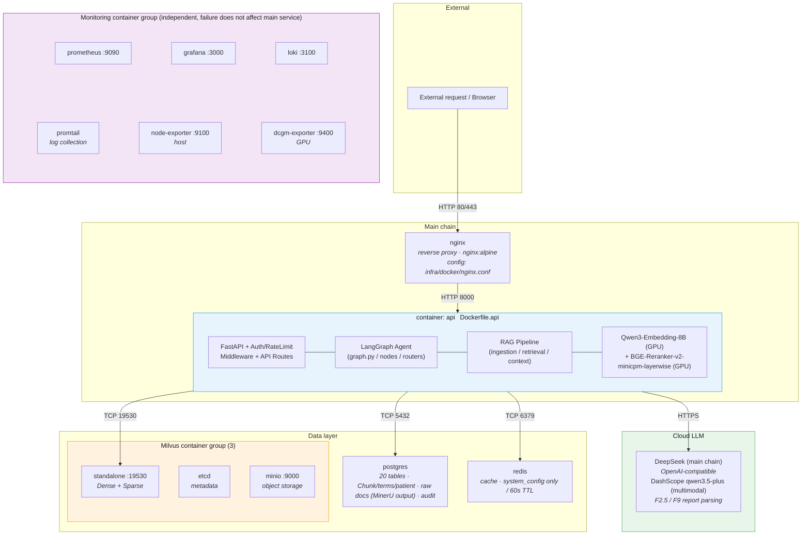
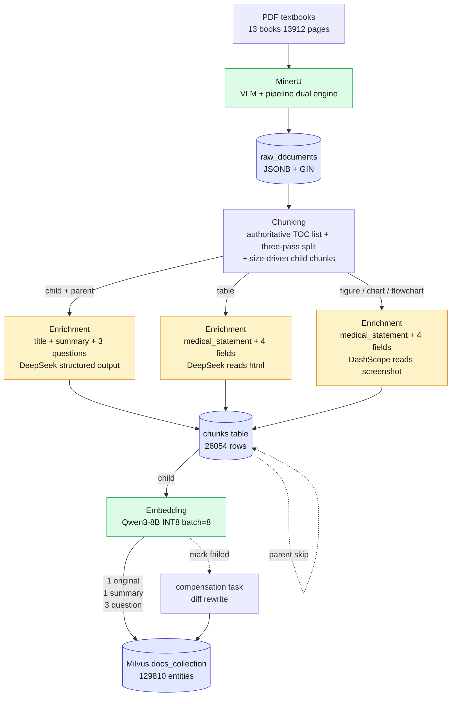
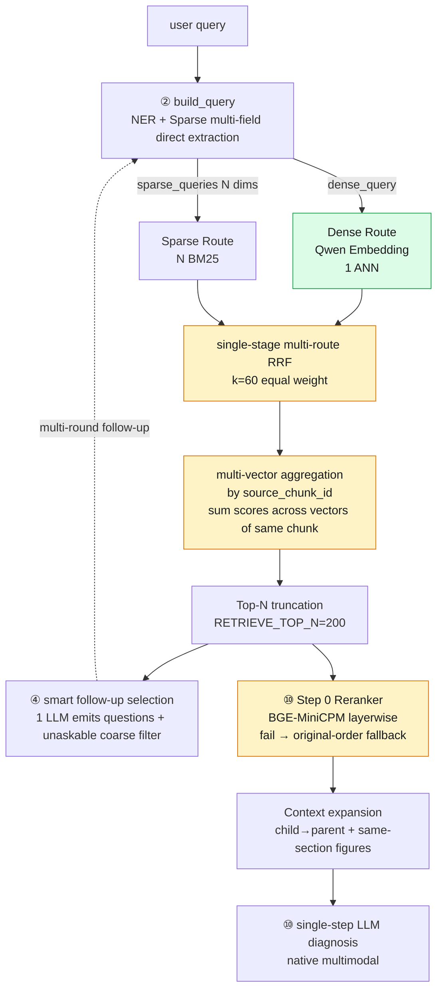
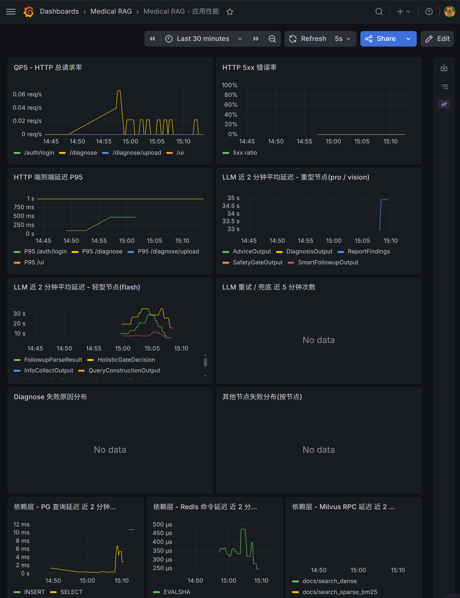
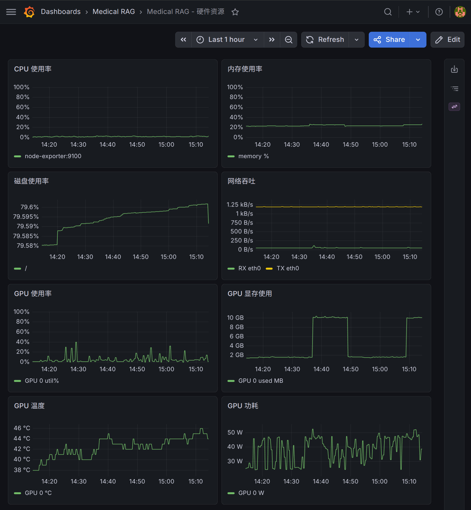

[简体中文](README.md) | [English](README.en.md)

# Agentic-RAG Diagnose Assistant

> Patient-side symptom self-check and initial diagnosis system, powered by a LangGraph Agent and multi-route RAG.
>
> **Personal portfolio project** (not production-deployed), covering data engineering → ML inference → Agent orchestration → backend → infrastructure → evaluation as a full end-to-end stack.
> Spec-driven design and implementation, single source of truth: [DEV_SPEC.md](DEV_SPEC.md) (4976 lines, Chinese).

---

## Demo

<div align="center">
  <a href="https://streamable.com/kjmixi" title="Click to watch the 1-minute demo">
    
  </a>
  <br/>
  <sub>▶ Click the image to watch a 1-minute end-to-end conversation on Streamable (chief complaint → multi-round follow-up → report upload → diagnosis → medication advice)</sub>
</div>

---

## Evaluation Results (62 cases from Chinese licensed-physician exam, 2026-05-17)

> Two-layer evaluation: **① RAG retrieval** (does recall cover the right textbook section?) → **② Diagnosis** (can the LLM produce the correct diagnosis based on recalled chunks?)

### ① RAG retrieval quality (LLM Judge scores parents 0~3 as ground truth)

| Metric | Score | Meaning |
|---|---|---|
| **Hit@20 (≥3 highly relevant)** | **100%** | 62/62 cases — **no case misses a highly-relevant section** |
| **NDCG@20** | **0.774** | Ranking quality (medical-domain range typically 0.6~0.8) |
| **MRR (≥2)** | **0.954** | Top-1 is at least moderately relevant in almost every case |
| Spearman ρ vs LLM | +0.708 | RAG ranking strongly correlated with LLM judgment |

### ② Diagnosis accuracy (LLM diagnoses on RAG Top-20; Judge evaluates gold ↔ LLM equivalence)

> **Multi-gold case**: a case where the patient has multiple coexisting diseases/comorbidities (e.g. "splenic rupture + rib fracture", "acute MI + acute left heart failure" — about half of the 62 cases)

| Metric | Score | Meaning |
|---|---|---|
| **Top-1 clinical hit rate** | **93.5%** | LLM's first candidate is clinically equivalent to gold (58/62) |
| **Top-2 hit rate** | **100%** | Gold primary diagnosis always in top 2 — **62/62, the diagnostic direction is almost never missed** |
| **0 primary direction errors** | **0/62** | All cases produced the correct diagnostic direction (no `none`) |
| **Multi-gold average coverage** | **86.7%** | Multi-gold cases have 86.7% of gold diagnoses listed on average |
| Multi-gold full recall rate | 72.6% | Multi-gold cases where ALL gold diagnoses are covered (45/62) |

→ Detailed methodology, `match_type` distribution, key design decisions: see [Chinese README — Evaluation Results](README.md#评测结果) and [RETRIEVAL_EVAL.md](docs/RETRIEVAL_EVAL.md) (Chinese, retrieval layer in 7 chapters)

---

## Project Positioning

**What it does**: User describes symptoms in natural language. The system clarifies history through multi-round follow-up, retrieves 13 medical textbooks as the knowledge base, and **gives an initial diagnosis + differential directions + recommended further exams**. 62-case Chinese licensed-physician exam evaluation: **Top-1 clinical-equivalent hit rate 93.5%, Top-2 100%, zero primary-direction errors** (see [Evaluation Results](#evaluation-results-62-cases-from-chinese-licensed-physician-exam-2026-05-17) above).

**Who it serves**: Patients needing initial diagnostic judgment and care navigation. All LLM outputs are filtered by a `safety_gate` node — **no prescriptions, no replacement for face-to-face physician care**. The system's role is "give the diagnostic directions a physician might consider + recommend how to investigate further"; final diagnosis and treatment still rest with a licensed physician.

**What it doesn't do**: Direct imaging interpretation, surgical planning, pediatric specialization, drug dosing calculation — these require specialized models or on-site physician judgment, out of scope.

---

## Highlights

> _Detailed in Chinese README §设计亮点 — 12 highlights covering full-stack ownership, multi-route RRF with multi-vector indexing, Small-to-Big parent/child chunking, single-GPU 16GB shared Embedding+Reranker, multimodal ingestion (text + tables + figures), LLM capability routing, idempotency + runtime degradation, 12-dimension HPI structured proactive questioning, single-LLM diagnosis with failure fallback (3-step chain retired per RAG eval — single-step achieves the same top-1 93.5% / top-2 100% at half the latency), Safety Gate as hard rail, 15-field `rag_trace` audit, centralized runtime constants (`agent_limits`)._

---

## System Architecture

> Cited from [DEV_SPEC §1.3.3](DEV_SPEC.md#133-项目层级).



---

## Agent Workflow

> Cited from [DEV_SPEC §4.1.3](DEV_SPEC.md#413-edge-路由与条件分支) — solid lines are normal sequential edges, dashed lines are conditional routing (`should_continue` / `diagnose_router` / `intake_router`).

```mermaid
%%{init: {'flowchart': {'curve': 'linear'}}}%%
graph TD;
    __start__(["⓪ __start__"]):::first
    N0a("⓪a initial_ask<br/><i>• 0 LLM, asks 3 questions and waits: any other discomfort / allergy·chronic illness·medication / pregnancy·lactation (women only)<br/>• loads patient profile</i>")
    N1("① info_collect<br/><i>one LLM call simultaneously:<br/>• parse chief complaint + present illness + 12 dimensions<br/>• parse the allergy/chronic illness/pregnancy answered in ⓪a + extract new symptoms, merge back to state</i>")
    N1b("①.5 analyze_initial_reports<br/><i>interrupt to ask if any reports → load/multimodal parse → report_findings</i>")
    N1c("intake_followup_ask<br/><i>• ask 12 slots in batches (4 per batch + 1 'any other discomfort')<br/>• once all collected, one LLM call translates and maps answers back to structured fields</i>")
    N2("② build_query<br/><i>Sparse multi-field direct extraction + LLM Dense Query rewrite</i>")
    N3("③ retrieve<br/><i>full vector recall</i>")
    N4("④ select_discriminative_symptom<br/><i>generate differential follow-up from recall + write unaskable coarse filter (for ⑩ fine filter)</i>")
    subgraph FollowupLoop[" "]
        direction TB
        N5("⑤ generate_followup<br/><i>pre-retrieval holistic gate (1 LLM over full state)<br/>• askable: patient can subjectively answer (nature/trigger/relief/radiation/associated…)<br/>• unaskable: requires exam/lab/imaging to know (Murphy sign/T3/ultrasound…)<br/>• unaskable_symptoms written every round, consumed by downstream ⑩/⑧a</i>")
        N6("⑥ wait_followup_answer<br/><i>wait for user's follow-up answer</i>")
        N7("⑦ process_followup_answer<br/><i>LLM translates user answer into structured fields back to state, clears this round's question list</i>")
    end
    N8("⑧a recommend_exam<br/><i>combine existing info → recommend patient-friendly exam list (both entries can add routine differential items)<br/>• ⑤ entry: no diagnosis yet, judge from chief complaint<br/>• ⑩ entry: diagnosis as prior, prioritize by candidates</i>")
    N8b("⑧b wait_exam_report<br/><i>interrupt waiting for exam results</i>")
    N9("⑨ process_exam_result<br/><i>process returned exam results</i>")
    N10("⑩ diagnose<br/><i>diagnostic reasoning (optional Cross-Encoder truncation + parent expansion + multimodal LLM single-step output)<br/>• simultaneously fine-filter/rewrite/newly-produce unaskable_symptoms (overrides upstream coarse filter, for ⑧a exam recommendation)</i>")
    N11("⑪ safety_gate<br/><i>safety-constraint gating (rules + LLM)</i>")
    N12("⑫ generate_advice<br/><i>generate advice</i>")
    N13("⑬ format_response<br/><i>format final reply</i>")
    __end__([__end__]):::last

    __start__ -->|"single entry"| N0a;
    N0a -->|"user answered → ① one LLM extracts chief complaint + parses user answer"| N1;
    N1 -->|"chief complaint/present illness extracted → check if patient wants to upload reports"| N1b;
    N1b -->|"report step done → start intake follow-up"| N1c;
    N1c -->|"slots translated into state, hand to ⑤ for pre-retrieval holistic gate"| N5;
    N2 -->|"assemble retrieval query"| N3;
    N3 -->|"got candidate medical-knowledge chunks"| N4;
    N4 -.->|"enough info → diagnose directly"| N10;
    N4 -.->|"need differential follow-up → ask user directly"| N6;
    N5 -.->|"askable questions → let user answer"| N6;
    N5 -.->|"no askable but has unaskable → first-visit direct exam recommendation"| N8;
    N5 -.->|"both empty → go straight to retrieval"| N2;
    N6 -->|"user answered → translated by ⑦"| N7;
    N7 -.->|"not yet retrieved (post-intake path) → back to ⑤ to judge again"| N5;
    N7 -.->|"already retrieved (④ differential follow-up answered), or round cap reached → back to retrieval"| N2;
    N10 -.->|"patient needs exams for further differentiation"| N8;
    N10 -.->|"can conclude → go to safety gate"| N11;
    N8 -->|"write advice into State"| N8b;
    N8b -->|"interrupt waiting for exam results"| N9;
    N9 -->|"new evidence returned, re-retrieve"| N2;
    N11 -->|"allergy/medication/pregnancy constraint filtering"| N12;
    N12 -->|"medication/exam/high-risk alerts"| N13;
    N13 -->|"output final reply"| __end__;

    classDef default fill:#ffffff,stroke:#333,stroke-width:1px,color:#000,line-height:1.2;
    classDef first fill:#f0f0f0,stroke:#999,color:#000;
    classDef last fill:#d4cffc,stroke:#333,color:#000;
    style FollowupLoop fill:none,stroke:none
```



> Easy-to-get-wrong points (recur during implementation):
>
> - ⑧/⑥ split into `a`/`b` halves, `interrupt()` separated from the LLM call, so the LLM does not re-fire on resume
> - `should_continue` is a **pure function**, must not write state (cap handling lives in ⑩ Step -1)
> - ⑩ single-step LLM failure → short-circuit `insufficient` + `failure_reason="step_1_structured_output_failed: ..."`
> - `present_illness_slots` has 12 dimensions, empty slots drive ⑤ dimension follow-up
> - ⑤ holistic gate emits `askable_targets`, ⑦ writes back to state then appends to `asked_targets` for L2 hard dedup, preventing the LLM from re-asking in disguise

---

## RAG Pipeline

### Ingestion — overall pipeline



### Ingestion — PG → Milvus write flow (zoom in)

> Cited from [DEV_SPEC §3.1.6.2](DEV_SPEC.md#3162-写入流程以-batch-为单位) — the `embedding_status` field (`pending → done / failed / skip`) doubles as the two-phase state machine, no distributed transaction needed.

```mermaid
flowchart TD
    S1["<b>Step 1: PostgreSQL Upsert (transaction)</b><br/>- Upsert the chunks table (chunk_id as primary key)<br/>- parent chunk: embedding_status = 'skip'<br/>- child chunk: embedding_status = 'pending'<br/>- transaction commit"]
    S1 -->|success| BRANCH
    S1 -->|"failure → roll back the whole batch, do not enter Step 2,<br/>reprocess the whole batch on the next retry"| END1["terminate (await retry)"]

    BRANCH{"parent chunk?<br/>(embedding_status = 'skip')"}
    BRANCH -->|yes| END2["terminate (no vectorization needed)"]
    BRANCH -->|no (child chunk)| S2

    S2["<b>Step 2: Milvus Upsert (batch)</b><br/>- deterministically derive vector record IDs from chunk_id:<br/>&ensp;{chunk_id} (original) / {chunk_id}_summary /<br/>&ensp;{chunk_id}_q0 / {chunk_id}_q1 / ...<br/>- for derivation rules and field definitions see config/milvus_schema.py:119 + src/rag/ingestion/embedding.py:112<br/>- batch Upsert into docs_collection"]
    S2 -->|success| S3
    S2 -->|failure| S2a

    S2a["<b>Step 2a: Milvus write-failure handling</b><br/>- update the corresponding chunk's embedding_status in PostgreSQL to 'failed'<br/>- log the error (chunk_id + exception info)<br/>- do not roll back the PostgreSQL data (the metadata itself is correct)<br/>- retried periodically by the compensation task (see 'Compensation Mechanism' below)"]

    S3["<b>Step 3: confirm the write</b><br/>- after a successful Milvus Upsert, update PostgreSQL:<br/>&ensp;embedding_status = 'done', updated_at = now()"]
```

### Retrieval



---

## Tech Stack

| Layer | Choice | Rationale (summary; details in [DEV_SPEC §2](DEV_SPEC.md#2-技术选型)) |
|---|---|---|
| Embedding | Qwen3-Embedding-8B (INT8, 4096-dim) | 8B capacity is enough to encode fine-grained differences between medical terms; C-MTEB 73.84 well above BGE-M3; same-family tokenizer as the LLM |
| Reranker | BGE-Reranker-v2-minicpm-layerwise (INT8) | MiniCPM is best for Chinese medical; cross-encoder full interaction compensates for being a different family from Qwen; layerwise provides a precision/speed knob |
| LLM main chain | DeepSeek (`with_structured_output` `function_calling`) | cheap + stable across 14 structured-output call sites |
| LLM multimodal | DashScope qwen3.5-plus | dedicated to report parsing; the main-chain DeepSeek has no vision |
| Vector DB | Milvus 2.5 standalone | HNSW + built-in BM25 (Chinese analyzer); 2.4+ full-text search one-stop, no SPLADE needed |
| Relational DB | PostgreSQL 16 | JSONB + GIN holds MinerU's heterogeneous output; ACID transactions guarantee dual-write consistency |
| Cache | Redis 7 | caches system_config only (60s TTL); **RAG responses are not cached** (state changes across calls, queries collide across patients) |
| Orchestration | LangGraph | built-in interrupt/resume + checkpointer + thread_id isolation |
| Web framework | FastAPI + Pydantic v2 + uvicorn | async + auto OpenAPI; `prometheus-fastapi-instrumentator` auto HTTP metrics |
| Auth | PyJWT HS256 + bcrypt + role guard | `require_role(*roles)` factory pattern; rate-limit key uses `user:<sub>` falling back to `ip:<addr>` (forged tokens land in the IP bucket) |
| Rate limit | custom sliding window (`Protocol` abstraction) | H6 switch to Redis swaps the implementation only, business untouched |
| Parsing | MinerU 2.5 | VLM (MinerU2.5-Pro 1.2B) + pipeline (PDF-Extract-Kit) dual-engine hybrid auto |
| Monitoring | Prometheus + Grafana + Loki + Promtail + DCGM | full-stack app / system / GPU / logs |
| Reverse proxy | Nginx | `set_real_ip_from + X-Forwarded-For` passes the client IP through so rate limiting works |
| Package mgmt | uv + Python 3.12 + PyTorch 2.7 cu128 | Blackwell sm_120 only in cu128+ wheels |
| Testing | pytest 3-layer | unit (all mock) / integration (real docker) / e2e (real LLM, phase J) |

---

## Monitoring & Observability

After one-shot startup of 13 containers, Prometheus auto-scrapes 6 targets (api / postgres / redis / milvus / node / dcgm) and Grafana auto-loads 2 dashboards. All LLM-call instrumentation is **written raw** — no decorators, no helpers, no context managers (see [DEV_SPEC §9.1](DEV_SPEC.md#9-全局实现契约跨章节)). ~300 lines of boilerplate across 20+ call sites is the explicit cost paid for clean exception scope, observable retries, and zero conflict with `with_retry` internals.

<div align="center">
  
  <br/>
  <sub>App performance: QPS / 5xx / HTTP P95 / LLM heavy (pro·vision) + light (flash) latency / retries·fallbacks / failure distribution / PG·Redis·Milvus dependency layer</sub>
  <br/><br/>
  
  <br/>
  <sub>Hardware: GPU utilization / VRAM / CPU / memory / disk / network (DCGM + Node Exporter)</sub>
</div>

---

## Quick Start

Main path = single-command full docker compose. Running uvicorn on the host is only a hot-reload debugging fallback.

```bash
# 1. Clone
git clone https://github.com/Handshakeworm/Agentic-RAG-diagnose-Assistant.git
cd Agentic-RAG-diagnose-Assistant

# 2. Configure environment variables
cp .env.example .env
# required:
#   LLM_API_KEY            (DeepSeek)
#   LLM_VISION_API_KEY     (DashScope)
#   JWT_SECRET_KEY         (openssl rand -hex 32)

# 3. Start the full stack (13 containers: nginx + api + data layer + monitoring)
#    first build of the api image ~10-15 min (downloads PyTorch + nvidia-* wheels ~5GB)
#    requires nvidia-container-toolkit (GPU passthrough to api / dcgm-exporter)
docker compose up -d --build
docker compose ps                            # ready only when all healthy

# 4. Initialize the database schema (20 tables + indexes, once on first deploy)
docker compose exec api alembic upgrade head
```

**Verify** (via nginx 80):

```bash
curl http://localhost/healthz                # {"status":"ok"}
curl -i http://localhost/readyz              # 200 + x-trace-id header
curl http://localhost/metrics | head         # Prometheus business metrics
curl -X POST http://localhost/auth/register \
  -H 'content-type: application/json' \
  -d '{"email":"a@b.com","password":"hunter22","role":"patient"}'
# → {"access_token":"...", ...}
```

Open `http://localhost:3000` (admin/admin) → Dashboards → "Medical RAG" → "App Performance" / "Hardware Resources" live dashboards.

**Hot-reload development** (when editing src/ and you want to see the effect immediately):

```bash
# main compose brings up dependencies, api runs on the host (hot-reload + IDE debugger)
docker compose up -d postgres redis milvus-standalone prometheus loki grafana promtail node-exporter dcgm-exporter
uv sync
source .venv/bin/activate
uvicorn src.api.app:app --host 0.0.0.0 --port 8000 --reload

# to reverse-proxy nginx to the host uvicorn (so rate limiting / trace_id also work end-to-end):
docker compose -f docker-compose.yml -f docker-compose.demo.yml up -d nginx
```

---

## Roadmap

See [DEV_SPEC.md §8.4 progress table](DEV_SPEC.md#84-进度跟踪表). As of 2026-05-17:

| Phase | Content | Status |
|---|---|---|
| A | Engineering skeleton & infrastructure base | Done |
| B | Data layer & model clients | Done |
| C | Ingestion Pipeline | Main flow working (13 books planned, 12 ingested with zero boundary loss); production hardening pending |
| D | Terminology (data shelved) | ICD-10 alias 40k+ ingested; not used at runtime |
| E | Retrieval (Sparse / Dense / RRF / Reranker / Filter) | Done |
| F | Agent workflow (17 nodes + 4 conditional routers) | Done |
| G | API layer & permissions (7 items) | Done |
| H | Infrastructure enhancements (Redis / Prometheus / Grafana / Loki / DCGM) | Done |
| I | Evaluation system | **Mostly done** (RAG retrieval + diagnosis closed-loop + dual-layer LLM Judge; Agent multi-round follow-up evaluation pending) |
| J | End-to-end acceptance & doc consolidation | J0 (Dockerization) done; J1-J6 pending |

**Test coverage**: 333 unit PASS / 95 integration PASS (real PG + Milvus + Redis) / e2e reserved for J1-J4.

---

## Documentation

- [DEV_SPEC.md](DEV_SPEC.md) — full design specification (Chinese, 4976 lines, single source of truth)
- [CLAUDE.md](CLAUDE.md) — AI collaboration workflow, architectural rules, contract red lines
- [RETRIEVAL_EVAL.md](docs/RETRIEVAL_EVAL.md) — RAG retrieval evaluation report (Chinese, 7 chapters)
- [EL_DESIGN_REVIEW.md](docs/EL_DESIGN_REVIEW.md) — Entity Linking design review (Chinese)
- [scripts/METHODOLOGY.md](scripts/METHODOLOGY.md) — Chunking POC general methodology

---

## License

[MIT](LICENSE)
